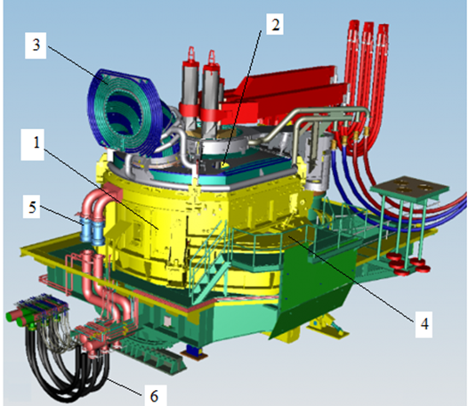
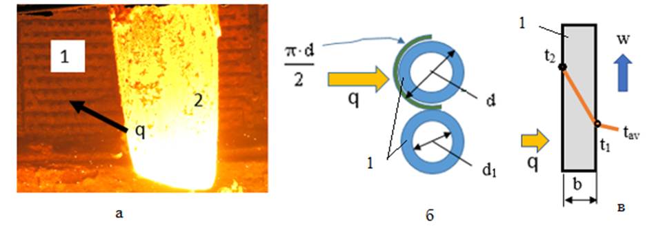
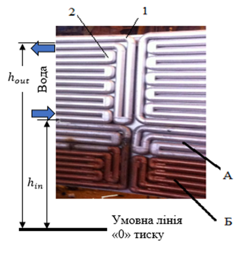

# Завдання 1.1 - Тепловий і гідравлічний розрахунок водоохолоджуваної панелі ДСП

## 1. Загальні положення

### 1.1 Опис об'єкту дослідження

Дугова сталеплавильна піч (ДСП) - це сучасне металургійне обладнання, що використовується для виплавки сталі. В сучасних конструкціях ДСП застосовують трубчасті водоохолоджувані захисні панелі стін і зводу замість традиційної цегляної футерівки.

### 1.2 Конструктивні особливості

Основні елементи конструкції ДСП включають:
1. Стінові панелі (розташовані вище лінії шлаку)
2. Звід (за винятком центральної частини)
3. Аспіраційний газохід
4. Кришку ежектора (вузли випуску)
5. Водяні колектори
6. Гнучкі шланги для подачі води

### 1.3 Детальний опис конструкції ДСП

На рисунку 1.1 представлена сучасна конструкція дугової сталеплавильної печі (ДСП) з водоохолоджуваними елементами. Розглянемо детально кожен елемент конструкції:



1. **Стінові панелі** (позиція 1):
   - Розташовані вище лінії шлаку
   - Виконані у вигляді трубчастих водоохолоджуваних елементів
   - Забезпечують захист корпусу печі від високих температур
   - Замінюють традиційну цегляну футерівку

2. **Звід печі** (позиція 2):
   - Охоплює верхню частину печі, крім центральної частини
   - Також виконаний з водоохолоджуваних панелей
   - Центральна частина залишається вільною для розміщення електродів

3. **Аспіраційний газохід** (позиція 3):
   - Призначений для відведення технологічних газів
   - Має водоохолоджувану конструкцію для захисту від високих температур
   - Інтегрований в загальну систему охолодження печі

4. **Кришка ежектора** (позиція 4):
   - Розташована в зоні вузла випуску
   - Забезпечує герметичність системи
   - Має водяне охолодження для підтримки робочої температури

5. **Водяні колектори** (позиція 5):
   - Забезпечують розподіл охолоджуючої води по системі
   - Формують замкнутий контур охолодження
   - З'єднують окремі водоохолоджувані елементи в єдину систему

6. **Гнучкі шланги** (позиція 6):
   - Забезпечують подачу води до рухомих елементів конструкції
   - Дозволяють здійснювати нахил печі при зливі металу
   - Витримують високі температури та механічні навантаження

Така конструкція, хоча і призводить до збільшення витрат енергії через втрати теплоти з водою, є економічно доцільною з точки зору економії вогнетривів та збільшення терміну служби печі.

### 1.4 Економічне обґрунтування

Хоча використання водоохолоджуваних панелей призводить до збільшення витрат енергії через втрати теплоти з водою, така конструкція є економічно доцільною з наступних причин:
- Значне зменшення витрат на вогнетриви
- Збільшення терміну служби печі
- Зменшення часу на ремонт та обслуговування

## 2. Теплообмінні процеси

### 2.1 Схема теплообміну

На рисунку 1.2 представлена комплексна схема теплообміну в системі "робочий простір ДСП – захисна водоохолоджувана панель". Схема складається з трьох взаємопов'язаних частин:



#### 2.1.1 Загальний вигляд теплового потоку (рис. 1.2.а)

На фотографії показано реальний процес теплообміну в ДСП:
- Позиція 1 - водоохолоджувана панель (трубчастий змійовик)
- Позиція 2 - графітований електрод
- Стрілкою q позначено напрямок теплового потоку від робочого простору печі до панелі
- Яскраве світіння демонструє інтенсивність теплового випромінювання

#### 2.1.2 Сприйняття теплового потоку панеллю (рис. 1.2.б)

Схематично показано геометричні параметри теплосприймаючої поверхні:
- Тепловий потік q направлений на трубчасту конструкцію
- π·d/2 - площа теплосприймаючої поверхні труби
- d - зовнішній діаметр труби
- d₁ - внутрішній діаметр труби
- Конструкція являє собою систему паралельних труб

#### 2.1.3 Відведення теплоти водою (рис. 1.2.в)

Представлено схему розподілу температур у водоохолоджуваній панелі:
- Висота панелі позначена як 1
- Ширина панелі позначена як b
- w - напрямок руху охолоджуючої води
- t₁ - температура води на вході
- t₂ - температура води на виході
- tₐᵥ - середня температура води
- q - тепловий потік, що відводиться водою

Така схема дозволяє:
1. Визначити кількість теплоти, що сприймається панеллю
2. Розрахувати необхідну витрату охолоджуючої води
3. Оцінити ефективність теплообміну
4. Контролювати температурний режим роботи панелі

Розуміння цієї схеми є ключовим для подальших теплових та гідравлічних розрахунків водоохолоджуваної панелі ДСП.

### 2.2 Основні параметри теплообміну

При розрахунку необхідно враховувати наступні параметри:
- Тепловий потік (q)
- Діаметр труб (d, d₁)
- Температурні показники (t₁, t₂)
- Ширина панелі (b)

## 3. Мета розрахунку

Основною метою теплового і гідравлічного розрахунку є:
1. Визначення оптимальних параметрів водоохолодження
2. Розрахунок необхідної витрати води
3. Оцінка ефективності теплообміну
4. Визначення температурних режимів роботи панелі

## 4. Вихідні дані для розрахунку

### 4.1 Геометричні параметри
- Діаметр труб водоохолоджуваної панелі
- Розміри панелі
- Конфігурація системи охолодження

### 4.2 Технологічні параметри
- Температура робочого простору печі
- Витрата води
- Початкова температура охолоджуючої води
- Допустиме підвищення температури води

## 5. Методика розрахунку

Розрахунок включає наступні етапи:
1. Визначення теплового навантаження
2. Розрахунок необхідної витрати води
3. Перевірка температурного режиму панелі
4. Гідравлічний розрахунок системи охолодження

## 6. Очікувані результати

В результаті виконання завдання мають бути визначені:
1. Оптимальні параметри системи охолодження
2. Ефективність теплообміну
3. Температурні режими роботи панелі
4. Гідравлічні характеристики системи

## 7. Формулювання Завдання

На основі заданого теплового потоку в робочому просторі ДСП необхідно провести тепловий та гідравлічний розрахунок захисної водоохолоджуваної панелі, а саме:
- визначити швидкість протікання та витрату води в панелі;
- оцінити максимальну довжину змійовика;
- встановити температурну робочої поверхні панелі;
- оцінити втрати тиску води в панелі.

Перші три пункти завдання стосуються теплового розрахунку панелі, четвертий – гідравлічного. Завдання в цілому ставить мету забезпечити експлуатацію панелі у штатному стаціонарному режимі.

## 8. Математичний опис процесів

### 8.1 Швидкість течії і витрата води у панелі

Теплообмін стінки труби змійовика з водою за умов турбулентного режиму описується критеріальним рівнянням (спрощеним для інженерних оцінок), що визначає число Нусельта через число Рейнольдса та число Прандтля:

формула (1.1)
$$Nu = α · d₁/λ = 0,021 · Re^{0,8} · Pr^{0,43}$$

де:
- α – коефіцієнт тепловіддачі конвекцією від стінки труби до потоку води (Вт/(м²·К))
- w – швидкість течії води (м/с)
- q – променевий тепловий потік з робочого простору печі (Вт/м²)
- λ – коефіцієнт теплопровідності води (Вт/(м·К))
- ν – коефіцієнт кінематичної в'язкості води (м²/с)
- ρ – щільність води (кг/м³)
- C – теплоємність води (Дж/(кг·К))
- d₁, d – внутрішній та зовнішній діаметр змійовика відповідно (м)

Основний параметр, що визначає теплову роботу панелі α при заданому q обчислюється із рівняння Ньютона-Ріхмана:
формула (1.2)
$$q = α · (t₁ - t_{av})$$

де $t_{av} = (t_{out} + t_{in})/2$ - середня температура води в панелі між температурою на вході $t_{in}$ та виході $t_{out} ≤ 55$ °С.

З урахуванням виразів для складових, рівняння (1.1) приймає вид:
формула (1.3)
$$\frac{q \cdot d_1}{\lambda \cdot (t_1-t_{av})} = 0,021(\frac{w \cdot d_1}{\nu})^{0,8}(\rho \cdot C \cdot \nu/\lambda)^{0,43}$$

Швидкість руху води w (м/с), що входить у вираз для числа Рейнольдса критеріального рівняння (1.1, 1.3), визначається з подальших розрахунків.

### 8.2 Розрахунок швидкості та витрати води

Швидкість руху води визначається за формулою:
формула (1.4)
$$w = (\frac{α·d₁^{0,2}·ν^{0,8}}{0,021·(ρ·c·ν/λ)^{0,43}·λ})^{1,25}$$

Зазвичай швидкість води в панелях складає 0,6-2,5 м/с.

Витрата води в панелі Q (м³/с) дорівнює добутку швидкості течії води та площі перерізу каналу і становить:
формула (1.5)
$$Q = w · π·d₁²/4$$

### 8.3 Максимальна довжина змійовика

Довжина змійовика L (м) визначається з міркувань забезпечення теплового балансу панелі та запобігання відкладення солей жорсткості на поверхні водяного каналу у разі перегріву води.

Важливі температурні обмеження:
- Перегрів води призводить до випадіння солей жорсткості при температурі 50-60 °С
- Для типової схеми водопідготовки на металургійному заводі рекомендується:
  - Температура стінки водяного каналу панелі $t₁ ≤ 75$ °С (рис. 1.2)
  - Температура води на виході з контуру охолодження $≤ 55$ °С

Стаціонарний режим панелі передбачає рівність:
- Енергії, що надходить в одиницю часу з променевим тепловим потоком q крізь робочу поверхню панелі $π(d/2)·L$ (рис. 1.1) – ліва частина рівняння (1.6)
- Теплоти, що відбирає вода через конвекцію – права частина (1.6)
формула (1.6)
$$q · π(d/2)· L = w · ρ · π(d₁²/4) · C(t_{out} - t_{in})$$

За умов теплового балансу панелі в ДСП, максимально допустима довжина змійовика панелі L (м) із рівняння (1.6) становить:
формула (1.7)
$$L = [w · ρ · π(d₁²/4) · C(t_{out} - t_{in})]/[q · π(d/2)]$$

Зазвичай, довжина змійовика панелі ДСП складає 10-30 м.

### 8.4 Температура робочої поверхні панелі

Температура зовнішньої поверхні змійовика визначається за формулою:
формула (1.8)
$$t_2 = t_1 + [q \ln(d/d_1)/2πλ_{pipe}]$$

Перегрів труби спричинює утворення тріщин малоциклової втоми через перевищення еквівалентних термічних напружень певної межі плинності матеріалу. В довідниках, у даному контексті, приводять експлуатаційну температуру конструкційних матеріалів, яку рекомендують не перевищувати:
- Для сталі 20 та мідi граничнa температура становить 450 та 260 °С відповідно (t₂, рис. 1.2)
- В певних межах t₂ можна знизити за рахунок зменшення товщини стінки b
- Оскільки умови роботи панелей передбачають ударні навантаження через падіння фрагментів скрапу, товщина стінки труби b має бути > 8-10 мм

### 8.5 Втрати тиску води в панелі

Втрати тиску $ΔP_{loss}$ (Па) при протіканні рідини в каналі є надлишковими. Таким чином, абсолютний тиск води на вході в панель має становити, як мінімум, $ΔP_{loss} + 10^5$ (Па). 

Величина $ΔP_{loss}$ включає:
1. Динамічні, пропорційні динамічному тиску $ρ · w²/2$, складові:
   - втрати на тертя ($ΔP_{fr}$)
   - місцеві опори ($ΔP_{lr}$)
2. Статичні (геометричні) складові, пов'язані із взаємним розташуванням патрубків живлення і зливу води ($ΔP_g$)

Формули для розрахунку:
формула (1.9)
$$ΔP_{fr} = μ_{fr} · (L/d_1) · ρ · w²/2$$
формула (1.10)
$$ΔP_{lr} = \sum_{i=1}^n ξ_{lr}^i · (ρ · \frac{w²}{2})$$
формула (1.11)
$$ΔP_g = ρ · g · (h_{out} - h_{in})$$
формула (1.12)
$$ΔP_{loss} = ΔP_{fr} + ΔP_{lr} + ΔP_g$$

де:
- $μ_{fr}$ – коефіцієнт тертя
- $ξ_{lr}^i$ – коефіцієнт місцевого опору i-го типу
- n – число місцевих опорів i-го типу
- $h_{in}$, $h_{out}$ – висота розташування патрубків зливу води і живлення над умовною лінією цехової магістралі (м)
- g – прискорення сили тяжіння (м/с²)

Умови розрахунку $ΔP_{loss}$ в захисній панелі ДСП:
- Зазвичай, конструкційні рішення живлення панелей водою передбачають $h_{out} ≈ h_{in}$, тому $ΔP_g ≈ 0$
- У загальному ж випадку $ΔP_g > 0$, тому що для виходу з системи охолодження газових бульбашок, розчинених у воді, має бути $h_{out} > h_{in}$

### 8.6 Структура змійовика та оцінка втрат тиску

На рисунку 1.3 представлена структура змійовика захисної водоохолоджуваної панелі ДСП та схема оцінки втрат тиску. Конструкція має наступні особливості:



#### 8.6.1 Матеріали та конструкція
- **А** – сталева панель
- **Б** – мідна панель
- Змійовик складається з двох різних матеріалів для оптимального співвідношення міцності та теплопровідності

#### 8.6.2 Місцеві опори
1. **Поворот на 90°** (позиція 1):
   - Розташований на переході між панелями
   - Створює додатковий гідравлічний опір
   - Коефіцієнт місцевого опору визначається за довідниковими даними

2. **Поворот на 180°** (позиція 2):
   - Забезпечує зміну напрямку руху води
   - Має більший коефіцієнт місцевого опору порівняно з поворотом на 90°
   - Впливає на загальні втрати тиску в системі

#### 8.6.3 Висотні параметри
- **h_out** – висота розташування вихідного патрубка
- **h_in** – висота розташування вхідного патрубка
- Різниця висот (h_out - h_in) впливає на статичну складову втрат тиску
- Умовна лінія "0" тиску служить базовою відміткою для розрахунку висот

#### 8.6.4 Особливості розрахунку втрат тиску
1. **Динамічні втрати**:
   - Враховують всі повороти на 90° та 180°
   - Кожен поворот має свій коефіцієнт місцевого опору
   - Сумарні втрати залежать від кількості поворотів

2. **Статичні втрати**:
   - Визначаються різницею висот h_out та h_in
   - Впливають на видалення газових бульбашок
   - Рекомендується підтримувати h_out > h_in

3. **Загальні рекомендації**:
   - Оптимізація конструкції для мінімізації місцевих опорів
   - Забезпечення надійного видалення газів
   - Врахування впливу температури на властивості води

### 8.9 Експлуатаційні норми гідравлічного розрахунку

Відповідність гідравлічного розрахунку панелі експлуатаційним нормам полягає в тому, що загальні втрати тиску води $ΔP_{loss}$ мають не перевищувати можливостей цехової водної магістралі $P_{wat}$ з коефіцієнтом запасу 1,25:

формула (1.13)
$$ΔP_{loss} · 1,25 ≤ P_{wat}$$

Зазвичай абсолютний тиск води в цеховій магістралі становить 0,3-0,4 МПа.

### 8.10 Довідкові дані і варіанти завдання

При виконанні завдання прийняті щодо розрахунків наступні теплофізичні параметри:

#### 8.10.1 Теплофізичні властивості матеріалів
- Теплопровідність води: $λ = 0,63$ Вт/(м·К)
- Теплопровідність сталі Ст20: $λ_{pipe} = 39$ Вт/(м·К)
- Теплопровідність міді: $λ_{pipe} = 370$ Вт/(м·К)

#### 8.10.2 Властивості води
- Щільність води: $ρ = 1$ т/м³
- Теплоємність води: $C = 4,2$ кДж/(кг·К)
- Коефіцієнт кінематичної в'язкості води: $ν = 10^{-6}$ м²/с

#### 8.10.3 Гідравлічні параметри
- Коефіцієнт тертя води в трубі: $μ_{fr} = 0,045$
- Коефіцієнт місцевого опору поворот потоку на 90°: $ξ_{lr}^1 = 0,22$
- Коефіцієнт місцевого опору поворот потоку на 180°: $ξ_{lr}^2 = 0,31$

#### 8.10.4 Розрахункові умови
Прийняти в розрахунках:
- $t_1 = 75$ °С
- $t_{out} = 55$ °С
- $ΔP_g = 0$

*Примітка: Варіанти завдань наведено в табл. 1.1. Слідкуйте за розмірністю величин в розрахункових формулах і в завданні.*

#### 8.11 Варіанти завдання

**Таблиця 1.1 - Варіанти завдання**

| Номер варіан-ту | Тепловий потік $q$ (кВт/м²) | Діаметр труби $d/d_1$ (мм) | Кількість місцевих опорів $n$ |  | Темпера-тура води вихідна $t_{in}$ (°С) | Тиск води в цеху $P_{wat}$ (МПа) | Матеріал труби |
|----------------|----------------------------|-------------------------|---------------------------|-----------------|----------------------------------|--------------------------------|----------------|
|                |                            |                         | 90° | 180° |                                  |                                |                |
| 1              | 155                        | 76/56                   | 2   | 10   | 20                               | 0,45                           | Сталь Ст20     |
| 2              | 280                        | 89/65                   | 2   | 68   | 25                               | 0,35                           | Мідь           |
| 3              | 145                        | 73/53                   | 2   | 10   | 25                               | 0,27                           | Сталь Ст20     |
| 4              | 170                        | 76/56                   | 2   | 8    | 20                               | 0,34                           | Сталь Ст20     |
| 5              | 160                        | 89/65                   | 3   | 10   | 15                               | 0,40                           | Сталь Ст20     |
| 6              | 250                        | 73/53                   | 3   | 12   | 18                               | 0,26                           | Мідь           |
| 7              | 305                        | 76/52                   | 2   | 5    | 22                               | 0,36                           | Мідь           |
| 8              | 120                        | 89/69                   | 2   | 8    | 24                               | 0,32                           | Сталь Ст20     |
| 9              | 175                        | 73/49                   | 4   | 12   | 23                               | 0,28                           | Сталь Ст20     |
| 10             | 230                        | 76/56                   | 2   | 8    | 20                               | 0,30                           | Мідь           |
| 11             | 165                        | 89/65                   | 2   | 6    | 19                               | 0,25                           | Сталь Ст20     |
| 12             | 150                        | 73/53                   | 3   | 12   | 18                               | 0,35                           | Сталь Ст20     |
| 13             | 140                        | 76/54                   | 2   | 10   | 25                               | 0,27                           | Сталь Ст20     |
| 14             | 235                        | 89/69                   | 4   | 12   | 25                               | 0,34                           | Мідь           |
| 15             | 255                        | 73/49                   | 2   | 8    | 20                               | 0,40                           | Мідь           |
| 16             | 200                        | 76/56                   | 2   | 68   | 20                               | 0,26                           | Сталь Ст20     |
| 17             | 185                        | 89/65                   | 3   | 10   | 15                               | 0,35                           | Сталь Ст20     |
| 18             | 285                        | 73/53                   | 2   | 8    | 18                               | 0,32                           | Мідь           |
| 19             | 140                        | 60/44                   | 4   | 10   | 22                               | 0,28                           | Сталь Ст20     |
| 20             | 210                        | 73/49                   | 3   | 12   | 24                               | 0,30                           | Сталь Ст20     |
| 21             | 170                        | 76/56                   | 2   | 5    | 23                               | 0,25                           | Сталь Ст20     |
| 22             | 260                        | 89/65                   | 2   | 8    | 20                               | 0,35                           | Мідь           |
| 23             | 155                        | 73/53                   | 3   | 12   | 19                               | 0,32                           | Сталь Ст20     |
| 24             | 295                        | 60/44                   | 2   | 8    | 18                               | 0,34                           | Мідь           |
| 25             | 200                        | 89/65                   | 4   | 6    | 25                               | 0,39                           | Сталь Ст20     |

# Методика розв'язання завдання 1.1

## 1. Перевірка вхідних даних

1. З таблиці 1.1 за номером варіанту визначаємо:
   - Тепловий потік $q$ (кВт/м²)
   - Діаметр труби $d/d_1$ (мм)
   - Кількість місцевих опорів $n$ (90° та 180°)
   - Температуру води вхідну $t_{in}$ (°С)
   - Тиск води в цеху $P_{wat}$ (МПа)
   - Матеріал труби

2. З умов розрахунку приймаємо:
   - $t_1 = 75$ °С
   - $t_{out} = 55$ °С
   - $\Delta P_g = 0$

3. Використовуємо константи:
   - Теплопровідність сталі Ст20: $\lambda_{pipe} = 39$ Вт/(м·К)
   - Теплопровідність міді: $\lambda_{pipe} = 370$ Вт/(м·К)
   - Щільність води: $\rho = 1$ т/м³
   - Теплоємність води: $C = 4.2$ кДж/(кг·К)
   - Коефіцієнт кінематичної в'язкості води: $\nu = 10^{-6}$ м²/с
   - Коефіцієнт тертя води в трубі: $\mu_{fr} = 0.045$
   - Коефіцієнт місцевого опору поворот потоку на 90°: $\xi_{lr}^1 = 0.22$
   - Коефіцієнт місцевого опору поворот потоку на 180°: $\xi_{lr}^2 = 0.31$

## 2. Розрахунок максимальної довжини змійовика

1. Використовуємо формулу (1.7):
   $$
   L = \frac{w \cdot \rho \cdot \pi \left( \frac{d_1^2}{4} \right) \cdot C (t_{out} - t_{in})}{q \cdot \pi \left( \frac{d}{2} \right)}
   $$

2. Перевіряємо умову:
   - Отримана довжина $L$ має бути в межах 10-30 м
   - Якщо $L$ виходить за ці межі, необхідно скоригувати швидкість води $w$

## 3. Розрахунок температури робочої поверхні

1. Використовуємо формулу (1.8):
   $$
   t_2 = t_1 + \frac{q \ln(d/d_1)}{2\pi\lambda_{pipe}}
   $$

2. Перевіряємо умови:
   - Для сталі 20: $t_2 \leq 450$ °С
   - Для міді: $t_2 \leq 260$ °С

## 4. Розрахунок втрат тиску

1. Розраховуємо втрати на тертя за формулою (1.9):
   $$
   \Delta P_{fr} = \mu_{fr} \cdot \frac{L}{d_1} \cdot \rho \cdot \frac{w^2}{2}
   $$

2. Розраховуємо місцеві втрати за формулою (1.10):
   $$
   \Delta P_{lr} = \sum \left( \xi_{lr}^i \cdot \rho \cdot \frac{w^2}{2} \right)
   $$
   де $i$ - тип місцевого опору (90° або 180°)

3. Враховуємо статичні втрати за формулою (1.11):
   $$
   \Delta P_g = 0 \quad \text{(за умовою)}
   $$

4. Розраховуємо сумарні втрати за формулою (1.12):
   $$
   \Delta P_{loss} = \Delta P_{fr} + \Delta P_{lr} + \Delta P_g
   $$

5. Перевіряємо умову:
   $$
   P_{wat} \geq \frac{\Delta P_{loss} + 10^5}{10^6} \text{ МПа}
   $$

## 5. Перевірка результатів

1. Перевіряємо обмеження по температурі:
   - $t_1 \leq 75$ °С
   - $t_{out} \leq 55$ °С
   - $t_2 \leq 450$ °С (для сталі 20)
   - $t_2 \leq 260$ °С (для міді)

2. Перевіряємо обмеження по довжині:
   $$
   10 \text{ м} \leq L \leq 30 \text{ м}
   $$

3. Перевіряємо достатність тиску води:
   $$
   P_{wat} \geq \frac{\Delta P_{loss} + 10^5}{10^6} \text{ МПа}
   $$


# Тепловий і гідравлічний розрахунок водоохолоджуваної панелі ДСП
## Варіант 25

### 1. Вступ

Дугова сталеплавильна піч (ДСП) є сучасним металургійним обладнанням, що використовується для виплавки сталі. В конструкції ДСП застосовуються трубчасті водоохолоджувані захисні панелі стін і зводу, які замінюють традиційну цегляну футерівку. Ефективність роботи цих панелей безпосередньо впливає на енергоефективність та довговічність печі.

### 2. Вихідні дані

Згідно з варіантом 25 маємо наступні параметри:
- Тепловий потік: q = 200 кВт/м²
- Діаметр труби: d/d₁ = 89/65 мм
- Кількість місцевих опорів: 
  - n₉₀ = 4 (поворот на 90°)
  - n₁₈₀ = 6 (поворот на 180°)
- Температура води вхідна: $t_in$ = 25 °С
- Тиск води в цеху: $P_wat$ = 0,39 МПа
- Матеріал труби: Сталь Ст20

Додаткові умови та константи:
- Температура стінки водяного каналу: t₁ = 75 °С
- Температура води на виході: $t_out$ = 55 °С
- Теплопровідність сталі Ст20: $λ_pipe$ = 39 Вт/(м·К)
- Щільність води: ρ = 1000 кг/м³
- Теплоємність води: C = 4200 Дж/(кг·К)
- Коефіцієнт кінематичної в'язкості води: ν = 10⁻⁶ м²/с
- Коефіцієнт тертя води в трубі: $μ_fr$ = 0,045
- Коефіцієнти місцевого опору:
  - поворот на 90°: $ξ_lr¹$ = 0,22
  - поворот на 180°: $ξ_lr²$ = 0,31

### 3. Розрахунок довжини змійовика

Довжина змійовика визначається з рівняння теплового балансу (1.6):

$$q · π(d/2)· L = w · ρ · π(d₁²/4) · C(t_{out} - t_{in})$$

де:
- L - довжина змійовика, м
- w - швидкість води, м/с
- d, d₁ - зовнішній та внутрішній діаметри труби, м

Виразивши L, отримуємо формулу (1.7):

$$L = \frac{w · ρ · π(d₁²/4) · C(t_{out} - t_{in})}{q · π(d/2)}$$

При швидкості води w = 0,70 м/с отримуємо:

$$L = \frac{0,70 · 1000 · π(0,065²/4) · 4200(55 - 25)}{200000 · π(0,089/2)} = 10,47 м$$

Отримана довжина знаходиться в допустимих межах (10-30 м).

### 4. Розрахунок температури робочої поверхні

Температура зовнішньої поверхні змійовика визначається за законом Фур'є для циліндричної одношарової стінки (1.8):

$$t_2 = t_1 + \frac{q \ln(d/d_1)}{2πλ_{pipe}}$$

Підставляючи значення:

$$t_2 = 75 + \frac{200000 · \ln(0,089/0,065)}{2π · 39} = 331,48 °С$$

Отримана температура не перевищує допустиму для сталі Ст20 (450 °С).

### 5. Розрахунок втрат тиску

#### 5.1 Втрати на тертя
За формулою (1.9):

$$ΔP_{fr} = μ_{fr} · (L/d_1) · ρ · w²/2$$

$$ΔP_{fr} = 0,045 · (10,47/0,065) · 1000 · 0,70²/2 = 1780 Па = 1,78 кПа$$

#### 5.2 Місцеві втрати
За формулою (1.10):

$$ΔP_{lr} = \sum_{i=1}^n ξ_{lr}^i · (ρ · \frac{w²}{2})$$

$$ΔP_{lr} = (4 · 0,22 + 6 · 0,31) · (1000 · \frac{0,70²}{2}) = 670 Па = 0,67 кПа$$

#### 5.3 Сумарні втрати
За формулою (1.12):

$$ΔP_{loss} = ΔP_{fr} + ΔP_{lr} + ΔP_g = 1780 + 670 + 0 = 2450 Па = 2,45 кПа$$

Мінімально необхідний тиск води:
$$P_{wat min} = (ΔP_{loss} + 10^5)/10^6 = 0,10 МПа$$

### 6. Перевірка обмежень

1. Температурний режим:
   - Температура стінки водяного каналу: 75 °С ≤ 75 °С (відповідає)
   - Температура води на виході: 55 °С ≤ 55 °С (відповідає)
   - Температура зовнішньої поверхні: 331,48 °С ≤ 450 °С (відповідає)

2. Довжина змійовика:
   - 10,47 м знаходиться в межах 10-30 м (відповідає)

3. Тиск води:
   - Наявний тиск 0,39 МПа > 0,10 МПа необхідного (відповідає)

### 7. Висновки

1. Розрахована конструкція водоохолоджуваної панелі ДСП є працездатною, всі параметри знаходяться в допустимих межах.

2. Основні характеристики:
   - Довжина змійовика 10,47 м забезпечує необхідне теплознімання
   - Температура зовнішньої поверхні 331,48 °С має запас міцності близько 120 °С
   - Сумарні втрати тиску 2,45 кПа є незначними, наявний тиск води має чотирикратний запас

3. Рекомендації щодо оптимізації:
   - Можливе збільшення довжини змійовика для покращення теплознімання
   - Наявний значний запас по тиску дозволяє оптимізувати конструкцію
   - Температурний режим має достатній запас міцності


```python
"""
Розрахунок водоохолоджуваної панелі ДСП
Варіант 25
"""
import math

# 1. Вхідні дані з таблиці 1.1 для варіанту 25
q = 200  # тепловий потік, кВт/м²
d = 89/1000  # зовнішній діаметр труби, м
d1 = 65/1000  # внутрішній діаметр труби, м
n_90 = 4  # кількість поворотів на 90°
n_180 = 6  # кількість поворотів на 180°
t_in = 25  # температура води на вході, °С
P_wat = 0.39  # тиск води в цеху, МПа
material = "Сталь Ст20"

# Константи з умов розрахунку
t1 = 75  # температура стінки водяного каналу панелі, °С
t_out = 55  # температура води на виході, °С
dP_g = 0  # статичні втрати тиску, Па

# Фізичні константи
lambda_st20 = 39  # теплопровідність сталі Ст20, Вт/(м·К)
lambda_cu = 370  # теплопровідність міді, Вт/(м·К)
rho = 1000  # щільність води, кг/м³
C = 4200  # теплоємність води, Дж/(кг·К)
nu = 1e-6  # коефіцієнт кінематичної в'язкості води, м²/с
mu_fr = 0.045  # коефіцієнт тертя води в трубі
xi_lr1 = 0.22  # коефіцієнт місцевого опору поворот на 90°
xi_lr2 = 0.31  # коефіцієнт місцевого опору поворот на 180°
```


```python
# Вибір теплопровідності матеріалу
lambda_pipe = lambda_st20 if material == "Сталь Ст20" else lambda_cu
print(f"{lambda_pipe = }")
```

    lambda_pipe = 39
    


```python
# 2. Розрахунок максимальної довжини змійовика
# Приймаємо початкову швидкість води
w = 0.5  # м/с

# Розрахунок довжини змійовика за формулою (1.7)
L = (w * rho * math.pi * (d1**2/4) * C * (t_out - t_in)) / (q * 1000 * math.pi * (d/2))
print(f"{L = }")
```

    L = 7.4768258426966305
    


```python
# Перевірка умови довжини (10-30 м) та корекція швидкості якщо потрібно
while L < 10 or L > 30:
    if L < 10:
        w += 0.1
    else:
        w -= 0.1
    L = (w * rho * math.pi * (d1**2/4) * C * (t_out - t_in)) / (q * 1000 * math.pi * (d/2))

print(f"\n1. Розрахована довжина змійовика: {L:.2f} м")
print(f"   Швидкість води: {w:.2f} м/с")
```

    
    1. Розрахована довжина змійовика: 10.47 м
       Швидкість води: 0.70 м/с
    


```python
# 3. Розрахунок температури робочої поверхні за формулою (1.8)
t2 = t1 + (q * 1000 * math.log(d/d1)) / (2 * math.pi * lambda_pipe)
print(f"{t2 = }")
```

    t2 = 331.4835774418354
    


```python
# Перевірка температурних обмежень
t2_max = 450 if material == "Сталь Ст20" else 260
print(f"{t2_max = }")
```

    t2_max = 450
    


```python
print(f"\n2. Температура зовнішньої поверхні змійовика: {t2:.2f} °С")
print(f"   Максимально допустима температура: {t2_max} °С")
if t2 > t2_max:
    print(f"   УВАГА! Перевищення допустимої температури на {t2 - t2_max:.2f} °С")
```

    
    2. Температура зовнішньої поверхні змійовика: 331.48 °С
       Максимально допустима температура: 450 °С
    


```python
# 4. Розрахунок втрат тиску
# Втрати на тертя за формулою (1.9)
dP_fr = mu_fr * (L/d1) * rho * (w**2/2)
print(f"{dP_fr = }")
```

    dP_fr = 1775.4585674157304
    


```python
# Місцеві втрати за формулою (1.10)
dP_lr = (n_90 * xi_lr1 + n_180 * xi_lr2) * rho * (w**2/2)
print(f"{dP_lr = }")
```

    dP_lr = 671.2999999999998
    


```python
# Сумарні втрати за формулою (1.12)
dP_loss = dP_fr + dP_lr + dP_g
print(f"{dP_loss = }")
```

    dP_loss = 2446.7585674157303
    


```python
# Перевірка достатності тиску води
P_wat_min = (dP_loss + 1e5)/1e6  # МПа
print(f"{P_wat_min = }")
```

    P_wat_min = 0.10244675856741572
    


```python
print(f"\n3. Втрати тиску:")
print(f"   - на тертя: {dP_fr/1000:.2f} кПа")
print(f"   - місцеві: {dP_lr/1000:.2f} кПа")
print(f"   - сумарні: {dP_loss/1000:.2f} кПа")
print(f"   Мінімально необхідний тиск води: {P_wat_min:.2f} МПа")
print(f"   Наявний тиск води: {P_wat:.2f} МПа")
if P_wat < P_wat_min:
    print(f"   УВАГА! Недостатній тиск води. Потрібно збільшити на {(P_wat_min - P_wat):.2f} МПа")
```

    
    3. Втрати тиску:
       - на тертя: 1.78 кПа
       - місцеві: 0.67 кПа
       - сумарні: 2.45 кПа
       Мінімально необхідний тиск води: 0.10 МПа
       Наявний тиск води: 0.39 МПа
    


```python
# 5. Перевірка всіх обмежень
print("\n4. Перевірка обмежень:")
print(f"   1) Температура стінки водяного каналу: {t1} °С {'≤' if t1 <= 75 else '>'} 75 °С")
print(f"   2) Температура води на виході: {t_out} °С {'≤' if t_out <= 55 else '>'} 55 °С")
print(f"   3) Температура зовнішньої поверхні: {t2:.1f} °С {'≤' if t2 <= t2_max else '>'} {t2_max} °С")
print(f"   4) Довжина змійовика: {L:.1f} м {'в межах' if 10 <= L <= 30 else 'поза межами'} 10-30 м")
print(f"   5) Тиск води: {P_wat} МПа {'≥' if P_wat >= P_wat_min else '<'} {P_wat_min:.2f} МПа")
```

    
    4. Перевірка обмежень:
       1) Температура стінки водяного каналу: 75 °С ≤ 75 °С
       2) Температура води на виході: 55 °С ≤ 55 °С
       3) Температура зовнішньої поверхні: 331.5 °С ≤ 450 °С
       4) Довжина змійовика: 10.5 м в межах 10-30 м
       5) Тиск води: 0.39 МПа ≥ 0.10 МПа
    

# Висновки для розрахунку водоохолоджуваної панелі ДСП (Варіант 25)

## 1. Загальна оцінка працездатності конструкції

За результатами теплового та гідравлічного розрахунку водоохолоджуваної панелі ДСП для варіанту 25 встановлено, що розроблена конструкція є цілком працездатною. Усі ключові параметри знаходяться в допустимих межах з достатнім запасом надійності, що забезпечує стабільну роботу системи охолодження.

## 2. Аналіз основних показників

### 2.1. Тепловий розрахунок:
- Розрахункова довжина змійовика становить 10,47 м, що відповідає рекомендованому діапазону (10-30 м)
- Температура зовнішньої поверхні змійовика складає 331,48°С, що на 118,52°С нижче критичної температури для сталі Ст20 (450°С)
- Температури стінки водяного каналу (75°С) та води на виході (55°С) не перевищують допустимі значення

### 2.2. Гідравлічний розрахунок:
- Сумарні втрати тиску в системі складають 2,45 кПа
- Мінімально необхідний тиск води становить 0,10 МПа
- Наявний тиск води в цеху (0,39 МПа) перевищує необхідний майже в 4 рази

## 3. Оцінка експлуатаційної надійності

Отримані результати свідчать про високий рівень експлуатаційної надійності водоохолоджуваної панелі:
- Значний температурний запас для матеріалу труб (118,52°С) забезпечує захист від термічних деформацій та малоциклової втоми
- Достатній запас по тиску води (0,29 МПа) гарантує стабільну роботу системи охолодження навіть при коливаннях тиску в цеховій мережі
- Оптимальний температурний режим води перешкоджає утворенню накипу та знижує ризик локальних перегрівів

## 4. Рекомендації щодо оптимізації

На основі отриманих результатів можна запропонувати наступні напрямки оптимізації системи:

1. **Можливості підвищення ефективності**:
   - З огляду на значний запас по тиску, можна збільшити швидкість води до 0,9-1,0 м/с для інтенсифікації теплообміну
   - Збільшення довжини змійовика до 15-20 м дозволить знизити температуру зовнішньої поверхні та продовжити термін служби панелі

2. **Економічна оптимізація**:
   - Можливе застосування труб меншого діаметра для економії матеріалу без істотного погіршення гідравлічних характеристик
   - Розглянути можливість зниження витрати води за рахунок підвищення допустимого перепаду температур (в розумних межах)

## 5. Висновки щодо практичної реалізації

Розрахована водоохолоджувана панель для ДСП:
1. Повністю відповідає технічним вимогам експлуатації
2. Має значні запаси по основним параметрам, що забезпечує надійність роботи
3. Економічно доцільна, оскільки підвищує довговічність печі та знижує витрати на вогнетриви
4. Допускає можливості подальшої оптимізації для підвищення ефективності роботи

Застосування такої конструкції водоохолоджуваної панелі дозволяє досягти оптимального балансу між енергетичними витратами на охолодження та збільшенням терміну служби печі, що є важливим техніко-економічним показником для металургійного виробництва.


```python

```
