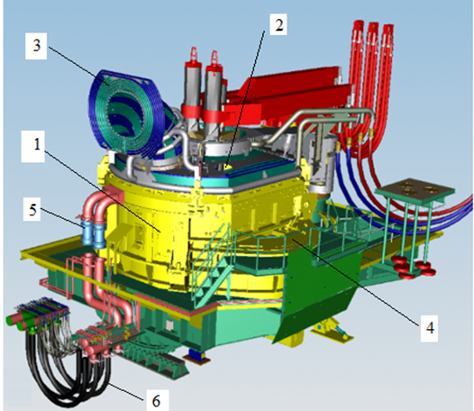
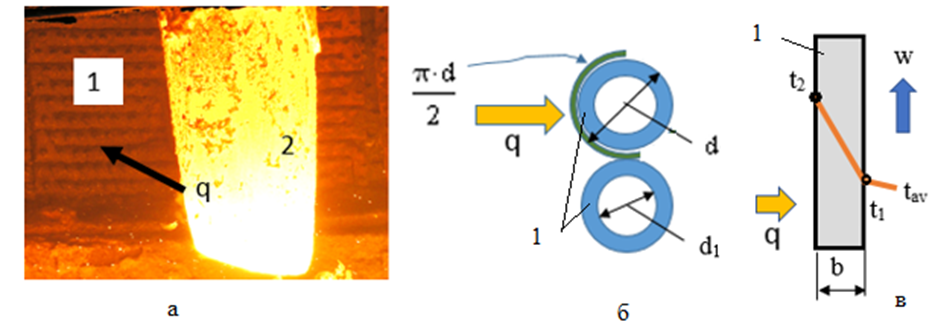
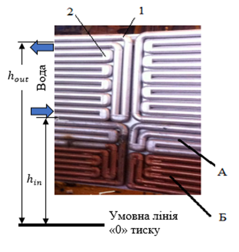

# Завдання 1.1 - Тепловий і гідравлічний розрахунок водоохолоджуваної панелі ДСП

## 1. Загальні положення

### 1.1 Опис об'єкту дослідження

Дугова сталеплавильна піч (ДСП) - це сучасне металургійне обладнання, що використовується для виплавки сталі. В сучасних конструкціях ДСП застосовують трубчасті водоохолоджувані захисні панелі стін і зводу замість традиційної цегляної футерівки.

### 1.2 Конструктивні особливості

Основні елементи конструкції ДСП включають:
1. Стінові панелі (розташовані вище лінії шлаку)
2. Звід (за винятком центральної частини)
3. Аспіраційний газохід
4. Кришку ежектора (вузли випуску)
5. Водяні колектори
6. Гнучкі шланги для подачі води

### 1.3 Детальний опис конструкції ДСП

На рисунку 1.1 представлена сучасна конструкція дугової сталеплавильної печі (ДСП) з водоохолоджуваними елементами. Розглянемо детально кожен елемент конструкції:



1. **Стінові панелі** (позиція 1):
   - Розташовані вище лінії шлаку
   - Виконані у вигляді трубчастих водоохолоджуваних елементів
   - Забезпечують захист корпусу печі від високих температур
   - Замінюють традиційну цегляну футерівку

2. **Звід печі** (позиція 2):
   - Охоплює верхню частину печі, крім центральної частини
   - Також виконаний з водоохолоджуваних панелей
   - Центральна частина залишається вільною для розміщення електродів

3. **Аспіраційний газохід** (позиція 3):
   - Призначений для відведення технологічних газів
   - Має водоохолоджувану конструкцію для захисту від високих температур
   - Інтегрований в загальну систему охолодження печі

4. **Кришка ежектора** (позиція 4):
   - Розташована в зоні вузла випуску
   - Забезпечує герметичність системи
   - Має водяне охолодження для підтримки робочої температури

5. **Водяні колектори** (позиція 5):
   - Забезпечують розподіл охолоджуючої води по системі
   - Формують замкнутий контур охолодження
   - З'єднують окремі водоохолоджувані елементи в єдину систему

6. **Гнучкі шланги** (позиція 6):
   - Забезпечують подачу води до рухомих елементів конструкції
   - Дозволяють здійснювати нахил печі при зливі металу
   - Витримують високі температури та механічні навантаження

Така конструкція, хоча і призводить до збільшення витрат енергії через втрати теплоти з водою, є економічно доцільною з точки зору економії вогнетривів та збільшення терміну служби печі.

### 1.4 Економічне обґрунтування

Хоча використання водоохолоджуваних панелей призводить до збільшення витрат енергії через втрати теплоти з водою, така конструкція є економічно доцільною з наступних причин:
- Значне зменшення витрат на вогнетриви
- Збільшення терміну служби печі
- Зменшення часу на ремонт та обслуговування

## 2. Теплообмінні процеси

### 2.1 Схема теплообміну

На рисунку 1.2 представлена комплексна схема теплообміну в системі "робочий простір ДСП – захисна водоохолоджувана панель". Схема складається з трьох взаємопов'язаних частин:



#### 2.1.1 Загальний вигляд теплового потоку (рис. 1.2.а)

На фотографії показано реальний процес теплообміну в ДСП:
- Позиція 1 - водоохолоджувана панель (трубчастий змійовик)
- Позиція 2 - графітований електрод
- Стрілкою q позначено напрямок теплового потоку від робочого простору печі до панелі
- Яскраве світіння демонструє інтенсивність теплового випромінювання

#### 2.1.2 Сприйняття теплового потоку панеллю (рис. 1.2.б)

Схематично показано геометричні параметри теплосприймаючої поверхні:
- Тепловий потік q направлений на трубчасту конструкцію
- π·d/2 - площа теплосприймаючої поверхні труби
- d - зовнішній діаметр труби
- d₁ - внутрішній діаметр труби
- Конструкція являє собою систему паралельних труб

#### 2.1.3 Відведення теплоти водою (рис. 1.2.в)

Представлено схему розподілу температур у водоохолоджуваній панелі:
- Висота панелі позначена як 1
- Ширина панелі позначена як b
- w - напрямок руху охолоджуючої води
- t₁ - температура води на вході
- t₂ - температура води на виході
- tₐᵥ - середня температура води
- q - тепловий потік, що відводиться водою

Така схема дозволяє:
1. Визначити кількість теплоти, що сприймається панеллю
2. Розрахувати необхідну витрату охолоджуючої води
3. Оцінити ефективність теплообміну
4. Контролювати температурний режим роботи панелі

Розуміння цієї схеми є ключовим для подальших теплових та гідравлічних розрахунків водоохолоджуваної панелі ДСП.

### 2.2 Основні параметри теплообміну

При розрахунку необхідно враховувати наступні параметри:
- Тепловий потік (q)
- Діаметр труб (d, d₁)
- Температурні показники (t₁, t₂)
- Ширина панелі (b)

## 3. Мета розрахунку

Основною метою теплового і гідравлічного розрахунку є:
1. Визначення оптимальних параметрів водоохолодження
2. Розрахунок необхідної витрати води
3. Оцінка ефективності теплообміну
4. Визначення температурних режимів роботи панелі

## 4. Вихідні дані для розрахунку

### 4.1 Геометричні параметри
- Діаметр труб водоохолоджуваної панелі
- Розміри панелі
- Конфігурація системи охолодження

### 4.2 Технологічні параметри
- Тепловий потік
- Витрата води
- Початкова температура охолоджуючої води
- Допустиме підвищення температури води

## 5. Методика розрахунку

Розрахунок включає наступні етапи:
1. Визначення середньої температури води в панелі:
   $$t_{av} = \frac{t_{out} + t_{in}}{2}$$
2. Визначення коефіцієнта тепловіддачі з рівняння Ньютона-Ріхмана:
   $$\alpha = \frac{q}{t_1 - t_{av}}$$
3. Обчислення числа Прандтля:
   $$Pr = \frac{\rho \cdot C \cdot \nu}{\lambda}$$
4. Визначення швидкості руху води за формулою (1.4):
   $$w = \left(\frac{\alpha \cdot d_1^{0,2} \cdot \nu^{0,8}}{0,021 \cdot Pr^{0,43} \cdot \lambda}\right)^{1,25}$$
5. Визначення витрати води:
   $$Q = w \cdot \pi \cdot d_1^2 / 4$$
6. Розрахунок максимальної довжини змійовика з рівняння теплового балансу.
7. Перевірка температури робочої поверхні панелі.
8. Визначення втрат тиску та перевірка умови:
   $$\Delta P_{loss} \cdot 1,25 \leq P_{wat}$$

## 6. Очікувані результати

В результаті виконання завдання мають бути визначені:
1. Оптимальні параметри системи охолодження
2. Ефективність теплообміну
3. Температурні режими роботи панелі
4. Гідравлічні характеристики системи

## 7. Формулювання Завдання

На основі заданого теплового потоку в робочому просторі ДСП необхідно провести тепловий та гідравлічний розрахунок захисної водоохолоджуваної панелі, а саме:
- визначити швидкість протікання та витрату води в панелі;
- оцінити максимальну довжину змійовика;
- встановити температурну робочої поверхні панелі;
- оцінити втрати тиску води в панелі.

Перші три пункти завдання стосуються теплового розрахунку панелі, четвертий – гідравлічного. Завдання в цілому ставить мету забезпечити експлуатацію панелі у штатному стаціонарному режимі.

## 8. Математичний опис процесів

### 8.1 Швидкість течії і витрата води у панелі

Теплообмін стінки труби змійовика з водою за умов турбулентного режиму описується критеріальним рівнянням (спрощеним для інженерних оцінок), що визначає число Нусельта через число Рейнольдса та число Прандтля:

формула (1.1)
$$Nu = α · d₁/λ = 0,021 · Re^{0,8} · Pr^{0,43}$$

де:
- Nu = α·d₁/λ – число Нусельта (безрозмірна величина, характеризує інтенсивність конвективного теплообміну)
- Re = w·d₁/ν – число Рейнольдса (безрозмірна величина, характеризує режим течії)
- Pr = ρ·C·ν/λ – число Прандтля (безрозмірна величина, характеризує фізичні властивості рідини)
- α – коефіцієнт тепловіддачі конвекцією від стінки труби до потоку води (Вт/(м²·К))
- w – швидкість течії води (м/с)
- q – променевий тепловий потік з робочого простору печі (Вт/м²)
- λ – коефіцієнт теплопровідності води (Вт/(м·К))
- ν – коефіцієнт кінематичної в'язкості води (м²/с)
- ρ – щільність води (кг/м³)
- C – теплоємність води (Дж/(кг·К))
- d₁, d – внутрішній та зовнішній діаметр змійовика відповідно (м)

Основний параметр, що визначає теплову роботу панелі α при заданому q обчислюється із рівняння Ньютона-Ріхмана:
формула (1.2)
$$q = α · (t₁ - t_{av})$$

де:
- q – тепловий потік, що сприймається поверхнею панелі (Вт/м²)
- α – коефіцієнт тепловіддачі від стінки труби до потоку води (Вт/(м²·К))
- t₁ – температура стінки водяного каналу панелі (°С)
- t_av = (t_out + t_in)/2 – середня температура води в панелі (°С); t_in – температура на вході (°С); t_out ≤ 55 °С – температура на виході (°С)

З урахуванням виразів для складових, рівняння (1.1) приймає вид:
формула (1.3)
$$\frac{q \cdot d_1}{\lambda \cdot (t_1-t_{av})} = 0,021(\frac{w \cdot d_1}{\nu})^{0,8}(\rho \cdot C \cdot \nu/\lambda)^{0,43}$$

де всі позначення відповідають формулам (1.1) та (1.2): q (Вт/м²), d₁ (м), λ (Вт/(м·К)), t₁ та t_av (°С), w (м/с), ν (м²/с), ρ (кг/м³), C (Дж/(кг·К)).

Швидкість руху води w (м/с), що входить у вираз для числа Рейнольдса критеріального рівняння (1.1, 1.3), визначається з подальших розрахунків.

### 8.2 Розрахунок швидкості та витрати води

Швидкість руху води визначається за формулою:
формула (1.4)
$$w = (\frac{α·d₁^{0,2}·ν^{0,8}}{0,021·(ρ·C·ν/λ)^{0,43}·λ})^{1,25}$$

де:
- w – швидкість течії води в змійовику (м/с)
- α – коефіцієнт тепловіддачі від стінки труби до потоку води (Вт/(м²·К))
- d₁ – внутрішній діаметр труби (м)
- ν – коефіцієнт кінематичної в'язкості води (м²/с)
- ρ – щільність води (кг/м³)
- C – теплоємність води (Дж/(кг·К))
- λ – коефіцієнт теплопровідності води (Вт/(м·К))

Зазвичай швидкість води в панелях складає 0,6-2,5 м/с.

Витрата води в панелі Q (м³/с) дорівнює добутку швидкості течії води та площі перерізу каналу і становить:
формула (1.5)
$$Q = w · π·d₁²/4$$

де:
- Q – витрата охолоджуючої води в панелі (м³/с)
- w – швидкість течії води (м/с)
- d₁ – внутрішній діаметр труби змійовика (м)

### 8.3 Максимальна довжина змійовика

Довжина змійовика L (м) визначається з міркувань забезпечення теплового балансу панелі та запобігання відкладення солей жорсткості на поверхні водяного каналу у разі перегріву води.

Важливі температурні обмеження:
- Перегрів води призводить до випадіння солей жорсткості при температурі 50-60 °С
- Для типової схеми водопідготовки на металургійному заводі рекомендується:
  - Температура стінки водяного каналу панелі $t₁ ≤ 75$ °С (рис. 1.2)
  - Температура води на виході з контуру охолодження $≤ 55$ °С

Стаціонарний режим панелі передбачає рівність:
- Енергії, що надходить в одиницю часу з променевим тепловим потоком q крізь робочу поверхню панелі $π(d/2)·L$ (рис. 1.1) – ліва частина рівняння (1.6)
- Теплоти, що відбирає вода через конвекцію – права частина (1.6)
формула (1.6)
$$q · π(d/2)· L = w · ρ · π(d₁²/4) · C(t_{out} - t_{in})$$

де:
- q – тепловий потік на зовнішній поверхні панелі (Вт/м²)
- d – зовнішній діаметр труби змійовика (м)
- L – довжина змійовика (м)
- w – швидкість течії води (м/с)
- ρ – щільність води (кг/м³)
- d₁ – внутрішній діаметр труби змійовика (м)
- C – теплоємність води (Дж/(кг·К))
- t_out – температура води на виході з панелі (°С)
- t_in – температура води на вході в панель (°С)

За умов теплового балансу панелі в ДСП, максимально допустима довжина змійовика панелі L (м) із рівняння (1.6) становить:
формула (1.7)
$$L = [w · ρ · π(d₁²/4) · C(t_{out} - t_{in})]/[q · π(d/2)]$$

де всі позначення відповідають формулі (1.6): L (м), w (м/с), ρ (кг/м³), d₁ та d (м), C (Дж/(кг·К)), t_out та t_in (°С), q (Вт/м²).

Зазвичай, довжина змійовика панелі ДСП складає 10-30 м.

### 8.4 Температура робочої поверхні панелі

Температура зовнішньої поверхні змійовика визначається за формулою:
формула (1.8)
$$t_2 = t_1 + [q \ln(d/d_1)/2πλ_{pipe}]$$

де:
- t₂ – температура зовнішньої (робочої) поверхні труби змійовика (°С)
- t₁ – температура стінки водяного каналу (внутрішньої поверхні труби) (°С)
- q – тепловий потік на поверхні панелі (Вт/м²)
- d – зовнішній діаметр труби (м)
- d₁ – внутрішній діаметр труби (м)
- λ_pipe – коефіцієнт теплопровідності матеріалу труби (Вт/(м·К))

Перегрів труби спричинює утворення тріщин малоциклової втоми через перевищення еквівалентних термічних напружень певної межі плинності матеріалу. В довідниках, у даному контексті, приводять експлуатаційну температуру конструкційних матеріалів, яку рекомендують не перевищувати:
- Для сталі 20 та мідi граничнa температура становить 450 та 260 °С відповідно (t₂, рис. 1.2)
- В певних межах t₂ можна знизити за рахунок зменшення товщини стінки b
- Оскільки умови роботи панелей передбачають ударні навантаження через падіння фрагментів скрапу, товщина стінки труби b має бути > 8-10 мм

### 8.5 Втрати тиску води в панелі

Втрати тиску $ΔP_{loss}$ (Па) при протіканні рідини в каналі є надлишковими. Таким чином, абсолютний тиск води на вході в панель має становити, як мінімум, $ΔP_{loss} + 10^5$ (Па).

Величина $ΔP_{loss}$ включає:
1. Динамічні, пропорційні динамічному тиску $ρ · w²/2$, складові:
   - втрати на тертя ($ΔP_{fr}$)
   - місцеві опори ($ΔP_{lr}$)
2. Статичні (геометричні) складові, пов'язані із взаємним розташуванням патрубків живлення і зливу води ($ΔP_g$)

Формули для розрахунку:
формула (1.9)
$$ΔP_{fr} = μ_{fr} · (L/d_1) · ρ · w²/2$$
формула (1.10)
$$ΔP_{lr} = \sum_{i=1}^n ξ_{lr}^i · (ρ · \frac{w²}{2})$$
формула (1.11)
$$ΔP_g = ρ · g · (h_{out} - h_{in})$$
формула (1.12)
$$ΔP_{loss} = ΔP_{fr} + ΔP_{lr} + ΔP_g$$

де:
- $ΔP_{fr}$ – втрати тиску на тертя по довжині (Па)
- $ΔP_{lr}$ – місцеві втрати тиску (Па)
- $ΔP_g$ – статичні (геометричні) втрати тиску (Па)
- $ΔP_{loss}$ – сумарні втрати тиску в панелі (Па)
- $μ_{fr}$ – безрозмірний коефіцієнт тертя Дарсі–Вейсбаха
- $L$ – довжина змійовика (м)
- $d_1$ – внутрішній діаметр труби (м)
- $ρ$ – щільність води (кг/м³)
- $w$ – швидкість течії води (м/с)
- $ξ_{lr}^i$ – безрозмірний коефіцієнт місцевого опору i-го типу
- $n$ – кількість місцевих опорів i-го типу
- $g$ – прискорення вільного падіння (м/с²)
- $h_{in}$, $h_{out}$ – висота розташування вхідного та вихідного патрубків над умовною лінією цехової магістралі відповідно (м)

Умови розрахунку $ΔP_{loss}$ в захисній панелі ДСП:
- Зазвичай, конструкційні рішення живлення панелей водою передбачають $h_{out} ≈ h_{in}$, тому $ΔP_g ≈ 0$
- У загальному ж випадку $ΔP_g > 0$, тому що для виходу з системи охолодження газових бульбашок, розчинених у воді, має бути $h_{out} > h_{in}$

### 8.6 Структура змійовика та оцінка втрат тиску

На рисунку 1.3 представлена структура змійовика захисної водоохолоджуваної панелі ДСП та схема оцінки втрат тиску. Конструкція має наступні особливості:



#### 8.6.1 Матеріали та конструкція
- **А** – сталева панель
- **Б** – мідна панель
- Змійовик складається з двох різних матеріалів для оптимального співвідношення міцності та теплопровідності

#### 8.6.2 Місцеві опори
1. **Поворот на 90°** (позиція 1):
   - Розташований на переході між панелями
   - Створює додатковий гідравлічний опір
   - Коефіцієнт місцевого опору визначається за довідниковими даними

2. **Поворот на 180°** (позиція 2):
   - Забезпечує зміну напрямку руху води
   - Має більший коефіцієнт місцевого опору порівняно з поворотом на 90°
   - Впливає на загальні втрати тиску в системі

#### 8.6.3 Висотні параметри
- **h_out** – висота розташування вихідного патрубка
- **h_in** – висота розташування вхідного патрубка
- Різниця висот (h_out - h_in) впливає на статичну складову втрат тиску
- Умовна лінія "0" тиску служить базовою відміткою для розрахунку висот

#### 8.6.4 Особливості розрахунку втрат тиску
1. **Динамічні втрати**:
   - Враховують всі повороти на 90° та 180°
   - Кожен поворот має свій коефіцієнт місцевого опору
   - Сумарні втрати залежать від кількості поворотів

2. **Статичні втрати**:
   - Визначаються різницею висот h_out та h_in
   - Впливають на видалення газових бульбашок
   - Рекомендується підтримувати h_out > h_in

3. **Загальні рекомендації**:
   - Оптимізація конструкції для мінімізації місцевих опорів
   - Забезпечення надійного видалення газів
   - Врахування впливу температури на властивості води

### 8.9 Експлуатаційні норми гідравлічного розрахунку

Відповідність гідравлічного розрахунку панелі експлуатаційним нормам полягає в тому, що загальні втрати тиску води $ΔP_{loss}$ мають не перевищувати можливостей цехової водної магістралі $P_{wat}$ з коефіцієнтом запасу 1,25:

формула (1.13)
$$ΔP_{loss} · 1,25 ≤ P_{wat}$$

де:
- $ΔP_{loss}$ – сумарні втрати тиску в панелі (Па або МПа)
- $P_{wat}$ – наявний (абсолютний) тиск води в цеховій магістралі (Па або МПа)
- 1,25 – коефіцієнт запасу надійності

Зазвичай абсолютний тиск води в цеховій магістралі становить 0,3-0,4 МПа.

### 8.10 Довідкові дані і варіанти завдання

При виконанні завдання прийняті щодо розрахунків наступні теплофізичні параметри:

#### 8.10.1 Теплофізичні властивості матеріалів
- Теплопровідність води: $λ = 0,63$ Вт/(м·К)
- Теплопровідність сталі Ст20: $λ_{pipe} = 39$ Вт/(м·К)
- Теплопровідність міді: $λ_{pipe} = 370$ Вт/(м·К)

#### 8.10.2 Властивості води
- Щільність води: $ρ = 1$ т/м³
- Теплоємність води: $C = 4,2$ кДж/(кг·К)
- Коефіцієнт кінематичної в'язкості води: $ν = 10^{-6}$ м²/с

#### 8.10.3 Гідравлічні параметри
- Коефіцієнт тертя води в трубі: $μ_{fr} = 0,045$
- Коефіцієнт місцевого опору поворот потоку на 90°: $ξ_{lr}^1 = 0,22$
- Коефіцієнт місцевого опору поворот потоку на 180°: $ξ_{lr}^2 = 0,31$

#### 8.10.4 Розрахункові умови
Прийняти в розрахунках:
- $t_1 = 75$ °С
- $t_{out} = 55$ °С
- $ΔP_g = 0$

*Примітка: Варіанти завдань наведено в табл. 1.1. Слідкуйте за розмірністю величин в розрахункових формулах і в завданні.*

#### 8.11 Варіанти завдання

**Таблиця 1.1 - Варіанти завдання**

| Номер варіанту | Тепловий потік $q$ (кВт/м²) | Діаметр труби $d/d_1$ (мм) | Кількість місцевих опорів $n$ |  | Температура води вихідна $t_{in}$ (°С) | Тиск води в цеху $P_{wat}$ (МПа) | Матеріал труби |
|----------------|----------------------------|-------------------------|---------------------------|-----------------|----------------------------------|--------------------------------|----------------|
|                |                            |                         | 90° | 180° |                                  |                                |                |
| 1              | 155                        | 76/56                   | 2   | 10   | 20                               | 0,45                           | Сталь Ст20     |
| 2              | 280                        | 89/65                   | 2   | 68   | 25                               | 0,35                           | Мідь           |
| 3              | 145                        | 73/53                   | 2   | 10   | 25                               | 0,27                           | Сталь Ст20     |
| 4              | 170                        | 76/56                   | 2   | 8    | 20                               | 0,34                           | Сталь Ст20     |
| 5              | 160                        | 89/65                   | 3   | 10   | 15                               | 0,40                           | Сталь Ст20     |
| 6              | 250                        | 73/53                   | 3   | 12   | 18                               | 0,26                           | Мідь           |
| 7              | 305                        | 76/52                   | 2   | 5    | 22                               | 0,36                           | Мідь           |
| 8              | 120                        | 89/69                   | 2   | 8    | 24                               | 0,32                           | Сталь Ст20     |
| 9              | 175                        | 73/49                   | 4   | 12   | 23                               | 0,28                           | Сталь Ст20     |
| 10             | 230                        | 76/56                   | 2   | 8    | 20                               | 0,30                           | Мідь           |
| 11             | 165                        | 89/65                   | 2   | 6    | 19                               | 0,25                           | Сталь Ст20     |
| 12             | 150                        | 73/53                   | 3   | 12   | 18                               | 0,35                           | Сталь Ст20     |
| 13             | 140                        | 76/54                   | 2   | 10   | 25                               | 0,27                           | Сталь Ст20     |
| 14             | 235                        | 89/69                   | 4   | 12   | 25                               | 0,34                           | Мідь           |
| 15             | 255                        | 73/49                   | 2   | 8    | 20                               | 0,40                           | Мідь           |
| 16             | 200                        | 76/56                   | 2   | 68   | 20                               | 0,26                           | Сталь Ст20     |
| 17             | 185                        | 89/65                   | 3   | 10   | 15                               | 0,35                           | Сталь Ст20     |
| 18             | 285                        | 73/53                   | 2   | 8    | 18                               | 0,32                           | Мідь           |
| 19             | 140                        | 60/44                   | 4   | 10   | 22                               | 0,28                           | Сталь Ст20     |
| 20             | 210                        | 73/49                   | 3   | 12   | 24                               | 0,30                           | Сталь Ст20     |
| 21             | 170                        | 76/56                   | 2   | 5    | 23                               | 0,25                           | Сталь Ст20     |
| 22             | 260                        | 89/65                   | 2   | 8    | 20                               | 0,35                           | Мідь           |
| 23             | 155                        | 73/53                   | 3   | 12   | 19                               | 0,32                           | Сталь Ст20     |
| 24             | 295                        | 60/44                   | 2   | 8    | 18                               | 0,34                           | Мідь           |
| 25             | 200                        | 89/65                   | 4   | 6    | 25                               | 0,39                           | Сталь Ст20     |

# Тепловий і гідравлічний розрахунок водоохолоджуваної панелі ДСП
## Варіант 25

### 1. Вступ

Дугова сталеплавильна піч (ДСП) є сучасним металургійним обладнанням, що використовується для виплавки сталі. В конструкції ДСП застосовуються трубчасті водоохолоджувані захисні панелі стін і зводу, які замінюють традиційну цегляну футерівку. Ефективність роботи цих панелей безпосередньо впливає на енергоефективність та довговічність печі.

### 2. Вхідні дані

Згідно з варіантом 25 маємо наступні параметри:
- Тепловий потік: q = 200 кВт/м²
- Діаметр труби: d/d₁ = 89/65 мм
- Кількість місцевих опорів:
  - n₉₀ = 4 (поворот на 90°)
  - n₁₈₀ = 6 (поворот на 180°)
- Температура води вхідна: $t_{in}$ = 25 °С
- Тиск води в цеху: $P_{wat}$ = 0,39 МПа
- Матеріал труби: Сталь Ст20

Додаткові умови та константи:
- Температура стінки водяного каналу: t₁ = 75 °С
- Температура води на виході: $t_{out}$ = 55 °С
- Теплопровідність сталі Ст20: $λ_{pipe}$ = 39 Вт/(м·К)
- Теплопровідність води: $λ$ = 0,63 Вт/(м·К)
- Щільність води: ρ = 1000 кг/м³
- Теплоємність води: C = 4200 Дж/(кг·К)
- Коефіцієнт кінематичної в'язкості води: ν = 10⁻⁶ м²/с
- Коефіцієнт тертя води в трубі: $μ_{fr}$ = 0,045
- Коефіцієнти місцевого опору:
  - поворот на 90°: $ξ_{lr}^1$ = 0,22
  - поворот на 180°: $ξ_{lr}^2$ = 0,31

### 3. Розрахунок швидкості та витрати води

#### 3.1 Середня температура води

$$t_{av} = \frac{t_{out} + t_{in}}{2} = \frac{55 + 25}{2} = 40\ ^\circ\text{C}$$

де: t_out = 55 °С – температура води на виході; t_in = 25 °С – температура води на вході.

#### 3.2 Коефіцієнт тепловіддачі

З рівняння Ньютона-Ріхмана:

$$\alpha = \frac{q}{t_1 - t_{av}} = \frac{200000}{75 - 40} = 5714,29\ \text{Вт/(м}^2\cdot\text{К)}$$

де: q = 200 000 Вт/м² – тепловий потік; t₁ = 75 °С – температура стінки водяного каналу; t_av = 40 °С – середня температура води.

#### 3.3 Число Прандтля і швидкість води

$$Pr = \frac{\rho \cdot C \cdot \nu}{\lambda} = \frac{1000 \cdot 4200 \cdot 10^{-6}}{0,63} = 6,6667$$

де: ρ = 1000 кг/м³ – щільність води; C = 4200 Дж/(кг·К) – теплоємність; ν = 10⁻⁶ м²/с – кінематична в'язкість; λ = 0,63 Вт/(м·К) – теплопровідність води.

$$w = \left(\frac{\alpha \cdot d_1^{0,2} \cdot \nu^{0,8}}{0,021 \cdot Pr^{0,43} \cdot \lambda}\right)^{1,25} = 2,02\ \text{м/с}$$

де: α = 5714,29 Вт/(м²·К) – коефіцієнт тепловіддачі; d₁ = 0,065 м – внутрішній діаметр труби; інші позначення ті ж, що і у формулі Pr вище.

Отримана швидкість знаходиться в рекомендованих межах 0,6-2,5 м/с.

#### 3.4 Витрата води

$$Q = w \cdot \pi \cdot d_1^2 / 4 = 2,02 \cdot \pi \cdot 0,065^2 / 4 = 0,00669\ \text{м}^3/\text{с}$$

де: w = 2,02 м/с – швидкість течії води; d₁ = 0,065 м – внутрішній діаметр труби.

Або в перерахунку на годинну витрату:

$$Q = 24,09\ \text{м}^3/\text{год}$$

### 4. Розрахунок довжини змійовика

Довжина змійовика визначається з рівняння теплового балансу (1.6):

$$q · π(d/2)· L = w · ρ · π(d₁²/4) · C(t_{out} - t_{in})$$

де:
- L – довжина змійовика (м)
- w – швидкість течії води (м/с)
- ρ – щільність води (кг/м³)
- d – зовнішній діаметр труби (м)
- d₁ – внутрішній діаметр труби (м)
- C – теплоємність води (Дж/(кг·К))
- q – тепловий потік на поверхні панелі (Вт/м²)
- t_out – температура води на виході (°С)
- t_in – температура води на вході (°С)

Виразивши L, отримуємо формулу (1.7):

$$L = \frac{w · ρ · π(d₁²/4) · C(t_{out} - t_{in})}{q · π(d/2)}$$

Підставляючи розраховану швидкість води, отримуємо:

$$L = \frac{2,02 · 1000 · π(0,065²/4) · 4200(55 - 25)}{200000 · π(0,089/2)} = 30,16\ м$$

Розрахована довжина змійовика становить 30,16 м, що формально перевищує верхню межу рекомендованого експлуатаційного діапазону (10–30 м). З точки зору інженерних розрахунків, таке відхилення (близько 0,5%) є незначним і повністю вписується в допустиму похибку математичної моделі, тому в базовому варіанті панель є працездатною.

Однак, проектування системи охолодження на граничних параметрах знижує її загальну надійність. Для оптимізації роботи панелі, суттєвого зменшення гідравлічного опору та запобігання ризикам локального перегріву чи закипання води, найбільш раціональним конструктивним рішенням є поділ даної панелі на два паралельні контури охолодження (приблизно по 15 м кожен). Це дозволить гарантовано вивести параметри системи в безпечний оптимум.

### 5. Розрахунок температури робочої поверхні

Температура зовнішньої поверхні змійовика визначається за законом Фур'є для циліндричної одношарової стінки (1.8):

$$t_2 = t_1 + \frac{q \ln(d/d_1)}{2πλ_{pipe}}$$

де:
- t₂ – температура зовнішньої (робочої) поверхні труби змійовика (°С)
- t₁ – температура стінки водяного каналу (внутрішньої поверхні труби) (°С)
- q – тепловий потік на поверхні панелі (Вт/м²)
- d – зовнішній діаметр труби (м)
- d₁ – внутрішній діаметр труби (м)
- λ_pipe – коефіцієнт теплопровідності матеріалу труби (Вт/(м·К))

Підставляючи значення:

$$t_2 = 75 + \frac{200000 · \ln(0,089/0,065)}{2π · 39} = 331,48\ ^\circ\text{C}$$

Отримана температура не перевищує допустиму для сталі Ст20 (450 °С).

### 6. Розрахунок втрат тиску

#### 6.1 Втрати на тертя

За формулою (1.9):

$$ΔP_{fr} = μ_{fr} · (L/d_1) · ρ · w²/2$$

де:
- $ΔP_{fr}$ – втрати тиску на тертя по довжині (Па)
- $μ_{fr}$ – безрозмірний коефіцієнт тертя Дарсі–Вейсбаха
- L – довжина змійовика (м)
- d₁ – внутрішній діаметр труби (м)
- ρ – щільність води (кг/м³)
- w – швидкість течії води (м/с)

$$ΔP_{fr} = 0,045 · (30,16/0,065) · 1000 · 2,02²/2 = 42453\ \text{Па} = 42,45\ \text{кПа}$$

#### 6.2 Місцеві втрати

За формулою (1.10):

$$ΔP_{lr} = \sum_{i=1}^n ξ_{lr}^i · (ρ · \frac{w²}{2})$$

де:
- $ΔP_{lr}$ – місцеві втрати тиску (Па)
- $ξ_{lr}^i$ – безрозмірний коефіцієнт місцевого опору i-го типу
- n – кількість місцевих опорів i-го типу
- ρ – щільність води (кг/м³)
- w – швидкість течії води (м/с)

$$ΔP_{lr} = (4 · 0,22 + 6 · 0,31) · (1000 · \frac{2,02²}{2}) = 5572\ \text{Па} = 5,57\ \text{кПа}$$

#### 6.3 Сумарні втрати

За формулою (1.12):

$$ΔP_{loss} = ΔP_{fr} + ΔP_{lr} + ΔP_g = 42453 + 5572 + 0 = 48025\ \text{Па} = 48,02\ \text{кПа}$$

де:
- $ΔP_{loss}$ – сумарні втрати тиску в панелі (Па)
- $ΔP_{fr}$ – втрати на тертя по довжині (Па)
- $ΔP_{lr}$ – місцеві втрати тиску (Па)
- $ΔP_g$ – статичні (геометричні) втрати тиску; за умовою $h_{out} ≈ h_{in}$, тому $ΔP_g = 0$ (Па)

Перевірка відповідності експлуатаційним нормам:

$$ΔP_{loss} \cdot 1,25 = 48,02 \cdot 1,25 = 60,03\ \text{кПа} = 0,060\ \text{МПа}$$

Оскільки $0,060\ \text{МПа} < 0,39\ \text{МПа}$, наявний тиск води в цеху є достатнім.

### 7. Перевірка обмежень

1. Температурний режим:
   - Температура стінки водяного каналу: 75 °С ≤ 75 °С (відповідає)
   - Температура води на виході: 55 °С ≤ 55 °С (відповідає)
   - Температура зовнішньої поверхні: 331,48 °С ≤ 450 °С (відповідає)

2. Швидкість води:
   - 2,02 м/с знаходиться в межах 0,6-2,5 м/с (відповідає)

3. Довжина змійовика:
   - 30,16 м формально перевищує верхню межу діапазону 10–30 м на ~0,5%, що вкладається в похибку моделі (прийнятно; рекомендується поділ на два контури)

4. Тиск води:
   - 0,060 МПа з урахуванням коефіцієнта запасу 1,25 менше наявного тиску 0,39 МПа (відповідає)

### 8. Висновки

1. Розрахована конструкція водоохолоджуваної панелі ДСП є працездатною, всі параметри знаходяться в допустимих межах.

2. Основні характеристики:
   - Швидкість протікання води становить 2,02 м/с, що забезпечує інтенсивний теплообмін
   - Витрата води становить 0,00669 м³/с або 24,09 м³/год
   - Довжина змійовика 30,16 м забезпечує необхідне теплознімання; формально перевищує межу 30 м на ~0,5% — у межах похибки моделі; рекомендується поділ на два паралельні контури (~15 м кожен)
   - Температура зовнішньої поверхні 331,48 °С має запас міцності близько 118,52 °С
   - Сумарні втрати тиску 48,02 кПа не перевищують допустимого значення для цехової магістралі

3. Рекомендації щодо оптимізації:
   - За потреби зменшення довжини змійовика доцільно розглянути конструктивне розділення панелі на декілька контурів охолодження
   - Наявний запас по тиску дозволяє зберігати стабільний режим роботи системи при змінних умовах експлуатації

4. Оцінка експлуатаційної надійності:
   - Значний температурний запас для матеріалу труб (118,52 °С) забезпечує захист від термічних деформацій та малоциклової втоми
   - Достатній запас по тиску води гарантує стабільну роботу системи охолодження навіть при коливаннях тиску в цеховій мережі
   - Оптимальний температурний режим води перешкоджає утворенню накипу та знижує ризик локальних перегрівів

5. Висновки щодо практичної реалізації:
   - Розрахована водоохолоджувана панель для ДСП повністю відповідає технічним вимогам експлуатації
   - Має значні запаси по основним параметрам, що забезпечує надійність роботи
   - Економічно доцільна, оскільки підвищує довговічність печі та знижує витрати на вогнетриви
   - Допускає можливості подальшої оптимізації для підвищення ефективності роботи

Застосування такої конструкції водоохолоджуваної панелі дозволяє досягти оптимального балансу між енергетичними витратами на охолодження та збільшенням терміну служби печі, що є важливим техніко-економічним показником для металургійного виробництва.

# ДОДАТОК
### Скрипт для розрахунку варіантів


```python
"""
Розрахунок водоохолоджуваної панелі ДСП
Варіант 25
"""
import math

# 1. Вхідні дані з таблиці 1.1 для варіанту 25
q = 200  # тепловий потік, кВт/м²
d = 89/1000  # зовнішній діаметр труби, м
d1 = 65/1000  # внутрішній діаметр труби, м
n_90 = 4  # кількість поворотів на 90°
n_180 = 6  # кількість поворотів на 180°
t_in = 25  # температура води на вході, °С
P_wat = 0.39  # тиск води в цеху, МПа
material = "Сталь Ст20"

# Константи з умов розрахунку
t1 = 75  # температура стінки водяного каналу панелі, °С
t_out = 55  # температура води на виході, °С
dP_g = 0  # статичні втрати тиску, Па

# Фізичні константи
lambda_st20 = 39  # теплопровідність сталі Ст20, Вт/(м·К)
lambda_cu = 370  # теплопровідність міді, Вт/(м·К)
lambda_water = 0.63  # теплопровідність води, Вт/(м·К)
rho = 1000  # щільність води, кг/м³
C = 4200  # теплоємність води, Дж/(кг·К)
nu = 1e-6  # коефіцієнт кінематичної в'язкості води, м²/с
mu_fr = 0.045  # коефіцієнт тертя води в трубі
xi_lr1 = 0.22  # коефіцієнт місцевого опору поворот на 90°
xi_lr2 = 0.31  # коефіцієнт місцевого опору поворот на 180°

# Вибір теплопровідності матеріалу
lambda_pipe = lambda_st20 if material == "Сталь Ст20" else lambda_cu

# 2. Розрахунок швидкості та витрати води
q_w = q * 1000
t_av = (t_in + t_out) / 2
alpha = q_w / (t1 - t_av)
Pr = (rho * C * nu) / lambda_water
w = ((alpha * d1**0.2 * nu**0.8) / (0.021 * Pr**0.43 * lambda_water)) ** 1.25
Q = w * math.pi * d1**2 / 4

# 3. Розрахунок довжини змійовика за формулою (1.7)
L = (w * rho * math.pi * (d1**2/4) * C * (t_out - t_in)) / (q_w * math.pi * (d/2))

# 4. Розрахунок температури робочої поверхні
t2 = t1 + (q_w * math.log(d/d1)) / (2 * math.pi * lambda_pipe)

# 5. Розрахунок втрат тиску
dP_fr = mu_fr * (L/d1) * rho * (w**2/2)
dP_lr = (n_90 * xi_lr1 + n_180 * xi_lr2) * rho * (w**2/2)
dP_loss = dP_fr + dP_lr + dP_g
dP_required = dP_loss * 1.25 / 1e6  # МПа

# 6. Перевірка обмежень
t2_max = 450 if material == "Сталь Ст20" else 260

print("\n1. Середня температура води: {:.2f} °С".format(t_av))
print("   Коефіцієнт тепловіддачі: {:.2f} Вт/(м²·К)".format(alpha))
print("   Число Прандтля: {:.4f}".format(Pr))
print("   Швидкість води: {:.2f} м/с".format(w))
print("   Витрата води: {:.6f} м³/с".format(Q))
print("   Розрахована довжина змійовика: {:.2f} м".format(L))

print("\n2. Температура зовнішньої поверхні змійовика: {:.2f} °С".format(t2))
print("   Максимально допустима температура: {:.2f} °С".format(t2_max))

print("\n3. Втрати тиску:")
print("   - на тертя: {:.2f} кПа".format(dP_fr/1000))
print("   - місцеві: {:.2f} кПа".format(dP_lr/1000))
print("   - сумарні: {:.2f} кПа".format(dP_loss/1000))
print("   Необхідний тиск з коефіцієнтом запасу 1,25: {:.3f} МПа".format(dP_required))
print("   Наявний тиск води: {:.2f} МПа".format(P_wat))

print("\n4. Перевірка обмежень:")
print(f"   1) Температура стінки водяного каналу: {t1:.0f} °С {'≤' if t1 <= 75 else '>'} 75 °С")
print(f"   2) Температура води на виході: {t_out:.0f} °С {'≤' if t_out <= 55 else '>'} 55 °С")
print(f"   3) Швидкість води: {w:.2f} м/с {'в межах' if 0.6 <= w <= 2.5 else 'поза межами'} 0.6-2.5 м/с")
print(f"   4) Температура зовнішньої поверхні: {t2:.1f} °С {'≤' if t2 <= t2_max else '>'} {t2_max:.0f} °С")
print(f"   5) Довжина змійовика: {L:.1f} м {'в межах' if 10 <= L <= 30 else 'поза межами'} 10-30 м")
```

    
    1. Середня температура води: 40.00 °С
       Коефіцієнт тепловіддачі: 5714.29 Вт/(м²·К)
       Число Прандтля: 6.6667
       Швидкість води: 2.02 м/с
       Витрата води: 0.006692 м³/с
       Розрахована довжина змійовика: 30.16 м
    
    2. Температура зовнішньої поверхні змійовика: 331.48 °С
       Максимально допустима температура: 450.00 °С
    
    3. Втрати тиску:
       - на тертя: 42.45 кПа
       - місцеві: 5.57 кПа
       - сумарні: 48.02 кПа
       Необхідний тиск з коефіцієнтом запасу 1,25: 0.060 МПа
       Наявний тиск води: 0.39 МПа
    
    4. Перевірка обмежень:
       1) Температура стінки водяного каналу: 75 °С ≤ 75 °С
       2) Температура води на виході: 55 °С ≤ 55 °С
       3) Швидкість води: 2.02 м/с в межах 0.6-2.5 м/с
       4) Температура зовнішньої поверхні: 331.5 °С ≤ 450 °С
       5) Довжина змійовика: 30.2 м поза межами 10-30 м
    


```python

```
