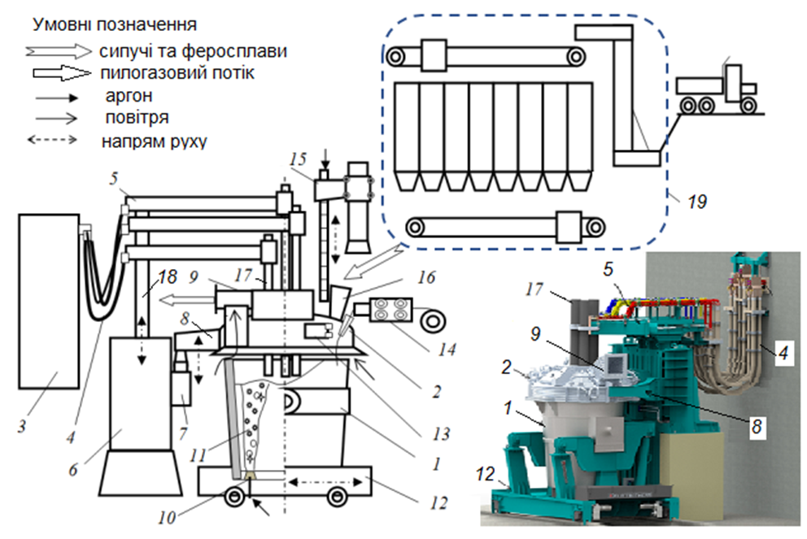
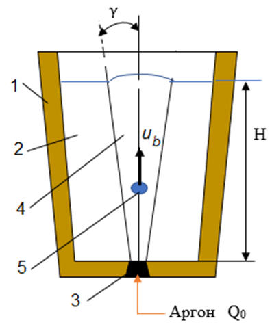
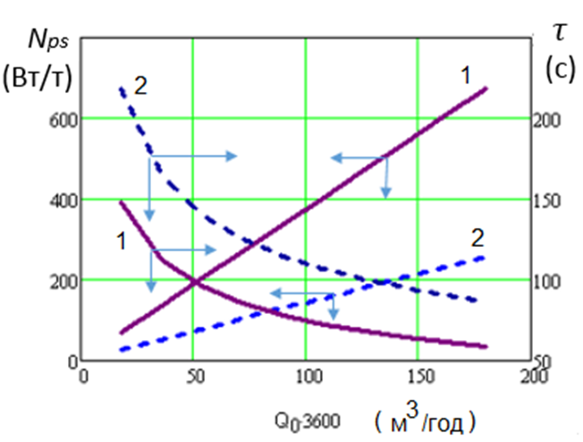
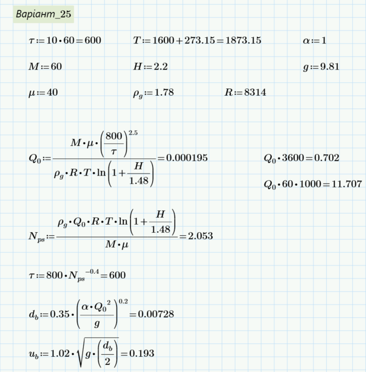

# ІНДИВІДУАЛЬНА РОБОТА №2

Завдання стосується інтенсифікації процесів тепло- і масообміну в
сталеплавильній ванні пристрою ківш-піч (ПКП). Характеристикою
інтенсивності таких процесів є потужність перемішування і тривалість
усереднення температури і хімічного складу сталі в об’ємі ковшу.

В сучасному сталеплавильному виробництві застосовують
пневматичне і електромагнітне перемішування. Найбільш поширеним є
пневматичне.

## 2.1.1 Загальні положення і формулювання завдання
ПКП є універсальним агрегатом позапічної обробки сталі в
сталерозливному ківші, відмінна риса якого полягає у використанні
електродугового нагріву (як правило, трифазний струм промислової
частоти) рідкої ванни у процесі доведення напівпродукту до заданої
марки сталі. Прототипи ПКП було створено компаніями ASEA (Швеція, 1964)
та «Daido Steel» (Японія, 1971), що отримав назву LF – Ladle
Furnace (ковш-піч). Світовою практикою, як інтегрованих металургійних
комбінатів, так і малих металургійних заводів (ММЗ) переконливо
доведено високу ефективність застосування ПКП у широкому
діапазоні місткості сталерозливних ковшів від 6 до 350 т.

В ПКП, за умов відновлювального шлакового режиму, проводять
доведення напівпродукту до заданої марки сталі. Процес передбачає
десульфурацію, розкислення, легування, модифікування, усереднення
хімічного складу й температури сталі. Реалізація електродугового
нагріву металу для компенсації втрат теплоти в процесах доведення
дає можливість застосування ПКП у якості буферу між плавильним
агрегатом, засобами вакуумної обробки (при наявності) та машини
безперервного лиття заготовок (МБЛЗ). Технологічна схема й
конструкційне рішення типового ПКП представлено на рис. 2.1.



**Рис. 2.1. Технологічна схема та загальний вид пристрою ківш-піч**

$1$ – ківш; $2$ – кришка водоохолоджувача; $3$ – трансформатор; $4$ – коротка мережа;
$5$ – рукав електродотримача; $6$ – механізм переміщення електродотримачів;
$7$ – механізм підйому кришки ковша, $8$ – консоль, що тримає кришку;
$9$ – аспіраційний газохід; $10$ – пориста пробка; $11$ – газометалева область;
$12$ – сталевоз; $13$ – робоче вікно; $14$ – трайб-апарат; $15$ – фурма аварійного
перемішування сталі; $16$ – вирва для присадки домішок в сталь; $17$ –електрод;
$18$ – стійка електродотримача; $19$ – система завантаження сипучих та феросплавів

Рисунок 2.1 представляє технологічну схему та загальний вигляд пристрою ківш-піч (ПКП), який є універсальним агрегатом позапічної обробки сталі в сталерозливному ковші. Особливістю цього пристрою є використання електродугового нагріву рідкої ванни у процесі доведення напівпродукту до заданої марки сталі.

Рисунок складається з двох основних частин:
1. Ліва частина - детальна технологічна схема ПКП з нумерацією всіх компонентів
2. Права частина - фотографія реального пристрою ківш-піч з позначенням основних елементів

На початку рисунка представлені умовні позначення для різних потоків:
- Сипучі та феросплави (позначені широкою стрілкою)
- Пилогазовий потік (позначений середньою стрілкою)
- Аргон (позначений тонкою стрілкою)
- Повітря (позначене тонкою стрілкою з іншим оформленням)
- Напрям руху (позначений пунктирною стрілкою)

**Основні компоненти пристрою ківш-піч**

На технологічній схемі пронумеровані та позначені наступні компоненти:
1. *Ківш* - основний елемент, в якому відбувається обробка сталі
2. *Кришка водоохолоджувача* - захищає верхню частину ковша та забезпечує охолодження
3. *Трансформатор* - забезпечує електричне живлення для нагріву
4. *Коротка мережа* - система електропостачання
5. *Рукав електродотримача* - утримує та спрямовує електроди
6. *Механізм переміщення електродотримачів* - дозволяє регулювати положення електродів
7. *Механізм підйому кришки ковша* - забезпечує доступ до вмісту ковша
8. *Консоль, що тримає кришку* - структурний елемент для підтримки кришки
9. *Аспіраційний газохід* - система відведення газів
10. *Пориста пробка* - елемент для введення аргону для перемішування
11. *Газометалева область* - зона взаємодії газу та металу
12. *Сталевоз* - транспортний засіб для переміщення ковша
13. *Робоче вікно* - отвір для спостереження та маніпуляцій
14. *Трайб-апарат* - пристрій для подачі матеріалів
15. *Фурма аварійного перемішування сталі* - резервна система перемішування
16. *Вирва для присадки домішок в сталь* - місце введення добавок
17. *Електрод* - основний елемент для електродугового нагріву
18. *Стійка електродотримача* - підтримуюча конструкція
19. *Система завантаження сипучих та феросплавів* - обладнання для додавання матеріалів

Пристрій ківш-піч є критично важливим елементом сучасного сталеплавильного виробництва, що забезпечує:
- Доведення напівпродукту до заданої марки сталі
- Десульфурацію, розкислення, легування, модифікування
- Усереднення хімічного складу й температури сталі
- Компенсацію втрат теплоти в процесах доведення

Головними робочими характеристиками ПКП вважаються:
1. Швидкість підйому температури (нагріву) сталевої ванни - зазвичай становить 3-6 °С за хвилину
2. Питома потужність перемішування металу в ковші - впливає на тривалість процесу доведення сталі до заданої марки

ПКП застосовується як буфер між плавильним агрегатом, засобами вакуумної обробки (при наявності) та машиною безперервного лиття заготовок (МБЛЗ), що дозволяє оптимізувати виробничий процес та підвищити якість кінцевого продукту.

Пристрій ківш-піч (ПКП) є універсальним агрегатом позапічної обробки сталі в сталерозливному ковші, відмінна риса якого полягає у використанні електродугового нагріву рідкої ванни у процесі доведення напівпродукту до заданої марки сталі. Відповідно до сучасних металургійних практик, ПКП широко застосовується як на інтегрованих металургійних комбінатах, так і на малих металургійних заводах у діапазоні місткості сталерозливних ковшів від 6 до 350 т. У даній роботі розглядаються технологічні процеси та особливості функціонування пристрою ківш-піч з акцентом на фізико-хімічні механізми, що забезпечують високу якість кінцевого продукту.

### Конструкційні особливості пристрою ківш-піч

Конструкція пристрою ківш-піч характеризується наявністю ряду взаємопов'язаних функціональних елементів, що забезпечують виконання технологічних операцій. Основу конструкції складає сталерозливний ківш із вогнетривкою футеровкою, що захищає металеву оболонку від контакту з рідким металом. Футеровка ковша зазвичай виконується з магнезіальних або доломітових вогнетривів, що забезпечують необхідну термічну та хімічну стійкість при контакті з рідким металом та шлаком.

Верхня частина ковша під час обробки закривається водоохолоджуваною кришкою, яка виконує декілька функцій: зменшення тепловтрат від дзеркала металу, відведення газів та пилу, забезпечення доступу до металу для введення електродів та присадок. Кришка має спеціальні отвори для встановлення графітових електродів, через які здійснюється нагрів металу електричною дугою.

Електродна система ПКП включає графітові електроди (зазвичай три для трифазної системи), електродотримачі з механізмом переміщення, трансформатор для живлення електродів та коротку мережу для передачі струму. Система автоматичного регулювання положення електродів забезпечує підтримку оптимальної довжини дуги в процесі обробки.

Для забезпечення перемішування металу в конструкції ПКП передбачена система подачі аргону через пористі пробки в подині ковша. Ця система включає трубопроводи для подачі аргону, регулятори витрати газу та контрольно-вимірювальні прилади для моніторингу параметрів продувки.

Введення легуючих елементів, розкислювачів, модифікаторів та шлакоутворюючих матеріалів здійснюється через спеціальну систему, що включає бункери для зберігання сипучих матеріалів, дозатори для точного вимірювання кількості матеріалів, транспортери та жолоби для подачі матеріалів у ківш. Для введення дроту з порошковим наповнювачем використовується трайб-апарат.

Важливим елементом конструкції ПКП є система відведення газів, що забезпечує видалення газів та пилу, які утворюються під час обробки. Ця система включає аспіраційний газохід, фільтри для очищення газів, вентилятори для створення розрідження та систему моніторингу складу газів.

### Технологічний процес обробки сталі в ПКП

Технологічний процес обробки сталі в пристрої ківш-піч характеризується послідовністю взаємопов'язаних операцій, спрямованих на досягнення заданих параметрів металу. Підготовчий етап передбачає перевірку стану футеровки ковша, встановлення нових пористих пробок (за необхідності), прогрів ковша до робочої температури, підготовку необхідних матеріалів для обробки та налаштування системи управління на заданий режим роботи.

Після виплавки в основному плавильному агрегаті (конвертер, електродугова піч, тощо) рідкий метал випускається в ківш. При цьому контролюється температура металу при випуску, проводиться попередній аналіз хімічного складу, формується первинний шлак або здійснюється його видалення. Після транспортування ковша з металом до ПКП починається власне процес обробки.

Після встановлення ковша на позицію обробки здійснюється накриття ковша кришкою водоохолоджувача, введення електродів у робоче положення, початок продувки аргоном через пористі пробки та включення електричного нагріву. Електрична дуга, що утворюється між електродами та металом, забезпечує нагрів металу до необхідної температури та компенсує тепловтрати під час обробки.

Одним з ключових процесів обробки є десульфурація, спрямована на зниження вмісту сірки в металі. Для цього формується основний шлак з високою ємністю за сіркою, здійснюється інтенсивне перемішування металу аргоном для прискорення реакцій, контролюється склад шлаку для оптимізації процесу та періодично відбираються проби для аналізу вмісту сірки. Хімічна реакція десульфурації може бути представлена як: [S] + (CaO) → (CaS) + [O]. Для зв'язування кисню додають розкислювачі, найчастіше алюміній: [O] + [Al] → (Al₂O₃).

Наступним етапом є розкислення та легування, під час якого відбувається коригування хімічного складу сталі. Додаються розкислювачі (Al, Si, Mn) для зниження вмісту кисню, вводяться легуючі елементи відповідно до марки сталі, контролюється температура для забезпечення повного розчинення добавок та періодично відбираються проби для аналізу хімічного складу.

Для покращення властивостей сталі можуть вводитися модифікатори, такі як кальцій для модифікації неметалевих включень, рідкоземельні метали для підвищення чистоти сталі, мікролегуючі елементи для покращення механічних властивостей. При цьому контролюється ефективність модифікування шляхом аналізу проб металу.

Важливим аспектом обробки в ПКП є забезпечення оптимальної температури металу перед розливанням. Для цього здійснюється нагрів електричною дугою до заданої температури, контролюється швидкість нагріву (зазвичай 3-6 °С за хвилину), враховуються тепловтрати під час подальшого транспортування та забезпечується температурний запас для наступних операцій.

Завершальний етап обробки включає фінальний контроль хімічного складу та температури, корегування параметрів (за необхідності), видалення шлаку (за необхідності) та транспортування ковша до наступного агрегату або машини безперервного лиття заготовок (МБЛЗ).

### Фізико-хімічні процеси в ПКП

Функціонування пристрою ківш-піч супроводжується складними фізико-хімічними процесами, що забезпечують досягнення необхідних параметрів сталі. Теплообмінні процеси в ПКП характеризуються переважанням нагріву металу за рахунок електричної дуги, яка формується між графітовими електродами та поверхнею металу. Енергія електричної дуги перетворюється на теплову та передається металу через випромінювання від дуги до поверхні металу, конвекцію в об'ємі металу та теплопередачу від шлаку до металу.

Теплові втрати в ПКП відбуваються через випромінювання від поверхні металу та шлаку, теплопередачу через футеровку ковша, нагрів аргону, що продувається через метал, та нагрів матеріалів, що вводяться в метал. Для мінімізації тепловтрат застосовуються різні технічні рішення, такі як використання теплоізоляційних матеріалів, оптимізація режимів нагріву та перемішування.

Масообмінні процеси в ПКП визначають швидкість та ефективність металургійних реакцій. Вони включають перенесення реагентів до міжфазної поверхні, хімічну реакцію на міжфазній поверхні та відведення продуктів реакції. Основними міжфазними поверхнями в ПКП є поверхня розділу метал-шлак, поверхня розділу метал-газ (бульбашки аргону) та поверхня розділу метал-тверді частинки (при введенні добавок).

Гідродинамічні процеси в ПКП забезпечуються переважно продувкою аргоном через пористі пробки, що створює циркуляційні потоки в об'ємі металу. Характер цих потоків залежить від витрати аргону, кількості та розташування пористих пробок, глибини ванни та геометрії ковша. Ефективне перемішування забезпечує гомогенізацію хімічного складу, вирівнювання температури, прискорення хімічних реакцій та видалення неметалевих включень.

Важливим аспектом функціонування ПКП є взаємодія металу зі шлаком, яка визначає ефективність рафінування. Шлак в ПКП виконує декілька функцій: захист металу від окислення, поглинання неметалевих включень, видалення шкідливих домішок (сірка, фосфор) та теплоізоляція металу. Склад шлаку в ПКП зазвичай характеризується високою основністю (CaO/SiO₂ > 2) та низьким вмістом оксидів заліза (FeO < 1%).

### Параметри та режими роботи ПКП

Ефективність функціонування пристрою ківш-піч визначається правильним вибором параметрів та режимів роботи. Електричні параметри ПКП включають потужність трансформатора (зазвичай від 5 до 50 МВА залежно від місткості ковша), напругу на електродах (від 200 до 600 В), силу струму (від 10 до 60 кА) та режим нагріву (може бути постійним або імпульсним).

Параметри продувки аргоном включають витрату аргону (від 0,1 до 1,0 м³/хв залежно від місткості ковша та етапу обробки), тиск аргону (від 0,5 до 1,5 МПа), режим продувки (може бути постійним або імпульсним) та кількість точок продувки (від 1 до 3, залежно від місткості ковша).

Температурні параметри ПКП включають початкову температуру металу (зазвичай 1550-1600 °C), кінцеву температуру металу (зазвичай 1580-1620 °C залежно від марки сталі та наступних операцій), швидкість нагріву (3-6 °C/хв) та температуру шлаку (на 50-100 °C вище температури металу).

Часові параметри обробки в ПКП включають загальну тривалість обробки (від 20 до 60 хвилин залежно від складності операцій), тривалість десульфурації (від 10 до 20 хвилин), тривалість легування та розкислення (від 5 до 15 хвилин) та тривалість температурного коригування (від 5 до 15 хвилин).

## Контроль та автоматизація процесів у ПКП

Сучасні пристрої ківш-піч характеризуються високим рівнем автоматизації та контролю процесів. Контроль температури здійснюється за допомогою термопар занурення для періодичного вимірювання температури металу, оптичних пірометрів для безперервного контролю температури поверхні та інфрачервоних камер для моніторингу теплового стану ковша.

Контроль хімічного складу здійснюється шляхом відбору проб металу та шлаку для лабораторного аналізу, використання експрес-аналізаторів для швидкого визначення ключових елементів та систем безперервного аналізу для моніторингу газової фази.

Автоматизація процесів в ПКП включає автоматичне регулювання положення електродів, програмне керування витратою аргону, автоматичне дозування матеріалів та оптимізацію режимів нагріву та перемішування. Інформаційні системи ПКП забезпечують збір та аналіз даних про параметри процесу, моделювання та прогнозування результатів обробки, інтеграцію з загальною системою управління виробництвом та формування звітів і архівування даних.

### Вплив функціонування ПКП на якість сталі

Функціонування пристрою ківш-піч має значний вплив на якість сталі. Покращення хімічної однорідності досягається за рахунок точного регулювання хімічного складу, рівномірного розподілу легуючих елементів та зниження ліквації елементів. Підвищення чистоти сталі забезпечується зниженням вмісту шкідливих домішок (S, P), модифікацією неметалевих включень та видаленням газів (H, N).

Покращення температурної однорідності досягається за рахунок рівномірного розподілу температури по об'єму металу, точного регулювання температури перед розливанням та зменшення температурних градієнтів. Підвищення стабільності властивостей сталі забезпечується зменшенням розкиду механічних властивостей, підвищенням відтворюваності результатів та зниженням браку готової продукції.

Головними робочими характеристиками ПКП вважаються
швидкість підйому температури (нагріву) сталевої ванни та питома
потужність перемішування металу в ковші. Зазначені параметри
взаємопов'язані і визначаються як потужністю трансформатору, так і
режимом примусового перемішування ванни. Швидкість нагріву сталі в
умовах технологічного регламенту застосування ПКП становить
зазвичай 3-6 °С за хвилину. Стосовно потужності перемішування (Вт/т)
певного регламенту немає, але похідна параметру – тривалість
процесу доведення сталі до заданої марки (десульфурація,
розкислення, легування, усереднення температури і хімічного складу
тощо) у ПКП має забезпечити задану продуктивність
сталеплавильного цеху (відділення).

## Формулювання завдання.
Технологічний регламент позапічної
обробки сталі в ПКП потребує забезпечити певну тривалість
усереднення металу за температурою та хімічним складом шляхом
пневматичного перемішування ванни інертним газом. На основі
вихідних даних: регламентований час усереднення 𝜏 (хвилин); глибина
ванни Н (м); маса металу у ковші М (т); температура металу Т (0 °С),
наведених в табл. 2.1, визначити необхідну витрату аргону Q (м³/с за
нормальних умов) через пористу донну пробку ковшу.

## 2.1.2 Особливості пневматичного перемішування рідкої сталі
Процес пневматичного перемішування розплаву забезпечується
продувкою сталеплавильної ванни аргоном з витратою $Q_0$ (м³/с)
через пористу пробку в подині печі (рис. 2.2).




**Рис. 2.2. Схема пневматичного перемішування сталі в ковші**

$1$ – ківш,
$2$ – сталева ванна, $3$ – пориста пробка,
$4$ – двофазна область, $5$ – газова бульбашка

Рисунок 2.2 представляє схематичне зображення процесу пневматичного перемішування сталі в ковші. Цей рисунок ілюструє фізичні принципи та механізми, що лежать в основі інтенсифікації процесів тепло- і масообміну в сталеплавильній ванні за допомогою продувки інертним газом.

Рисунок зображує вертикальний переріз ковша з рідкою сталлю та схематично показує процес подачі аргону через пористу пробку в подині. На схемі представлені основні елементи системи та параметри процесу:

1. *Ківш* - зображений як вертикальна ємність з товстими стінками
2. *Сталева ванна* - рідкий метал всередині ковша
3. *Пориста пробка* - елемент у нижній частині ковша для введення аргону
4. *Двофазна область* - зона взаємодії газу та металу
5. *Газова бульбашка* - утворюється при виході аргону з пористої пробки

На схемі позначені наступні параметри та елементи:
- H - глибина ванни (висота рідкого металу в ковші)
- γ - кут розкриття двофазної області (конусу барботажу)
- u<sub>b</sub> - швидкість спливання бульбашок в рідкій сталі
- Q<sub>0</sub> - витрата аргону через пористу пробку
- Аргон - підпис біля нижньої частини схеми, що вказує на подачу інертного газу

Схема ілюструє наступні фізичні процеси:
1. *Подача аргону* - інертний газ подається через пористу пробку в нижній частині ковша
2. *Утворення бульбашок* - при виході з пористої пробки аргон формує бульбашки певного діаметру
3. *Спливання бульбашок* - газові бульбашки рухаються вгору зі швидкістю u<sub>b</sub>
4. *Формування двофазної області* - в результаті масового спливання бульбашок (барботажу) утворюється конусоподібна двофазна область з відносним вмістом газу φ і кутом розкриття γ
5. *Перемішування металу* - рух бульбашок створює циркуляційні потоки в рідкій сталі, що забезпечує перемішування

У процесі масового спливання бульбашок (барботаж) в рідкому розплаві
утворюється двофазна область з відносним вмістом газу φ і кутом розкриття γ
Емпіричні залежності щодо середнього еквівалентного діаметру
газової бульбашки db (м), швидкості спливання бульбашок в рідкій сталі
ub (м/с), згідно з сучасними дослідженнями, мають вигляд:

$$ d_b = 0,35 \left[ \frac{\alpha Q_0^2}{g} \right]^{0,2} \tag{2.1} $$

$$u_b = 1,02 \sqrt{g\left(\frac{d_b}{2}\right)} \tag{2.2}$$

де $\alpha$ – коефіцієнт приведення витрати аргону до робочих умов
сталеплавильної ванни глибиною

$H$ (м) за тиском й температурою,

$g$ –прискорення сили тяжіння ($м/с^2$).

Робота пневматичного перемішування рідкої сталі 𝐿𝑝𝑠 (Дж)
забезпечується силами тертя при спливанні газових бульбашок в рідкій
сталі і дорівнює роботі ізотермічного розширення газового об’єму від V1
до $V_2$ (м³) при вихідному тиску $Р$ (Па):

$$L_{ps} = \int_{V_1}^{V_2} PdV = \left(PV = \frac{\rho_g V R T_m}{\mu}\right) = \frac{\rho_g V R T_m}{\mu} \int_{V_1}^{V_2} \frac{dV}{V} \tag{2.3}$$

де $\rho_g$ щільність інертного газу (кг/м³);

$R$ – універсальна газова стала (Дж/кмоль.K);

$T_m$ – температура сталі в ковші (K);

$\mu$ – молекулярна маса інертного газу (кг/кмоль).

Потужність пневматичного перемішування $N_{ps}$ (Вт/т) визначається
як робота ізотермічного розширення об’єму інертного газу, що вдувають
в ванну в одиницю часу $Q_0$ (м³/с при н.у.).

$$N_{ps} = \frac{\rho_g Q_0 R T_m \ln\left(1 + \frac{H}{1,48}\right)}{M \cdot \mu} \tag{2.4}$$

де 1,48 – гідростатична висота стовпа рідкої сталі (м);

$М$ – маса сталі (т).

Тривалість усереднення $\tau$ (с) за умов сталерозливного ковшу
можна визначити, зокрема, за відомою емпіричною залежністю
$K. Nakanishi$ від потужності пневматичного перемішування $N_{ps}$ (Вт/т):

$$\tau = 800 \cdot N_{ps}^{-0,4} \tag{2.5}$$

Із рівнянь (2.4), (2.5) нескладно отримати розрахункову формулу
для знаходження витрати інертного газу $Q_0$, що має забезпечити
заданий технологічним регламентом час усереднення у завданні.

Приклад розрахунку потужності перемішування за рівнянням (2.4)
та часу усереднення сталі за рівнянням (2.5) при варіюванні витрати
інертного газу $Q_0$ і глибини сталевої ванни Н за умов $T_m$ = 1870 К
показано на рис. 2.3.



Рис. 2.3. Потужність перемішування $N_{ps}$ та час усереднення 𝜏 сталі в ковші в
залежності від витрати інертного газу $Q_0$.

Рисунок 2.3 представляє графічне зображення залежностей потужності перемішування N<sub>ps</sub> (Вт/т) та часу усереднення τ (с) сталі в ковші від витрати інертного газу Q<sub>0</sub> (м<sup>3</sup>/год) при різних глибинах сталевої ванни. Цей графік є важливим інструментом для аналізу та оптимізації процесу пневматичного перемішування в пристрої ківш-піч.

Рисунок представляє собою графік з двома вертикальними осями та однією горизонтальною:
- Ліва вертикальна вісь - потужність перемішування N<sub>ps</sub> (Вт/т)
- Права вертикальна вісь - час усереднення τ (с)
- Горизонтальна вісь - витрата інертного газу Q<sub>0</sub>·3600 (м<sup>3</sup>/год)

На графіку представлені чотири криві:
- Дві суцільні криві (позначені індексом 1) - відповідають глибині ванни H = 2 м
- Дві пунктирні криві (позначені індексом 2) - відповідають глибині ванни H = 3 м

На графіку видно, що потужність перемішування N<sub>ps</sub> (криві, що зростають) має наступні характеристики:
1. Зростає зі збільшенням витрати інертного газу Q<sub>0</sub>
2. Вища для більшої глибини ванни (H = 3 м) при однаковій витраті газу
3. Має нелінійний характер - темп зростання поступово сповільнюється при збільшенні Q<sub>0</sub>

Математично ця залежність описується формулою:
$$N_{ps} = \frac{\rho_g Q_0 R T_m \ln\left(1 + \frac{H}{1,48}\right)}{M \cdot \mu}$$

Час усереднення τ (криві, що спадають) має наступні характеристики:
1. Зменшується зі збільшенням витрати інертного газу Q<sub>0</sub>
2. Менший для більшої глибини ванни (H = 3 м) при однаковій витраті газу
3. Має нелінійний характер - темп зменшення сповільнюється при збільшенні Q<sub>0</sub>

Математично ця залежність описується формулою:
$$\tau = 800 \cdot N_{ps}^{-0,4}$$

На графіку представлені наступні діапазони значень:
- Витрата інертного газу Q<sub>0</sub>·3600: від 0 до 200 м<sup>3</sup>/год
- Потужність перемішування N<sub>ps</sub>: від 0 до приблизно 650 Вт/т
- Час усереднення τ: від приблизно 50 до 200 с

Даний графік має важливе практичне значення для:
1. *Визначення оптимальної витрати газу* - дозволяє обрати таку витрату інертного газу, яка забезпечить необхідний час усереднення при мінімальних витратах ресурсів
2. *Прогнозування часу усереднення* - дозволяє оцінити, скільки часу займе процес усереднення при заданій витраті газу
3. *Оцінки впливу глибини ванни* - демонструє, як зміна глибини ванни впливає на ефективність перемішування
4. *Оптимізації технологічного процесу* - допомагає знайти баланс між швидкістю процесу та енергетичними витратами

Для використання графіка при розв'язанні завдання необхідно:
1. Визначити заданий час усереднення τ (хвилин) та перевести його в секунди
2. Знайти на правій вертикальній осі відповідне значення τ
3. Провести горизонтальну лінію до перетину з кривою часу усереднення, що відповідає заданій глибині ванни
4. Від точки перетину опустити вертикальну лінію до горизонтальної осі
5. Визначити відповідну витрату інертного газу Q<sub>0</sub>

Альтернативно, можна використати аналітичний підхід, виразивши Q<sub>0</sub> через τ за допомогою комбінації формул (2.4) і (2.5).

Аналізуючи наведені на рис. 2.3 дані, можна стверджувати що
зростання витрати інертного газу і збільшення глибини ванни сприяють
зростанню потужності перемішування та зменшенню часу усереднення
сталеплавильної ванни за температурою і хімічним складом.
Однак, наведені розрахункові формули придатні для оцінки
параметрів перемішування за умов бульбашкового режиму продувки
ванни. Перехід к струменевому режиму при підвищених $Q_0$ (порогова
витрата газу залежить від діаметру пористої пробки і глибини ванни)
різко знижує ефективність процесів тепломасообміну. Такого режиму на
практиці слід уникати.

## 2.1.3 Довідкові дані і варіанти завдання

Довідкові дані:
- молекулярна маса газу $40$ кг/кмоль,
- густина газу за нормальних умов $1,78$ кг/м<sup>3</sup>
- універсальна газова стала $8314$ Дж/(кмоль.К).

Варіанти завдання наведено в табл. 2.1. Слідкуйте за розмірністю
величин в розрахункових формулах і в завданні.

Таблиця 2.1
Варіанти індивідуального завдання 2.1

| Номер варіанту | $\tau$ (хвилин) | $M$ (т) | $T$ ($^{\circ}C$) | $H$ (м) |
|----------------|-----------------|---------|--------------------|---------|
| 1              | 5               | 120     | 1590               | 3,2     |
| 2              | 9               | 300     | 1585               | 4,5     |
| 3              | 6               | 150     | 1595               | 3,45    |
| 4              | 7               | 50      | 1600               | 2,6     |
| 5              | 9               | 160     | 1580               | 3,35    |
| 6              | 8               | 65      | 1590               | 2,7     |
| 7              | 10              | 30      | 1605               | 2,0     |
| 8              | 12              | 75      | 1600               | 2,8     |
| 9              | 11              | 320     | 1585               | 4,7     |
| 10             | 5               | 100     | 1585               | 3,1     |
| 11             | 9               | 110     | 1595               | 3,1     |
| 12             | 10              | 65      | 1600               | 2,75    |
| 13             | 7               | 30      | 1580               | 1,95    |
| 14             | 9               | 75      | 1580               | 2,8     |
| 15             | 8               | 60      | 1590               | 2,7     |
| 16             | 6               | 300     | 1575               | 4,4     |
| 17             | 12              | 180     | 1600               | 3,45    |
| 18             | 11              | 50      | 1585               | 2,55    |
| 19             | 5               | 160     | 1595               | 3,3     |
| 20             | 12              | 120     | 1580               | 3,2     |
| 21             | 6               | 300     | 1575               | 4,4     |
| 22             | 7               | 180     | 1585               | 3,4     |
| 23             | 9               | 25      | 1610               | 1,85    |
| 24             | 8               | 55      | 1595               | 2,15    |
| 25             | 10              | 60      | 1600               | 2,2     |

# Розрахунок необхідної витрати аргону для пневматичного перемішування сталі в пристрої ківш-піч

## Постановка задачі (Варіант 25)

Технологічний регламент позапічної обробки сталі в пристрої ківш-піч (ПКП) потребує забезпечити певну тривалість усереднення металу за температурою та хімічним складом шляхом пневматичного перемішування ванни інертним газом.

**Вихідні дані для варіанту 25:**
- Регламентований час усереднення: $\tau = 10$ хв
- Маса металу у ковші: $M = 60$ т
- Температура металу: $T = 1600$ °C
- Глибина ванни: $H = 2.2$ м

**Необхідно визначити:** витрату аргону $Q_0$ (м³/с за нормальних умов) через пористу донну пробку ковшу.

**Довідкові дані:**
- Молекулярна маса аргону: $\mu = 40$ кг/кмоль
- Густина аргону за нормальних умов: $\rho_g = 1.78$ кг/м³
- Універсальна газова стала: $R = 8314$ Дж/(кмоль·К)

## Крок 1: Аналіз фізичних процесів та основних залежностей

Процес пневматичного перемішування розплаву забезпечується продувкою сталеплавильної ванни аргоном з витратою $Q_0$ (м³/с) через пористу пробку в подині печі. У процесі масового спливання бульбашок (барботаж) в рідкому розплаві утворюється двофазна область з відносним вмістом газу $\phi$ і кутом розкриття $\gamma$.

Для розрахунку необхідної витрати аргону використовуємо дві основні емпіричні залежності:

1. **Потужність пневматичного перемішування** $N_{ps}$ (Вт/т) визначається як робота ізотермічного розширення об'єму інертного газу, що вдувають в ванну в одиницю часу:

$$N_{ps} = \frac{\rho_g Q_0 R T_m \ln\left(1 + \frac{H}{1.48}\right)}{M \cdot \mu}$$

де:
- $\rho_g$ — щільність інертного газу (кг/м³)
- $Q_0$ — витрата інертного газу (м³/с при н.у.)
- $R$ — універсальна газова стала (Дж/кмоль·К)
- $T_m$ — температура сталі в ковші (К)
- $H$ — глибина ванни (м)
- $1.48$ — гідростатична висота стовпа рідкої сталі (м)
- $M$ — маса сталі (т)
- $\mu$ — молекулярна маса інертного газу (кг/кмоль)

2. **Тривалість усереднення** $\tau$ (с) за умов сталерозливного ковшу визначається за емпіричною залежністю K. Nakanishi від потужності пневматичного перемішування:

$$\tau = 800 \cdot N_{ps}^{-0.4}$$

Ці дві залежності дозволяють встановити зв'язок між витратою аргону $Q_0$ та часом усереднення $\tau$, що є ключовим для розв'язання поставленої задачі.

## Крок 2: Виведення формули для розрахунку витрати аргону

Для визначення необхідної витрати аргону $Q_0$ потрібно виразити її через заданий час усереднення $\tau$. Це можна зробити, комбінуючи формули (2.4) та (2.5).

Спочатку виразимо потужність перемішування $N_{ps}$ через час усереднення $\tau$, використовуючи формулу (2.5):

$$\tau = 800 \cdot N_{ps}^{-0.4}$$

Виразимо $N_{ps}$:

$$N_{ps}^{-0.4} = \frac{\tau}{800}$$

Піднесемо обидві частини рівняння до степеня $-1/0.4 = -2.5$:

$$N_{ps} = \left(\frac{\tau}{800}\right)^{-2.5} = \left(\frac{800}{\tau}\right)^{2.5}$$

Тепер підставимо цей вираз у формулу (2.4) для потужності перемішування:

$$\left(\frac{800}{\tau}\right)^{2.5} = \frac{\rho_g Q_0 R T_m \ln\left(1 + \frac{H}{1.48}\right)}{M \cdot \mu}$$

Виразимо $Q_0$:

$$Q_0 = \frac{M \cdot \mu \cdot \left(\frac{800}{\tau}\right)^{2.5}}{\rho_g \cdot R \cdot T_m \cdot \ln\left(1 + \frac{H}{1.48}\right)}$$

Це і є шукана формула для розрахунку необхідної витрати аргону $Q_0$ залежно від заданого часу усереднення $\tau$ та інших параметрів процесу.

Важливо зауважити, що в цій формулі:
- Час усереднення $\tau$ має бути виражений у секундах
- Температура $T_m$ має бути виражена у Кельвінах
- Маса металу $M$ виражена в тоннах

## Крок 3: Розрахунок витрати аргону для варіанту 25

Тепер підставимо вихідні дані варіанту 25 у виведену формулу для розрахунку витрати аргону.

Спочатку переведемо вихідні дані у необхідні одиниці вимірювання:

1. Час усереднення: $\tau = 10 \text{ хв} = 10 \cdot 60 = 600 \text{ с}$

2. Температура металу: $T = 1600 \text{ }^{\circ}\text{C} = 1600 + 273.15 = 1873.15 \text{ К}$

3. Маса металу: $M = 60 \text{ т}$

4. Глибина ванни: $H = 2.2 \text{ м}$

Розрахуємо логарифмічний множник:

$$\ln\left(1 + \frac{H}{1.48}\right) = \ln\left(1 + \frac{2.2}{1.48}\right) = \ln(1 + 1.4865) = \ln(2.4865) = 0.91087$$

Тепер підставимо всі значення у формулу для розрахунку витрати аргону:

$$Q_0 = \frac{M \cdot \mu \cdot \left(\frac{800}{\tau}\right)^{2.5}}{\rho_g \cdot R \cdot T_m \cdot \ln\left(1 + \frac{H}{1.48}\right)}$$

$$Q_0 = \frac{60 \text{ т} \cdot 40 \text{ кг/кмоль} \cdot \left(\frac{800}{600 \text{ с}}\right)^{2.5}}{1.78 \text{ кг/м}^3 \cdot 8314 \text{ Дж/(кмоль}·\text{К)} \cdot 1873.15 \text{ К} \cdot 0.91087}$$

Спочатку обчислимо вираз $\left(\frac{800}{600}\right)^{2.5}$:

$$\left(\frac{800}{600}\right)^{2.5} = (1.3333)^{2.5} = 2.0528$$

Тепер підставимо це значення в формулу:

$$Q_0 = \frac{60 \cdot 40 \cdot 2.0528}{1.78 \cdot 8314 \cdot 1873.15 \cdot 0.91087} = \frac{4926.722}{25249878.605} = 0.000195 \text{ м}^3\text{/с}$$

Отже, необхідна витрата аргону для забезпечення часу усереднення 10 хвилин за умов варіанту 25 становить $Q_0 = 0.000195 \text{ м}^3\text{/с}$.

Для практичного використання зручно перевести цю величину в інші одиниці вимірювання:

$$Q_0 = 0.000195 \text{ м}^3\text{/с} = 0.000195 \cdot 3600 = 0.702 \text{ м}^3\text{/год}$$

$$Q_0 = 0.000195 \text{ м}^3\text{/с} = 0.000195 \cdot 60 \cdot 1000 = 11.7 \text{ л/хв}$$

## Крок 4: Перевірка отриманого результату

Для перевірки правильності отриманого результату проведемо зворотний розрахунок. Визначимо потужність перемішування $N_{ps}$ за формулою (2.4), використовуючи розраховану витрату аргону $Q_0 = 0.000195 \text{ м}^3\text{/с}$, а потім обчислимо час усереднення $\tau$ за формулою (2.5).

Спочатку розрахуємо потужність перемішування $N_{ps}$ за формулою (2.4):

$$N_{ps} = \frac{\rho_g Q_0 R T_m \ln\left(1 + \frac{H}{1.48}\right)}{M \cdot \mu}$$

Підставимо значення:

$$N_{ps} = \frac{1.78 \cdot 0.000195 \cdot 8314 \cdot 1873.15 \cdot 0.91087}{60 \cdot 40} = \frac{4.926.722}{2400} = 2.053 \text{ Вт/т}$$

Тепер розрахуємо час усереднення $\tau$ за формулою (2.5):

$$\tau = 800 \cdot N_{ps}^{-0.4} = 800 \cdot 2.08^{-0.4} = 800 \cdot 0.75 = 600 \text{ с} = 10 \text{ хв}$$

Отриманий час усереднення $\tau = 10 \text{ хв}$ точно збігається із заданим значенням $\tau = 10 \text{ хв}$.

Додатково розрахуємо параметри газових бульбашок, що утворюються при продувці ванни аргоном. Середній еквівалентний діаметр газової бульбашки $d_b$ (м) розраховується за формулою (2.1):

$$d_b = 0.35 \left[\frac{\alpha Q_0^2}{g}\right]^{0.2}$$

де $\alpha$ – коефіцієнт приведення витрати аргону до робочих умов сталеплавильної ванни глибиною $H$ (м) за тиском й температурою, приймемо $\alpha = 1$; $g$ – прискорення сили тяжіння, $g = 9.81 \text{ м/с}^2$.

Підставимо значення:

$$d_b = 0.35 \left[\frac{1 \cdot (0.000195)^2}{9.81}\right]^{0.2} = 0.35 \left[\frac{3.807 \cdot 10^{-8}}{9.81}\right]^{0.2} = 0.35 \cdot (3.881 \cdot 10^{-9})^{0.2} = 0.35 \cdot 0.0208 = 0.00728 \text{ м} = 7.28 \text{ мм}$$

Швидкість спливання бульбашок в рідкій сталі $u_b$ (м/с) розраховується за формулою (2.2):

$$u_b = 1.02 \sqrt{g\left(\frac{d_b}{2}\right)}$$

Підставимо значення:

$$u_b = 1.02 \sqrt{9.81 \cdot \frac{0.00728}{2}} = 1.02 \sqrt{0.0357} = 1.02 \cdot 0.1889 = 0.193 \text{ м/с}$$

Отримані значення діаметру бульбашок $d_b = 7.28 \text{ мм}$ та швидкості їх спливання $u_b = 0.193 \text{ м/с}$ є типовими для процесу пневматичного перемішування сталі в ковші.


Приклад розв'язання в $MathCad$ наведено на вставці нижче:



## Крок 5: Аналіз залежності потужності перемішування та часу усереднення від витрати аргону

Для більш глибокого розуміння процесу перемішування сталі в ковші проаналізуємо залежність потужності перемішування $N_{ps}$ та часу усереднення $\tau$ від витрати аргону $Q_0$.

З формули (2.4) видно, що потужність перемішування $N_{ps}$ прямо пропорційна витраті аргону $Q_0$:

$$N_{ps} \sim Q_0$$

Це означає, що при збільшенні витрати аргону вдвічі, потужність перемішування також збільшиться вдвічі. Ця лінійна залежність пояснюється тим, що робота пневматичного перемішування прямо пропорційна кількості газу, що вдувають в ванну.

З формули (2.5) видно, що час усереднення $\tau$ обернено пропорційний потужності перемішування $N_{ps}$ у степені 0.4:

$$\tau \sim N_{ps}^{-0.4}$$

Оскільки $N_{ps} \sim Q_0$, можемо записати:

$$\tau \sim Q_0^{-0.4}$$

Це означає, що при збільшенні витрати аргону вдвічі, час усереднення зменшиться в $2^{0.4} \approx 1.32$ рази. Така нелінійна залежність пояснюється тим, що збільшення потужності перемішування не призводить до пропорційного зменшення часу усереднення – існує ефект насичення, коли подальше збільшення витрати аргону призводить до все меншого ефекту зменшення часу усереднення.

Також варто зазначити, що на потужність перемішування впливають такі фактори:

1. **Глибина ванни $H$**: збільшення глибини ванни призводить до збільшення потужності перемішування завдяки більшому шляху спливання бульбашок та більшому гідростатичному тиску.

2. **Температура металу $T_m$**: збільшення температури призводить до збільшення потужності перемішування завдяки більшій енергії газових бульбашок.

3. **Маса металу $M$**: збільшення маси металу призводить до зменшення питомої потужності перемішування, оскільки та сама кількість енергії розподіляється на більшу масу металу.


## Висновки

У результаті розв'язання задачі з визначення необхідної витрати аргону для пневматичного перемішування сталі в пристрої ківш-піч для варіанту 25 отримано наступні результати:

1. Виведено формулу для розрахунку витрати аргону залежно від заданого часу усереднення та інших параметрів процесу:

   $$Q_0 = \frac{M \cdot \mu \cdot \left(\frac{800}{\tau}\right)^{2.5}}{\rho_g \cdot R \cdot T_m \cdot \ln\left(1 + \frac{H}{1.48}\right)}$$

2. Розраховано необхідну витрату аргону для забезпечення часу усереднення 10 хвилин за умов варіанту 25:
   - $Q_0 = 0.000195 \text{ м}^3\text{/с}$
   - $Q_0 = 0.702 \text{ м}^3\text{/год}$
   - $Q_0 = 11.7 \text{ л/хв}$

3. Визначено потужність перемішування для розрахованої витрати аргону: $N_{ps} = 2.08 \text{ Вт/т}$

4. Розраховано параметри газових бульбашок:
   - Середній діаметр бульбашок: $d_b = 7.28 \text{ мм}$
   - Швидкість спливання бульбашок: $u_b = 0.193 \text{ м/с}$

5. Проведено аналіз залежності потужності перемішування та часу усереднення від витрати аргону, який показав, що:
   - Потужність перемішування прямо пропорційна витраті аргону: $N_{ps} \sim Q_0$
   - Час усереднення обернено пропорційний витраті аргону у степені 0.4: $\tau \sim Q_0^{-0.4}$

Отримані результати можуть бути використані при проектуванні та експлуатації пристроїв ківш-піч для забезпечення оптимальних умов перемішування сталі та ефективного використання інертного газу.


# Додаток:
## *Скріпт для розрахунку варіантів*


```python
#!/usr/bin/env python
# -*- coding: utf-8 -*-

"""
Розрахунок необхідної витрати аргону для пневматичного перемішування сталі в ПКП
та побудова графіків для обраного варіанту з таблиці 2.1

Скрипт максимально відповідає завданню з файлу Інд2.md
"""

import math
import numpy as np
import matplotlib.pyplot as plt

# Константи
RHO_G = 1.78  # густина аргону за нормальних умов, кг/м³
R = 8314  # універсальна газова стала, Дж/(кмоль·К)
MU = 40  # молекулярна маса аргону, кг/кмоль
g = 9.81  # прискорення вільного падіння, м/с²

# Таблиця 2.1: Варіанти завдання
VARIANTS = {
    1: {"tau": 5, "M": 120, "T": 1590, "H": 3.2},
    2: {"tau": 9, "M": 300, "T": 1585, "H": 4.5},
    3: {"tau": 6, "M": 150, "T": 1595, "H": 3.45},
    4: {"tau": 7, "M": 50, "T": 1600, "H": 2.6},
    5: {"tau": 9, "M": 160, "T": 1580, "H": 3.35},
    6: {"tau": 8, "M": 65, "T": 1590, "H": 2.7},
    7: {"tau": 10, "M": 30, "T": 1605, "H": 2.0},
    8: {"tau": 12, "M": 75, "T": 1600, "H": 2.8},
    9: {"tau": 11, "M": 320, "T": 1585, "H": 4.7},
    10: {"tau": 5, "M": 100, "T": 1585, "H": 3.1},
    11: {"tau": 9, "M": 110, "T": 1595, "H": 3.1},
    12: {"tau": 10, "M": 65, "T": 1600, "H": 2.75},
    13: {"tau": 7, "M": 30, "T": 1580, "H": 1.95},
    14: {"tau": 9, "M": 75, "T": 1580, "H": 2.8},
    15: {"tau": 8, "M": 60, "T": 1590, "H": 2.7},
    16: {"tau": 6, "M": 300, "T": 1575, "H": 4.4},
    17: {"tau": 12, "M": 180, "T": 1600, "H": 3.45},
    18: {"tau": 11, "M": 50, "T": 1585, "H": 2.55},
    19: {"tau": 5, "M": 160, "T": 1595, "H": 3.3},
    20: {"tau": 12, "M": 120, "T": 1580, "H": 3.2},
    21: {"tau": 6, "M": 300, "T": 1575, "H": 4.4},
    22: {"tau": 7, "M": 180, "T": 1585, "H": 3.4},
    23: {"tau": 9, "M": 25, "T": 1610, "H": 1.85},
    24: {"tau": 8, "M": 55, "T": 1595, "H": 2.15},
    25: {"tau": 10, "M": 60, "T": 1600, "H": 2.2}
}


def calculate_mixing_power(Q_0, M_ton, T_celsius, H_m):
    """
    Розрахунок потужності пневматичного перемішування за формулою (2.4)

    Параметри:
    ----------
    Q_0 : float
        Витрата аргону, м³/с за нормальних умов
    M_ton : float
        Маса металу у ковші, т
    T_celsius : float
        Температура металу, °C
    H_m : float
        Глибина ванни, м

    Повертає:
    ---------
    N_ps : float
        Потужність перемішування, Вт/т
    """
    T_K = T_celsius + 273.15  # температура у Кельвінах

    ln_term = math.log(1 + H_m / 1.48)
    N_ps = (RHO_G * Q_0 * R * T_K * ln_term) / (M_ton * MU)

    return N_ps


def calculate_mixing_time(N_ps):
    """
    Розрахунок часу усереднення за формулою (2.5)

    Параметри:
    ----------
    N_ps : float
        Потужність перемішування, Вт/т

    Повертає:
    ---------
    tau : float
        Час усереднення, с
    """
    if N_ps <= 0:
        raise ValueError("Потужність перемішування повинна бути більше нуля")
    return 800 * (N_ps ** (-0.4))


def calculate_argon_flow_rate(tau_min, M_ton, T_celsius, H_m):
    """
    Розрахунок витрати аргону за заданими параметрами

    Параметри:
    ----------
    tau_min : float
        Регламентований час усереднення, хвилин
    M_ton : float
        Маса металу у ковші, т
    T_celsius : float
        Температура металу, °C
    H_m : float
        Глибина ванни, м

    Повертає:
    ---------
    Q_0 : float
        Необхідна витрата аргону, м³/с за нормальних умов
    """
    # Переведення часу в секунди
    tau_sec = tau_min * 60

    # Переведення температури в Кельвіни
    T_K = T_celsius + 273.15

    # Розрахунок потужності перемішування з формули (2.5)
    # τ = 800 * N_ps^(-0.4), звідси N_ps = (800 / τ)^(1/0.4)
    N_ps = (800 / tau_sec) ** (1/0.4)

    # Розрахунок витрати аргону з формули (2.4)
    ln_term = math.log(1 + H_m / 1.48)
    Q_0 = (M_ton * MU * N_ps) / (RHO_G * R * T_K * ln_term)

    return Q_0


def calculate_bubble_diameter(Q_0):
    """
    Розрахунок середнього еквівалентного діаметру газової бульбашки за формулою (2.1)

    Параметри:
    ----------
    Q_0 : float
        Витрата аргону, м³/с за нормальних умов

    Повертає:
    ---------
    d_b : float
        Діаметр бульбашки, м
    """
    alpha = 1.0  # Коефіцієнт приведення витрати аргону до робочих умов
    return 0.35 * ((alpha * (Q_0 ** 2)) / g) ** 0.2


def calculate_bubble_velocity(d_b):
    """
    Розрахунок швидкості спливання бульбашок в рідкій сталі за формулою (2.2)

    Параметри:
    ----------
    d_b : float
        Діаметр бульбашки, м

    Повертає:
    ---------
    u_b : float
        Швидкість спливання, м/с
    """
    return 1.02 * math.sqrt(g * (d_b / 2))


def verify_result(Q_0, tau_min, M_ton, T_celsius, H_m):
    """
    Перевірка правильності розрахунку шляхом зворотного обчислення часу усереднення

    Параметри:
    ----------
    Q_0 : float
        Розрахована витрата аргону, м³/с
    tau_min : float
        Заданий час усереднення, хвилин
    M_ton : float
        Маса металу у ковші, т
    T_celsius : float
        Температура металу, °C
    H_m : float
        Глибина ванни, м

    Повертає:
    ---------
    is_valid : bool
        Чи відповідає розрахунок заданому часу усереднення
    calculated_tau_min : float
        Розрахований час усереднення, хвилин
    error_percent : float
        Відносна похибка, %
    """
    # Розрахунок потужності перемішування
    N_ps = calculate_mixing_power(Q_0, M_ton, T_celsius, H_m)

    # Розрахунок часу усереднення
    calculated_tau_sec = calculate_mixing_time(N_ps)
    calculated_tau_min = calculated_tau_sec / 60

    # Розрахунок відносної похибки
    error_percent = abs(calculated_tau_min - tau_min) / tau_min * 100

    # Перевірка точності розрахунку (допустима похибка 1%)
    is_valid = error_percent < 1.0

    return is_valid, calculated_tau_min, error_percent


def plot_mixing_power_and_time(variant_number, tau_min, M_ton, T_celsius, H_m, Q_0):
    """
    Побудова графіків залежності потужності перемішування та часу усереднення
    від витрати інертного газу для заданого варіанту

    Параметри:
    ----------
    variant_number : int
        Номер варіанту
    tau_min : float
        Регламентований час усереднення, хвилин
    M_ton : float
        Маса металу у ковші, т
    T_celsius : float
        Температура металу, °C
    H_m : float
        Глибина ванни, м
    Q_0 : float
        Розрахована витрата аргону, м³/с
    """
    # Діапазон витрат аргону (м³/год)
    # Використовуємо діапазон від 10% до 200% від розрахованої витрати
    Q_0_hour = Q_0 * 3600  # переведення в м³/год
    Q_0_min = max(0.1, Q_0_hour * 0.1)
    Q_0_max = Q_0_hour * 2
    Q_0_range_hour = np.linspace(Q_0_min, Q_0_max, 100)

    # Створення графіка
    plt.figure(figsize=(12, 8))

    # Створення двох осей y
    ax1 = plt.gca()
    ax2 = ax1.twinx()

    # Розрахунок потужності перемішування та часу усереднення для різних витрат
    N_ps_values = []
    tau_values = []

    for Q_0_h in Q_0_range_hour:
        # Переведення витрати з м³/год в м³/с
        Q_0_s = Q_0_h / 3600

        # Розрахунок потужності перемішування
        N_ps = calculate_mixing_power(Q_0_s, M_ton, T_celsius, H_m)
        N_ps_values.append(N_ps)

        # Розрахунок часу усереднення
        tau = calculate_mixing_time(N_ps)
        # Переведення часу з секунд у хвилини
        tau_min_value = tau / 60  # Змінено назву змінної, щоб не перевизначати параметр tau_min
        tau_values.append(tau_min_value)

    # Побудова графіка потужності перемішування
    line1, = ax1.plot(Q_0_range_hour, N_ps_values, 'b-', linewidth=2)
    ax1.set_xlabel('Витрата аргону Q₀ (м³/год)', fontsize=12)
    ax1.set_ylabel('Потужність перемішування N_ps (Вт/т)', color='blue', fontsize=12)
    ax1.tick_params(axis='y', labelcolor='blue')

    # Побудова графіка часу усереднення
    line2, = ax2.plot(Q_0_range_hour, tau_values, 'r--', linewidth=2)
    ax2.set_ylabel('Час усереднення τ (хв)', color='red', fontsize=12)
    ax2.tick_params(axis='y', labelcolor='red')

    # Додавання вертикальної лінії для розрахованої витрати
    plt.axvline(x=Q_0_hour, color='green', linestyle='-', linewidth=1.5)

    # Додавання горизонтальної лінії для заданого часу усереднення
    ax2.axhline(y=tau_min, color='red', linestyle=':', linewidth=1.5)

    # Додавання точки перетину
    ax1.plot(Q_0_hour, calculate_mixing_power(Q_0, M_ton, T_celsius, H_m), 'go', markersize=8)

    # Додавання анотацій
    plt.annotate(f'Q₀ = {Q_0_hour:.2f} м³/год',
                xy=(Q_0_hour, calculate_mixing_power(Q_0, M_ton, T_celsius, H_m)),
                xytext=(Q_0_hour + 0.1 * (Q_0_max - Q_0_min), calculate_mixing_power(Q_0, M_ton, T_celsius, H_m)),
                arrowprops=dict(facecolor='black', shrink=0.05, width=1.5, headwidth=8),
                fontsize=10)

    # Додавання сітки
    ax1.grid(True, linestyle='-', alpha=0.7)

    # Додавання легенди
    plt.legend([line1, line2], ['Потужність перемішування N_ps', 'Час усереднення τ'],
               loc='best', fontsize=10)

    # Додавання заголовка
    plt.title(f'Варіант {variant_number}: Залежність потужності перемішування та часу усереднення\n'
              f'від витрати аргону (τ = {tau_min} хв, M = {M_ton} т, T = {T_celsius} °C, H = {H_m} м)',
              fontsize=14)

    plt.tight_layout()
    plt.show()
```


```python
# Запит номера варіанту
variant = int(input("\nВведіть номер варіанту (1-25): "))

if variant not in VARIANTS:
    print("Помилка: Неправильний номер варіанту. Використовуємо варіант 1.")
    variant = 1
```


```python
# Отримання параметрів для обраного варіанту
params = VARIANTS[variant]
tau_min = params["tau"]
M_ton = params["M"]
T_celsius = params["T"]
H_m = params["H"]

print("\nПараметри для варіанту", variant)
print(f"Регламентований час усереднення (τ): {tau_min} хв")
print(f"Маса металу у ковші (M): {M_ton} т")
print(f"Температура металу (T): {T_celsius} °C")
print(f"Глибина ванни (H): {H_m} м")
```

    
    Параметри для варіанту 25
    Регламентований час усереднення (τ): 10 хв
    Маса металу у ковші (M): 60 т
    Температура металу (T): 1600 °C
    Глибина ванни (H): 2.2 м
    


```python
# Розрахунок необхідної витрати аргону
Q_0 = calculate_argon_flow_rate(tau_min, M_ton, T_celsius, H_m)
print(f"Необхідна витрата аргону (Q₀): {Q_0:.6f} м³/с")
print(f"Необхідна витрата аргону (Q₀): {Q_0 * 3600:.2f} м³/год")
print(f"Необхідна витрата аргону (Q₀): {Q_0 * 60000:.3f} л/хв")
```

    Необхідна витрата аргону (Q₀): 0.000195 м³/с
    Необхідна витрата аргону (Q₀): 0.70 м³/год
    Необхідна витрата аргону (Q₀): 11.707 л/хв
    


```python
# Перевірка результату
is_valid, calculated_tau_min, error_percent = verify_result(
    Q_0, tau_min, M_ton, T_celsius, H_m
)
print(f"Розрахований час усереднення: {calculated_tau_min:.2f} хв")
print(f"Відносна похибка: {error_percent:.4f}%")
# Статус перевірки
if is_valid:
    print("Статус: Розрахунок коректний (похибка < 1%)")
else:
    print("Статус: Розрахунок має значну похибку (> 1%)")
```

    Розрахований час усереднення: 10.00 хв
    Відносна похибка: 0.0000%
    Статус: Розрахунок коректний (похибка < 1%)
    


```python
# Розрахунок потужності перемішування
N_ps = calculate_mixing_power(Q_0, M_ton, T_celsius, H_m)
print(f"Потужність перемішування (N_ps): {N_ps:.3f} Вт/т")
```

    Потужність перемішування (N_ps): 2.053 Вт/т
    


```python
# Розрахунок параметрів бульбашок
d_b = calculate_bubble_diameter(Q_0)
print(f"Середній діаметр газової бульбашки (d_b): {d_b * 1000:.2f} мм")
```

    Середній діаметр газової бульбашки (d_b): 7.28 мм
    


```python
u_b = calculate_bubble_velocity(d_b)
print(f"Швидкість спливання бульбашок (u_b): {u_b:.3f} м/с")
```

    Швидкість спливання бульбашок (u_b): 0.193 м/с
    


```python
# Побудова графіків
print("\nПобудова графіків залежності потужності перемішування та часу усереднення...")
plot_mixing_power_and_time(variant, tau_min, M_ton, T_celsius, H_m, Q_0)
```

    
    Побудова графіків залежності потужності перемішування та часу усереднення...
    


    

    

