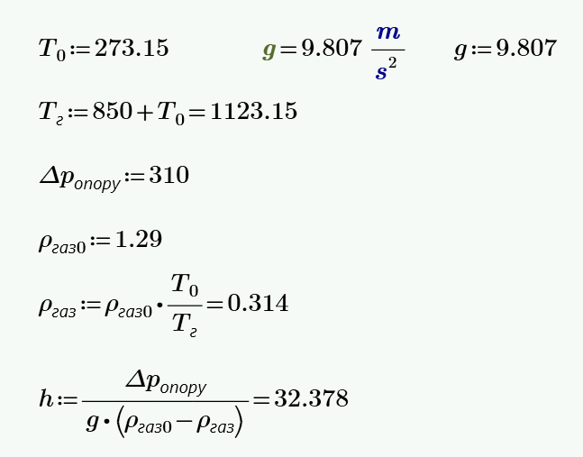

# Розрахунок висоти димової труби нагрівальної печі

Розрахувати висоту димової труби нагрівальної печі за умов:
температура димових газів 850 °С, сумарний втрати тиску (опір руху) в трубі 310 Па.
Прийняти, що щільність димових газів за нормальних умов приблизно дорівнює щільності повітря і становить $1.29$ кг/м$^3$.

## Умови задачі
- Температура димових газів: $850 °С$
- Сумарні втрати тиску (опір руху) в трубі: $310$ Па
- Щільність димових газів за нормальних умов: $1.29$ кг/м$^3$ (приблизно дорівнює щільності повітря)

## Теоретичне обґрунтування

### Призначення та принцип роботи димової труби

Димова труба — це вертикальний канал великої висоти, через який відводяться гарячі продукти згоряння із щільністю ($\rho_г$), меншою, ніж щільність навколишнього атмосферного повітря ($\rho_в$).

Димова труба є **тяговим засобом**, призначеним для створення розрідження (тяги), під дією якого продукти згоряння відсмоктуються з камери промислової теплоенергетичної установки, долаючи опір системи димоходів. При використанні димососу димова труба виконує в основному функцію **розсіювання викидів**.

### Фізичні основи природної тяги

Принцип роботи димової труби базується на фізичному явищі природної тяги, яка виникає внаслідок різниці густин між нагрітими димовими газами всередині труби та зовнішнім повітрям. Ця різниця густин створює різницю тисків, яка забезпечує рух газів вгору по трубі.

Природна тяга — це результат дії архімедової сили, що діє на димові гази з меншою густиною, які знаходяться в середовищі з більшою густиною (атмосферне повітря). Згідно з принципом Архімеда, на тіло, занурене в рідину або газ, діє виштовхувальна сила, рівна вазі витісненого ним об'єму рідини або газу.

### Формування статичного тиску (гідростатика димової труби)

Механізм створення розрідження можна зрозуміти, розглянувши **статику димової труби**. Припустимо, що димовий шибер опущено і рух газів у трубі припинився.

У площині **гирла труби** (верхній зріз) тиск газів та атмосфери рівні між собою і становлять величину $P_0$ — тиск атмосфери, що лежить вище від димової труби:

$$P_{г,верх} = P_{в,верх} = P_0$$

У міру переміщення **вниз від гирла** на висоту $H$ тиск газів та атмосфери збільшуються по-різному, оскільки вони мають різну густину:

$$P_{г1} = P_0 + \rho_г \cdot g \cdot H \quad \text{(для газів)}$$

$$P_{в1} = P_0 + \rho_в \cdot g \cdot H \quad \text{(для атмосфери)}$$

Оскільки $\rho_г < \rho_в$, тиск газів зростає повільніше, ніж атмосферний. Отже, **знизу труби** виникає розрідження:

$$\Delta P_1 = P_{г1} - P_{в1} = (\rho_г - \rho_в) \cdot g \cdot H < 0$$

де:
- $P_0$ — атмосферний тиск на рівні гирла труби (верхній зріз), Па;
- $P_{г1}$, $P_{в1}$ — тиск димових газів та атмосферного повітря у підніжжі труби, Па;
- $\rho_г$ — густина димових газів при робочій температурі, кг/м$^3$;
- $\rho_в$ — густина зовнішнього повітря за нормальних умов, кг/м$^3$;
- $g$ — прискорення вільного падіння, 9.81 м/с$^2$;
- $H$ — висота димової труби, м;
- $\Delta P_1$ — розрідження (природна тяга) у підніжжі труби, Па.

Саме це розрідження і є **природною тягою**, що примушує продукти згоряння підніматися трубою.

### Вплив температури на тягу

Температура газів відіграє критичну роль у створенні тяги, оскільки вона безпосередньо впливає на густину газів. Згідно з законами термодинаміки, при підвищенні температури густина газу зменшується, що збільшує різницю густин між димовими газами та атмосферним повітрям, тим самим посилюючи тягу.

> **Довідково:** На кожні 100 м підйому вгору атмосферний тиск знижується приблизно на $\Delta P = 11$ мм. рт. ст. ($1450$ Па), а температура атмосфери зменшується на $\Delta t = 0.6$ °С. Для труб значної висоти ці ефекти слід враховувати в уточнених розрахунках.

### Баланс тяги та опору системи

Для забезпечення нормальної роботи системи, створювана тяга повинна бути достатньою для подолання всіх опорів системи. Ці опори включають:

1. **Аеродинамічний опір каналів** — опір, що виникає при русі газів по димоходах та газоходах печі
2. **Місцеві опори** — опір, що виникає в місцях зміни напрямку потоку, перетину або при проходженні через різні пристрої (шибери, засувки)
3. **Опір на вході та виході** — виникає при зміні швидкості та напрямку потоку на вході в димохід та при виході з труби в атмосферу

Умова нормальної роботи димової труби записується як **нерівність**:

$$\Delta p_{розр} = H \cdot g \cdot (\rho_в - \rho_г) \geq \sum \Delta p_{оп}$$

де:
- $\Delta p_{розр}$ — розрахункова тяга, що створюється димовою трубою, Па;
- $H$ — висота димової труби, м;
- $g$ — прискорення вільного падіння, 9.81 м/с$^2$;
- $\rho_в$ — густина зовнішнього повітря за нормальних умов, кг/м$^3$;
- $\rho_г$ — густина димових газів при робочій температурі, кг/м$^3$;
- $\sum \Delta p_{оп}$ — сума всіх аеродинамічних опорів системи, Па.

Це означає, що розрахована за граничною умовою (рівність) висота є **мінімально необхідною**. На практиці висота труби повинна бути більшою, або необхідно явно вводити коефіцієнт запасу.

Звідси мінімальна висота труби:

$$H_{min} = \frac{\sum \Delta p_{оп}}{g \cdot (\rho_в - \rho_г)}$$

де:
- $H_{min}$ — мінімально необхідна висота димової труби, м;
- $\sum \Delta p_{оп}$ — сума всіх аеродинамічних опорів системи, Па;
- $g$ — прискорення вільного падіння, 9.81 м/с$^2$;
- $\rho_в$ — густина зовнішнього повітря за нормальних умов, кг/м$^3$;
- $\rho_г$ — густина димових газів при робочій температурі, кг/м$^3$.

## Термодинамічні закономірності зміни густини газів

### Закон ідеального газу та залежність густини від температури

Зміна густини газів з температурою підпорядковується закону ідеального газу. За умови постійного тиску, густина газу обернено пропорційна його абсолютній температурі:

$$\rho_{газ} = \rho_0 \times \frac{T_0}{T}$$

де:
- $\rho_0$ - густина газів за нормальних умов, кг/м$^3$;
- $T_0$ - температура за нормальних умов, $273$ К;
- $T$ - абсолютна температура газів, К.

Ця залежність є фундаментальною для розрахунку тяги, оскільки визначає різницю густин між димовими газами та атмосферним повітрям.

### Вплив вологості та складу димових газів

На практиці склад димових газів і наявність в них вологи також впливають на їх густину. Водяна пара має меншу молекулярну масу порівняно з повітрям, тому вологі димові гази мають меншу густину, що посилює тягу. Однак у спрощених розрахунках цим ефектом часто нехтують.

## Розрахунок густини димових газів при підвищеній температурі

Підставляючи значення для нашої задачі:

$$\rho_{газ} = \rho_0 \cdot \frac{T_0}{T} = 1.29 \cdot \frac{273.15}{273.15 + 850} = 0.3137\;кг/м^3$$

## Розрахунок висоти димової труби

Тепер визначимо необхідну **мінімальну** висоту димової труби, підставивши отримані значення в рівняння тяги:

$$H_{min} = \frac{\sum \Delta p_{оп}}{g \cdot (\rho_в - \rho_г)} = \frac{310}{9.81 \times (1.29 - 0.3137)} = \frac{310}{9.578} \approx 32.37\;м$$

## Практичні аспекти проектування димових труб

### Коефіцієнт запасу тяги

Оскільки умова нормальної роботи є **нерівністю** $\Delta p_{розр} \geq \sum \Delta p_{оп}$, розрахована висота $H_{min} = 32.37$ м є лише нижньою межею. У практичному проектуванні вводять коефіцієнт запасу тяги $k_з = 1.2 \div 1.5$, щоб компенсувати можливі відхилення від розрахункових умов, таких як:
- Зміни атмосферного тиску
- Коливання температури зовнішнього повітря
- Зміни режиму роботи печі
- Забруднення внутрішніх поверхонь димоходів

З урахуванням коефіцієнта запасу $k_з = 1.2$:

$$H_{пр} = k_з \times H_{min} = 1.2 \times 32.37 \approx 38.84\;м$$

### Розсіювання шкідливих викидів

Важливою функцією димової труби є **розсіювання шкідливих речовин** в атмосфері. Концентрація шкідливих речовин $C_{шр}$ на рівні землі залежить від висоти труби за наближеним співвідношенням:

$$C_{шр} \sim \frac{\sqrt[3]{V \cdot \Delta t}}{H^2}$$

де:
- $V$ — об'ємна витрата димових газів, м$^3$/с;
- $\Delta t$ — різниця температур газів та атмосфери, °С;
- $H$ — висота труби, м.

З цієї формули видно, що зі збільшенням висоти труби концентрація шкідливих речовин на рівні земля **різко зменшується** (пропорційно $H^2$), що є ще одним вагомим аргументом на користь застосування коефіцієнта запасу та збільшення проектної висоти труби понад мінімальну розрахункову.

### Конструктивні обмеження

При проектуванні димової труби необхідно також враховувати:
- Вплив вітрових навантажень на стійкість конструкції
- Температурні деформації матеріалів
- Вимоги будівельних норм щодо мінімальної висоти труб над дахами будівель
- Екологічні вимоги щодо розсіювання забруднюючих речовин в атмосфері

## Висновок

Таким чином, для забезпечення необхідної тяги, що дозволить подолати опір системи в $310$ Па при температурі димових газів $850$ °С, **мінімальна** розрахункова висота димової труби складає:

$$H_{min} \approx 32.37\;м$$

Оскільки ця висота є нижньою межею (умова нормальної роботи — нерівність), з урахуванням коефіцієнта запасу $k_з = 1.2$ рекомендована проектна висота становить:

$$H_{пр} \approx 38.84\;м$$

Ця висота забезпечить достатню природну тягу для ефективного відведення продуктів згоряння з нагрівальної печі в атмосферу, підтримуючи оптимальний режим роботи теплотехнічного обладнання. Збільшення висоти труби понад мінімальне значення також суттєво знизить приземну концентрацію шкідливих речовин завдяки кращому розсіюванню викидів.

# Розрахунок на Python

```python
# ============================================================
# Розрахунок висоти димової труби нагрівальної печі
# ============================================================

# --- Вхідні дані ---

t_gas = 850          # температура димових газів, градуси Цельсія
delta_p = 310        # сумарний опір руху в трубі, Па
rho_0 = 1.29         # густина газів за нормальних умов (0°C), кг/м³
k_zapas = 1.2        # коефіцієнт запасу тяги (рекомендований діапазон 1.2–1.5)
g = 9.81             # прискорення вільного падіння, м/с²
T_0 = 273.15         # нормальна температура в Кельвінах (0°C = 273.15 K)

# --- Крок 1: Переводимо температуру газів з Цельсія в Кельвіни ---

T_gas = T_0 + t_gas  # абсолютна температура димових газів, К
                     # T_gas = 273.15 + 850 = 1123.15 К

# --- Крок 2: Розраховуємо густину димових газів при робочій температурі ---
# Закон ідеального газу: при нагріванні газ розширюється і стає легшим
# Формула: rho_gas = rho_0 * (T_0 / T_gas)

rho_gas = rho_0 * (T_0 / T_gas)   # густина димових газів при 850°C, кг/м³
                                   # rho_gas = 1.29 * (273.15 / 1123.15) ≈ 0.3137 кг/м³

# --- Крок 3: Розраховуємо різницю густин ---
# Зовнішнє повітря важче за гарячі гази — це і є причина тяги

delta_rho = rho_0 - rho_gas   # різниця густин: повітря мінус димові гази, кг/м³
                               # delta_rho = 1.29 - 0.3137 ≈ 0.9763 кг/м³

# --- Крок 4: Розраховуємо мінімальну висоту труби ---
# Формула тяги: delta_p = H * g * (rho_повітря - rho_газів)
# Звідси: H = delta_p / (g * delta_rho)

H_min = delta_p / (g * delta_rho)   # мінімальна висота труби, м
                                     # H_min = 310 / (9.81 * 0.9763) ≈ 32.37 м

# --- Крок 5: Розраховуємо проектну висоту з коефіцієнтом запасу ---
# Мінімальна висота — це нижня межа, реальна труба має бути вищою

H_project = k_zapas * H_min   # проектна висота труби з урахуванням запасу, м
                               # H_project = 1.2 * 32.37 ≈ 38.84 м

# --- Виведення результатів ---

print("========================================")
print("  РЕЗУЛЬТАТИ РОЗРАХУНКУ ДИМОВОЇ ТРУБИ")
print("========================================")
print()
print(f"Вхідні дані:")
print(f"  Температура газів:       {t_gas} °C")
print(f"  Опір системи:            {delta_p} Па")
print(f"  Коефіцієнт запасу:       {k_zapas}")
print()
print(f"Проміжні результати:")
print(f"  Температура газів:       {T_gas:.2f} К")
print(f"  Густина газів (850°C):   {rho_gas:.4f} кг/м³")
print(f"  Різниця густин:          {delta_rho:.4f} кг/м³")
print()
print(f"Результати:")
print(f"  Мінімальна висота труби: {H_min:.2f} м")
print(f"  Проектна висота труби:   {H_project:.2f} м")
print("========================================")
```

**Очікуваний вивід програми:**
```
========================================
  РЕЗУЛЬТАТИ РОЗРАХУНКУ ДИМОВОЇ ТРУБИ
========================================

Вхідні дані:
  Температура газів:       850 °C
  Опір системи:            310 Па
  Коефіцієнт запасу:       1.2

Проміжні результати:
  Температура газів:       1123.15 К
  Густина газів (850°C):   0.3137 кг/м³
  Різниця густин:          0.9763 кг/м³

Результати:
  Мінімальна висота труби: 32.37 м
  Проектна висота труби:   38.84 м
========================================
```

# ДОДАТОК
### Розв'язок в $MathCad$

