# 1
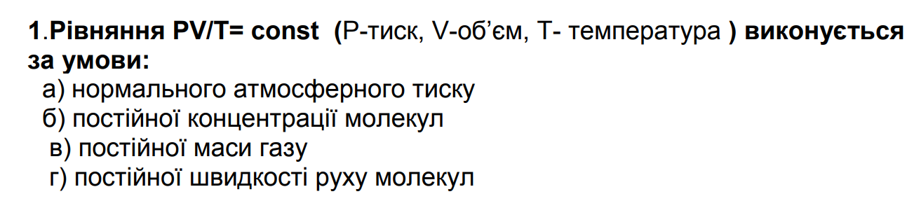

Рівняння $\frac{PV}{T} = const$ є формою об'єднаного газового закону (або рівняння Клапейрона), який описує поведінку ідеального газу. Це рівняння справедливе за умови, що кількість речовини (або маса) газу залишається незмінною.

Розглянемо варіанти відповідей:

а) нормального атмосферного тиску - це конкретне значення тиску, а не загальна умова.

б) постійної концентрації молекул - концентрація залежить від об'єму та кількості молекул. Постійна концентрація не є умовою для цього рівняння.

в) постійної маси газу - якщо маса газу постійна, то і кількість молів (n) є постійною. З рівняння стану ідеального газу $PV = nRT$, де R - універсальна газова стала, ми можемо переписати його як $\frac{PV}{T} = nR$. Оскільки n і R постійні, то $\frac{PV}{T} = const$.

г) постійної швидкості руху молекул - швидкість руху молекул пов'язана з температурою. Постійна швидкість означала б постійну температуру, що є умовою для закону Бойля-Маріотта (PV=const при T=const), але не для об'єднаного газового закону.

Таким чином, вірною умовою є **постійна маса газу**.

**Відповідь: в) постійної маси газу**

# 2
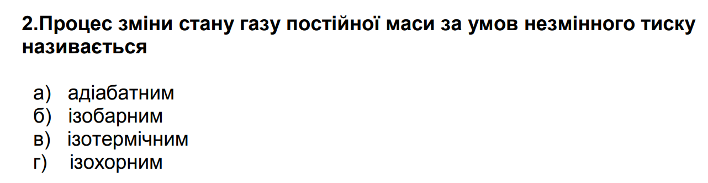

Процес зміни стану газу постійної маси за умов незмінного тиску називається:

Розглянемо подані варіанти:

а) адіабатним - процес, що відбувається без теплообміну з навколишнім середовищем ($Q=0$).

б) ізобарним - процес, що відбувається за постійного тиску ($P=const$).

в) ізотермічним - процес, що відбувається за постійної температури ($T=const$).

г) ізохорним - процес, що відбувається за постійного об'єму ($V=const$).

Згідно з умовою завдання, тиск є незмінним (постійним). Такий процес називається ізобарним.

**Відповідь: б) ізобарним**

# 3
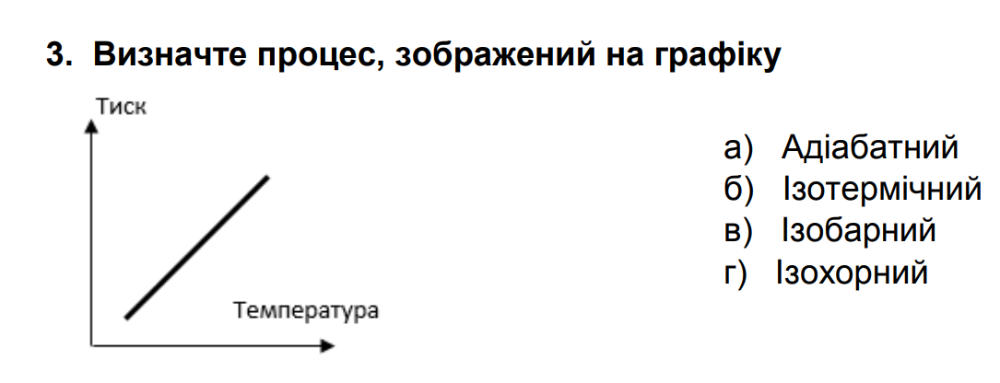

Визначте процес, зображений на графіку

На графіку зображена залежність тиску (P) від температури (T). Графік є прямою лінією, що проходить через початок координат. Це означає, що тиск прямо пропорційний температурі: $P \propto T$, або $\frac{P}{T} = const$.

З рівняння стану ідеального газу для постійної маси ($PV = nRT$) ми можемо вивести співвідношення між P і T: $\frac{P}{T} = \frac{nR}{V}$.
Оскільки $n$ (кількість речовини) і $R$ (універсальна газова стала) є постійними для постійної маси газу, то для того, щоб відношення $\frac{P}{T}$ було постійним, об'єм $V$ також має бути постійним.

Процес, що відбувається за постійного об'єму, називається ізохорним.

Розглянемо інші варіанти:

а) Адіабатний - процес без теплообміну. На P-T діаграмі виглядає інакше.

б) Ізотермічний - процес за постійної температури. На P-T діаграмі це вертикальна лінія.

в) Ізобарний - процес за постійного тиску. На P-T діаграмі це горизонтальна лінія.

Таким чином, графік, де $P \propto T$ і лінія проходить через початок координат, відповідає ізохорному процесу.

**Відповідь: г) Ізохорний**

# 4
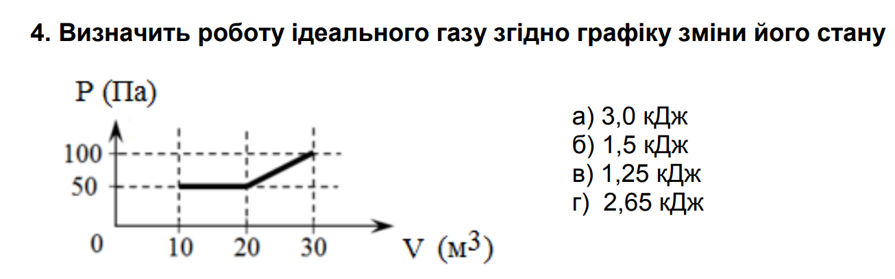

Визначить роботу ідеального газу згідно графіку зміни його стану

Робота, виконана газом під час зміни його стану, на P-V діаграмі чисельно дорівнює площі під кривою процесу. В даному випадку графік складається з двох відрізків.

Перший відрізок: від об'єму 10 м³ до 20 м³ при постійному тиску 50 Па. Це ізобарний процес.
Робота в ізобарному процесі розраховується за формулою $W_1 = P \Delta V$.
$$W_1 = 50 \, \text{Па} \times (20 \, \text{м}^3 - 10 \, \text{м}^3) = 50 \, \text{Па} \times 10 \, \text{м}^3 = 500 \, \text{Дж}$$

Другий відрізок: від об'єму 20 м³ до 30 м³, при цьому тиск лінійно зростає від 50 Па до 100 Па. Площа під цим відрізком є площею трапеції.
Площа трапеції розраховується як $\frac{1}{2} \times (\text{сума основ}) \times \text{висота}$. У нашому випадку "основи" - це тиски, а "висота" - зміна об'єму.
$$W_2 = \frac{1}{2} (P_2 + P_3) (V_3 - V_2)$$
$$W_2 = \frac{1}{2} (50 \, \text{Па} + 100 \, \text{Па}) (30 \, \text{м}^3 - 20 \, \text{м}^3)$$
$$W_2 = \frac{1}{2} (150 \, \text{Па}) (10 \, \text{м}^3)$$
$$W_2 = \frac{1}{2} \times 1500 \, \text{Дж} = 750 \, \text{Дж}$$

Повна робота, виконана газом, дорівнює сумі робіт на кожному відрізку:
$$W_{загальна} = W_1 + W_2 = 500 \, \text{Дж} + 750 \, \text{Дж} = 1250 \, \text{Дж}$$

Переведемо джоулі в кілоджоулі:
$$1250 \, \text{Дж} = 1.25 \, \text{кДж}$$.

Порівнюємо з варіантами відповідей:

а) 3,0 кДж

б) 1,5 кДж

в) 1,25 кДж

г) 2,65 кДж

Розраховане значення збігається з варіантом в).

**Відповідь: в) 1,25 кДж**

# 5
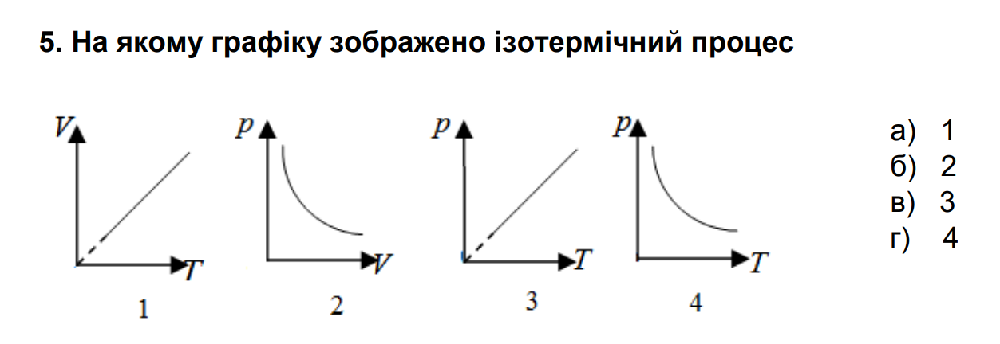

На якому графіку зображено ізотермічний процес

Ізотермічний процес - це процес зміни стану газу, що відбувається за постійної температури ($T = const$). Для ідеального газу при постійній масі, ізотермічний процес описується законом Бойля-Маріотта: $PV = const$.

Розглянемо кожен графік:

1. Графік V(T): Пряма лінія, що проходить через початок координат. Це означає $V \propto T$. Це графік ізобарного процесу (при постійному тиску).

2. Графік P(V): Крива, яка показує обернену залежність тиску від об'єму ($P \propto \frac{1}{V}$ або $PV = const$). Це графік ізотермічного процесу.

3. Графік P(T): Пряма лінія, що проходить через початок координат. Це означає $P \propto T$. Це графік ізохорного процесу (при постійному об'ємі).

4. Графік P(T): Крива, яка не відповідає жодному з основних ізо-процесів на цій діаграмі. Ізотермічний процес на P-T діаграмі виглядав би як вертикальна лінія (при постійній T).

Таким чином, графік, що зображує ізотермічний процес ($PV = const$), це графік під номером 2.

**Відповідь: б) 2**

# 6
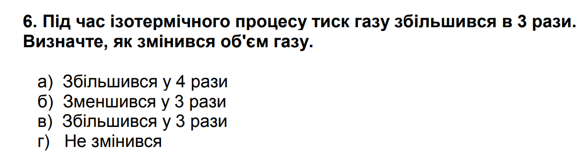

Під час ізотермічного процесу тиск газу збільшився в 3 рази. Визначте, як змінився об'єм газу.

Ізотермічний процес означає, що температура газу залишається постійною ($T = const$). Для ідеального газу постійної маси ізотермічний процес описується законом Бойля-Маріотта:
$P_1V_1 = P_2V_2$

За умовою, тиск газу збільшився в 3 рази, тобто $P_2 = 3P_1$. Підставимо це співвідношення в рівняння Бойля-Маріотта:
$P_1V_1 = (3P_1)V_2$

Оскільки $P_1 \neq 0$, ми можемо розділити обидві частини рівняння на $P_1$:
$V_1 = 3V_2$

Звідси випливає:
$V_2 = \frac{V_1}{3}$

Таким чином, кінцевий об'єм $V_2$ став у 3 рази меншим за початковий об'єм $V_1$. Це означає, що об'єм газу зменшився у 3 рази.

Розглянемо варіанти відповідей:

а) Збільшився у 4 рази - Неправильно

б) Зменшився у 3 рази - Правильно

в) Збільшився у 3 рази - Неправильно

г) Не змінився - Неправильно (це ізохорний процес)

**Відповідь: б) Зменшився у 3 рази**

# 7
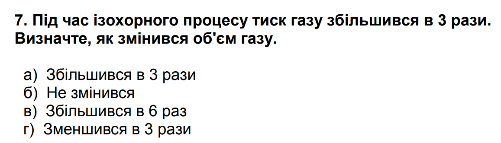

Під час ізохорного процесу тиск газу збільшився в 3 рази. Визначте, як змінився об'єм газу.

Ізохорний процес - це процес зміни стану газу, що відбувається за постійного об'єму ($V = const$). За визначенням ізохорного процесу, об'єм газу не змінюється незалежно від того, як змінюються його тиск або температура.

Згідно з умовою, тиск газу збільшився в 3 рази. Для ізохорного процесу (при постійній масі газу) це означає, що температура також збільшилася в 3 рази згідно із законом Шарля (або другим законом Гей-Люссака): $\frac{P_1}{T_1} = \frac{P_2}{T_2}$ при $V=const$, звідки $\frac{P_2}{P_1} = \frac{T_2}{T_1}$. Якщо $P_2 = 3P_1$, то $T_2 = 3T_1$.

Однак, запитання стосується зміни об'єму. Оскільки процес є ізохорним, об'єм залишається незмінним.

Розглянемо варіанти відповідей:

а) Збільшився в 3 рази - Неправильно.

б) Не змінився - Правильно, за визначенням ізохорного процесу.

в) Збільшився в 6 раз - Неправильно.

г) Зменшився в 3 рази - Неправильно.

**Відповідь: б) Не змінився**

# 8
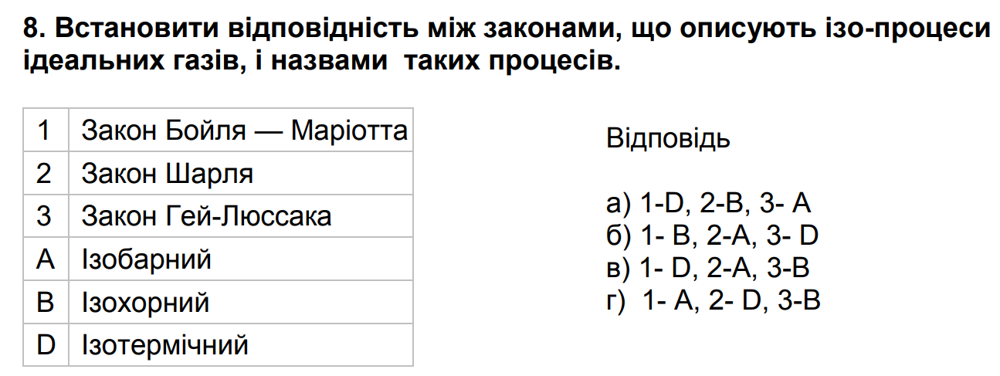

Встановити відповідність між законами, що описують ізо-процеси ідеальних газів, і назвами таких процесів.

Давайте зіставимо кожен закон з відповідним ізо-процесом:

1.  **Закон Бойля—Маріотта**: Описує зв'язок між тиском та об'ємом газу за постійної температури та маси ($PV = const$). Цей процес називається **ізотермічним**. Відповідність: 1 - D.

2. **Закон Шарля**: Описує зв'язок між об'ємом та температурою газу за постійного тиску та маси ($\frac{V}{T} = const$). Цей процес називається **ізобарним**. Відповідність: 2 - А.

3. **Закон Гей-Люссака**: Описує зв'язок між тиском та температурою газу за постійного об'єму та маси ($\frac{P}{T} = const$). Цей процес називається **ізохорним**. Відповідність: 3 - В.

Таким чином, правильна відповідність: 1-D, 2-А, 3-В.

Тепер порівняємо з запропонованими варіантами:

а) 1-D, 2-В, 3- А - Неправильно

б) 1-В, 2-А, 3- D - Неправильно

в) 1-D, 2-А, 3-В - Правильно

г) 1- А, 2- D, 3-В - Неправильно

**Відповідь: в) 1-D, 2-А, 3-В**

# 9
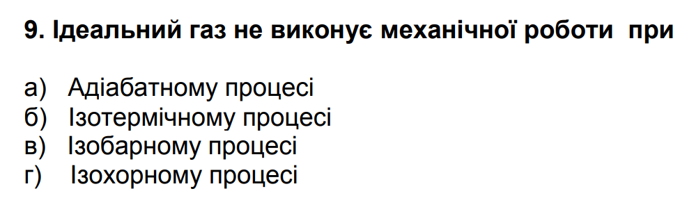

Ідеальний газ не виконує механічної роботи при

Механічна робота, що виконується газом, визначається за формулою $W = \int P \, dV$. Для виконання механічної роботи газом необхідна зміна його об'єму ($\Delta V \neq 0$).

Розглянемо кожен із зазначених процесів:

а) Адіабатний процес: відбувається без теплообміну з навколишнім середовищем ($Q=0$). Робота в адіабатному процесі, як правило, не дорівнює нулю, якщо змінюється об'єм.

б) Ізотермічний процес: відбувається за постійної температури ($T=const$). Робота в ізотермічному процесі не дорівнює нулю, якщо змінюється об'єм ($W = nRT \ln(V_2/V_1)$).

в) Ізобарний процес: відбувається за постійного тиску ($P=const$). Робота в ізобарному процесі дорівнює $W = P \Delta V$, і вона не дорівнює нулю, якщо змінюється об'єм.

г) Ізохорний процес: відбувається за постійного об'єму ($V=const$). В цьому випадку зміна об'єму $\Delta V = 0$. Відповідно, робота, що виконується газом, дорівнює $W = P \Delta V = P \times 0 = 0$.

Таким чином, ідеальний газ не виконує механічної роботи під час ізохорного процесу, оскільки його об'єм залишається незмінним.

**Відповідь: г) Ізохорному процесі**

# 10
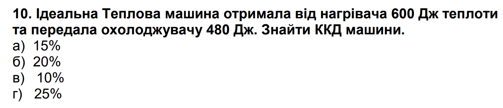

Ідеальна теплова машина отримала від нагрівача 600 Дж теплоти та передала охолоджувачу 480 Дж. Знайти ККД машини.

Коефіцієнт корисної дії (ККД, $\eta$) теплової машини визначається як відношення корисної роботи ($W$), виконаної машиною, до кількості теплоти ($Q_H$), отриманої від нагрівача:
$$\eta = \frac{W}{Q_H}$$

Згідно з першим законом термодинаміки, робота, виконана тепловою машиною, дорівнює різниці між теплотою, отриманою від нагрівача ($Q_H$), та теплотою, переданою охолоджувачу ($Q_C$):
$$W = Q_H - Q_C$$

За умовою задачі:
Теплота від нагрівача $Q_H = 600 \, \text{Дж}$
Теплота до охолоджувача $Q_C = 480 \, \text{Дж}$

Спочатку розрахуємо виконану роботу:
$$W = 600 \, \text{Дж} - 480 \, \text{Дж} = 120 \, \text{Дж}$$

Тепер розрахуємо ККД:
$$\eta = \frac{W}{Q_H} = \frac{120 \, \text{Дж}}{600 \, \text{Дж}} = \frac{120}{600} = \frac{1}{5} = 0.2$$

Щоб виразити ККД у відсотках, помножимо на 100%:
$$\eta = 0.2 \times 100\% = 20\%$$

ККД теплової машини становить 20%.

Порівняємо з варіантами відповідей:

а) 15% - Неправильно.

б) 20% - Правильно.

в) 10% - Неправильно.

г) 25% - Неправильно.

**Відповідь: б) 20%**

# 11
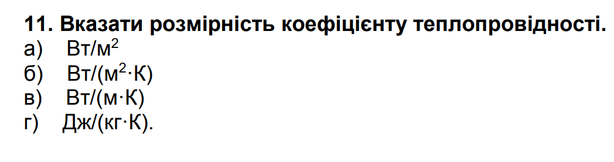

Вказати розмірність коефіцієнту теплопровідності.

Коефіцієнт теплопровідності ($\lambda$) - це фізична величина, що характеризує здатність матеріалу проводити тепло. Він входить до закону Фур'є для теплопровідності, який у одновимірному випадку можна записати як:
$$Q = -\lambda A \frac{dT}{dx}$$
де:

$Q$ - швидкість передачі теплоти (потужність), вимірюється у Ватах (Вт).

$A$ - площа поверхні, через яку проходить тепловий потік, вимірюється у квадратних метрах (м²).

$\frac{dT}{dx}$ - градієнт температури (зміна температури на одиницю довжини), вимірюється у Кельвінах на метр (К/м).

$\lambda$ - коефіцієнт теплопровідності.

З цього рівняння можна виразити розмірність коефіцієнта теплопровідності:
$$[\lambda] = \frac{[Q]}{[A] \cdot [\frac{dT}{dx}]} = \frac{\text{Вт}}{\text{м}^2 \cdot \frac{\text{К}}{\text{м}}} = \frac{\text{Вт} \cdot \text{м}}{\text{м}^2 \cdot \text{К}} = \frac{\text{Вт}}{\text{м} \cdot \text{К}}$$

Отже, розмірність коефіцієнта теплопровідності - Вт/(м·К).

Порівняємо з запропонованими варіантами:

а) Вт/м² - Розмірність густини теплового потоку.

б) Вт/(м²·К) - Неправильна розмірність.

в) Вт/(м·К) - Правильна розмірність коефіцієнта теплопровідності.

г) Дж/(кг·К) - Розмірність питомої теплоємності.

**Відповідь: в) Вт/(м·К)**

# 12
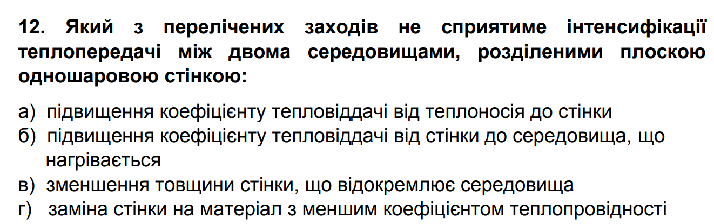

Який з перелічених заходів не сприятиме інтенсифікації теплопередачі між двома середовищами, розділеними плоскою одношаровою стінкою:

Інтенсифікація теплопередачі означає збільшення швидкості передачі теплоти. Швидкість теплопередачі через плоску одношарову стінку описується формулою:
$$Q = K A \Delta T$$
де
$Q$ - швидкість теплопередачі,

$K$ - коефіцієнт загальної теплопередачі,

$A$ - площа поверхні теплообміну,

$\Delta T$ - різниця температур між середовищами.

Для збільшення $Q$ потрібно збільшити $K$, $A$ або $\Delta T$. Заходи в варіантах стосуються коефіцієнта загальної теплопередачі $K$.

Коефіцієнт загальної теплопередачі для плоскої одношарової стінки розраховується за формулою:
$$\frac{1}{K} = \frac{1}{\alpha_1} + \frac{\delta}{\lambda} + \frac{1}{\alpha_2}$$
де

$\alpha_1$ - коефіцієнт тепловіддачі від першого середовища до стінки,

$\delta$ - товщина стінки,

$\lambda$ - коефіцієнт теплопровідності матеріалу стінки,

$\alpha_2$ - коефіцієнт тепловіддачі від стінки до другого середовища.

Щоб збільшити $K$, потрібно зменшити $\frac{1}{K}$. Розглянемо вплив кожного заходу на $\frac{1}{K}$:

а) підвищення коефіцієнту тепловіддачі від теплоносія до стінки ($\alpha_1$ збільшується): При збільшенні $\alpha_1$ дріб $\frac{1}{\alpha_1}$ зменшується. Отже, $\frac{1}{K}$ зменшується, а $K$ збільшується. Це сприяє інтенсифікації.

б) підвищення коефіцієнту тепловіддачі від стінки до середовища, що нагрівається ($\alpha_2$ збільшується): При збільшенні $\alpha_2$ дріб $\frac{1}{\alpha_2}$ зменшується. Отже, $\frac{1}{K}$ зменшується, а $K$ збільшується. Це сприяє інтенсифікації.

в) зменшення товщини стінки ($\delta$ зменшується): При зменшенні $\delta$ дріб $\frac{\delta}{\lambda}$ зменшується. Отже, $\frac{1}{K}$ зменшується, а $K$ збільшується. Це сприяє інтенсифікації.

г) заміна стінки на матеріал з меншим коефіцієнтом теплопровідності ($\lambda$ зменшується): При зменшенні $\lambda$ дріб $\frac{\delta}{\lambda}$ збільшується (знаменник меншає). Отже, $\frac{1}{K}$ збільшується, а $K$ зменшується. Це не сприяє інтенсифікації, а навпаки, зменшує теплопередачу.

Таким чином, захід, який не сприятиме інтенсифікації теплопередачі, - це заміна стінки на матеріал з меншим коефіцієнтом теплопровідності.

**Відповідь: г) заміна стінки на матеріал з меншим коефіцієнтом теплопровідності**

# 13
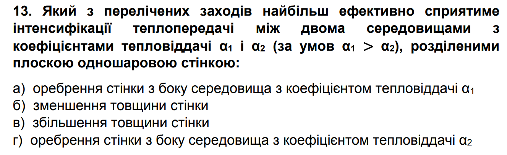

Який з перелічених заходів найбільш ефективно сприятиме інтенсифікації теплопередачі між двома середовищами з коефіцієнтами тепловіддачі $\alpha_1$ і $\alpha_2$ (за умов $\alpha_1 > \alpha_2$), розділеними плоскою одношаровою стінкою:

Загальний термічний опір теплопередачі через плоску стінку виражається як сума трьох опорів: опору тепловіддачі від першого середовища до стінки ($\frac{1}{\alpha_1 A}$), опору теплопровідності стінки ($\frac{\delta}{\lambda A}$) та опору тепловіддачі від стінки до другого середовища ($\frac{1}{\alpha_2 A}$). Загальний коефіцієнт теплопередачі $K$ пов'язаний із загальним термічним опором $R_{total}$ співвідношенням $R_{total} = \frac{1}{KA}$.

$$R_{total} = \frac{1}{\alpha_1 A} + \frac{\delta}{\lambda A} + \frac{1}{\alpha_2 A}$$
$$\frac{1}{KA} = \frac{1}{A} \left( \frac{1}{\alpha_1} + \frac{\delta}{\lambda} + \frac{1}{\alpha_2} \right)$$
$$\frac{1}{K} = \frac{1}{\alpha_1} + \frac{\delta}{\lambda} + \frac{1}{\alpha_2}$$

Щоб інтенсифікувати теплопередачу (збільшити $K$), потрібно зменшити загальний термічний опір $\frac{1}{K}$. Найбільший внесок у загальний опір вносить та складова, яка є найбільшою.

За умовою $\alpha_1 > \alpha_2$, з чого випливає, що $\frac{1}{\alpha_1} < \frac{1}{\alpha_2}$. Тобто опір тепловіддачі з боку середовища з коефіцієнтом $\alpha_2$ більший, ніж з боку середовища з коефіцієнтом $\alpha_1$. Цей більший опір є "вузьким місцем" у процесі теплопередачі.

Розглянемо варіанти:

а) оребрення стінки з боку середовища з коефіцієнтом тепловіддачі $\alpha_1$: Оребрення збільшує площу поверхні тепловіддачі. Це ефективно там, де коефіцієнт тепловіддачі низький. Оскільки $\alpha_1$ більший, опір на цій стороні менший, і ефект від оребрення буде меншим, ніж з боку з нижчим коефіцієнтом.

б) зменшення товщини стінки: Зменшення $\delta$ зменшує опір теплопровідності стінки ($\frac{\delta}{\lambda}$), що сприяє збільшенню $K$. Це ефективно, особливо для товстих стінок або матеріалів з низькою теплопровідністю.

в) збільшення товщини стінки: Збільшення $\delta$ збільшує опір теплопровідності стінки, що зменшує $K$. Це не сприяє інтенсифікації.

г) оребрення стінки з боку середовища з коефіцієнтом тепловіддачі $\alpha_2$: Оскільки $\alpha_2$ є меншим коефіцієнтом тепловіддачі, опір на цій стороні ($\frac{1}{\alpha_2}$) є більшим. Оребрення цієї сторони значно збільшує площу тепловіддачі на стороні найбільшого опору, що призводить до найбільш суттєвого зменшення загального термічного опору і, відповідно, найбільшого збільшення коефіцієнта загальної теплопередачі $K$.

Найбільш ефективним заходом для інтенсифікації теплопередачі, коли один з коефіцієнтів тепловіддачі значно менший за інший, є оребрення поверхні з боку меншого коефіцієнта тепловіддачі.

**Відповідь: г) оребрення стінки з боку середовища з коефіцієнтом тепловіддачі $\alpha_2$**

# 14
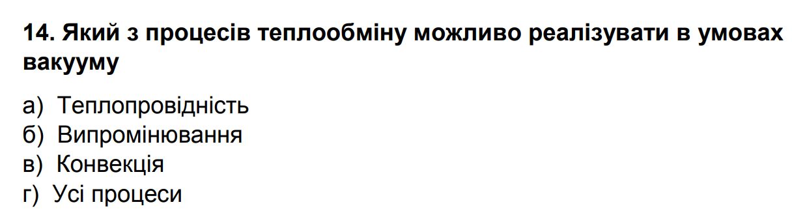

Який з процесів теплообміну можливо реалізувати в умовах вакууму

Розглянемо основні види теплообміну:

а) **Теплопровідність**: Передача теплоти шляхом безпосереднього контакту частинок середовища. Цей процес потребує наявності речовини (твердої, рідкої або газоподібної), оскільки передача енергії відбувається через взаємодію молекул або інших частинок. У вакуумі, де частинок практично немає, теплопровідність неможлива.

б) **Випромінювання**: Передача теплоти за допомогою електромагнітних хвиль. Цей процес не потребує наявності проміжного середовища і може відбуватися через вакуум. Прикладом є передача теплоти від Сонця до Землі через космічний вакуум.

в) **Конвекція**: Передача теплоти шляхом переміщення самого середовища (рідини або газу). Цей процес також потребує наявності рухомого середовища. У вакуумі немає рідини чи газу, тому конвекція неможлива.

г) Усі процеси: Неправильно, оскільки теплопровідність та конвекція потребують середовища.

Таким чином, єдиним видом теплообміну, що може відбуватися в умовах вакууму, є випромінювання.

**Відповідь: б) Випромінювання**

# 15
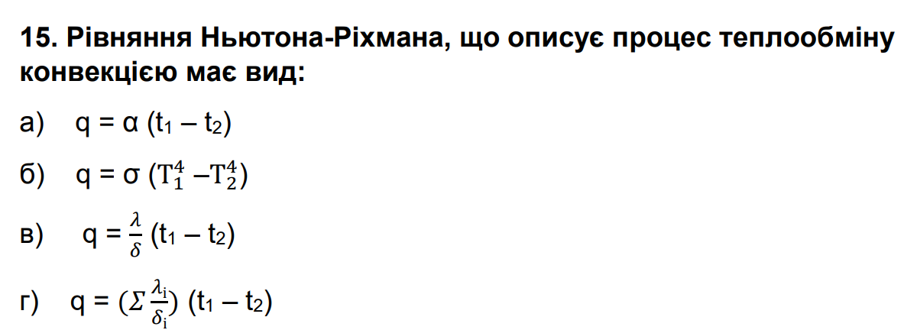

Рівняння Ньютона-Ріхмана, що описує процес теплообміну конвекцією має вигляд:

Рівняння Ньютона-Ріхмана (також відоме як закон Ньютона для охолодження у контексті конвективного теплообміну) описує швидкість теплообміну між поверхнею та рухомим середовищем (рідиною або газом) через конвекцію. Це рівняння формулюється таким чином: швидкість теплообміну пропорційна площі поверхні контакту та різниці температур між поверхнею та середовищем.

У перерахунку на густину теплового потоку ($q$, теплота за одиницю площі за одиницю часу), рівняння має вигляд:
$$q = \alpha \Delta t$$
або
$$q = \alpha (t_{поверхні} - t_{середовища})$$

де:

$q$ - густина теплового потоку (Вт/м²)

$\alpha$ - коефіцієнт тепловіддачі (Вт/(м²·К) або Вт/(м²·°C))

$\Delta t$ - різниця температур між поверхнею та середовищем (°C або К).

Враховуючи позначення температур як $t_1$ та $t_2$, рівняння набуває вигляду $$q = \alpha (t_1 - t_2)$$

Розглянемо запропоновані варіанти:

а) $q = \alpha (t_1 - t_2)$: Це рівняння відповідає закону Ньютона-Ріхмана для конвективного теплообміну. $\alpha$ - коефіцієнт тепловіддачі.

б) $q = \sigma (T_1^4 - T_2^4)$: Це закон Стефана-Больцмана для теплообміну випромінюванням між двома абсолютно чорними тілами при температурах $T_1$ та $T_2$.

в) $q = \frac{\lambda}{\delta} (t_1 - t_2)$: Це рівняння описує теплопровідність через плоску стінку товщиною $\delta$ з коефіцієнтом теплопровідності $\lambda$ при різниці температур $t_1 - t_2$ між поверхнями.

г) $q = (\Sigma \frac{\lambda_i}{\delta_i}) (t_1 - t_2)$: Це рівняння описує теплопровідність через багатошарову стінку.

Таким чином, рівняння, що описує процес теплообміну конвекцією згідно з законом Ньютона-Ріхмана, - це варіант а).

**Відповідь: а) $q = \alpha (t_1 - t_2)$**

# 16
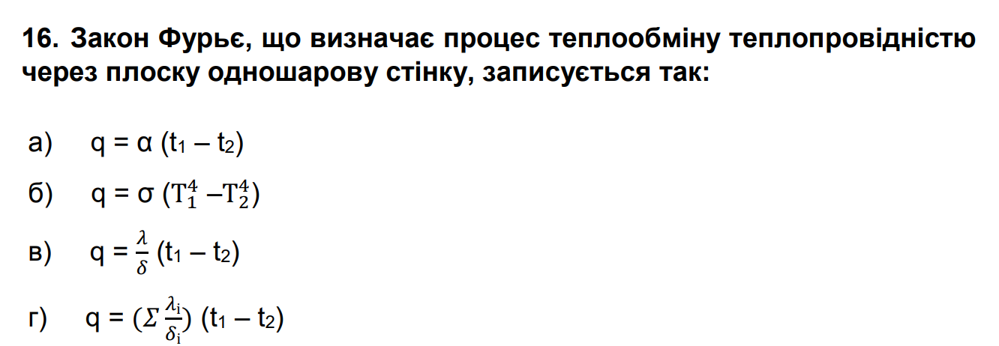

Закон Фур'є, що визначає процес теплообміну теплопровідністю через плоску одношарову стінку, записується так:

Закон Фур'є для теплопровідності в одновимірному випадку (через плоску стінку) стверджує, що кількість теплоти, що передається за одиницю часу через одиницю площі (густина теплового потоку $q$), пропорційна градієнту температури. Математично це виглядає так:
$$q = -\lambda \frac{dt}{dx}$$

Для плоскої одношарової стінки товщиною $\delta$ з різницею температур $t_1$ та $t_2$ на її поверхнях, градієнт температури можна вважати постійним і рівним $\frac{t_2 - t_1}{\delta}$. Якщо прийняти, що теплота тече від поверхні з температурою $t_1$ до поверхні з температурою $t_2$ (тобто $t_1 > t_2$), то $dt$ буде від'ємним при зростанні $x$ (напрямку передачі теплоти). Щоб отримати додатну густину теплового потоку в напрямку від $t_1$ до $t_2$, використовують різницю температур $(t_1 - t_2)$ і записують:
$$q = \lambda \frac{t_1 - t_2}{\delta}$$
або
$$q = \frac{\lambda}{\delta} (t_1 - t_2)$$

Порівняємо з запропонованими варіантами:

а) $q = \alpha (t_1 - t_2)$: Це закон Ньютона-Ріхмана для конвективного теплообміну.

б) $q = \sigma (T_1^4 - T_2^4)$: Це закон Стефана-Больцмана для теплообміну випромінюванням.

в) $q = \frac{\lambda}{\delta} (t_1 - t_2)$: Це рівняння точно відповідає закону Фур'є для теплопровідності через плоску одношарову стінку.

г) $q = (\Sigma \frac{\lambda_i}{\delta_i}) (t_1 - t_2)$: Це рівняння не є стандартним записом закону Фур'є для багатошарової стінки у такому вигляді.

**Відповідь: в) $q = \frac{\lambda}{\delta} (t_1 - t_2)$**

# 17
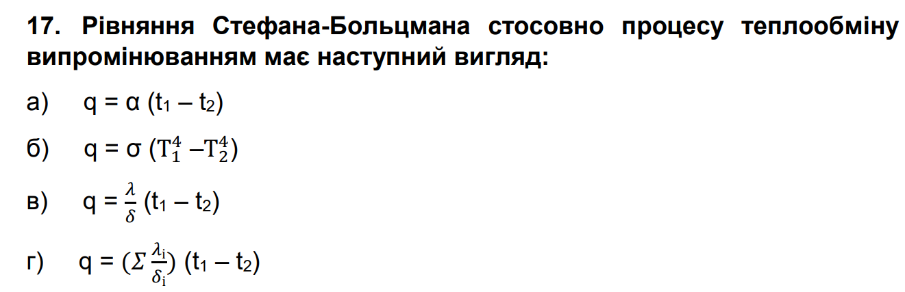

Рівняння Стефана-Больцмана стосовно процесу теплообміну випромінюванням має наступний вигляд:

Закон Стефана-Больцмана описує енергію, випромінювану абсолютно чорним тілом. У випадку теплообміну випромінюванням між двома тілами, густина чистого теплового потоку ($q$) між ними (для абсолютно чорних тіл) пропорційна різниці четвертих ступенів їх абсолютних температур. Рівняння має вигляд:
$$q = \sigma (T_1^4 - T_2^4)$$
де:

$q$ - густина чистого теплового потоку випромінюванням (Вт/м²)

$\sigma$ - стала Стефана-Больцмана ($\approx 5.67 \times 10^{-8} \, \text{Вт}/(\text{м}^2 \cdot \text{К}^4)$)

$T_1$ та $T_2$ - абсолютні температури поверхонь (в Кельвінах).

Порівняємо з запропонованими варіантами:

а) $q = \alpha (t_1 - t_2)$: Це закон Ньютона-Ріхмана для конвективного теплообміну.

б) $q = \sigma (T_1^4 - T_2^4)$: Це рівняння відповідає закону Стефана-Больцмана для теплообміну випромінюванням між абсолютно чорними тілами.

в) $q = \frac{\lambda}{\delta} (t_1 - t_2)$: Це закон Фур'є для теплопровідності.

г) $q = (\Sigma \frac{\lambda_i}{\delta_i}) (t_1 - t_2)$: Це рівняння пов'язане з теплопровідністю, а не випромінюванням.

**Відповідь: б) $q = \sigma (T_1^4 - T_2^4)$**

# 18
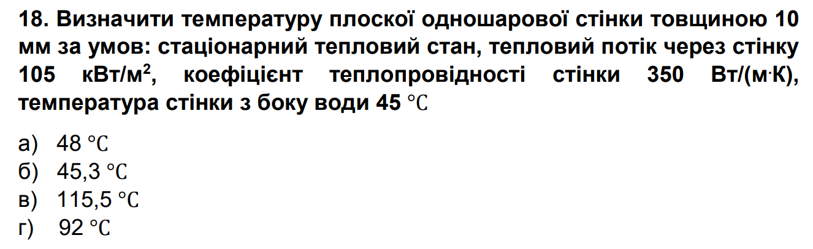

Визначити температуру плоскої одношарової стінки товщиною 10 мм за умов: стаціонарний тепловий стан, тепловий потік через стінку 105 кВт/м², коефіцієнт теплопровідності стінки 350 Вт/(м·К), температура стінки з боку води 45 °С.

Для розрахунку температури іншої сторони стінки скористаємося законом Фур'є для стаціонарної теплопровідності через плоску стінку. Густина теплового потоку $q$ визначається за формулою:
$$q = \frac{\lambda}{\delta} (t_1 - t_2)$$
де:

$q$ - густина теплового потоку (Вт/м²)

$\lambda$ - коефіцієнт теплопровідності матеріалу стінки (Вт/(м·К))

$\delta$ - товщина стінки (м)

$t_1$ та $t_2$ - температури на поверхнях стінки (°С або К).

За умовою задачі маємо:

Товщина стінки $\delta = 10 \, \text{мм} = 0.010 \, \text{м}$

Густина теплового потоку $q = 105 \, \text{кВт/м}^2 = 105 \times 10^3 \, \text{Вт/м}^2 = 105000 \, \text{Вт/м}^2$

Коефіцієнт теплопровідності стінки $\lambda = 350 \, \text{Вт/(м·К)}$

Температура стінки з боку води $t_{\text{води}} = 45 \, \text{°С}$

Нехай $t_1$ буде температура з одного боку стінки, а $t_2$ - температура з іншого боку. Різниця температур $(t_1 - t_2)$ викликає тепловий потік $q$. Модуль різниці температур через стінку можна знайти з формули:
$$|t_1 - t_2| = \frac{q \delta}{\lambda}$$

Підставимо відомі значення:
$$|t_1 - t_2| = \frac{105000 \, \text{Вт/м}^2 \times 0.010 \, \text{м}}{350 \, \text{Вт/(м·К)}} = \frac{1050}{350} \, \text{К} = 3 \, \text{К}$$

Оскільки різниця в Кельвінах дорівнює різниці в градусах Цельсія, то різниця температур через стінку становить 3 °С.

Температура стінки з боку води дорівнює 45 °С. Інша сторона стінки може бути або на 3 °С гарячішою, або на 3 °С холоднішою за 45 °С. Тобто температура іншої сторони може бути $45 + 3 = 48$ °С або $45 - 3 = 42$ °С.

Розглянемо варіанти відповідей:

а) 48 °С

б) 45,3 °С

в) 115,5 °С

г) 92 °С

Серед запропонованих варіантів є 48 °С. Якщо температура іншої сторони становить 48 °С, а з боку води 45 °С, то тепловий потік відбувається від 48 °С до 45 °С, що відповідає додатному тепловому потоку в цьому напрямку.

Розрахунок для перевірки: якщо $t_1 = 48$ °С та $t_2 = 45$ °С, то $q = \frac{350}{0.010} (48 - 45) = 35000 \times 3 = 105000 \, \text{Вт/м}^2 = 105 \, \text{кВт/м}^2$. Це збігається із заданим тепловим потоком.

Якщо б інша сторона була 42 °С, а з боку води 45 °С, то тепловий потік також був би 105 кВт/м², але в протилежному напрямку. Однак 42 °С немає серед варіантів.

Отже, найбільш ймовірний варіант, що відповідає умові та варіантам відповіді, - це температура іншої сторони стінки 48 °С.

**Відповідь: а) 48 °С**

# 19
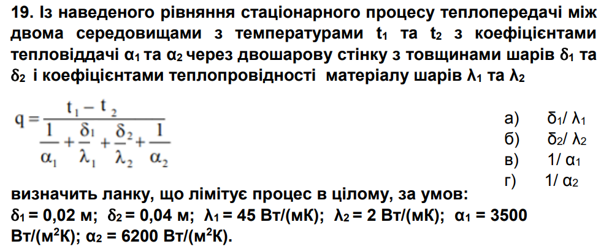

Із наведеного рівняння стаціонарного процесу теплопередачі між двома середовищами з температурами $t_1$ та $t_2$ з коефіцієнтами тепловіддачі $\alpha_1$ та $\alpha_2$ через двошарову стінку з товщинами шарів $\delta_1$ та $\delta_2$ і коефіцієнтами теплопровідності матеріалу шарів $\lambda_1$ та $\lambda_2$:
$$q = \frac{t_1 - t_2}{\frac{1}{\alpha_1} + \frac{\delta_1}{\lambda_1} + \frac{\delta_2}{\lambda_2} + \frac{1}{\alpha_2}}$$
визначити ланку, що лімітує процес в цілому, за умов:

$\delta_1 = 0,02 \, \text{м}$;

$\delta_2 = 0,04 \, \text{м}$;

$\lambda_1 = 45 \, \text{Вт/(мК)}$;

$\lambda_2 = 2 \, \text{Вт/(мК)}$;

$\alpha_1 = 3500 \, \text{Вт/(м}^2\text{К)}$;

$\alpha_2 = 6200 \, \text{Вт/(м}^2\text{К)}$.

Ланкою, що лімітує процес теплопередачі (або визначає "вузьке місце"), є складова загального термічного опору, яка має найбільше значення. Загальний термічний опір (на одиницю площі) у цьому випадку дорівнює знаменнику дробу у формулі для $q$:
$$R_{total} = \frac{1}{\alpha_1} + \frac{\delta_1}{\lambda_1} + \frac{\delta_2}{\lambda_2} + \frac{1}{\alpha_2}$$

Окремі терми представляють собою термічні опори:

Опір тепловіддачі з боку першого середовища: $R_1 = \frac{1}{\alpha_1}$

Опір теплопровідності першого шару: $R_2 = \frac{\delta_1}{\lambda_1}$

Опір теплопровідності другого шару: $R_3 = \frac{\delta_2}{\lambda_2}$

Опір тепловіддачі з боку другого середовища: $R_4 = \frac{1}{\alpha_2}$

Розрахуємо значення кожного опору за заданими умовами:

$$R_1 = \frac{1}{3500 \, \text{Вт/(м}^2\text{·К)}} \approx 0.0002857 \, \text{(м}^2\text{·К)/Вт}$$
$$R_2 = \frac{0.02 \, \text{м}}{45 \, \text{Вт/(м·К)}} \approx 0.0004444 \, \text{(м}^2\text{·К)/Вт}$$
$$R_3 = \frac{0.04 \, \text{м}}{2 \, \text{Вт/(м·К)}} = 0.02 \, \text{(м}^2\text{·К)/Вт}$$
$$R_4 = \frac{1}{6200 \, \text{Вт/(м}^2\text{·К)}} \approx 0.0001613 \, \text{(м}^2\text{·К)/Вт}$$

Порівняємо отримані значення опорів:
$$R_1 \approx 0.0002857$$
$$R_2 \approx 0.0004444$$
$$R_3 = 0.0200000$$
$$R_4 \approx 0.0001613$$

Найбільшим серед цих значень є $R_3 = 0.02 \, \text{(м}^2\text{·К)/Вт}$. Це опір теплопровідності другого шару стінки ($\frac{\delta_2}{\lambda_2}$).

Таким чином, ланкою, що лімітує процес теплопередачі, є термічний опір другого шару стінки.

Розглянемо варіанти відповідей:

а) $\delta_1 / \lambda_1$ (Це $R_2$)

б) $\delta_2 / \lambda_2$ (Це $R_3$)

в) $1 / \alpha_1$ (Це $R_1$)

г) $1 / \alpha_2$ (Це $R_4$)

Найбільший опір відповідає варіанту б).

**Відповідь: б) $\delta_2 / \lambda_2$**

# 20
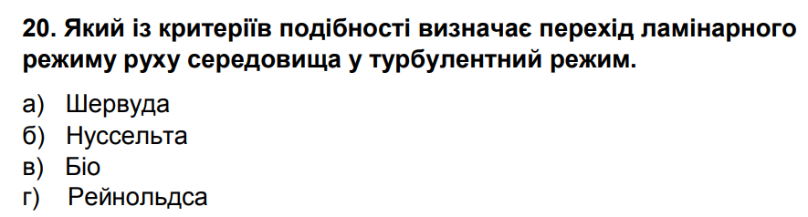

Який із критеріїв подібності визначає перехід ламінарного режиму руху середовища у турбулентний режим.

Розглянемо значення кожного з критеріїв подібності в контексті теплофізики та гідродинаміки:

а) **Критерій Шервуда (Sh)**: Використовується для опису масообміну, співвідношення конвективного та дифузійного масопереносу. Не визначає режим руху середовища.

б) **Критерій Нуссельта (Nu)**: Використовується для опису теплообміну конвекцією, співвідношення інтенсивності конвективного теплообміну до теплообміну теплопровідністю в пристінковому шарі. Не визначає режим руху середовища, але залежить від нього.

в) **Критерій Біо (Bi)**: Використовується для оцінки співвідношення термічного опору теплопровідності всередині тіла до термічного опору тепловіддачі з його поверхні. Стосується розподілу температури всередині тіла під час теплообміну. Не визначає режим руху середовища.

г) **Критерій Рейнольдса (Re)**: Визначається як відношення інерційних сил до сил в'язкості в потоці рідини або газу. Цей критерій є визначальним для ідентифікації режиму руху середовища. При низьких значеннях Re спостерігається ламінарний режим (впорядкований рух шарами), при високих значеннях Re - турбулентний режим (невпорядкований, хаотичний рух). Перехід від ламінарного до турбулентного режиму відбувається при певних критичних значеннях числа Рейнольдса, які залежать від геометрії потоку.

Таким чином, критерій подібності, що визначає перехід від ламінарного режиму руху середовища до турбулентного, - це критерій Рейнольдса.

**Відповідь: г) Рейнольдса**

# 21
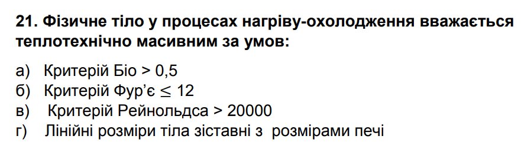

Фізичне тіло у процесах нагріву-охолодження вважається теплотехнічно масивним за умов:

Теплотехнічна масивність тіла в контексті процесів нагріву або охолодження пов'язана з тим, наскільки швидко вирівнюється температура всередині тіла порівняно зі швидкістю теплообміну з навколишнім середовищем. Це поняття описується за допомогою критерію Біо (Bi).

Критерій Біо - це відношення термічного опору теплопровідності всередині тіла до термічного опору тепловіддачі з поверхні тіла:
$$Bi = \frac{R_{внутрішній}}{R_{зовнішній}} = \frac{L_c / \lambda}{1 / \alpha} = \frac{\alpha L_c}{\lambda}$$
де:

$L_c$ - характерний лінійний розмір тіла

$\lambda$ - коефіцієнт теплопровідності матеріалу тіла

$\alpha$ - коефіцієнт тепловіддачі від поверхні тіла до середовища.

- Якщо $Bi \ll 1$ (зазвичай $Bi < 0.1$), внутрішній термічний опір значно менший за зовнішній. Температура всередині тіла майже однакова в будь-який момент часу (модель тіла з зосередженими параметрами). Таке тіло вважається теплотехнічно тонким.
- Якщо $Bi > 0.1$, внутрішній термічний опір є порівнянним або більшим за зовнішній. Існують значні градієнти температури всередині тіла. Таке тіло вважається теплотехнічно масивним або товстим. Різні джерела використовують дещо різні порогові значення (наприклад, $Bi > 0.5$ або $Bi > 1$) для чіткого розмежування, але ідея полягає в тому, що при достатньо великому Bi внутрішні градієнти температури є суттєвими.

Розглянемо варіанти відповідей:

а) Критерій Біо > 0,5: Це умова, яка вказує на значний внутрішній термічний опір порівняно із зовнішнім, що характерно для теплотехнічно масивних тіл.

б) Критерій Фур'є ≤ 12: Критерій Фур'є (Fo) характеризує швидкість поширення зміни температури всередині тіла з часом. Він важливий для нестаціонарних процесів, але не визначає теплотехнічну масивність в термінах співвідношення внутрішнього та зовнішнього опорів.

в) Критерій Рейнольдса > 20000: Критерій Рейнольдса визначає режим руху рідини (ламінарний чи турбулентний) і не стосується теплотехнічної масивності твердого тіла.

г) Лінійні розміри тіла зіставні з розмірами печі: Розміри тіла є фактором, що впливає на теплообмін, але само по собі порівняння розмірів тіла та печі не є точним критерієм теплотехнічної масивності. Критерій Біо враховує теплофізичні властивості тіла та умови теплообміну.

Таким чином, тіло вважається теплотехнічно масивним за умов, коли критерій Біо є достатньо великим, наприклад, більшим за 0,5.

**Відповідь: а) Критерій Біо > 0,5**

# 22
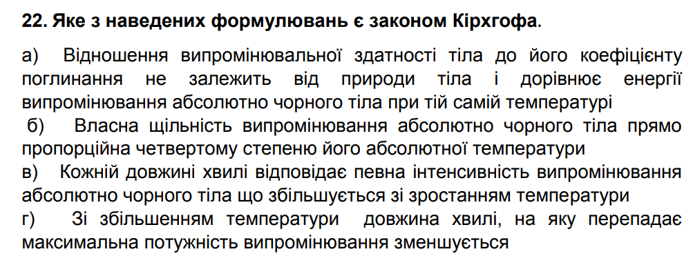

Яке з наведених формулювань є законом Кірхгофа.

Закон Кірхгофа для теплового випромінювання встановлює зв'язок між випромінювальною та поглинальною здатністю тіла. Він формулюється так: відношення випромінювальної здатності будь-якого тіла до його поглинальної здатності є однаковим для всіх тіл при даній температурі і для даної довжини хвилі, і дорівнює випромінювальній здатності абсолютно чорного тіла при тій самій температурі і довжині хвилі. Узагальнена форма для інтегральної (за всіма довжинами хвиль) випромінювальної здатності для тіл у тепловій рівновазі стверджує, що відношення випромінювальної здатності реального тіла до його коефіцієнта поглинання дорівнює випромінювальній здатності абсолютно чорного тіла при тій самій температурі.

Розглянемо запропоновані формулювання:

а) Відношення випромінювальної здатності тіла до його коефіцієнту поглинання не залежить від природи тіла і дорівнює енергії випромінювання абсолютно чорного тіла при тій самій температурі - Це є коректним формулюванням закону Кірхгофа (для інтегральних характеристик у стані теплової рівноваги).

б) Власна щільність випромінювання абсолютно чорного тіла прямо пропорційна четвертому степеню його абсолютної температури - Це формулювання закону Стефана-Больцмана.

в) Кожній довжині хвилі відповідає певна інтенсивність випромінювання абсолютно чорного тіла що збільшується зі зростанням температури - Це частковий опис спектрального розподілу випромінювання абсолютно чорного тіла (закон Планка).

г) Зі збільшенням температури довжина хвилі, на яку припадає максимальна потужність випромінювання зменшується - Це формулювання закону зміщення Віна.

Таким чином, правильним формулюванням закону Кірхгофа є варіант а).

**Відповідь: а) Відношення випромінювальної здатності тіла до його коефіцієнту поглинання не залежить від природи тіла і дорівнює енергії випромінювання абсолютно чорного тіла при тій самій температурі**

# 23
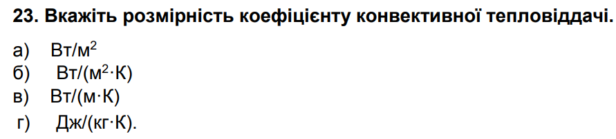

Вкажіть розмірність коефіцієнту конвективної тепловіддачі.

Коефіцієнт конвективної тепловіддачі ($\alpha$) є мірою інтенсивності теплообміну між поверхнею та рухомим середовищем (рідиною або газом). Згідно з законом Ньютона-Ріхмана, густина теплового потоку при конвекції ($q$) визначається за формулою:
$$q = \alpha \Delta t$$
де:

$q$ - густина теплового потоку (теплова потужність на одиницю площі), вимірюється у Ватах на квадратний метр (Вт/м²).

$\Delta t$ - різниця температур між поверхнею та середовищем, вимірюється у Кельвінах (К) або градусах Цельсія (°С). Оскільки нас цікавить розмірність, різниця температур має розмірність Кельвіна.

$\alpha$ - коефіцієнт конвективної тепловіддачі.

З цієї формули можемо виразити розмірність коефіцієнта тепловіддачі:
$$[\alpha] = \frac{[q]}{[\Delta t]} = \frac{\text{Вт/м}^2}{\text{К}} = \frac{\text{Вт}}{\text{м}^2 \cdot \text{К}}$$

Отже, розмірність коефіцієнта конвективної тепловіддачі - Вт/(м²·К).

Порівняємо з запропонованими варіантами:

а) Вт/м² - Розмірність густини теплового потоку.

б) Вт/(м²·К) - Правильна розмірність коефіцієнта конвективної тепловіддачі.

в) Вт/(м·К) - Розмірність коефіцієнта теплопровідності.

г) Дж/(кг·К) - Розмірність питомої теплоємності.

**Відповідь: б) Вт/(м²·К)**

# 24
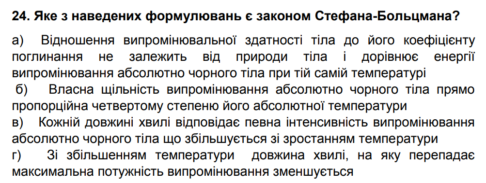

Яке з наведених формулювань є законом Стефана-Больцмана?

Закон Стефана-Больцмана стверджує, що повна енергія, яку випромінює одиниця площі поверхні абсолютно чорного тіла за одиницю часу (енергетична світність), прямо пропорційна четвертому степеню його абсолютної температури.

Розглянемо запропоновані формулювання:

а) Відношення випромінювальної здатності тіла до його коефіцієнту поглинання не залежить від природи тіла і дорівнює енергії випромінювання абсолютно чорного тіла при тій самій температурі - Це закон Кірхгофа.

б) Власна щільність випромінювання абсолютно чорного тіла прямо пропорційна четвертому степеню його абсолютної температури - Це є коректним формулюванням закону Стефана-Больцмана (щільність випромінювання тут синонім до енергетичної світності на одиницю площі).

в) Кожній довжині хвилі відповідає певна інтенсивність випромінювання абсолютно чорного тіла що збільшується зі зростанням температури - Це частковий опис спектрального розподілу випромінювання абсолютно чорного тіла (закон Планка).

г) Зі збільшенням температури довжина хвилі, на яку припадає максимальна потужність випромінювання зменшується - Це закон зміщення Віна.

**Відповідь: б) Власна щільність випромінювання абсолютно чорного тіла прямо пропорційна четвертому степеню його абсолютної температури**

# 25
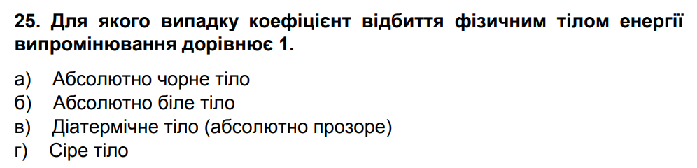

Для якого випадку коефіцієнт відбиття фізичним тілом енергії випромінювання дорівнює 1.

Розглянемо властивості різних типів тіл щодо їх взаємодії з випромінюванням:

а) **Абсолютно чорне тіло**: Це ідеалізоване тіло, яке повністю поглинає всю падаючу на нього енергію випромінювання, незалежно від довжини хвилі та напрямку. Для нього коефіцієнт поглинання $\alpha = 1$, коефіцієнт відбиття $\rho = 0$, коефіцієнт пропускання $\tau = 0$.

б) **Абсолютно біле тіло**: Це ідеалізоване тіло, яке повністю відбиває всю падаючу на нього енергію випромінювання. Для нього коефіцієнт відбиття $\rho = 1$, коефіцієнт поглинання $\alpha = 0$, коефіцієнт пропускання $\tau = 0$.

в) **Діатермічне тіло (абсолютно прозоре)**: Це ідеалізоване тіло, яке повністю пропускає через себе всю падаючу на нього енергію випромінювання. Для нього коефіцієнт пропускання $\tau = 1$, коефіцієнт поглинання $\alpha = 0$, коефіцієнт відбиття $\rho = 0$.

г) **Сіре тіло**: Це реальне тіло, для якого коефіцієнти поглинання, відбиття та пропускання є постійними для всіх довжин хвиль і температур, але коефіцієнт поглинання $\alpha < 1$. Для сірого тіла коефіцієнт відбиття $\rho$ знаходиться в межах від 0 до 1.

Запитання стосується випадку, коли коефіцієнт відбиття дорівнює 1. Ця властивість характерна для абсолютно білого тіла.

**Відповідь: б) Абсолютно біле тіло**

# 26
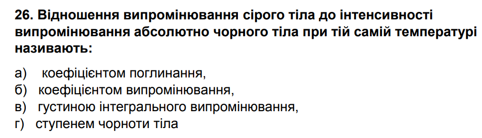

Відношення випромінювання сірого тіла до інтенсивності випромінювання абсолютно чорного тіла при тій самій температурі називають:

Випромінювальна здатність (або енергетична світність) реального тіла при певній температурі - це енергія, яку випромінює одиниця його площі за одиницю часу. Випромінювальна здатність абсолютно чорного тіла при тій самій температурі є максимально можливою.

Відношення випромінювальної здатності реального (сірого) тіла до випромінювальної здатності абсолютно чорного тіла при однаковій температурі називається **ступенем чорноти тіла** або **коефіцієнтом випромінювання** (емісивність). Для сірого тіла цей коефіцієнт є постійним і меншим за 1.

Розглянемо запропоновані варіанти:

а) коефіцієнтом поглинання: Відношення поглинутого випромінювання до падаючого.

б) коефіцієнтом випромінювання: Цей термін іноді використовується як синонім ступеня чорноти, але "ступінь чорноти" є більш точним терміном для цього відношення в контексті випромінювальних властивостей.

в) густиною інтегрального випромінювання: Це сама випромінювальна здатність, а не її відношення до випромінювання чорного тіла.

г) ступенем чорноти тіла: Це точне визначення відношення випромінювальної здатності реального (сірого) тіла до випромінювальної здатності абсолютно чорного тіла при однаковій температурі.

**Відповідь: г) ступенем чорноти тіла**

# 27
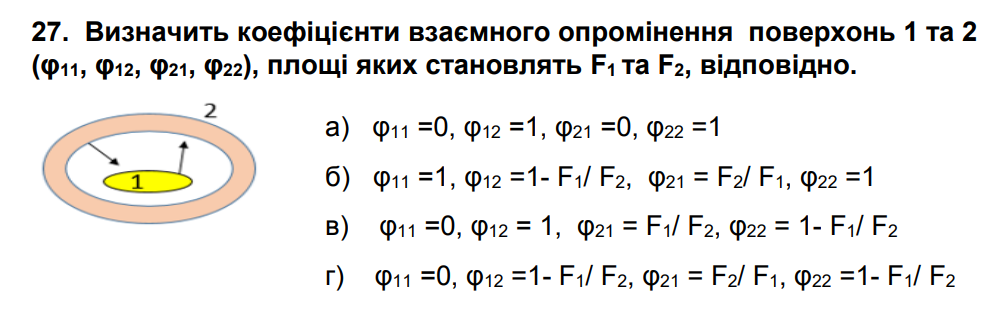

Визначить коефіцієнти взаємного опромінення поверхонь 1 та 2 ($\Phi_{11}, \Phi_{12}, \Phi_{21}, \Phi_{22}$), площі яких становлять F₁ та F₂, відповідно.
[Зображення: менша поверхня 1 всередині більшої поверхні 2]

Коефіцієнт взаємного опромінення $\Phi_{ij}$ - це частка випромінювання, що залишає поверхню $i$ і досягає поверхні $j$.

Проаналізуємо коефіцієнти для даної конфігурації:
- $\Phi_{11}$: Коефіцієнт опромінення поверхні 1 на себе. Оскільки поверхня 1 повністю оточена поверхнею 2 і не має увігнутостей, жодне випромінювання, що залишає поверхню 1, не потрапляє назад на неї. Отже, $\Phi_{11} = 0$.

- $\Phi_{12}$: Коефіцієнт опромінення поверхні 1 на поверхню 2. Оскільки поверхня 1 повністю знаходиться всередині поверхні 2, все випромінювання, що залишає поверхню 1, потрапляє на поверхню 2. Отже, $\Phi_{12} = 1$.

- $\Phi_{21}$: Коефіцієнт опромінення поверхні 2 на поверхню 1. Використаємо закон взаємності для коефіцієнтів опромінення: $F_i \Phi_{ij} = F_j \Phi_{ji}$.

Для поверхонь 1 і 2 маємо: $F_1 \Phi_{12} = F_2 \Phi_{21}$.

Оскільки $\Phi_{12} = 1$, то $F_1 \times 1 = F_2 \Phi_{21}$, звідки $\Phi_{21} = \frac{F_1}{F_2}$.

- $\Phi_{22}$: Коефіцієнт опромінення поверхні 2 на себе. Сума коефіцієнтів опромінення від поверхні до всіх поверхонь, що утворюють замкнену систему (включаючи саму себе), дорівнює 1. У даній системі випромінювання з поверхні 2 потрапляє або на поверхню 1, або назад на поверхню 2.

Отже, $\Phi_{21} + \Phi_{22} = 1$.

Знаючи $\Phi_{21} = \frac{F_1}{F_2}$, отримаємо $\Phi_{22} = 1 - \Phi_{21} = 1 - \frac{F_1}{F_2}$.

Таким чином, коефіцієнти взаємного опромінення:
$$\Phi_{11} = 0$$
$$\Phi_{12} = 1$$
$$\Phi_{21} = \frac{F_1}{F_2}$$
$$\Phi_{22} = 1 - \frac{F_1}{F_2}$$

Порівняємо з запропонованими варіантами:

а) $\Phi_{11}=0, \Phi_{12}=1, \Phi_{21}=0, \Phi_{22}=1$ - Неправильно.

б) $\Phi_{11}=1, \Phi_{12}=1- F_1 / F_2, \Phi_{21}= F_2 / F_1, \Phi_{22}=1$ - Неправильно.

в) $\Phi_{11}=0, \Phi_{12}=1, \Phi_{21}= F_1 / F_2, \Phi_{22}= 1- F_1 / F_2$ - Правильно.

г) $\Phi_{11}=0, \Phi_{12}=1- F_1 / F_2, \Phi_{21}= F_2 / F_1, \Phi_{22}= 1- F_1 / F_2$ - Неправильно.

**Відповідь: в) $\Phi_{11}=0, \Phi_{12}=1, \Phi_{21}= F_1 / F_2, \Phi_{22}= 1- F_1 / F_2$**

# 28
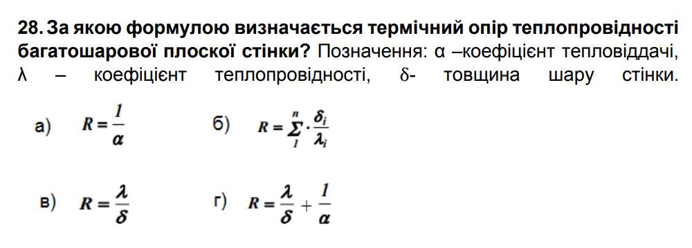

За якою формулою визначається термічний опір теплопровідності багатошарової плоскої стінки? Позначення: $\alpha$ – коефіцієнт тепловіддачі, $\lambda$ – коефіцієнт теплопровідності, $\delta_i$ – товщина $i$-го шару стінки.

Термічний опір теплопровідності окремого шару плоскої стінки товщиною $\delta$ і коефіцієнтом теплопровідності $\lambda$ (на одиницю площі) визначається за формулою $R = \frac{\delta}{\lambda}$.

Для багатошарової плоскої стінки, що складається з $n$ шарів, які з'єднані послідовно (тепло проходить через кожен шар по черзі), загальний термічний опір теплопровідності (на одиницю площі) дорівнює сумі термічних опорів окремих шарів:
$$R_{теплопровідності, загальний} = R_1 + R_2 + ... + R_n = \frac{\delta_1}{\lambda_1} + \frac{\delta_2}{\lambda_2} + ... + \frac{\delta_n}{\lambda_n} = \sum_{i=1}^{n} \frac{\delta_i}{\lambda_i}$$

Розглянемо запропоновані формули:

а) $R = \frac{1}{\alpha}$: Це термічний опір тепловіддачі (конвекції) на одиницю площі.

б) $R = \sum_{i=1}^{n} \frac{\delta_i}{\lambda_i}$: Ця формула є сумою термічних опорів теплопровідності кожного шару, що відповідає загальному термічному опору теплопровідності багатошарової стінки.

в) $R = \frac{\lambda}{\delta}$: Це термічна провідність одного шару на одиницю площі (обернена до термічного опору теплопровідності).

г) $R = \frac{\lambda}{\delta} + \frac{1}{\alpha}$: Ця формула змішує термічну провідність і термічний опір і не є коректною для опису загального термічного опору теплопровідності багатошарової стінки.

Отже, формула, що визначає термічний опір теплопровідності багатошарової плоскої стінки, - це сума термічних опорів окремих шарів, яка представлена у варіанті б).

**Відповідь: б) $R = \sum_{i=1}^{n} \frac{\delta_i}{\lambda_i}$**

# 29
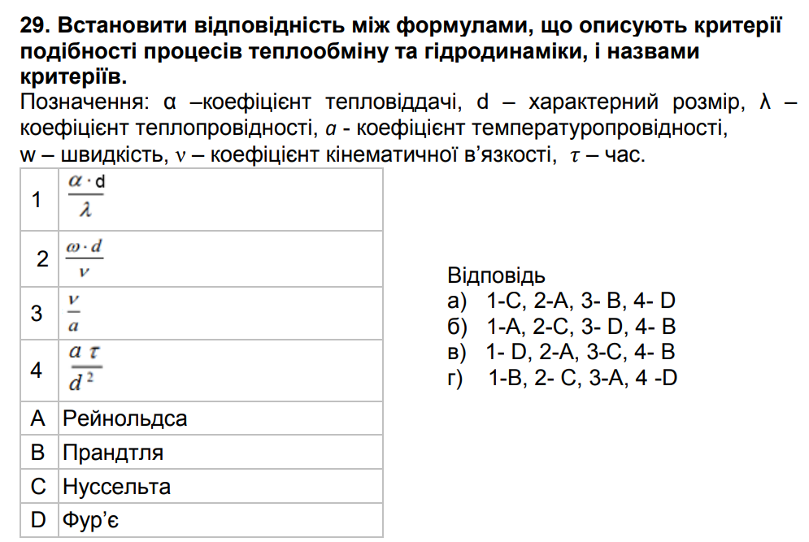

Встановити відповідність між формулами, що описують критерії подібності процесів теплообміну та гідродинаміки, і назвами критеріїв.
Позначення: $\alpha$ – коефіцієнт тепловіддачі, $d$ – характерний розмір, $\lambda$ – коефіцієнт теплопровідності, $a$ – коефіцієнт температуропровідності, $w$ – швидкість, $\nu$ – коефіцієнт кінематичної в'язкості, $\tau$ – час.

Зіставимо кожну формулу з відповідним критерієм подібності:
1.  $\frac{\alpha \cdot d}{\lambda}$: Ця формула є визначенням **критерію Нуссельта (С)**, який характеризує інтенсивність конвективного теплообміну.
2.  $\frac{w \cdot d}{\nu}$: Ця формула є визначенням **критерію Рейнольдса (А)**, який характеризує режим руху рідини (ламінарний або турбулентний).
3.  $\frac{\nu}{a}$: Ця формула є визначенням **критерію Прандтля (В)**, який є відношенням кінематичної в'язкості до коефіцієнта температуропровідності і характеризує фізичні властивості середовища, що впливають на теплообмін при конвекції.
4.  $\frac{a \tau}{d^2}$: Ця формула є визначенням **критерію Фур'є (D)**, який є безрозмірним часом і характеризує нестаціонарність процесу теплопровідності.

Таким чином, правильна відповідність: 1-С, 2-А, 3-В, 4-D.

Порівняємо з запропонованими варіантами:

а) 1-С, 2-А, 3- В, 4- D - Правильно.

б) 1-А, 2-С, 3- D, 4- В - Неправильно.

в) 1- D, 2-А, 3-С, 4- В - Неправильно.

г) 1-В, 2- С, 3-А, 4-D - Неправильно.

**Відповідь: а) 1-С, 2-А, 3- В, 4- D**

# 30
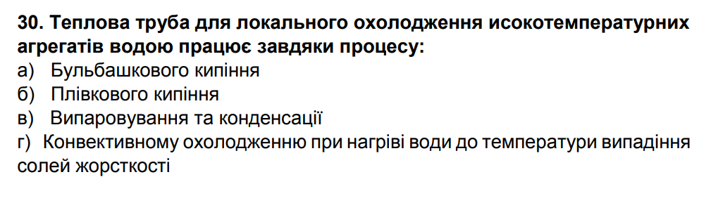

Теплова труба для локального охолодження високотемпературних агрегатів водою працює завдяки процесу:

Теплова труба - це високоефективний пристрій для передачі теплоти, який використовує принципи фазових переходів робочого тіла (випаровування та конденсації). У тепловій трубі робоче тіло (наприклад, вода) випаровується в зоні нагріву (випарнику), поглинаючи велику кількість теплоти (прихована теплота пароутворення). Пара рухається до зони охолодження (конденсатора), де вона конденсується, віддаючи цю теплоту. Потім конденсат повертається до випарника (зазвичай за допомогою капілярної структури або під дією сили тяжіння), і цикл повторюється.

Розглянемо запропоновані варіанти:

а) Бульбашкового кипіння: Це один з режимів кипіння, який може відбуватися у випарнику теплової труби, але сам по собі він не описує весь процес теплопередачі вздовж труби.

б) Плівкового кипіння: Це інший режим кипіння, який зазвичай не є бажаним для ефективної роботи теплової труби, оскільки плівка пари створює додатковий термічний опір.

в) Випаровування та конденсації: Це є основним фізичним процесом, який забезпечує роботу теплової труби. Теплота передається шляхом циклу випаровування рідини в одній частині та конденсації пари в іншій.

г) Конвективному охолодженню при нагріві води до температури випадання солей жорсткості: Це опис конвективного теплообміну з додатковим фактором, пов'язаним з якістю води (жорсткістю та утворенням накипу). Це не є принципом роботи теплової труби.

Таким чином, теплова труба працює завдяки процесам випаровування та конденсації робочого тіла.

**Відповідь: в) Випаровування та конденсації**

# 31
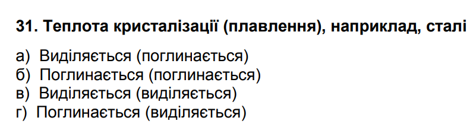

Теплота кристалізації (плавлення), наприклад, сталі

Розглянемо процеси кристалізації та плавлення:
- **Кристалізація** (затвердіння) - це перехід речовини з рідкого стану у твердий кристалічний стан. Цей процес супроводжується **виділенням** теплоти (екзотермічний процес). Теплота кристалізації - це кількість теплоти, що виділяється при кристалізації одиниці маси речовини при постійній температурі (температурі кристалізації).

- **Плавлення** - це перехід речовини з твердого стану в рідкий стан. Цей процес супроводжується **поглинанням** теплоти (ендотермічний процес). Теплота плавлення - це кількість теплоти, яку потрібно надати одиниці маси твердої речовини при постійній температурі (температурі плавлення), щоб перевести її в рідкий стан.

Запитання стосується "Теплоти кристалізації (плавлення)". У дужках вказано процес плавлення. Варіанти відповідей представлені у форматі: дія під час кристалізації (дія під час плавлення).

Під час кристалізації теплота **виділяється**.

Під час плавлення теплота **поглинається**.

Шукаємо варіант "Виділяється (поглинається)".

Розглянемо варіанти відповідей:

а) Виділяється (поглинається) - Правильно.

б) Поглинається (поглинається) - Неправильно.

в) Виділяється (виділяється) - Неправильно.

г) Поглинається (виділяється) - Неправильно.

**Відповідь: а) Виділяється (поглинається)**

# 32
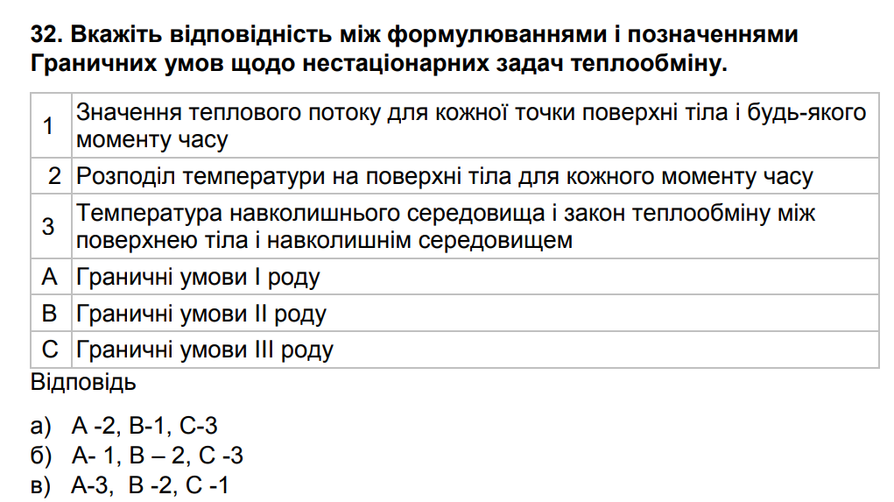

Вкажіть відповідність між формулюваннями і позначеннями граничних умов щодо нестаціонарних задач теплообміну.

Розглянемо різні типи граничних умов у теплообміні:

- **Граничні умови I роду (А)**: Задається температура на поверхні тіла в будь-який момент часу.
- **Граничні умови II роду (В)**: Задається густина теплового потоку на поверхні тіла в будь-який момент часу.
- **Граничні умови III роду (С)**: Задається температура навколишнього середовища та закон теплообміну (як правило, конвективного) між поверхнею тіла та середовищем.

Тепер зіставимо формулювання з типами граничних умов:

1. Значення теплового потоку для кожної точки поверхні тіла і будь-якого моменту часу - Це відповідає граничним умовам **II роду (В)**.
2. Розподіл температури на поверхні тіла для кожного моменту часу - Це відповідає граничним умовам **I роду (А)**.
3. Температура навколишнього середовища і закон теплообміну між поверхнею тіла і навколишнім середовищем - Це відповідає граничним умовам **III роду (С)**.

Таким чином, правильна відповідність: А-2, В-1, С-3.

Розглянемо варіанти відповідей:

а) А-2, В-1, С-3 - Правильно.

б) А- 1, В- 2, С -3 - Неправильно.

в) А-3, В-2, С -1 - Неправильно.

**Відповідь: а) А-2, В-1, С-3**

# 33
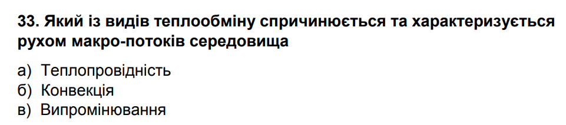

Який із видів теплообміну спричинюється та характеризується рухом макро-потоків середовища

Розглянемо основні види теплообміну:

а) **Теплопровідність**: Передача теплоти відбувається шляхом мікроскопічної взаємодії частинок (атомів, молекул) середовища без переміщення самого середовища на макроскопічному рівні.

б) **Конвекція**: Передача теплоти відбувається шляхом переміщення макроскопічних об'ємів (макро-потоків) рухомого середовища (рідини або газу). Це може бути природна конвекція (викликана різницею густин) або примусова конвекція (викликана зовнішніми силами, наприклад, насосом чи вентилятором).

в) **Випромінювання**: Передача теплоти здійснюється за допомогою електромагнітних хвиль і не потребує наявності середовища.

Запитання чітко вказує на "рух макро-потоків середовища". Ця ознака є визначальною для конвекції.

**Відповідь: б) Конвекція**

# 34
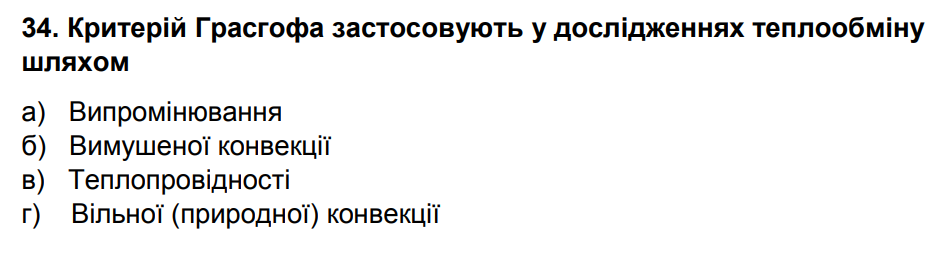

Критерій Грасгофа застосовують у дослідженнях теплообміну шляхом

Критерій Грасгофа (Gr) - це безрозмірне число, яке характеризує співвідношення підйомної сили (архімедової сили), що виникає через різницю густин рідини або газу при різній температурі, до сил в'язкості. Цей критерій є визначальним при дослідженні **вільної (природної) конвекції**, де рух середовища спричинений виключно різницею температур, що викликає різницю густин.

Розглянемо запропоновані варіанти:

а) Випромінювання: Теплообмін випромінюванням не пов'язаний з рухом середовища, тому критерій Грасгофа не застосовується.

б) Вимушеної конвекції: При вимушеній конвекції рух середовища спричинений зовнішніми силами (наприклад, роботою насоса або вентилятора). Основним критерієм подібності для вимушеної конвекції є критерій Рейнольдса. Критерій Грасгофа може враховуватися при змішаній конвекції, але не є визначальним для чисто вимушеної.

в) Теплопровідності: Теплопровідність - це перенос теплоти шляхом безпосереднього контакту частинок, без макроскопічного переміщення середовища. Критерій Грасгофа не застосовується.

г) Вільної (природної) конвекції: Рух середовища при вільній конвекції спричинений різницею густин, яка виникає через градієнт температури. Критерій Грасгофа є основним критерієм подібності для вільної конвекції.

Таким чином, критерій Грасгофа застосовують у дослідженнях теплообміну шляхом вільної (природної) конвекції.

**Відповідь: г) Вільної (природної) конвекції**

# 35
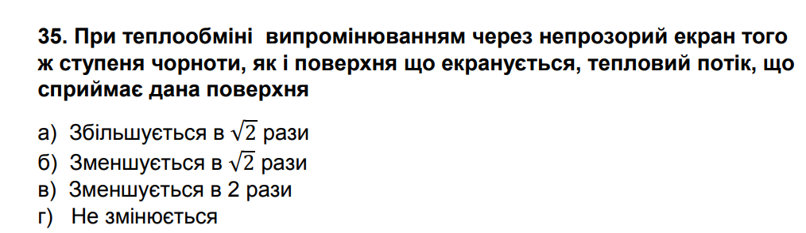

При теплообміні випромінюванням через непрозорий екран того ж ступеня чорноти, як і поверхня що екранується, тепловий потік, що сприймає дана поверхня

Розглянемо випадок теплообміну випромінюванням між двома паралельними плоскими поверхнями з однаковою площею та ступенем чорноти $\epsilon$. Тепловий потік між ними (без екрана) пропорційний $\sigma (T_1^4 - T_2^4)$ та обернено пропорційний термічному опору, який залежить від ступеня чорноти.

При розміщенні між цими поверхнями непрозорого екрана того ж ступеня чорноти $\epsilon$, система перетворюється на послідовне з'єднання радіаційних теплообмінів: від першої поверхні до екрана, і від екрана до другої поверхні. Кожен з цих процесів має свій термічний опір.

Для випадку двох паралельних плоских поверхонь з однаковою площею $A$ та однаковим ступенем чорноти $\epsilon$, тепловий потік без екрана (для випадку, коли $T_1 > T_2$) можна виразити як:
$$Q_{12} = \frac{\sigma (T_1^4 - T_2^4)}{\frac{1}{\epsilon} + \frac{1}{\epsilon} - 1} A = \frac{\sigma (T_1^4 - T_2^4)}{\frac{2}{\epsilon} - 1} A$$

Якщо між поверхнями 1 і 2 розмістити екран 3 з тим же ступенем чорноти $\epsilon$, то тепловий потік буде передаватися послідовно від 1 до 3, а потім від 3 до 2. При стаціонарному режимі тепловий потік від 1 до 3 дорівнює тепловому потоку від 3 до 2, і дорівнює загальному тепловому потоку від 1 до 2 через екран. Припускаючи, що екран має проміжну температуру $T_3$.

Тепловий потік від 1 до 3: $Q_{13} = \frac{\sigma (T_1^4 - T_3^4)}{\frac{1}{\epsilon} + \frac{1}{\epsilon} - 1} A = \frac{\sigma (T_1^4 - T_3^4)}{\frac{2}{\epsilon} - 1} A$

Тепловий потік від 3 до 2: $Q_{32} = \frac{\sigma (T_3^4 - T_2^4)}{\frac{1}{\epsilon} + \frac{1}{\epsilon} - 1} A = \frac{\sigma (T_3^4 - T_2^4)}{\frac{2}{\epsilon} - 1} A$

Оскільки $Q_{13} = Q_{32}$, то $T_1^4 - T_3^4 = T_3^4 - T_2^4$, звідки $2 T_3^4 = T_1^4 + T_2^4$, або $T_3^4 = \frac{T_1^4 + T_2^4}{2}$.

Підставимо $T_3^4$ у формулу для $Q_{13}$ (або $Q_{32}$):
$$Q_{12, з \, екраном} = \frac{\sigma (T_1^4 - \frac{T_1^4 + T_2^4}{2})}{\frac{2}{\epsilon} - 1} A = \frac{\sigma \frac{2T_1^4 - T_1^4 - T_2^4}{2}}{\frac{2-\epsilon}{\epsilon}} A = \frac{\sigma \frac{T_1^4 - T_2^4}{2}}{\frac{2-\epsilon}{\epsilon}} A = \frac{\sigma \epsilon (T_1^4 - T_2^4)}{2(2-\epsilon)} A$$

Порівняємо теплові потоки з екраном і без екрана (припускаючи, що формула без екрана була $Q_{12} = \frac{\sigma \epsilon (T_1^4 - T_2^4)}{2 - \epsilon} A$):
$$\frac{Q_{12, з \, екраном}}{Q_{12, без \, екрана}} = \frac{\frac{\sigma \epsilon (T_1^4 - T_2^4)}{2(2-\epsilon)} A}{\frac{\sigma \epsilon (T_1^4 - T_2^4)}{2 - \epsilon} A} = \frac{1}{2}$$

Таким чином, тепловий потік зменшується в 2 рази.

**Відповідь: в) Зменшується в 2 рази**

# 36
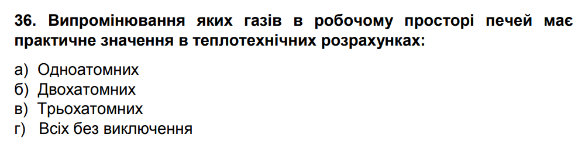

Випромінювання яких газів в робочому просторі печей має практичне значення в теплотехнічних розрахунках:

Теплове випромінювання газів відбувається за рахунок зміни дипольного моменту молекул під час коливальних та обертальних рухів. Гази, молекули яких мають симетрію, що не дозволяє мати дипольний момент або змінювати його під час коливань/обертань, практично не випромінюють і не поглинають теплового випромінювання.

- **Одноатомні гази** (наприклад, Ar, He) мають симетричну структуру і не випромінюють теплоти.
- **Двохатомні гомоядерні гази** (наприклад, O₂, N₂, H₂) також мають симетричну структуру і їх випромінювання в теплотехнічних розрахунках зазвичай не враховується.
- **Двохатомні гетероядерні гази** (наприклад, CO, NO) мають дипольний момент і можуть випромінювати, але їх внесок у випромінювання продуктів згоряння зазвичай менший, ніж у трьохатомних газів.
- **Трьохатомні та багатоатомні гази** (наприклад, CO₂, H₂O, SO₂) мають складнішу структуру і значний дипольний момент або його зміну під час коливань, тому вони є сильними випромінювачами та поглиначами теплового випромінювання, особливо в інфрачервоній області спектра, яка є актуальною для температур в печах. Основними газами, що випромінюють у робочому просторі печей (продуктах згоряння), є вуглекислий газ (CO₂) та водяна пара (H₂O).

Таким чином, випромінювання трьохатомних газів має практичне значення в теплотехнічних розрахунках печей. Хоча деякі багатоатомні гази (наприклад, SO₂) також випромінюють, а гетероядерні двохатомні гази (CO) також можуть мати значний внесок за певних умов, варіант "Трьохатомних" є найбільш точним серед запропонованих, оскільки CO₂ та H₂O є типовими і значущими випромінюючими компонентами в робочому просторі печей.

**Відповідь: в) Трьохатомних**

# 37
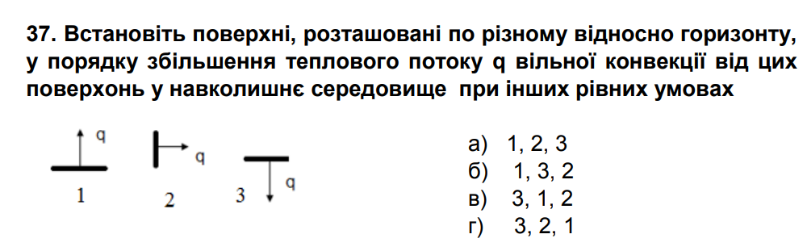

Встановіть поверхні, розташовані по різному відносно горизонту, у порядку збільшення теплового потоку q вільної конвекції від цих поверхонь у навколишнє середовище при інших рівних умовах

Вільна (природна) конвекція виникає за рахунок різниці густин середовища, спричиненої нерівномірним розподілом температури. Орієнтація поверхні відіграє важливу роль у формуванні конвективних потоків.

Розглянемо теплообмін від гарячої поверхні до більш холодного навколишнього середовища:
1. Горизонтальна поверхня, тепловий потік спрямований вгору (діаграма 1): Гаряче, менш щільне середовище біля поверхні піднімається вгору, сприяючи інтенсивному перемішуванню та хорошому конвективному теплообміну.
2. Вертикальна поверхня, тепловий потік спрямований горизонтально (діаграма 2): Гаряче середовище біля вертикальної поверхні також піднімається вгору вздовж поверхні, утворюючи висхідний потік. Інтенсивність конвекції є помірною.
3. Горизонтальна поверхня, тепловий потік спрямований вниз (діаграма 3): Гаряче, менш щільне середовище біля поверхні знаходиться над холоднішим, щільнішим середовищем. Це створює стійку стратифікацію, яка перешкоджає вільному руху середовища вниз і значно пригнічує конвекцію. Теплопередача відбувається переважно за рахунок теплопровідності в тонкому шарі середовища біля поверхні, що призводить до найменшого теплового потоку серед трьох випадків.

Порівнюючи інтенсивність вільної конвекції для цих орієнтацій, ми маємо:

Найменший тепловий потік - горизонтальна поверхня, потік вниз (діаграма 3).

Проміжний тепловий потік - вертикальна поверхня (діаграма 2).

Найбільший тепловий потік - горизонтальна поверхня, потік вгору (діаграма 1).

Отже, поверхні в порядку збільшення теплового потоку розташовуються так: 3, 2, 1.

**Відповідь: г) 3, 2, 1**

# 38
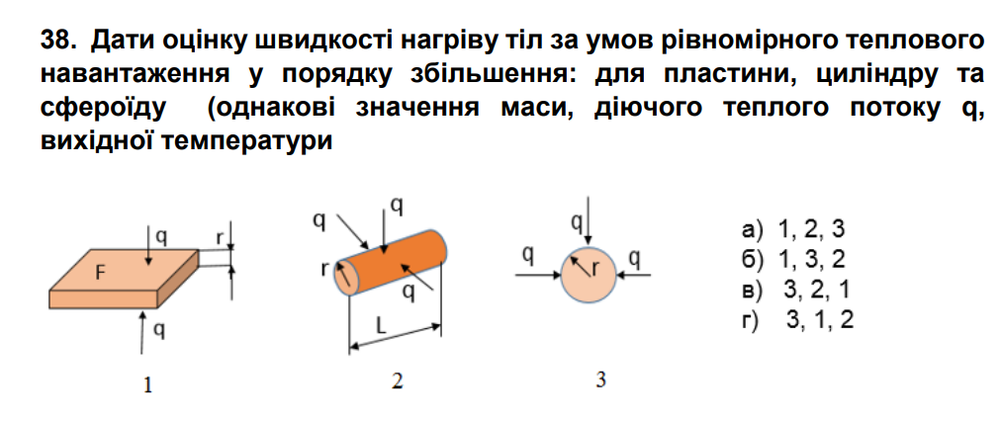

Дати оцінку швидкості нагріву тіл за умов рівномірного теплового навантаження у порядку збільшення: для пластини, циліндру та сфероїду (однакові значення маси, діючого теплового потоку q, вихідної температури)

Швидкість нагріву тіла пропорційна кількості теплоти, що надходить до тіла за одиницю часу, та обернено пропорційна його теплоємності. Кількість теплоти, що надходить, дорівнює тепловому потоку $q$, помноженому на площу поверхні тіла $A$: $Q = q \cdot A$. Теплоємність тіла $C = m \cdot c_p$, де $m$ - маса, $c_p$ - питома теплоємність.

Швидкість зміни температури (швидкість нагріву) приблизно дорівнює $\frac{\Delta T}{\Delta \tau} \propto \frac{Q}{C} = \frac{q \cdot A}{m \cdot c_p}$.

За умовою задачі, маса ($m$), діючий тепловий потік ($q$) та вихідна температура однакові для всіх тіл. Припускаючи, що тіла виготовлені з одного матеріалу, їх питома теплоємність ($c_p$) також однакова. Таким чином, швидкість нагріву прямо пропорційна площі поверхні тіла $A$:
$$\frac{\Delta T}{\Delta \tau} \propto A$$

Для однакової маси (а отже, однакового об'єму, якщо густина стала), тіло з більшою площею поверхні буде нагріватися швидше, а тіло з меншою площею поверхні - повільніше. Серед тіл однакового об'єму сфера має найменшу площу поверхні.

Порівняємо площі поверхонь пластини, циліндра та сфери однакової маси (об'єму). Сфера (3) має найменшу площу поверхні серед тіл однакового об'єму, тому вона буде нагріватися найповільніше. Пластина (1), особливо якщо вона тонка, матиме відносно велику площу поверхні. Циліндр (2) матиме проміжну площу поверхні (залежно від співвідношення висоти до радіуса).

Зображення візуально підтверджує цю ідею: сфера є найбільш "компактною", тоді як пластина виглядає тонкою і розширеною, що вказує на велику відносну площу поверхні.

Таким чином, у порядку збільшення швидкості нагріву (від найповільнішого до найшвидшого), тіла розташовуються так: сфера (найменша площа поверхні), циліндр, пластина (найбільша площа поверхні).

Порядок збільшення швидкості нагріву відповідає порядку збільшення площі поверхні: 3, 2, 1.

Розглянемо варіанти відповідей:

а) 1, 2, 3 - Неправильно (порядок зменшення).

б) 1, 3, 2 - Неправильно.

в) 3, 2, 1 - Правильно.

г) 3, 1, 2 - Неправильно.

**Відповідь: в) 3, 2, 1**

# 39
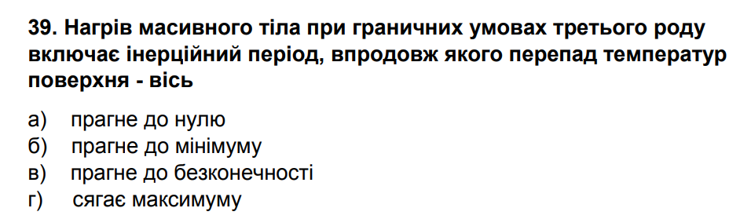

Нагрів масивного тіла при граничних умовах третього роду включає інерційний період, впродовж якого перепад температур поверхня - вісь

При нагріві масивного тіла (тіла зі значним термічним опором теплопровідності всередині) відносно холодним середовищем за граничних умов третього роду (конвективний теплообмін з навколишнім середовищем) спостерігається так званий "інерційний період" нестаціонарного теплообміну.

На початку процесу нагріву теплота надходить на поверхню тіла з навколишнього середовища. Температура поверхні тіла починає швидко зростати. Однак, через значний термічний опір теплопровідності матеріалу "масивного" тіла, теплота повільно поширюється вглиб тіла, до його осі або центру.

Протягом цього "інерційного періоду" температура поверхні значно випереджає температуру внутрішніх шарів тіла. Перепад температур між поверхнею та віссю (центром) тіла зростає від початкового значення (яке дорівнювало нулю, якщо початковий розподіл температури був рівномірним). Цей перепад температур є рушійною силою для подальшого поширення теплоти всередину тіла.

Максимальний перепад температури між поверхнею та віссю тіла зазвичай досягається протягом нестаціонарного процесу нагріву. Інерційний період є початковою фазою цього процесу, коли перепад температур інтенсивно зростає. Хоча абсолютний максимум перепаду може бути досягнутий дещо пізніше завершення власне інерційного періоду (залежно від точного визначення цього періоду), під час інерційного періоду перепад температур є значним і збільшується.

Зважаючи на варіанти відповідей, найбільш точним описом того, що відбувається з перепадом температур поверхня - вісь протягом інерційного періоду нагріву масивного тіла, є його зростання і досягнення значних значень, що відповідає концепції "сягає максимуму" в контексті нестаціонарного процесу.

**Відповідь: г) сягає максимуму**

# 40
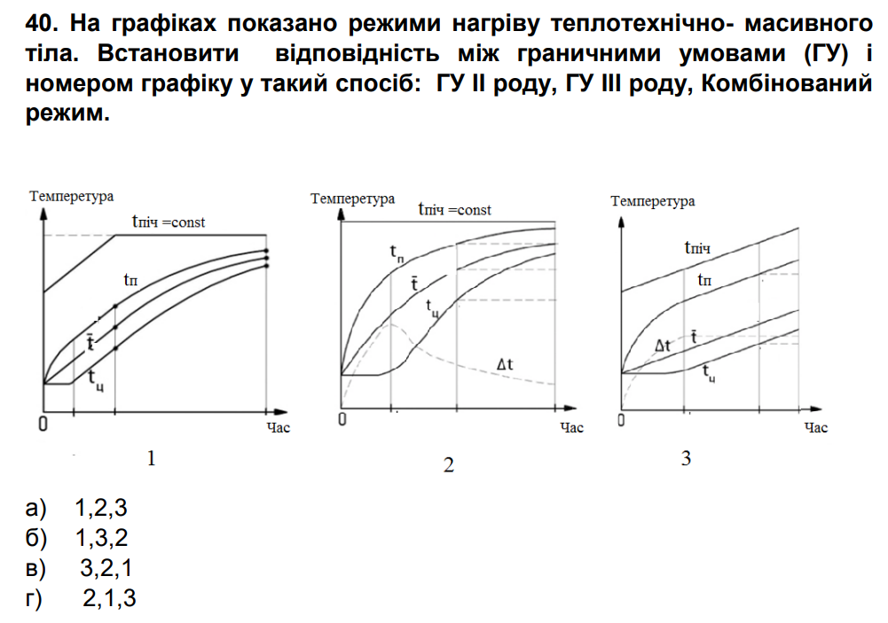

На графіках показано режими нагріву теплотехнічно- масивною тіла. Встановити відповідність між граничними умовами (ГУ) і номером графіку у такий спосіб: ГУ II роду, ГУ III роду, Комбінований режим.
[Три графіки залежності температури від часу]

Розглянемо характеристики кожного типу граничних умов та відповідні їм графіки температури масивного тіла:

- **Граничні умови II роду (задана густина теплового потоку на поверхні):** При нагріві за цих умов на поверхню тіла надходить постійний потік теплоти. Температура поверхні і внутрішніх точок тіла буде зростати з часом. Якщо немає втрат теплоти, температура може зростати необмежено (в рамках моделі). На графіку це буде виглядати як зростання температури тіла (поверхні та внутрішніх точок) з часом. Графік 2 показує зростання температури поверхні ($t_п$) та осі ($t_о$) з часом, причому різниця температур ($\Delta t$) між ними змінюється, але загальна тенденція - зростання температури.

- **Граничні умови III роду (конвективний теплообмін з середовищем постійної температури):** При нагріві за цих умов тіло обмінюється теплотою з навколишнім середовищем, температура якого постійна ($t_{піч} = const$). Швидкість теплообміну залежить від різниці температур між поверхнею тіла та середовищем. В міру нагріву тіла різниця температур зменшується, і швидкість теплообміну сповільнюється. Зрештою, температура тіла наближається до температури навколишнього середовища. Графік 1 показує, що температура поверхні ($t_п$) та осі ($t_о$) зростає і наближається до постійної температури навколишнього середовища ($t_{піч}$).

- **Комбінований режим:** У контексті нагріву в печах, комбінований режим часто означає теплообмін шляхом конвекції та випромінювання, або нагрів у печі, температура якої змінюється за певним законом. Графік 3 показує, що температура навколишнього середовища ($t_{піч}$) зростає лінійно з часом. Температура поверхні ($t_п$) та осі ($t_о$) також зростає, але відстає від температури печі. Це типова картина нагріву в печі з програмним підвищенням температури.

Таким чином, відповідність наступна:
- ГУ II роду: Графік 2
- ГУ III роду: Графік 1
- Комбінований режим: Графік 3

Запитання просить встановити відповідність у порядку: ГУ II роду, ГУ III роду, Комбінований режим.
Отже, номери графіків у цьому порядку: 2, 1, 3.

Порівняємо з варіантами відповідей:

а) 1, 2, 3 - Неправильно.

б) 1, 3, 2 - Неправильно.

в) 3, 2, 1 - Неправильно.

г) 2, 1, 3 - Правильно.

**Відповідь: г) 2, 1, 3**