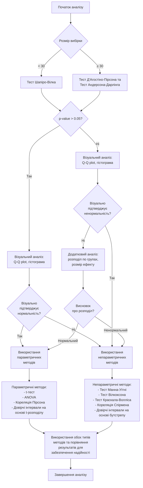

# Методологія вибору статистичних тестів на основі характеристик розподілу даних

## Анотація

У даному документі представлено системний підхід до вибору відповідних статистичних методів аналізу даних з урахуванням особливостей їх розподілу. Запропоновано послідовність дій для визначення характеристик розподілу даних та обґрунтованого вибору параметричних або непараметричних методів статистичного аналізу. Розроблена методологія є універсальною та може бути застосована до різноманітних наборів даних незалежно від їхньої предметної області.

## Вступ

Статистичний аналіз є ключовим інструментом для обробки та інтерпретації експериментальних даних у різних галузях науки. Однак достовірність отриманих результатів значною мірою залежить від коректності застосування статистичних методів, яка, своєю чергою, визначається відповідністю цих методів характеристикам розподілу даних. Зокрема, багато класичних статистичних методів базуються на припущенні про нормальний розподіл даних, і їх застосування до даних з ненормальним розподілом може призвести до хибних висновків.

Метою даної роботи є розробка системного підходу до вибору статистичних методів аналізу з урахуванням характеристик розподілу даних. Запропонована методологія дозволяє обґрунтовано обирати між параметричними та непараметричними методами залежно від результатів статистичних тестів на нормальність та інших характеристик даних.

## Методологія оцінки нормальності розподілу

### Статистичні тести на нормальність

Для оцінки відповідності даних нормальному розподілу рекомендується використовувати комбінацію різних статистичних тестів, кожен з яких має свої переваги та обмеження.

#### 1. Тест Шапіро-Вілка (Shapiro-Wilk)

Тест Шапіро-Вілка вважається одним із найпотужніших тестів на нормальність, особливо для вибірок малого та середнього розміру (до 5000 спостережень).

**Реалізація:** 
```python
from scipy.stats import shapiro
stat, p_value = shapiro(data)
```

**Інтерпретація:** Якщо p-значення менше за обраний рівень значущості (наприклад, 0,05), гіпотеза про нормальний розподіл відхиляється.

**Обмеження:** Ефективність цього тесту знижується для великих вибірок, оскільки він стає занадто чутливим до незначних відхилень від нормальності.

#### 2. Тест Д'Агостіно-Пірсона (D'Agostino-Pearson)

Тест Д'Агостіно-Пірсона оцінює нормальність на основі асиметрії та ексцесу розподілу, що робить його корисним для виявлення відхилень від нормальності через форму розподілу.

**Реалізація:**
```python
from scipy.stats import normaltest
stat, p_value = normaltest(data)
```

**Інтерпретація:** Аналогічно до тесту Шапіро-Вілка, відхилення нульової гіпотези відбувається при p < 0,05.

**Переваги:** Ефективний для великих наборів даних.

#### 3. Тест Андерсона-Дарлінга (Anderson-Darling)

Тест Андерсона-Дарлінга є модифікацією тесту Колмогорова-Смирнова з більшою чутливістю до хвостів розподілу.

**Реалізація:**
```python
from scipy.stats import anderson
result = anderson(data)
```

**Інтерпретація:** Якщо статистика тесту перевищує критичне значення для обраного рівня значущості, розподіл вважається ненормальним.

**Особливості:** Особливо ефективний для виявлення відхилень у хвостах розподілу.

### Графічні методи оцінки нормальності

Поряд із формальними статистичними тестами, для оцінки нормальності розподілу рекомендується використовувати графічні методи.

#### 1. Квантиль-квантиль графіки (Q-Q plots)

Q-Q графіки дозволяють візуально порівняти квантилі емпіричного розподілу з квантилями теоретичного нормального розподілу.

**Реалізація:**
```python
import matplotlib.pyplot as plt
from scipy import stats
fig = plt.figure()
stats.probplot(data, plot=plt)
plt.title("Q-Q Plot")
plt.show()
```

**Інтерпретація:** Якщо точки на графіку наближаються до прямої лінії, це свідчить про відповідність нормальному розподілу. Систематичні відхилення від прямої вказують на порушення нормальності.

#### 2. Гістограми з накладеною кривою нормального розподілу

**Реалізація:**
```python
import numpy as np
import matplotlib.pyplot as plt
import scipy.stats as stats

plt.hist(data, bins=30, density=True, alpha=0.6, color='g')

# Накладення кривої нормального розподілу
mu, std = np.mean(data), np.std(data)
xmin, xmax = plt.xlim()
x = np.linspace(xmin, xmax, 100)
p = stats.norm.pdf(x, mu, std)
plt.plot(x, p, 'k', linewidth=2)
plt.title("Гістограма з накладеною кривою нормального розподілу")
plt.show()
```

**Інтерпретація:** Візуальне порівняння емпіричного розподілу з теоретичним нормальним розподілом.

## Алгоритм вибору статистичних методів

Для забезпечення надійності статистичного аналізу рекомендується дотримуватися наступного алгоритму:



## Рекомендації щодо статистичних методів

### Методи для даних з нормальним розподілом (параметричні)

| Мета аналізу | Рекомендований метод | Умови застосування |
|--------------|----------------------|-------------------|
| Порівняння двох незалежних груп | t-тест для незалежних вибірок | Нормальний розподіл у обох групах |
| Порівняння двох залежних груп | Парний t-тест | Нормальний розподіл різниць між парами |
| Порівняння трьох і більше груп | Однофакторний дисперсійний аналіз (ANOVA) | Нормальний розподіл у всіх групах, гомогенність дисперсій |
| Аналіз зв'язку між змінними | Кореляція Пірсона | Нормальний розподіл обох змінних, лінійний зв'язок |
| Оцінка точності середнього | Довірчі інтервали на основі t-розподілу | Нормальний розподіл |

### Методи для даних з ненормальним розподілом (непараметричні)

| Мета аналізу | Рекомендований метод | Умови застосування |
|--------------|----------------------|-------------------|
| Порівняння двох незалежних груп | Тест Манна-Уітні | Ненормальний розподіл, порядкова шкала |
| Порівняння двох залежних груп | Тест Вілкоксона для парних вибірок | Ненормальний розподіл, порядкова шкала |
| Порівняння трьох і більше груп | Тест Краскала-Волліса | Ненормальний розподіл, порядкова шкала |
| Аналіз зв'язку між змінними | Кореляція Спірмена або Кендалла | Ненормальний розподіл, монотонний зв'язок |
| Оцінка точності медіани | Довірчі інтервали на основі бутстрепу | Будь-який розподіл |

## Додаткові рекомендації

1. **Для великих вибірок** (n > 30) параметричні методи можуть бути застосовані навіть при незначних відхиленнях від нормальності завдяки центральній граничній теоремі.

2. **При аналізі складних даних** рекомендується застосовувати як параметричні, так і непараметричні методи, і порівнювати отримані результати. Збіг результатів підвищує довіру до висновків.

3. **Для дуже асиметричних розподілів** або розподілів з важкими хвостами непараметричні методи є більш надійними.

4. **При порівнянні груп з різними типами розподілів** (нормальний в одній групі, ненормальний в іншій) рекомендується віддавати перевагу непараметричним методам.

5. **Для представлення центральної тенденції**:
   - При нормальному розподілі: середнє арифметичне ± стандартне відхилення
   - При ненормальному розподілі: медіана (25-й перцентиль; 75-й перцентиль)

## Висновки

Запропонована методологія забезпечує систематичний підхід до вибору статистичних методів аналізу даних з урахуванням характеристик їх розподілу. Комбінація формальних статистичних тестів і візуальних методів оцінки нормальності дозволяє приймати обґрунтовані рішення щодо застосування параметричних або непараметричних методів. Універсальність даного підходу забезпечується адаптацією методології до різних розмірів вибірок та типів розподілів.

## Список використаних джерел

1. Razali, N. M., & Wah, Y. B. (2011). Power comparisons of Shapiro-Wilk, Kolmogorov-Smirnov, Lilliefors and Anderson-Darling tests. Journal of Statistical Modeling and Analytics, 2(1), 21-33.

2. Ghasemi, A., & Zahediasl, S. (2012). Normality tests for statistical analysis: a guide for non-statisticians. International Journal of Endocrinology and Metabolism, 10(2), 486-489.

3. Öztuna, D., Elhan, A. H., & Tüccar, E. (2006). Investigation of four different normality tests in terms of type 1 error rate and power under different distributions. Turkish Journal of Medical Sciences, 36(3), 171-176.

4. McKnight, P. E., & Najab, J. (2010). Mann-Whitney U Test. In The Corsini Encyclopedia of Psychology (eds I. B. Weiner and W. E. Craighead). https://doi.org/10.1002/9780470479216.corpsy0524
