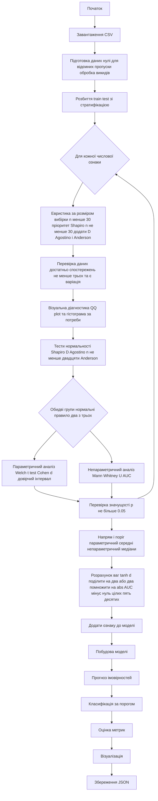

# Методика статистичної моделі та алгоритм роботи

Документ описує методику, реалізовану у файлі `D:\WINDSURF\ARTICLEs\Стаття № 2 - нове\статистична-модель.py`, а також деталі алгоритму статистичної моделі класифікації із автоматичним вибором статистичних тестів для різних наборів даних. Виклад здійснено у науковому стилі та структурований відповідно до кроків оброблення даних, навчання моделі, прогнозування та оцінювання якості.

## 1. Вхідні дані та попередня обробка

- Завантаження даних. Функція `load_data(file_path, group_column='is_successful', handle_outliers_flag=True)` читає CSV, перетворює цільову змінну на цілочисельний тип, формує список числових ознак (без цільової), виводить розподіл цільового класу.
- Негативні значення. Для всіх числових колонок від’ємні значення замінюються на нуль, з протоколюванням кількості замін по колонках.
- Пропуски. Обчислюється кількість пропусків у числових колонках; інформація виводиться у звіт.
- Викиди. За потреби виконується обробка викидів (`handle_all_outliers`) із підтримкою трьох методів виявлення: IQR, Z-score, Percentile, та трьох підходів обробки: cap (вінсоризація), remove (видалення), median (заміна медіаною). Формується звіт по викидах і (опційно) зберігаються візуалізації `boxplot + histogram` для топ-колонок з найбільшою кількістю викидів (`plot_outliers`).

## 2. Розбиття на тренувальну і тестову вибірки

- Стратифікація. `split_train_test(df, test_size=0.3, random_state=42)` виконує `train_test_split` із параметром `stratify` за `is_successful`, зберігаючи розподіл класів у тренуванні й тесті.

## 3. Методика вибору статистичних тестів (ядро підходу)

Реалізована у функціях `test_normality`, `assess_normality_for_column`, `analyze_column_significance`.

- 3.1. Тести нормальності для кожної ознаки у розрізі груп. Для ознаки `column_name` дані розділяються на дві групи за `group_column='is_successful'`:
  - Група 0: `df[df[group]=='0'][column]`.
  - Група 1: `df[df[group]=='1'][column]`.
  Для кожної групи виконуються три незалежні тести нормальності:
  - Shapiro–Wilk (`test_name='shapiro'`) із підвибіркою до 5000 спостережень за потреби.
  - D’Agostino–Pearson (`test_name='dagostino'`), застосовується лише за умови n ≥ 20.
  - Anderson–Darling (`test_name='anderson'`) з визначенням p-value за пороговими критеріями.

- 3.2. Правило прийняття рішення про нормальність.
  - Для кожної групи підраховується кількість тестів, які дали позитивне підтвердження нормальності (p > 0.05; для Anderson–Darling — статистика нижче критичного значення на відповідному рівні значущості).
  - Група вважається нормальною, якщо щонайменше 2 із 3 тестів підтверджують нормальність.
  - Пара ознак (обидві групи) вважається «обидві нормальні» (`both_normal=True`), якщо обидві групи пройшли правило 2/3.

- 3.3. Вибір подальшого статистичного тесту.
  - Якщо `both_normal=True` → застосовується параметричний підхід: Welch’s t-test (`stats.ttest_ind(..., equal_var=False)`) і обчислення розміру ефекту Cohen’s d з 95% ДІ для різниці середніх.
  - Якщо `both_normal=False` → застосовується непараметричний підхід: Mann–Whitney U з перетворенням U у AUC як міру ефекту; додатково визначається напрям впливу.

- 3.4. Перевірки придатності даних.
  - Тести нормальності не запускаються, якщо кількість валідних спостережень < 3 або відсутня варіація значень (усі значення однакові).
  - Для D’Agostino–Pearson обов’язкова умова n ≥ 20.

- 3.5. Критерій значущості.
  - Рівень значущості α = 0.05.
  - Результати тестів інтерпретуються через p-value; додатково формується інтерпретація розміру ефекту: для Cohen’s d — пороги 0.2/0.5/0.8; для AUC — за відхиленням |AUC−0.5| (≈0.05/0.1/0.2).

## 4. Аналіз значущості ознак і побудова моделі

- 4.1. Оцінка кожної ознаки. `analyze_column_significance`:
  - Виконує п.3 для конкретної ознаки.
  - Визначає напрям впливу: для параметричного підходу — за середніми (`mean`), для непараметричного — за медіанами (`median`).
  - Формує порогове значення для майбутньої класифікації: середнє арифметичне між груповими середніми (або медіанами) незалежно від напрямку (тобто midpoint двох «центрів» розподілів).

- 4.2. Визначення ваги ознаки. `calculate_feature_weight(effect_size, method)`:
  - Для параметричного підходу (Cohen’s d) застосовується згладжувальна трансформація до [0,1]: `0.5 + 0.5 * tanh(d/2)`.
  - Для непараметричного підходу (AUC) використовується шкала `2 * |AUC − 0.5|` (дає значення у [0,1] і симетрично центрована відносно 0.5).

- 4.3. Відбір значущих ознак і параметри моделі. `train_statistical_model`:
  - Аналізує всі числові колонки; відбирає лише статистично значущі (p ≤ 0.05).
  - Для кожної значущої ознаки зберігає: `threshold`, `direction`, `weight`, `p_value`, `effect_size`.
  - Формує словник `model['features']` та метадані (кількість ознак, розподіл цілі, поріг класифікації за замовчуванням 0.5).

## 5. Прогнозування на тестових даних

- Голосування ознак. `predict_with_statistical_model`:
  - Для кожної значущої ознаки обчислюється «голос»: якщо `direction=True` (більше → успіх) і значення перевищує `threshold`, додається `weight`; якщо `direction=False`, голос додається при невиході за поріг у «менший» бік.
  - Сума голосів нормується на їх максимально можливу суму → отримується `probability` у [0,1]. Якщо значущих ознак немає, застосовується базова ймовірність, рівна частці позитивного класу у тренувальних даних.
  - Остаточний клас: `predicted_class = (probability > classification_threshold)`. За замовчуванням `classification_threshold = 0.5` (може бути змінений у метаданих моделі).

## 6. Оцінювання якості моделі та візуалізації

- Метрики. `evaluate_model_performance(y_true, y_pred, y_prob)` повертає:
  - Точність (Accuracy), Збалансована точність (Balanced Accuracy), Точність (Precision), Повнота (Recall), Специфічність (Specificity), F1-міра, ROC AUC (за можливості), NPV, Матриця помилок.
- Візуалізації. `plot_model_results(...)` зберігає:
  - ROC-криву з AUC, матрицю помилок (heatmap), гістограми розподілу прогнозованих ймовірностей за класами, графік важливості ознак.
- Збереження результатів. `save_model_results(model, evaluation_results, output_file)` — серіалізує модель і метрики у JSON із `NumpyEncoder`.

## 7. Загальний алгоритм (Mermaid діаграма)

## 8. Особливості реалізації та зауваги

- Стійкість до викидів. Вінсоризація/видалення/медіанна заміна надають гнучкий контроль; вибір методу фіксується у логах.
- Вимоги до обсягу даних. Для коректності тестів нормальності передбачені мінімальні обсяги та перевірка на варіативність.
- Інтерпретованість. Модель базується на підмножині статистично значущих ознак із прозорими порогами, напрямками впливу та вагами, що полегшує експертну валідацію.
- Гнучкість порогу класифікації. За замовчуванням 0.5, може бути адаптований під цільову функцію (наприклад, підвищення Recall або Precision).

## 9. Висновок

Подана методика реалізує системний статистичний підхід до побудови простої, інтерпретованої класифікаційної моделі із автоматичним вибором коректного статистичного тесту залежно від емпіричних властивостей даних. Комбінація перевірки нормальності за правилом 2/3 на рівні кожної групи, подальший вибір між параметричними та непараметричними тестами, а також перетворення розміру ефекту на ваги ознак забезпечують баланс між надійністю висновків та простотою розгортання моделі у прикладних задачах.
