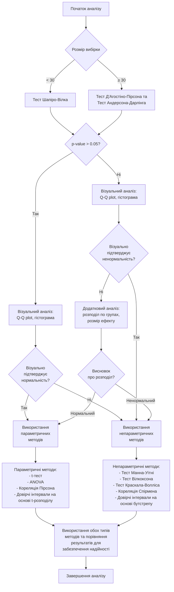
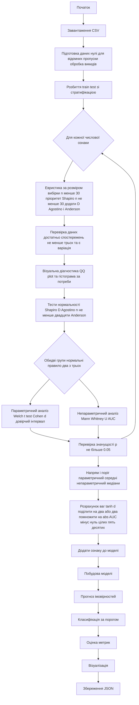

# Статистична модель


```python
"""
Statistical prediction model based on comparative statistical tests.
Automatically selects analysis methods and calculates statistical significance of factors.
"""
import pandas as pd
import numpy as np
from scipy import stats
import matplotlib
matplotlib.use('Agg')
import matplotlib.pyplot as plt
import seaborn as sns
import json
import os
import logging
import sys
from datetime import datetime
from sklearn.model_selection import train_test_split
from sklearn import metrics

# Налаштування параметрів обробки викидів
HANDLE_OUTLIERS = True  # Чи потрібно обробляти викиди
OUTLIER_METHOD = 'iqr'  # Метод виявлення викидів: 'iqr', 'zscore', або 'percentile'
OUTLIER_TREATMENT = 'cap'  # Метод обробки викидів: 'cap', 'remove', або 'median'
OUTLIER_THRESHOLD = 1.5  # Поріг для виявлення викидів

# Налаштування логування
def setup_logging(log_file='statistical_model_log.txt'):
    """Set up logging to file and console with detailed formatting."""
    # Створення директорії для логів, якщо вона не існує
    log_dir = os.path.dirname(log_file)
    if log_dir and not os.path.exists(log_dir):
        os.makedirs(log_dir, exist_ok=True)

    # Налаштування логера
    logger = logging.getLogger()
    logger.setLevel(logging.INFO)

    # Очистка попередніх обробників
    if logger.handlers:
        for handler in logger.handlers:
            logger.removeHandler(handler)

    # Додавання файлового обробника
    file_handler = logging.FileHandler(log_file, mode='w', encoding='utf-8')
    file_handler.setFormatter(logging.Formatter('%(message)s'))
    logger.addHandler(file_handler)

    # Додавання консольного обробника
    console_handler = logging.StreamHandler(sys.stdout)
    console_handler.setFormatter(logging.Formatter('%(message)s'))
    logger.addHandler(console_handler)

    # Запис заголовка в лог
    logger.info('=' * 80)
    logger.info('СТАТИСТИЧНА МОДЕЛЬ ПРОГНОЗУВАННЯ')
    logger.info(f'Час запуску: {datetime.now().strftime("%Y-%m-%d %H:%M:%S")}')
    logger.info('=' * 80 + '\n')

    return logger


# Допоміжна функція для виведення роздільників у логах
def log_section(logger, title, section_level=1):
    """Log section header with appropriate formatting based on importance level."""
    if section_level == 1:
        # Головний розділ
        logger.info('\n' + '=' * 80)
        logger.info(f' {title} '.center(80, '='))
        logger.info('=' * 80)
    elif section_level == 2:
        # Підрозділ
        logger.info('\n' + '-' * 80)
        logger.info(f' {title} '.center(80, '-'))
        logger.info('-' * 80)
    else:
        # Мінорний підрозділ
        logger.info(f"\n--- {title} ---")

# Клас для серіалізації об'єктів numpy в JSON
class NumpyEncoder(json.JSONEncoder):
    """Special encoder for NumPy objects to JSON serialization."""
    def default(self, obj):
        if isinstance(obj, (np.integer, np.int64, np.int32)):
            return int(obj)
        if isinstance(obj, (np.floating, np.float64, np.float32)):
            return float(obj)
        if isinstance(obj, (np.ndarray,)):
            return obj.tolist()
        if isinstance(obj, (pd.Series, pd.DataFrame)):
            return obj.to_dict()
        if isinstance(obj, np.bool_):
            return bool(obj)
        if hasattr(obj, 'to_json'):
            return obj.to_json()
        return super().default(obj)


def load_data(file_path, group_column='is_successful', handle_outliers_flag=True):
    """
    Завантаження даних з CSV-файлу та їх підготовка для аналізу.

    Args:
        file_path: Шлях до файлу з даними
        group_column: Назва цільової колонки

    Returns:
        DataFrame та список числових колонок
    """
    logger = logging.getLogger()
    log_section(logger, "ЗАВАНТАЖЕННЯ ТА ПІДГОТОВКА ДАНИХ")

    logger.info(f"Завантаження даних з файлу: {file_path}")
    df = pd.read_csv(file_path)

    logger.info(f"Завантажено датасет розміром {df.shape[0]} рядків x {df.shape[1]} колонок")

    # Перетворення цільової колонки на цілі числа
    df[group_column] = df[group_column].astype(int)

    # Підрахунок розподілу цільової змінної
    target_dist = df[group_column].value_counts()
    logger.info(f"\nРозподіл цільової змінної '{group_column}':")
    logger.info(f"0 (Неуспішні замовлення): {target_dist.get(0, 0)} ({target_dist.get(0, 0) / len(df) * 100:.2f}%)")
    logger.info(f"1 (Успішні замовлення): {target_dist.get(1, 0)} ({target_dist.get(1, 0) / len(df) * 100:.2f}%)")

    # Вибір числових колонок для аналізу
    numeric_columns = df.select_dtypes(include=['number']).columns.tolist()
    if group_column in numeric_columns:
        numeric_columns.remove(group_column)
    logger.info(f"\nВиявлено {len(numeric_columns)} числових колонок для аналізу")

    # Заміна від'ємних значень нулями
    negative_values = {}
    for col in numeric_columns:
        neg_count = (df[col] < 0).sum()
        if neg_count > 0:
            negative_values[col] = neg_count
            df[col] = df[col].apply(lambda x: max(0, x) if not pd.isna(x) else x)

    if negative_values:
        logger.info("\nЗаміна від'ємних значень нулями у наступних колонках:")
        for col, count in negative_values.items():
            logger.info(f"  - {col}: {count} значень замінено")

    # Перевірка пропущених значень
    missing_values = df[numeric_columns].isna().sum()
    if missing_values.sum() > 0:
        logger.info("\nВиявлено пропущені значення у наступних колонках:")
        for col, count in missing_values[missing_values > 0].items():
            logger.info(f"  - {col}: {count} пропущених значень ({count / len(df) * 100:.2f}%)")

    # Додаємо обробку викидів
    if handle_outliers_flag:
        df, outlier_report = handle_all_outliers(
            df, numeric_columns, method='iqr', treatment='cap', threshold=1.5
        )

        # Додаємо візуалізацію для колонок з найбільшою кількістю викидів
        if outlier_report:
            # Перевіряємо структуру outlier_report
            for key, value in list(outlier_report.items())[:1]:
                if 'outliers_found' not in value:
                    # Якщо ключ інший, спробуйте знайти відповідний
                    # або змініть key у сортуванні на правильний
                    logger.warning(
                        f"У звіті про викиди відсутній ключ 'outliers_found'. Наявні ключі: {list(value.keys())}")

            # Спробуйте використовувати безпечний підхід до сортування
            top_outliers = sorted(
                outlier_report.items(),
                key=lambda x: x[1].get('outliers_found', x[1].get('count', 0)),  # Спробуйте альтернативні ключі
                reverse=True
            )[:5]


    return df, numeric_columns


def detect_outliers(df, column_name, method='iqr', threshold=1.5):
    """
    Виявлення викидів у числовій колонці за допомогою різних методів.

    Args:
        df: DataFrame з даними
        column_name: Назва колонки для аналізу
        method: Метод виявлення викидів ('iqr', 'zscore', 'percentile')
        threshold: Поріг для виявлення викидів (для IQR та Z-score)

    Returns:
        Маска логічних значень, де True вказує на викид
    """
    logger = logging.getLogger()
    data = df[column_name].dropna()

    if method == 'iqr':
        # Метод міжквартильного розмаху (IQR)
        q1 = data.quantile(0.25)
        q3 = data.quantile(0.75)
        iqr = q3 - q1
        lower_bound = q1 - threshold * iqr
        upper_bound = q3 + threshold * iqr
        outliers = (df[column_name] < lower_bound) | (df[column_name] > upper_bound)

    elif method == 'zscore':
        # Метод Z-score
        mean = data.mean()
        std = data.std()
        z_scores = abs((df[column_name] - mean) / std)
        outliers = z_scores > threshold

    elif method == 'percentile':
        # Метод процентилів
        lower_bound = data.quantile(0.01)  # 1й процентиль
        upper_bound = data.quantile(0.99)  # 99й процентиль
        outliers = (df[column_name] < lower_bound) | (df[column_name] > upper_bound)

    else:
        logger.warning(f"Невідомий метод виявлення викидів: {method}. Використовуємо IQR.")
        q1 = data.quantile(0.25)
        q3 = data.quantile(0.75)
        iqr = q3 - q1
        lower_bound = q1 - threshold * iqr
        upper_bound = q3 + threshold * iqr
        outliers = (df[column_name] < lower_bound) | (df[column_name] > upper_bound)

    return outliers


def handle_outliers(df, column_name, method='iqr', treatment='cap', threshold=1.5):
    """
    Виявлення та обробка викидів у числовій колонці.

    Args:
        df: DataFrame з даними
        column_name: Назва колонки для аналізу
        method: Метод виявлення викидів ('iqr', 'zscore', 'percentile')
        treatment: Спосіб обробки викидів ('cap', 'remove', 'median')
        threshold: Поріг для виявлення викидів

    Returns:
        DataFrame з обробленими викидами та кількість виявлених викидів
    """
    logger = logging.getLogger()
    outliers = detect_outliers(df, column_name, method, threshold)
    outlier_count = outliers.sum()

    if outlier_count == 0:
        return df.copy(), 0

    if treatment == 'remove':
        # Видалення рядків з викидами
        df_cleaned = df[~outliers].copy()

    elif treatment == 'cap':
        # Обмеження значень викидів (вінсоризація)
        df_cleaned = df.copy()
        data = df[column_name].dropna()

        if method == 'iqr':
            q1 = data.quantile(0.25)
            q3 = data.quantile(0.75)
            iqr = q3 - q1
            lower_bound = q1 - threshold * iqr
            upper_bound = q3 + threshold * iqr

        elif method == 'zscore':
            mean = data.mean()
            std = data.std()
            lower_bound = mean - threshold * std
            upper_bound = mean + threshold * std

        elif method == 'percentile':
            lower_bound = data.quantile(0.01)
            upper_bound = data.quantile(0.99)

        # Замінюємо викиди граничними значеннями
        df_cleaned.loc[df_cleaned[column_name] > upper_bound, column_name] = upper_bound
        df_cleaned.loc[df_cleaned[column_name] < lower_bound, column_name] = lower_bound

    elif treatment == 'median':
        # Заміна викидів на медіану
        df_cleaned = df.copy()
        median_value = df[column_name].median()
        df_cleaned.loc[outliers, column_name] = median_value

    else:
        logger.warning(f"Невідомий метод обробки викидів: {treatment}. Використовуємо вінсоризацію.")
        df_cleaned = df.copy()
        data = df[column_name].dropna()
        q1 = data.quantile(0.25)
        q3 = data.quantile(0.75)
        iqr = q3 - q1
        lower_bound = q1 - threshold * iqr
        upper_bound = q3 + threshold * iqr
        df_cleaned.loc[df_cleaned[column_name] > upper_bound, column_name] = upper_bound
        df_cleaned.loc[df_cleaned[column_name] < lower_bound, column_name] = lower_bound

    return df_cleaned, outlier_count


def handle_all_outliers(df, numeric_columns, method='iqr', treatment='cap', threshold=1.5):
    """
    Обробляє викиди у всіх вказаних числових колонках.

    Args:
        df: DataFrame з даними
        numeric_columns: Список числових колонок для обробки
        method: Метод виявлення викидів ('iqr', 'zscore', 'percentile')
        treatment: Спосіб обробки викидів ('cap', 'remove', 'median')
        threshold: Поріг для виявлення викидів

    Returns:
        DataFrame з обробленими викидами та звіт про виявлені викиди
    """
    logger = logging.getLogger()
    log_section(logger, "ОБРОБКА ВИКИДІВ", 2)

    logger.info(f"Метод виявлення викидів: {method}")
    logger.info(f"Метод обробки викидів: {treatment}")
    logger.info(f"Поріг для виявлення: {threshold}\n")

    df_cleaned = df.copy()
    outlier_report = {}

    for column in numeric_columns:
        try:
            temp_df, outlier_count = handle_outliers(
                df_cleaned, column, method=method, treatment=treatment, threshold=threshold
            )

            if treatment == 'remove':
                # Якщо видаляємо викиди, потрібно оновити весь DataFrame
                df_cleaned = temp_df

                if outlier_count > 0:
                    outlier_report[column] = {
                        'outliers_found': outlier_count,
                        'percentage': outlier_count / len(df) * 100,
                        'remaining_rows': len(df_cleaned)
                    }
            else:
                # Якщо обмежуємо або замінюємо, оновлюємо тільки колонку
                if outlier_count > 0:
                    df_cleaned[column] = temp_df[column]
                    outlier_report[column] = {
                        'outliers_found': outlier_count,
                        'percentage': outlier_count / len(df) * 100
                    }
        except Exception as e:
            logger.warning(f"Помилка обробки викидів у колонці {column}: {str(e)}")

    # Логування результатів
    if outlier_report:
        logger.info("Виявлено викиди у наступних колонках:")
        for col, stats in outlier_report.items():
            logger.info(f"  - {col}: {stats['outliers_found']} викидів ({stats['percentage']:.2f}%)")

        if treatment == 'remove':
            logger.info(f"\nПісля видалення рядків з викидами залишилось {len(df_cleaned)} з {len(df)} рядків "
                        f"({len(df_cleaned) / len(df) * 100:.2f}%)")
    else:
        logger.info("Викидів не виявлено в жодній з колонок.")

    return df_cleaned, outlier_report


def plot_outliers(df, column_name, outliers=None, output_dir='.'):
    """
    Створює візуалізацію для виявлення та відображення викидів.

    Args:
        df: DataFrame з даними
        column_name: Назва колонки для аналізу
        outliers: Маска логічних значень, де True вказує на викид (якщо None, буде використано IQR)
        output_dir: Каталог для збереження графіків

    Returns:
        Шлях до збереженого графіка
    """
    if outliers is None:
        outliers = detect_outliers(df, column_name)

    plt.figure(figsize=(12, 6))

    # Створюємо підграфіки
    fig, (ax1, ax2) = plt.subplots(1, 2, figsize=(16, 6))

    # Boxplot
    sns.boxplot(y=df[column_name], ax=ax1)
    ax1.set_title(f'Boxplot для {column_name}')

    # Histogram with outliers highlighted
    sns.histplot(df.loc[~outliers, column_name], ax=ax2, color='blue',
                 label='Нормальні значення', alpha=0.5)
    if outliers.sum() > 0:
        sns.histplot(df.loc[outliers, column_name], ax=ax2, color='red',
                     label='Викиди', alpha=0.5)
    ax2.set_title(f'Розподіл значень для {column_name}')
    ax2.legend()

    plt.tight_layout()

    # Зберігаємо графік
    os.makedirs(output_dir, exist_ok=True)
    output_path = os.path.join(output_dir, f'outliers_{column_name}.png')
    plt.savefig(output_path)
    plt.close()

    return output_path


def split_train_test(df, test_size=0.3, random_state=42):
    """
    Розбиває дані на тренувальну та тестову вибірки, зберігаючи
    співвідношення цільової змінної.

    Args:
        df: DataFrame з даними
        test_size: Розмір тестової вибірки (від 0 до 1)
        random_state: Зерно генератора випадкових чисел

    Returns:
        Кортеж (df_train, df_test)
    """
    logger = logging.getLogger()
    log_section(logger, "РОЗБИТТЯ НА ТРЕНУВАЛЬНУ І ТЕСТОВУ ВИБІРКИ", 2)

    logger.info(f"Параметри розбиття: test_size={test_size}, random_state={random_state}")

    # Стратифіковане розбиття за цільовою змінною
    df_train, df_test = train_test_split(
        df, test_size=test_size, random_state=random_state, stratify=df['is_successful']
    )

    # Логування результатів розбиття
    logger.info(f"Тренувальна вибірка: {len(df_train)} записів ({len(df_train) / len(df) * 100:.2f}%)")
    logger.info(f"Тестова вибірка: {len(df_test)} записів ({len(df_test) / len(df) * 100:.2f}%)")

    # Перевірка розподілу цільової змінної
    train_target_dist = df_train['is_successful'].value_counts(normalize=True) * 100
    test_target_dist = df_test['is_successful'].value_counts(normalize=True) * 100

    logger.info("\nРозподіл цільової змінної після розбиття:")
    logger.info(
        f"Тренувальна вибірка: Неуспішні - {train_target_dist.get(0, 0):.2f}%, Успішні - {train_target_dist.get(1, 0):.2f}%")
    logger.info(
        f"Тестова вибірка: Неуспішні - {test_target_dist.get(0, 0):.2f}%, Успішні - {test_target_dist.get(1, 0):.2f}%")

    return df_train, df_test


def test_normality(data, test_name='shapiro'):
    """
    Проводить тест на нормальність розподілу даних.

    Args:
        data: Серія або масив даних для аналізу
        test_name: Назва тесту (shapiro, dagostino, anderson)

    Returns:
        Кортеж (statistic, p_value, is_normal)
    """
    logger = logging.getLogger()

    # Видалення пропущених значень
    clean_data = data.dropna()

    # Перевірка мінімальної кількості даних
    if len(clean_data) < 3:
        logger.info(f"Недостатньо даних для тесту нормальності: {len(clean_data)} < 3")
        return None, None, False

    # Перевірка наявності варіації в даних
    if len(clean_data.unique()) <= 1:
        logger.info(f"Дані не містять варіації (унікальних значень: {len(clean_data.unique())})")
        return None, None, False

    try:
        if test_name == 'shapiro':
            # Тест Шапіро-Вілка (обмеження: <5000 спостережень)
            if len(clean_data) > 5000:
                sample = clean_data.sample(5000, random_state=42)
                logger.info(
                    f"Використовується вибірка {len(sample)} з {len(clean_data)} спостережень для тесту Шапіро-Вілка")
                stat, p = stats.shapiro(sample)
            else:
                stat, p = stats.shapiro(clean_data)

            logger.info(f"Тест Шапіро-Вілка: статистика={stat:.6f}, p-значення={p:.6e}")

        elif test_name == 'dagostino':
            # Тест Д'Агостіно-Пірсона (вимагає n >= 20)
            if len(clean_data) < 20:
                logger.info(f"Недостатньо даних для тесту Д'Агостіно-Пірсона: {len(clean_data)} < 20")
                return None, None, False

            stat, p = stats.normaltest(clean_data)
            logger.info(f"Тест Д'Агостіно-Пірсона: статистика={stat:.6f}, p-значення={p:.6e}")

        elif test_name == 'anderson':
            # Тест Андерсона-Дарлінга
            result = stats.anderson(clean_data, dist='norm')
            stat = result.statistic

            # Визначення p-значення за критичними значеннями
            significance_levels = [15, 10, 5, 2.5, 1]
            critical_values = result.critical_values

            # Знаходження найближчого рівня значущості
            for i, (sl, cv) in enumerate(zip(significance_levels, critical_values)):
                if stat > cv:
                    # Якщо статистика більша за критичне значення, то p < рівень значущості
                    p = sl / 100  # Перетворення відсотка у частку
                    break
            else:
                # Якщо статистика менша за всі критичні значення
                p = 0.15  # > найбільшого рівня значущості

            logger.info(f"Тест Андерсона-Дарлінга: статистика={stat:.6f}, приблизне p-значення={p:.6f}")
            logger.info(
                f"  Критичні значення: {', '.join([f'{s}%: {v:.6f}' for s, v in zip(significance_levels, critical_values)])}")

        else:
            logger.warning(f"Невідомий тест нормальності: {test_name}")
            return None, None, False

        # Інтерпретація p-значення (при alpha=0.05)
        is_normal = p > 0.05
        conclusion = "нормальний" if is_normal else "не нормальний"
        logger.info(f"Висновок: розподіл {conclusion} (p {'>' if is_normal else '<='} 0.05)")

        return stat, p, is_normal

    except Exception as e:
        logger.error(f"Помилка при виконанні тесту нормальності: {str(e)}")
        return None, None, False


def assess_normality_for_column(df, column_name, group_column='is_successful'):
    """
    Комплексна оцінка нормальності розподілу для груп у колонці.
    Використовує кілька тестів та формує загальний висновок.

    Args:
        df: DataFrame з даними
        column_name: Назва колонки для аналізу
        group_column: Назва колонки групування

    Returns:
        Словник з результатами оцінки та рекомендованим методом аналізу
    """
    logger = logging.getLogger()
    log_section(logger, f"ОЦІНКА НОРМАЛЬНОСТІ ДЛЯ КОЛОНКИ '{column_name}'", 2)

    # Дані для кожної групи
    group_0 = df[df[group_column] == 0][column_name].dropna()
    group_1 = df[df[group_column] == 1][column_name].dropna()

    # Базова статистика
    logger.info(f"Група 0 (Неуспішні замовлення): {len(group_0)} спостережень")
    logger.info(f"Середнє: {group_0.mean():.4f}, Медіана: {group_0.median():.4f}, "
                f"Ст. відхилення: {group_0.std():.4f}, CV: {group_0.std() / group_0.mean() if group_0.mean() != 0 else float('nan'):.4f}")
    logger.info(f"Асиметрія: {stats.skew(group_0):.4f}, Ексцес: {stats.kurtosis(group_0):.4f}")

    logger.info(f"\nГрупа 1 (Успішні замовлення): {len(group_1)} спостережень")
    logger.info(f"Середнє: {group_1.mean():.4f}, Медіана: {group_1.median():.4f}, "
                f"Ст. відхилення: {group_1.std():.4f}, CV: {group_1.std() / group_1.mean() if group_1.mean() != 0 else float('nan'):.4f}")
    logger.info(f"Асиметрія: {stats.skew(group_1):.4f}, Ексцес: {stats.kurtosis(group_1):.4f}")

    # Тести нормальності
    logger.info("\nТести нормальності для Групи 0 (Неуспішні замовлення):")
    g0_shapiro = test_normality(group_0, 'shapiro')
    g0_dagostino = test_normality(group_0, 'dagostino')
    g0_anderson = test_normality(group_0, 'anderson')

    logger.info("\nТести нормальності для Групи 1 (Успішні замовлення):")
    g1_shapiro = test_normality(group_1, 'shapiro')
    g1_dagostino = test_normality(group_1, 'dagostino')
    g1_anderson = test_normality(group_1, 'anderson')

    # Підрахунок кількості тестів, які підтверджують нормальність
    g0_normal_tests = sum([g0_shapiro[2], g0_dagostino[2], g0_anderson[2]])
    g1_normal_tests = sum([g1_shapiro[2], g1_dagostino[2], g1_anderson[2]])

    # Визначення нормальності для кожної групи (якщо хоча б 2 тести підтверджують)
    g0_is_normal = g0_normal_tests >= 2
    g1_is_normal = g1_normal_tests >= 2

    # Загальний висновок щодо нормальності
    both_normal = g0_is_normal and g1_is_normal

    # Визначення рекомендованого методу порівняння
    if both_normal:
        recommended_method = 'parametric'  # t-тест, Cohen's d
        logger.info("\nВИСНОВОК: Обидві групи мають нормальний розподіл")
        logger.info("Рекомендований метод: ПАРАМЕТРИЧНИЙ (t-тест, Cohen's d)")
    else:
        recommended_method = 'nonparametric'  # Mann-Whitney U, AUC
        logger.info("\nВИСНОВОК: Принаймні одна з груп має ненормальний розподіл")
        logger.info("Рекомендований метод: НЕПАРАМЕТРИЧНИЙ (Mann-Whitney U, AUC)")

    return {
        'column': column_name,
        'group_0_normal': g0_is_normal,
        'group_1_normal': g1_is_normal,
        'both_normal': both_normal,
        'recommended_method': recommended_method,
        'group_0_size': len(group_0),
        'group_1_size': len(group_1)
    }


def compare_groups_parametric(group_0, group_1):
    """
    Порівнює дві групи за допомогою параметричного t-тесту та обчислює ефект за Cohen's d.

    Args:
        group_0: Дані першої групи (неуспішні)
        group_1: Дані другої групи (успішні)

    Returns:
        Словник з результатами тесту та розміром ефекту
    """
    logger = logging.getLogger()
    logger.info("Виконується ПАРАМЕТРИЧНИЙ аналіз (t-тест, Cohen's d)")

    # Welch's t-test (не вимагає рівних дисперсій)
    t_stat, p_value = stats.ttest_ind(group_0, group_1, equal_var=False)

    # Cohen's d (розмір ефекту)
    mean_diff = group_1.mean() - group_0.mean()
    pooled_std = np.sqrt(((len(group_0) - 1) * group_0.std() ** 2 + (len(group_1) - 1) * group_1.std() ** 2) /
                         (len(group_0) + len(group_1) - 2))
    cohen_d = mean_diff / pooled_std

    # 95% довірчий інтервал для різниці середніх
    df = (group_0.var() / len(group_0) + group_1.var() / len(group_1)) ** 2 / (
            (group_0.var() / len(group_0)) ** 2 / (len(group_0) - 1) +
            (group_1.var() / len(group_1)) ** 2 / (len(group_1) - 1))
    ci = stats.t.interval(0.95, df, loc=mean_diff,
                          scale=np.sqrt(group_0.var() / len(group_0) + group_1.var() / len(group_1)))

    # Логування
    logger.info(f"t-статистика: {t_stat:.4f}, p-значення: {p_value:.8f}")
    logger.info(f"Cohen's d (розмір ефекту): {cohen_d:.4f}")

    # Різниця середніх
    rel_diff_percent = (mean_diff / group_0.mean() * 100) if group_0.mean() != 0 else float('inf')
    logger.info(f"Різниця середніх: {mean_diff:.4f} ({rel_diff_percent:.2f}%)")
    logger.info(f"95% довірчий інтервал для різниці: [{ci[0]:.4f}, {ci[1]:.4f}]")

    # Висновок про статистичну значущість (при alpha=0.05)
    if p_value <= 0.05:
        significance = "СТАТИСТИЧНО ЗНАЧУЩА"
    else:
        significance = "статистично незначуща"
    logger.info(f"Висновок: різниця між групами {significance} (p {'<=' if p_value <= 0.05 else '>'} 0.05)")

    # Інтерпретація розміру ефекту
    if abs(cohen_d) < 0.2:
        effect_size_interpretation = "незначний"
    elif abs(cohen_d) < 0.5:
        effect_size_interpretation = "малий"
    elif abs(cohen_d) < 0.8:
        effect_size_interpretation = "середній"
    else:
        effect_size_interpretation = "великий"
    logger.info(f"Інтерпретація розміру ефекту: {effect_size_interpretation} (|d| = {abs(cohen_d):.2f})")

    return {
        'test': 't_test',
        'statistic': t_stat,
        'p_value': p_value,
        'effect_size': cohen_d,
        'mean_difference': mean_diff,
        'relative_difference_percent': rel_diff_percent,
        'confidence_interval': ci,
        'is_significant': p_value <= 0.05,
        'effect_size_interpretation': effect_size_interpretation
    }


def compare_groups_nonparametric(group_0, group_1):
    """
    Порівнює дві групи за допомогою непараметричного Mann-Whitney U тесту
    та обчислює AUC як міру розміру ефекту.

    Args:
        group_0: Дані першої групи (неуспішні)
        group_1: Дані другої групи (успішні)

    Returns:
        Словник з результатами тесту та розміром ефекту
    """
    logger = logging.getLogger()
    logger.info("Виконується НЕПАРАМЕТРИЧНИЙ аналіз (Mann-Whitney U, AUC)")

    # Mann-Whitney U тест
    u_stat, p_value = stats.mannwhitneyu(group_0, group_1, alternative='two-sided')

    # AUC (як міра розміру ефекту)
    # AUC = P(X_1 > X_0), де X_1 - випадкова величина з групи 1, X_0 - з групи 0
    n1, n0 = len(group_1), len(group_0)
    auc = u_stat / (n0 * n1)  # Нормалізація U-статистики

    # Перевірка напрямку ефекту (AUC має бути більше 0.5, якщо група_1 > група_0)
    if auc < 0.5:
        auc = 1 - auc  # Перетворюємо, щоб AUC > 0.5 відповідало group_1 > group_0

    # Медіанна різниця та процентна різниця
    median_diff = group_1.median() - group_0.median()
    rel_diff_percent = (median_diff / group_0.median() * 100) if group_0.median() != 0 else float('inf')

    # Логування
    logger.info(f"Mann-Whitney U статистика: {u_stat:.4f}, p-значення: {p_value:.8f}")
    logger.info(f"AUC (розмір ефекту): {auc:.4f}")
    logger.info(f"Різниця медіан: {median_diff:.4f} ({rel_diff_percent:.2f}%)")

    # Висновок про статистичну значущість (при alpha=0.05)
    if p_value <= 0.05:
        significance = "СТАТИСТИЧНО ЗНАЧУЩА"
    else:
        significance = "статистично незначуща"
    logger.info(f"Висновок: різниця між групами {significance} (p {'<=' if p_value <= 0.05 else '>'} 0.05)")

    # Інтерпретація розміру ефекту AUC
    auc_centered = abs(auc - 0.5)  # центруємо AUC навколо 0.5
    if auc_centered < 0.05:
        effect_size_interpretation = "незначний"
    elif auc_centered < 0.1:
        effect_size_interpretation = "малий"
    elif auc_centered < 0.2:
        effect_size_interpretation = "середній"
    else:
        effect_size_interpretation = "великий"
    logger.info(f"Інтерпретація AUC: {effect_size_interpretation} (AUC = {auc:.4f})")

    return {
        'test': 'mann_whitney_u',
        'statistic': u_stat,
        'p_value': p_value,
        'effect_size': auc,
        'median_difference': median_diff,
        'relative_difference_percent': rel_diff_percent,
        'is_significant': p_value <= 0.05,
        'effect_size_interpretation': effect_size_interpretation
    }


def analyze_column_significance(df_train, column_name, group_column='is_successful'):
    """
    Аналізує статистичну значущість колонки для розмежування двох груп.
    Автоматично обирає відповідний метод на основі оцінки нормальності розподілу.

    Args:
        df_train: Тренувальний DataFrame
        column_name: Назва колонки для аналізу
        group_column: Назва колонки групування

    Returns:
        Словник з результатами аналізу
    """
    logger = logging.getLogger()
    log_section(logger, f"АНАЛІЗ СТАТИСТИЧНОЇ ЗНАЧУЩОСТІ: '{column_name}'", 2)

    # Розділення даних за групами
    group_0 = df_train[df_train[group_column] == 0][column_name].dropna()
    group_1 = df_train[df_train[group_column] == 1][column_name].dropna()

    # Перевірка достатньої кількості даних
    if len(group_0) < 3 or len(group_1) < 3:
        logger.info(f"Недостатньо даних для аналізу: група 0 = {len(group_0)}, група 1 = {len(group_1)}")
        return {
            'column': column_name,
            'is_significant': False,
            'reason': 'Недостатньо даних',
            'method': None
        }

    # Оцінка нормальності розподілу
    normality_results = assess_normality_for_column(df_train, column_name, group_column)

    # Вибір методу аналізу на основі результатів оцінки нормальності
    if normality_results['both_normal']:
        # Параметричний тест для нормальних розподілів
        results = compare_groups_parametric(group_0, group_1)
    else:
        # Непараметричний тест для ненормальних розподілів
        results = compare_groups_nonparametric(group_0, group_1)

    # Визначення напрямку впливу (чи більші значення збільшують ймовірність успіху)
    if normality_results['both_normal']:
        # Для параметричного тесту використовуємо середні значення
        direction = group_1.mean() > group_0.mean()
    else:
        # Для непараметричного тесту використовуємо медіани
        direction = group_1.median() > group_0.median()

    # Визначення порогового значення для прийняття рішення
    if direction:
        # Якщо більші значення → успіх, поріг = середнє арифметичне між середніми/медіанами
        if normality_results['both_normal']:
            threshold = (group_0.mean() + group_1.mean()) / 2
        else:
            threshold = (group_0.median() + group_1.median()) / 2
    else:
        # Якщо менші значення → успіх, поріг = те ж саме
        if normality_results['both_normal']:
            threshold = (group_0.mean() + group_1.mean()) / 2
        else:
            threshold = (group_0.median() + group_1.median()) / 2

    # Логування результатів
    logger.info("\nРезультати аналізу значущості:")
    logger.info(f"Обраний метод: {'ПАРАМЕТРИЧНИЙ' if normality_results['both_normal'] else 'НЕПАРАМЕТРИЧНИЙ'}")
    logger.info(f"p-значення: {results['p_value']:.8f} (α = 0.05)")

    if results['is_significant']:
        effect_size = results.get('effect_size', 0)
        if 'effect_size_interpretation' in results:
            logger.info(f"Розмір ефекту: {effect_size:.4f} ({results['effect_size_interpretation']})")
        else:
            logger.info(f"Розмір ефекту: {effect_size:.4f}")

        # Логування напрямку впливу
        direction_text = "більші значення → вища ймовірність успіху" if direction else "менші значення → вища ймовірність успіху"
        logger.info(f"Напрямок впливу: {direction_text}")
        logger.info(f"Порогове значення: {threshold:.4f}")
    else:
        logger.info("Колонка не є статистично значущою для розмежування груп")

    # Повний результат
    return {
        'column': column_name,
        'is_significant': results['is_significant'],
        'p_value': results['p_value'],
        'effect_size': results.get('effect_size', 0),
        'effect_size_interpretation': results.get('effect_size_interpretation', ''),
        'method': 'parametric' if normality_results['both_normal'] else 'nonparametric',
        'direction': direction,
        'threshold': threshold,
        'full_results': {**results, **normality_results}
    }


def calculate_feature_weight(effect_size, method):
    """
    Розраховує вагу ознаки на основі розміру ефекту.

    Args:
        effect_size: Значення розміру ефекту (Cohen's d або AUC)
        method: Метод, використаний для розрахунку ('parametric' або 'nonparametric')

    Returns:
        Нормалізована вага ознаки від 0 до 1
    """
    logger = logging.getLogger()

    if method == 'parametric':
        # Cohen's d: нормалізація великих ефектів
        # Трансформація d в діапазон [0, 1]
        weight = 0.5 + 0.5 * np.tanh(effect_size / 2)  # tanh обмежує великі значення
    else:
        # AUC: вже в діапазоні [0, 1], масштабуємо до [0.5, 1]
        weight = 2 * abs(effect_size - 0.5) if effect_size >= 0.5 else 0

    logger.info(f"Розрахована вага фактора: {weight:.4f} (на основі розміру ефекту: {effect_size:.4f})")
    return weight


def train_statistical_model(df_train, numeric_columns, group_column='is_successful'):
    """
    Навчає статистичну модель на основі значущих колонок.
    Виконує аналіз статистичної значущості для всіх числових колонок,
    визначає порогові значення та ваги факторів.

    Args:
        df_train: Тренувальний DataFrame
        numeric_columns: Список числових колонок для аналізу
        group_column: Назва цільової колонки

    Returns:
        Словник з параметрами моделі
    """
    logger = logging.getLogger()
    log_section(logger, "НАВЧАННЯ СТАТИСТИЧНОЇ МОДЕЛІ", 1)

    # Аналіз кожної колонки
    results = {}
    significant_columns = []

    for column in numeric_columns:
        logger.info(f"\nАналіз колонки: '{column}'")
        result = analyze_column_significance(df_train, column, group_column)
        results[column] = result

        if result['is_significant']:
            significant_columns.append(column)

    # Побудова моделі на основі значущих колонок
    logger.info(
        f"\nВиявлено {len(significant_columns)} статистично значущих колонок з {len(numeric_columns)} загальних")

    model_features = {}
    for column in significant_columns:
        result = results[column]
        weight = calculate_feature_weight(result['effect_size'], result['method'])

        model_features[column] = {
            'threshold': result['threshold'],
            'direction': result['direction'],
            'weight': weight,
            'p_value': result['p_value'],
            'effect_size': result['effect_size']
        }

    # Сортування колонок за вагою (важливістю)
    sorted_features = sorted(model_features.items(), key=lambda x: x[1]['weight'], reverse=True)

    logger.info("\nЗначущі колонки (відсортовані за важливістю):")
    for i, (column, params) in enumerate(sorted_features, 1):
        direction_text = "більше → успіх" if params['direction'] else "менше → успіх"
        logger.info(
            f"{i}. {column}: поріг = {params['threshold']:.2f}, напрямок: {direction_text}, вага: {params['weight']:.4f}")

    # Підрахунок розподілу цільової змінної
    target_distribution = df_train[group_column].value_counts().to_dict()

    # Модель з усіма необхідними параметрами
    model = {
        'features': model_features,
        'metadata': {
            'total_columns': len(numeric_columns),
            'significant_columns': len(significant_columns),
            'target_distribution': target_distribution,
            # Оптимальний поріг класифікації (за замовчуванням 0.5)
            'classification_threshold': 0.5
        }
    }

    return model


def predict_with_statistical_model(df_test, model):
    """
    Виконує прогнозування на тестовій вибірці за допомогою статистичної моделі.

    Args:
        df_test: Тестовий DataFrame
        model: Статистична модель, навчена на тренувальних даних

    Returns:
        DataFrame з прогнозами та ймовірностями
    """
    logger = logging.getLogger()
    log_section(logger, "ПРОГНОЗУВАННЯ НА ТЕСТОВІЙ ВИБІРЦІ", 1)

    logger.info(f"Прогнозування для {len(df_test)} спостережень")

    # Копія тестових даних для додавання прогнозів
    predictions = df_test.copy()

    # Розрахунок "голосів" для кожного спостереження за кожною значущою колонкою
    for column, params in model['features'].items():
        if column not in df_test.columns:
            logger.warning(f"Колонка '{column}' відсутня у тестових даних")
            continue

        logger.info(f"Обробка колонки '{column}'...")

        # Визначення, чи перевищує значення поріг
        exceeds_threshold = df_test[column] > params['threshold']

        # Якщо більше значення = більша ймовірність успіху
        if params['direction']:
            predictions[f"{column}_vote"] = exceeds_threshold.astype(float) * params['weight']
            logger.info(f"  Напрямок: більше → успіх, поріг = {params['threshold']:.4f}, вага = {params['weight']:.4f}")
        # Якщо менше значення = більша ймовірність успіху
        else:
            predictions[f"{column}_vote"] = (~exceeds_threshold).astype(float) * params['weight']
            logger.info(f"  Напрямок: менше → успіх, поріг = {params['threshold']:.4f}, вага = {params['weight']:.4f}")

    # Сумарний "голос" усіх значущих колонок
    vote_columns = [col for col in predictions.columns if col.endswith('_vote')]
    if vote_columns:
        predictions['total_vote'] = predictions[vote_columns].sum(axis=1)

        # Нормалізація голосів для отримання "ймовірності"
        max_possible_vote = sum(model['features'][col]['weight'] for col in model['features'])
        if max_possible_vote > 0:  # Запобігаємо діленню на нуль
            predictions['probability'] = predictions['total_vote'] / max_possible_vote
            logger.info(f"Максимальний можливий голос: {max_possible_vote:.4f}")
        else:
            predictions['probability'] = 0.5  # Якщо немає значущих колонок
            logger.warning("Немає значущих колонок для прогнозування, встановлено базову ймовірність 0.5")
    else:
        # Якщо немає значущих колонок, виставляємо базову ймовірність
        logger.warning("Немає значущих колонок з голосами, використовується базова ймовірність")
        positive_ratio = model['metadata']['target_distribution'].get(1, 0) / sum(
            model['metadata']['target_distribution'].values())
        predictions['probability'] = positive_ratio
        logger.info(f"Базова ймовірність (доля позитивного класу в тренувальних даних): {positive_ratio:.4f}")

    # Класифікація на основі порогу
    classification_threshold = model['metadata']['classification_threshold']
    predictions['predicted_class'] = (predictions['probability'] > classification_threshold).astype(int)
    logger.info(f"Використаний поріг класифікації: {classification_threshold:.4f}")

    # Логування розподілу прогнозів
    pred_dist = predictions['predicted_class'].value_counts()
    logger.info("\nРозподіл прогнозованих класів:")
    logger.info(f"0 (Неуспішні): {pred_dist.get(0, 0)} ({pred_dist.get(0, 0) / len(predictions) * 100:.2f}%)")
    logger.info(f"1 (Успішні): {pred_dist.get(1, 0)} ({pred_dist.get(1, 0) / len(predictions) * 100:.2f}%)")

    return predictions


def evaluate_model_performance(y_true, y_pred, y_prob):
    """
    Оцінює якість моделі на основі різних метрик ефективності.

    Args:
        y_true: Фактичні значення цільової змінної
        y_pred: Прогнозовані класи (0 або 1)
        y_prob: Прогнозовані ймовірності для класу 1

    Returns:
        Словник з метриками ефективності
    """
    logger = logging.getLogger()
    log_section(logger, "ОЦІНКА ЯКОСТІ МОДЕЛІ", 1)

    # Базові метрики класифікації
    accuracy = metrics.accuracy_score(y_true, y_pred)
    precision = metrics.precision_score(y_true, y_pred, zero_division=0)
    recall = metrics.recall_score(y_true, y_pred, zero_division=0)
    f1 = metrics.f1_score(y_true, y_pred, zero_division=0)
    balanced_accuracy = metrics.balanced_accuracy_score(y_true, y_pred)

    # ROC AUC (для ймовірнісних прогнозів)
    try:
        roc_auc = metrics.roc_auc_score(y_true, y_prob)
    except:
        roc_auc = None
        logger.warning("Не вдалося розрахувати ROC AUC (можливо, недостатньо класів)")

    # Матриця помилок
    cm = metrics.confusion_matrix(y_true, y_pred)
    tn, fp, fn, tp = cm.ravel() if cm.size == 4 else (0, 0, 0, 0)

    # Додаткові метрики
    specificity = tn / (tn + fp) if (tn + fp) > 0 else 0  # Специфічність = TN / (TN + FP)
    npv = tn / (tn + fn) if (tn + fn) > 0 else 0  # Negative Predictive Value

    # Логування результатів
    logger.info("\nМетрики ефективності моделі:")
    logger.info(f"Точність (Accuracy): {accuracy:.4f}")
    logger.info(f"Збалансована точність (Balanced Accuracy): {balanced_accuracy:.4f}")
    logger.info(f"Точність (Precision): {precision:.4f}")
    logger.info(f"Повнота (Recall / Sensitivity): {recall:.4f}")
    logger.info(f"Специфічність (Specificity): {specificity:.4f}")
    logger.info(f"F1-міра: {f1:.4f}")
    if roc_auc:
        logger.info(f"ROC AUC: {roc_auc:.4f}")
    logger.info(f"Negative Predictive Value: {npv:.4f}")

    # Матриця помилок
    logger.info("\nМатриця помилок:")
    logger.info("               | Прогноз: 0 | Прогноз: 1 |")
    logger.info(f"Фактично: 0 | {tn:10d} | {fp:10d} |")
    logger.info(f"Фактично: 1 | {fn:10d} | {tp:10d} |")

    # Зведена інформація по класам
    logger.info("\nЗведена інформація по класам:")
    for cls in sorted(np.unique(np.concatenate([y_true, y_pred]))):
        tpr = recall if cls == 1 else specificity
        cls_precision = precision if cls == 1 else npv
        logger.info(f"Клас {cls}: Точність = {cls_precision:.4f}, Повнота = {tpr:.4f}")

    return {
        'accuracy': accuracy,
        'balanced_accuracy': balanced_accuracy,
        'precision': precision,
        'recall': recall,
        'specificity': specificity,
        'f1': f1,
        'roc_auc': roc_auc,
        'npv': npv,
        'confusion_matrix': {
            'tn': int(tn),
            'fp': int(fp),
            'fn': int(fn),
            'tp': int(tp)
        }
    }


def plot_model_results(df_test, y_true, y_prob, feature_importance=None, output_dir='.'):
    """
    Створює візуалізації результатів моделі.

    Args:
        df_test: Тестовий набір даних
        y_true: Фактичні значення цільової змінної
        y_prob: Прогнозовані ймовірності
        feature_importance: Словник з важливістю ознак
        output_dir: Каталог для збереження графіків

    Returns:
        Список шляхів до збережених графіків
    """
    logger = logging.getLogger()
    log_section(logger, "ВІЗУАЛІЗАЦІЯ РЕЗУЛЬТАТІВ", 1)

    os.makedirs(output_dir, exist_ok=True)
    saved_plots = []

    try:
        plt.figure(figsize=(10, 8))

        # 1. ROC крива
        logger.info("Створення ROC-кривої...")
        fpr, tpr, _ = metrics.roc_curve(y_true, y_prob)
        roc_auc = metrics.auc(fpr, tpr)

        plt.figure(figsize=(8, 6))
        plt.plot(fpr, tpr, color='darkorange', lw=2,
                 label=f'ROC крива (AUC = {roc_auc:.3f})')
        plt.plot([0, 1], [0, 1], color='navy', lw=2, linestyle='--')
        plt.xlim([0.0, 1.0])
        plt.ylim([0.0, 1.05])
        plt.xlabel('False Positive Rate')
        plt.ylabel('True Positive Rate')
        plt.title('ROC крива')
        plt.legend(loc="lower right")
        plt.grid(True, alpha=0.3)

        roc_path = os.path.join(output_dir, 'roc_curve.png')
        plt.savefig(roc_path)
        plt.close()
        saved_plots.append(roc_path)
        logger.info(f"ROC крива збережена у {roc_path}")

        # 2. Матриця помилок (confusion matrix)
        logger.info("Створення матриці помилок...")
        y_pred = (y_prob > 0.5).astype(int)
        cm = metrics.confusion_matrix(y_true, y_pred)

        plt.figure(figsize=(8, 6))
        sns.heatmap(cm, annot=True, fmt="d", cmap="Blues",
                    cbar=False, annot_kws={"size": 14})
        plt.xlabel('Прогнозований клас')
        plt.ylabel('Фактичний клас')
        plt.title('Матриця помилок')
        plt.xticks([0.5, 1.5], ['0', '1'])
        plt.yticks([0.5, 1.5], ['0', '1'])

        cm_path = os.path.join(output_dir, 'confusion_matrix.png')
        plt.savefig(cm_path)
        plt.close()
        saved_plots.append(cm_path)
        logger.info(f"Матриця помилок збережена у {cm_path}")

        # 3. Розподіл ймовірностей між класами
        logger.info("Створення гістограми розподілу ймовірностей...")
        plt.figure(figsize=(10, 6))

        sns.histplot(x=y_prob[y_true == 0], color="red", alpha=0.5,
                     bins=20, label="Фактичний клас 0", kde=True)
        sns.histplot(x=y_prob[y_true == 1], color="blue", alpha=0.5,
                     bins=20, label="Фактичний клас 1", kde=True)

        plt.axvline(x=0.5, color='black', linestyle='--')
        plt.xlabel('Прогнозована ймовірність класу 1')
        plt.ylabel('Частота')
        plt.title('Розподіл прогнозованих ймовірностей за фактичними класами')
        plt.legend()
        plt.grid(True, alpha=0.3)

        hist_path = os.path.join(output_dir, 'probability_distribution.png')
        plt.savefig(hist_path)
        plt.close()
        saved_plots.append(hist_path)
        logger.info(f"Гістограма розподілу збережена у {hist_path}")

        # 4. Важливість ознак
        if feature_importance:
            logger.info("Створення графіка важливості ознак...")
            features = list(feature_importance.keys())
            importance = [feature_importance[f] for f in features]

            feature_df = pd.DataFrame({
                'feature': features,
                'importance': importance
            }).sort_values('importance', ascending=False)

            plt.figure(figsize=(12, 8))
            sns.barplot(data=feature_df, x='importance', y='feature', palette='viridis')
            plt.title('Важливість ознак')
            plt.xlabel('Важливість')
            plt.ylabel('Ознака')
            plt.grid(True, axis='x', alpha=0.3)
            plt.tight_layout()

            feat_path = os.path.join(output_dir, 'feature_importance.png')
            plt.savefig(feat_path)
            plt.close()
            saved_plots.append(feat_path)
            logger.info(f"Графік важливості ознак збережено у {feat_path}")

    except Exception as e:
        logger.error(f"Помилка при створенні візуалізацій: {e}")
        logger.exception("Деталі помилки:")

    return saved_plots


class NumpyEncoder(json.JSONEncoder):
    """
    Спеціальний енкодер для JSON, який обробляє типи даних numpy та pandas.
    """

    def default(self, obj):
        if isinstance(obj, (np.integer, np.int64, np.int32, np.int16, np.int8)):
            return int(obj)
        elif isinstance(obj, (np.floating, np.float64, np.float32, np.float16)):
            return float(obj)
        elif isinstance(obj, (np.ndarray,)):
            return obj.tolist()
        elif isinstance(obj, (pd.Series)):
            return obj.tolist()
        elif isinstance(obj, pd.DataFrame):
            return obj.to_dict('records')
        elif isinstance(obj, pd.Timestamp):
            return obj.isoformat()
        elif isinstance(obj, np.bool_):
            return bool(obj)
        elif np.isnan(obj):
            return None
        return super(NumpyEncoder, self).default(obj)


def save_model_results(model, evaluation_results, output_file='statistical_model_results.json'):
    """
    Зберігає результати моделі та її параметри у JSON форматі.

    Args:
        model: Статистична модель
        evaluation_results: Результати оцінки ефективності
        output_file: Шлях для збереження результатів

    Returns:
        Шлях до збереженого файлу
    """
    logger = logging.getLogger()
    log_section(logger, "ЗБЕРЕЖЕННЯ РЕЗУЛЬТАТІВ МОДЕЛІ", 1)

    try:
        # Збирання всіх результатів в один словник
        results = {
            'model': model,
            'evaluation': evaluation_results,
            'timestamp': datetime.now().strftime('%Y-%m-%d %H:%M:%S')
        }

        # Збереження у JSON з використанням спеціального енкодера
        with open(output_file, 'w', encoding='utf-8') as f:
            json.dump(results, f, ensure_ascii=False, indent=2, cls=NumpyEncoder)

        logger.info(f"Результати моделі збережені у файлі: {output_file}")
        return output_file

    except Exception as e:
        logger.error(f"Помилка при збереженні результатів моделі: {e}")
        logger.exception("Деталі помилки:")
        return None


def main():
    """
    Основна функція для запуску повного статистичного аналізу та моделювання.
    """
    # Налаштування логування
    setup_logging()
    logger = logging.getLogger()
    log_section(logger, "СТАТИСТИЧНИЙ АНАЛІЗ ТА ПРОГНОЗУВАННЯ УСПІШНОСТІ ЗАМОВЛЕНЬ", 0)


    try:
        # Завантаження та попередня обробка даних
        logger.info("Завантаження даних...")
        data_file = 'cleanest_data.csv'
        df, numeric_columns = load_data(data_file,
                                        handle_outliers_flag=False)  # Спершу завантаження без обробки викидів
        print("\nBEFORE")
        # Тимчасово змінюємо налаштування
        with pd.option_context('display.max_columns', None):
            print(df.describe())
        # Обробка викидів після завантаження даних
        if HANDLE_OUTLIERS:
            log_section(logger, "ОБРОБКА ВИКИДІВ У ДАНИХ", 2)
            logger.info(f"Метод виявлення викидів: {OUTLIER_METHOD}")
            logger.info(f"Метод обробки викидів: {OUTLIER_TREATMENT}")
            logger.info(f"Поріг для виявлення: {OUTLIER_THRESHOLD}")

            df, outlier_report = handle_all_outliers(
                df, numeric_columns,
                method=OUTLIER_METHOD,
                treatment=OUTLIER_TREATMENT,
                threshold=OUTLIER_THRESHOLD
            )

            # Створення візуалізацій для колонок з найбільшою кількістю викидів
            if outlier_report:
                top_outliers = sorted(
                    outlier_report.items(),
                    key=lambda x: x[1]['outliers_found'] if 'outliers_found' in x[1] else 0,
                    reverse=True
                )[:5]  # Топ-5 колонок з найбільшою кількістю викидів

                output_dir = 'outlier_plots'
                os.makedirs(output_dir, exist_ok=True)

                for col, _ in top_outliers:
                    plot_outliers(df, col, output_dir=output_dir)
        print("\nAFTER")
        # Тимчасово змінюємо налаштування
        with pd.option_context('display.max_columns', None):
            print(df.describe())
        # Розділення на тренувальну та тестову вибірки
        df_train, df_test = split_train_test(df, test_size=0.3)

        # Навчання статистичної моделі
        logger.info("Навчання статистичної моделі...")
        model = train_statistical_model(df_train, numeric_columns, group_column='is_successful')

        # Прогнозування
        logger.info("Застосування моделі до тестової вибірки...")
        predictions = predict_with_statistical_model(df_test, model)

        # Оцінка якості моделі
        logger.info("Оцінка якості моделі...")
        y_true = df_test['is_successful'].values
        y_pred = predictions['predicted_class'].values
        y_prob = predictions['probability'].values

        evaluation_results = evaluate_model_performance(y_true, y_pred, y_prob)

        # Створення візуалізацій
        logger.info("Створення візуалізацій...")
        output_dir = 'model_results_visualizations'

        # Підготовка даних про важливість ознак для візуалізації
        feature_importance = {col: params['weight'] for col, params in model['features'].items()}

        saved_plots = plot_model_results(df_test, y_true, y_prob,
                                         feature_importance=feature_importance,
                                         output_dir=output_dir)

        # Збереження результатів моделі
        logger.info("Збереження результатів моделі...")
        output_file = 'statistical_model_results.json'
        save_model_results(model, evaluation_results, output_file)

        logger.info("\nАналіз завершено успішно!")
        logger.info(f"Візуалізації збережені в директорії: {output_dir}")
        logger.info(f"Результати моделі збережені у файлі: {output_file}")

    except Exception as e:
        logger.error(f"Помилка під час виконання аналізу: {str(e)}")
        logger.exception("Детальна інформація про помилку:")
        raise


if __name__ == "__main__":
    main()

```

# Методологія вибору статистичних тестів на основі характеристик розподілу даних

## Анотація

У даному документі представлено системний підхід до вибору відповідних статистичних методів аналізу даних з урахуванням особливостей їх розподілу. Запропоновано послідовність дій для визначення характеристик розподілу даних та обґрунтованого вибору параметричних або непараметричних методів статистичного аналізу. Розроблена методологія є універсальною та може бути застосована до різноманітних наборів даних незалежно від їхньої предметної області.

## Вступ

Статистичний аналіз є ключовим інструментом для обробки та інтерпретації експериментальних даних у різних галузях науки. Однак достовірність отриманих результатів значною мірою залежить від коректності застосування статистичних методів, яка, своєю чергою, визначається відповідністю цих методів характеристикам розподілу даних. Зокрема, багато класичних статистичних методів базуються на припущенні про нормальний розподіл даних, і їх застосування до даних з ненормальним розподілом може призвести до хибних висновків.

Метою даної роботи є розробка системного підходу до вибору статистичних методів аналізу з урахуванням характеристик розподілу даних. Запропонована методологія дозволяє обґрунтовано обирати між параметричними та непараметричними методами залежно від результатів статистичних тестів на нормальність та інших характеристик даних.

## Методологія оцінки нормальності розподілу

### Статистичні тести на нормальність

Для оцінки відповідності даних нормальному розподілу рекомендується використовувати комбінацію різних статистичних тестів, кожен з яких має свої переваги та обмеження.

#### 1. Тест Шапіро-Вілка (Shapiro-Wilk)

Тест Шапіро-Вілка вважається одним із найпотужніших тестів на нормальність, особливо для вибірок малого та середнього розміру (до 5000 спостережень).

**Реалізація:**
```python
from scipy.stats import shapiro
stat, p_value = shapiro(data)
```

**Інтерпретація:** Якщо p-значення менше за обраний рівень значущості (наприклад, 0,05), гіпотеза про нормальний розподіл відхиляється.

**Обмеження:** Ефективність цього тесту знижується для великих вибірок, оскільки він стає занадто чутливим до незначних відхилень від нормальності.

#### 2. Тест Д'Агостіно-Пірсона (D'Agostino-Pearson)

Тест Д'Агостіно-Пірсона оцінює нормальність на основі асиметрії та ексцесу розподілу, що робить його корисним для виявлення відхилень від нормальності через форму розподілу.

**Реалізація:**
```python
from scipy.stats import normaltest
stat, p_value = normaltest(data)
```

**Інтерпретація:** Аналогічно до тесту Шапіро-Вілка, відхилення нульової гіпотези відбувається при p < 0,05.

**Переваги:** Ефективний для великих наборів даних.

#### 3. Тест Андерсона-Дарлінга (Anderson-Darling)

Тест Андерсона-Дарлінга є модифікацією тесту Колмогорова-Смирнова з більшою чутливістю до хвостів розподілу.

**Реалізація:**
```python
from scipy.stats import anderson
result = anderson(data)
```

**Інтерпретація:** Якщо статистика тесту перевищує критичне значення для обраного рівня значущості, розподіл вважається ненормальним.

**Особливості:** Особливо ефективний для виявлення відхилень у хвостах розподілу.

### Графічні методи оцінки нормальності

Поряд із формальними статистичними тестами, для оцінки нормальності розподілу рекомендується використовувати графічні методи.

#### 1. Квантиль-квантиль графіки (Q-Q plots)

Q-Q графіки дозволяють візуально порівняти квантилі емпіричного розподілу з квантилями теоретичного нормального розподілу.

**Реалізація:**
```python
import matplotlib.pyplot as plt
from scipy import stats
fig = plt.figure()
stats.probplot(data, plot=plt)
plt.title("Q-Q Plot")
plt.show()
```

**Інтерпретація:** Якщо точки на графіку наближаються до прямої лінії, це свідчить про відповідність нормальному розподілу. Систематичні відхилення від прямої вказують на порушення нормальності.

#### 2. Гістограми з накладеною кривою нормального розподілу

**Реалізація:**
```python
import numpy as np
import matplotlib.pyplot as plt
import scipy.stats as stats

plt.hist(data, bins=30, density=True, alpha=0.6, color='g')

# Накладення кривої нормального розподілу
mu, std = np.mean(data), np.std(data)
xmin, xmax = plt.xlim()
x = np.linspace(xmin, xmax, 100)
p = stats.norm.pdf(x, mu, std)
plt.plot(x, p, 'k', linewidth=2)
plt.title("Гістограма з накладеною кривою нормального розподілу")
plt.show()
```

**Інтерпретація:** Візуальне порівняння емпіричного розподілу з теоретичним нормальним розподілом.

## Алгоритм вибору статистичних методів

Для забезпечення надійності статистичного аналізу рекомендується дотримуватися наступного алгоритму:



## Рекомендації щодо статистичних методів

### Методи для даних з нормальним розподілом (параметричні)

| Мета аналізу | Рекомендований метод | Умови застосування |
|--------------|----------------------|-------------------|
| Порівняння двох незалежних груп | t-тест для незалежних вибірок | Нормальний розподіл у обох групах |
| Порівняння двох залежних груп | Парний t-тест | Нормальний розподіл різниць між парами |
| Порівняння трьох і більше груп | Однофакторний дисперсійний аналіз (ANOVA) | Нормальний розподіл у всіх групах, гомогенність дисперсій |
| Аналіз зв'язку між змінними | Кореляція Пірсона | Нормальний розподіл обох змінних, лінійний зв'язок |
| Оцінка точності середнього | Довірчі інтервали на основі t-розподілу | Нормальний розподіл |

### Методи для даних з ненормальним розподілом (непараметричні)

| Мета аналізу | Рекомендований метод | Умови застосування |
|--------------|----------------------|-------------------|
| Порівняння двох незалежних груп | Тест Манна-Уітні | Ненормальний розподіл, порядкова шкала |
| Порівняння двох залежних груп | Тест Вілкоксона для парних вибірок | Ненормальний розподіл, порядкова шкала |
| Порівняння трьох і більше груп | Тест Краскала-Волліса | Ненормальний розподіл, порядкова шкала |
| Аналіз зв'язку між змінними | Кореляція Спірмена або Кендалла | Ненормальний розподіл, монотонний зв'язок |
| Оцінка точності медіани | Довірчі інтервали на основі бутстрепу | Будь-який розподіл |

## Додаткові рекомендації

1. **Для великих вибірок** (n > 30) параметричні методи можуть бути застосовані навіть при незначних відхиленнях від нормальності завдяки центральній граничній теоремі.

2. **При аналізі складних даних** рекомендується застосовувати як параметричні, так і непараметричні методи, і порівнювати отримані результати. Збіг результатів підвищує довіру до висновків.

3. **Для дуже асиметричних розподілів** або розподілів з важкими хвостами непараметричні методи є більш надійними.

4. **При порівнянні груп з різними типами розподілів** (нормальний в одній групі, ненормальний в іншій) рекомендується віддавати перевагу непараметричним методам.

5. **Для представлення центральної тенденції**:
   - При нормальному розподілі: середнє арифметичне ± стандартне відхилення
   - При ненормальному розподілі: медіана (25-й перцентиль; 75-й перцентиль)

## Висновки

Запропонована методологія забезпечує систематичний підхід до вибору статистичних методів аналізу даних з урахуванням характеристик їх розподілу. Комбінація формальних статистичних тестів і візуальних методів оцінки нормальності дозволяє приймати обґрунтовані рішення щодо застосування параметричних або непараметричних методів. Універсальність даного підходу забезпечується адаптацією методології до різних розмірів вибірок та типів розподілів.

## Список використаних джерел

1. Razali, N. M., & Wah, Y. B. (2011). Power comparisons of Shapiro-Wilk, Kolmogorov-Smirnov, Lilliefors and Anderson-Darling tests. Journal of Statistical Modeling and Analytics, 2(1), 21-33.

2. Ghasemi, A., & Zahediasl, S. (2012). Normality tests for statistical analysis: a guide for non-statisticians. International Journal of Endocrinology and Metabolism, 10(2), 486-489.

3. Öztuna, D., Elhan, A. H., & Tüccar, E. (2006). Investigation of four different normality tests in terms of type 1 error rate and power under different distributions. Turkish Journal of Medical Sciences, 36(3), 171-176.

4. McKnight, P. E., & Najab, J. (2010). Mann-Whitney U Test. In The Corsini Encyclopedia of Psychology (eds I. B. Weiner and W. E. Craighead). https://doi.org/10.1002/9780470479216.corpsy0524


# Методика статистичної моделі та алгоритм роботи

Документ описує методику, реалізовану у файлі `D:\WINDSURF\ARTICLEs\Стаття № 2 - нове\статистична-модель.py`, а також деталі алгоритму статистичної моделі класифікації із автоматичним вибором статистичних тестів для різних наборів даних. Виклад здійснено у науковому стилі та структурований відповідно до кроків оброблення даних, навчання моделі, прогнозування та оцінювання якості.

## 1. Вхідні дані та попередня обробка

- Завантаження даних. Функція `load_data(file_path, group_column='is_successful', handle_outliers_flag=True)` читає CSV, перетворює цільову змінну на цілочисельний тип, формує список числових ознак (без цільової), виводить розподіл цільового класу.
- Негативні значення. Для всіх числових колонок від’ємні значення замінюються на нуль, з протоколюванням кількості замін по колонках.
- Пропуски. Обчислюється кількість пропусків у числових колонках; інформація виводиться у звіт.
- Викиди. За потреби виконується обробка викидів (`handle_all_outliers`) із підтримкою трьох методів виявлення: IQR, Z-score, Percentile, та трьох підходів обробки: cap (вінсоризація), remove (видалення), median (заміна медіаною). Формується звіт по викидах і (опційно) зберігаються візуалізації `boxplot + histogram` для топ-колонок з найбільшою кількістю викидів (`plot_outliers`).

## 2. Розбиття на тренувальну і тестову вибірки

- Стратифікація. `split_train_test(df, test_size=0.3, random_state=42)` виконує `train_test_split` із параметром `stratify` за `is_successful`, зберігаючи розподіл класів у тренуванні й тесті.

## 3. Методика вибору статистичних тестів (ядро підходу)

Реалізована у функціях `test_normality`, `assess_normality_for_column`, `analyze_column_significance`.

- 3.1. Тести нормальності для кожної ознаки у розрізі груп. Для ознаки `column_name` дані розділяються на дві групи за `group_column='is_successful'`:
  - Група 0: `df[df[group]=='0'][column]`.
  - Група 1: `df[df[group]=='1'][column]`.
  Для кожної групи виконуються три незалежні тести нормальності:
  - Shapiro–Wilk (`test_name='shapiro'`) із підвибіркою до 5000 спостережень за потреби.
  - D’Agostino–Pearson (`test_name='dagostino'`), застосовується лише за умови n ≥ 20.
  - Anderson–Darling (`test_name='anderson'`) з визначенням p-value за пороговими критеріями.

- 3.2. Правило прийняття рішення про нормальність.
  - Для кожної групи підраховується кількість тестів, які дали позитивне підтвердження нормальності (p > 0.05; для Anderson–Darling — статистика нижче критичного значення на відповідному рівні значущості).
  - Група вважається нормальною, якщо щонайменше 2 із 3 тестів підтверджують нормальність.
  - Пара ознак (обидві групи) вважається «обидві нормальні» (`both_normal=True`), якщо обидві групи пройшли правило 2/3.

- 3.3. Вибір подальшого статистичного тесту.
  - Якщо `both_normal=True` → застосовується параметричний підхід: Welch’s t-test (`stats.ttest_ind(..., equal_var=False)`) і обчислення розміру ефекту Cohen’s d з 95% ДІ для різниці середніх.
  - Якщо `both_normal=False` → застосовується непараметричний підхід: Mann–Whitney U з перетворенням U у AUC як міру ефекту; додатково визначається напрям впливу.

- 3.4. Перевірки придатності даних.
  - Тести нормальності не запускаються, якщо кількість валідних спостережень < 3 або відсутня варіація значень (усі значення однакові).
  - Для D’Agostino–Pearson обов’язкова умова n ≥ 20.

- 3.5. Критерій значущості.
  - Рівень значущості α = 0.05.
  - Результати тестів інтерпретуються через p-value; додатково формується інтерпретація розміру ефекту: для Cohen’s d — пороги 0.2/0.5/0.8; для AUC — за відхиленням |AUC−0.5| (≈0.05/0.1/0.2).

## 4. Аналіз значущості ознак і побудова моделі

- 4.1. Оцінка кожної ознаки. `analyze_column_significance`:
  - Виконує п.3 для конкретної ознаки.
  - Визначає напрям впливу: для параметричного підходу — за середніми (`mean`), для непараметричного — за медіанами (`median`).
  - Формує порогове значення для майбутньої класифікації: середнє арифметичне між груповими середніми (або медіанами) незалежно від напрямку (тобто midpoint двох «центрів» розподілів).

- 4.2. Визначення ваги ознаки. `calculate_feature_weight(effect_size, method)`:
  - Для параметричного підходу (Cohen’s d) застосовується згладжувальна трансформація до [0,1]: `0.5 + 0.5 * tanh(d/2)`.
  - Для непараметричного підходу (AUC) використовується шкала `2 * |AUC − 0.5|` (дає значення у [0,1] і симетрично центрована відносно 0.5).

- 4.3. Відбір значущих ознак і параметри моделі. `train_statistical_model`:
  - Аналізує всі числові колонки; відбирає лише статистично значущі (p ≤ 0.05).
  - Для кожної значущої ознаки зберігає: `threshold`, `direction`, `weight`, `p_value`, `effect_size`.
  - Формує словник `model['features']` та метадані (кількість ознак, розподіл цілі, поріг класифікації за замовчуванням 0.5).

## 5. Прогнозування на тестових даних

- Голосування ознак. `predict_with_statistical_model`:
  - Для кожної значущої ознаки обчислюється «голос»: якщо `direction=True` (більше → успіх) і значення перевищує `threshold`, додається `weight`; якщо `direction=False`, голос додається при невиході за поріг у «менший» бік.
  - Сума голосів нормується на їх максимально можливу суму → отримується `probability` у [0,1]. Якщо значущих ознак немає, застосовується базова ймовірність, рівна частці позитивного класу у тренувальних даних.
  - Остаточний клас: `predicted_class = (probability > classification_threshold)`. За замовчуванням `classification_threshold = 0.5` (може бути змінений у метаданих моделі).

## 6. Оцінювання якості моделі та візуалізації

- Метрики. `evaluate_model_performance(y_true, y_pred, y_prob)` повертає:
  - Точність (Accuracy), Збалансована точність (Balanced Accuracy), Точність (Precision), Повнота (Recall), Специфічність (Specificity), F1-міра, ROC AUC (за можливості), NPV, Матриця помилок.
- Візуалізації. `plot_model_results(...)` зберігає:
  - ROC-криву з AUC, матрицю помилок (heatmap), гістограми розподілу прогнозованих ймовірностей за класами, графік важливості ознак.
- Збереження результатів. `save_model_results(model, evaluation_results, output_file)` — серіалізує модель і метрики у JSON із `NumpyEncoder`.

## 7. Загальний алгоритм (Mermaid діаграма)



## 8. Особливості реалізації та зауваги

- Стійкість до викидів. Вінсоризація/видалення/медіанна заміна надають гнучкий контроль; вибір методу фіксується у логах.
- Вимоги до обсягу даних. Для коректності тестів нормальності передбачені мінімальні обсяги та перевірка на варіативність.
- Інтерпретованість. Модель базується на підмножині статистично значущих ознак із прозорими порогами, напрямками впливу та вагами, що полегшує експертну валідацію.
- Гнучкість порогу класифікації. За замовчуванням 0.5, може бути адаптований під цільову функцію (наприклад, підвищення Recall або Precision).

## 9. Висновок

Подана методика реалізує системний статистичний підхід до побудови простої, інтерпретованої класифікаційної моделі із автоматичним вибором коректного статистичного тесту залежно від емпіричних властивостей даних. Комбінація перевірки нормальності за правилом 2/3 на рівні кожної групи, подальший вибір між параметричними та непараметричними тестами, а також перетворення розміру ефекту на ваги ознак забезпечують баланс між надійністю висновків та простотою розгортання моделі у прикладних задачах.


```txt
================================================================================
СТАТИСТИЧНА МОДЕЛЬ ПРОГНОЗУВАННЯ
Час запуску: 2025-09-27 14:02:16
================================================================================


--- СТАТИСТИЧНИЙ АНАЛІЗ ТА ПРОГНОЗУВАННЯ УСПІШНОСТІ ЗАМОВЛЕНЬ ---
Завантаження даних...

================================================================================
======================= ЗАВАНТАЖЕННЯ ТА ПІДГОТОВКА ДАНИХ =======================
================================================================================
Завантаження даних з файлу: cleanest_data.csv
Завантажено датасет розміром 86794 рядків x 25 колонок

Розподіл цільової змінної 'is_successful':
0 (Неуспішні замовлення): 32031 (36.90%)
1 (Успішні замовлення): 54763 (63.10%)

Виявлено 19 числових колонок для аналізу

Заміна від'ємних значень нулями у наступних колонках:
  - order_amount: 3 значень замінено

--------------------------------------------------------------------------------
--------------------------- ОБРОБКА ВИКИДІВ У ДАНИХ ----------------------------
--------------------------------------------------------------------------------
Метод виявлення викидів: iqr
Метод обробки викидів: cap
Поріг для виявлення: 1.5

--------------------------------------------------------------------------------
------------------------------- ОБРОБКА ВИКИДІВ --------------------------------
--------------------------------------------------------------------------------
Метод виявлення викидів: iqr
Метод обробки викидів: cap
Поріг для виявлення: 1.5

Виявлено викиди у наступних колонках:
  - order_amount: 10451 викидів (12.04%)
  - order_messages: 5773 викидів (6.65%)
  - order_changes: 9156 викидів (10.55%)
  - partner_total_orders: 9420 викидів (10.85%)
  - partner_avg_amount: 8011 викидів (9.23%)
  - partner_success_avg_amount: 6089 викидів (7.02%)
  - partner_fail_avg_amount: 8970 викидів (10.33%)
  - partner_total_messages: 9459 викидів (10.90%)
  - partner_success_avg_messages: 15968 викидів (18.40%)
  - partner_fail_avg_messages: 20719 викидів (23.87%)
  - partner_avg_changes: 11770 викидів (13.56%)
  - partner_success_avg_changes: 3580 викидів (4.12%)
  - partner_fail_avg_changes: 5648 викидів (6.51%)
  - hour_of_day: 576 викидів (0.66%)
  - order_lines_count: 4708 викидів (5.42%)
  - discount_total: 89 викидів (0.10%)

--------------------------------------------------------------------------------
------------------ РОЗБИТТЯ НА ТРЕНУВАЛЬНУ І ТЕСТОВУ ВИБІРКИ -------------------
--------------------------------------------------------------------------------
Параметри розбиття: test_size=0.3, random_state=42
Тренувальна вибірка: 60755 записів (70.00%)
Тестова вибірка: 26039 записів (30.00%)

Розподіл цільової змінної після розбиття:
Тренувальна вибірка: Неуспішні - 36.90%, Успішні - 63.10%
Тестова вибірка: Неуспішні - 36.91%, Успішні - 63.09%
Навчання статистичної моделі...

================================================================================
========================= НАВЧАННЯ СТАТИСТИЧНОЇ МОДЕЛІ =========================
================================================================================

Аналіз колонки: 'order_amount'

--------------------------------------------------------------------------------
---------------- АНАЛІЗ СТАТИСТИЧНОЇ ЗНАЧУЩОСТІ: 'order_amount' ----------------
--------------------------------------------------------------------------------

--------------------------------------------------------------------------------
---------------- ОЦІНКА НОРМАЛЬНОСТІ ДЛЯ КОЛОНКИ 'order_amount' ----------------
--------------------------------------------------------------------------------
Група 0 (Неуспішні замовлення): 22421 спостережень
Середнє: 1465.8886, Медіана: 339.3600, Ст. відхилення: 1907.7860, CV: 1.3015
Асиметрія: 0.9137, Ексцес: -0.8971

Група 1 (Успішні замовлення): 38334 спостережень
Середнє: 1245.4610, Медіана: 686.4000, Ст. відхилення: 1412.8705, CV: 1.1344
Асиметрія: 1.4265, Ексцес: 0.9252

Тести нормальності для Групи 0 (Неуспішні замовлення):
Використовується вибірка 5000 з 22421 спостережень для тесту Шапіро-Вілка
Тест Шапіро-Вілка: статистика=0.709471, p-значення=7.525015e-69
Висновок: розподіл не нормальний (p <= 0.05)
Тест Д'Агостіно-Пірсона: статистика=5348.541424, p-значення=0.000000e+00
Висновок: розподіл не нормальний (p <= 0.05)
Тест Андерсона-Дарлінга: статистика=2732.458864, приблизне p-значення=0.150000
  Критичні значення: 15%: 0.576000, 10%: 0.656000, 5%: 0.787000, 2.5%: 0.918000, 1%: 1.092000
Висновок: розподіл нормальний (p > 0.05)

Тести нормальності для Групи 1 (Успішні замовлення):
Використовується вибірка 5000 з 38334 спостережень для тесту Шапіро-Вілка
Тест Шапіро-Вілка: статистика=0.776547, p-значення=1.058687e-63
Висновок: розподіл не нормальний (p <= 0.05)
Тест Д'Агостіно-Пірсона: статистика=8141.230266, p-значення=0.000000e+00
Висновок: розподіл не нормальний (p <= 0.05)
Тест Андерсона-Дарлінга: статистика=2942.518058, приблизне p-значення=0.150000
  Критичні значення: 15%: 0.576000, 10%: 0.656000, 5%: 0.787000, 2.5%: 0.918000, 1%: 1.092000
Висновок: розподіл нормальний (p > 0.05)

ВИСНОВОК: Принаймні одна з груп має ненормальний розподіл
Рекомендований метод: НЕПАРАМЕТРИЧНИЙ (Mann-Whitney U, AUC)
Виконується НЕПАРАМЕТРИЧНИЙ аналіз (Mann-Whitney U, AUC)
Mann-Whitney U статистика: 379074645.0000, p-значення: 0.00000000
AUC (розмір ефекту): 0.5590
Різниця медіан: 347.0400 (102.26%)
Висновок: різниця між групами СТАТИСТИЧНО ЗНАЧУЩА (p <= 0.05)
Інтерпретація AUC: малий (AUC = 0.5590)

Результати аналізу значущості:
Обраний метод: НЕПАРАМЕТРИЧНИЙ
p-значення: 0.00000000 (α = 0.05)
Розмір ефекту: 0.5590 (малий)
Напрямок впливу: більші значення → вища ймовірність успіху
Порогове значення: 512.8800

Аналіз колонки: 'order_messages'

--------------------------------------------------------------------------------
--------------- АНАЛІЗ СТАТИСТИЧНОЇ ЗНАЧУЩОСТІ: 'order_messages' ---------------
--------------------------------------------------------------------------------

--------------------------------------------------------------------------------
--------------- ОЦІНКА НОРМАЛЬНОСТІ ДЛЯ КОЛОНКИ 'order_messages' ---------------
--------------------------------------------------------------------------------
Група 0 (Неуспішні замовлення): 22421 спостережень
Середнє: 6.0904, Медіана: 5.0000, Ст. відхилення: 3.4714, CV: 0.5700
Асиметрія: 1.9821, Ексцес: 4.8085

Група 1 (Успішні замовлення): 38334 спостережень
Середнє: 10.0769, Медіана: 9.0000, Ст. відхилення: 4.9494, CV: 0.4912
Асиметрія: 0.8157, Ексцес: -0.5251

Тести нормальності для Групи 0 (Неуспішні замовлення):
Використовується вибірка 5000 з 22421 спостережень для тесту Шапіро-Вілка
Тест Шапіро-Вілка: статистика=0.811126, p-значення=1.637375e-60
Висновок: розподіл не нормальний (p <= 0.05)
Тест Д'Агостіно-Пірсона: статистика=8932.374003, p-значення=0.000000e+00
Висновок: розподіл не нормальний (p <= 0.05)
Тест Андерсона-Дарлінга: статистика=1141.885176, приблизне p-значення=0.150000
  Критичні значення: 15%: 0.576000, 10%: 0.656000, 5%: 0.787000, 2.5%: 0.918000, 1%: 1.092000
Висновок: розподіл нормальний (p > 0.05)

Тести нормальності для Групи 1 (Успішні замовлення):
Використовується вибірка 5000 з 38334 спостережень для тесту Шапіро-Вілка
Тест Шапіро-Вілка: статистика=0.876699, p-значення=8.444086e-53
Висновок: розподіл не нормальний (p <= 0.05)
Тест Д'Агостіно-Пірсона: статистика=4146.902998, p-значення=0.000000e+00
Висновок: розподіл не нормальний (p <= 0.05)
Тест Андерсона-Дарлінга: статистика=1542.298398, приблизне p-значення=0.150000
  Критичні значення: 15%: 0.576000, 10%: 0.656000, 5%: 0.787000, 2.5%: 0.918000, 1%: 1.092000
Висновок: розподіл нормальний (p > 0.05)

ВИСНОВОК: Принаймні одна з груп має ненормальний розподіл
Рекомендований метод: НЕПАРАМЕТРИЧНИЙ (Mann-Whitney U, AUC)
Виконується НЕПАРАМЕТРИЧНИЙ аналіз (Mann-Whitney U, AUC)
Mann-Whitney U статистика: 196781682.0000, p-значення: 0.00000000
AUC (розмір ефекту): 0.7710
Різниця медіан: 4.0000 (80.00%)
Висновок: різниця між групами СТАТИСТИЧНО ЗНАЧУЩА (p <= 0.05)
Інтерпретація AUC: великий (AUC = 0.7710)

Результати аналізу значущості:
Обраний метод: НЕПАРАМЕТРИЧНИЙ
p-значення: 0.00000000 (α = 0.05)
Розмір ефекту: 0.7710 (великий)
Напрямок впливу: більші значення → вища ймовірність успіху
Порогове значення: 7.0000

Аналіз колонки: 'order_changes'

--------------------------------------------------------------------------------
--------------- АНАЛІЗ СТАТИСТИЧНОЇ ЗНАЧУЩОСТІ: 'order_changes' ----------------
--------------------------------------------------------------------------------

--------------------------------------------------------------------------------
--------------- ОЦІНКА НОРМАЛЬНОСТІ ДЛЯ КОЛОНКИ 'order_changes' ----------------
--------------------------------------------------------------------------------
Група 0 (Неуспішні замовлення): 22421 спостережень
Середнє: 2.7083, Медіана: 2.0000, Ст. відхилення: 1.5382, CV: 0.5680
Асиметрія: 1.0745, Ексцес: 0.9968

Група 1 (Успішні замовлення): 38334 спостережень
Середнє: 3.7414, Медіана: 3.0000, Ст. відхилення: 2.0333, CV: 0.5435
Асиметрія: 0.4372, Ексцес: -1.1248

Тести нормальності для Групи 0 (Неуспішні замовлення):
Використовується вибірка 5000 з 22421 спостережень для тесту Шапіро-Вілка
Тест Шапіро-Вілка: статистика=0.872905, p-значення=2.490703e-53
Висновок: розподіл не нормальний (p <= 0.05)
Тест Д'Агостіно-Пірсона: статистика=3385.433012, p-значення=0.000000e+00
Висновок: розподіл не нормальний (p <= 0.05)
Тест Андерсона-Дарлінга: статистика=893.224626, приблизне p-значення=0.150000
  Критичні значення: 15%: 0.576000, 10%: 0.656000, 5%: 0.787000, 2.5%: 0.918000, 1%: 1.092000
Висновок: розподіл нормальний (p > 0.05)

Тести нормальності для Групи 1 (Успішні замовлення):
Використовується вибірка 5000 з 38334 спостережень для тесту Шапіро-Вілка
Тест Шапіро-Вілка: статистика=0.881871, p-значення=4.694103e-52
Висновок: розподіл не нормальний (p <= 0.05)
Тест Д'Агостіно-Пірсона: статистика=19786.221631, p-значення=0.000000e+00
Висновок: розподіл не нормальний (p <= 0.05)
Тест Андерсона-Дарлінга: статистика=1639.857188, приблизне p-значення=0.150000
  Критичні значення: 15%: 0.576000, 10%: 0.656000, 5%: 0.787000, 2.5%: 0.918000, 1%: 1.092000
Висновок: розподіл нормальний (p > 0.05)

ВИСНОВОК: Принаймні одна з груп має ненормальний розподіл
Рекомендований метод: НЕПАРАМЕТРИЧНИЙ (Mann-Whitney U, AUC)
Виконується НЕПАРАМЕТРИЧНИЙ аналіз (Mann-Whitney U, AUC)
Mann-Whitney U статистика: 308209066.5000, p-значення: 0.00000000
AUC (розмір ефекту): 0.6414
Різниця медіан: 1.0000 (50.00%)
Висновок: різниця між групами СТАТИСТИЧНО ЗНАЧУЩА (p <= 0.05)
Інтерпретація AUC: середній (AUC = 0.6414)

Результати аналізу значущості:
Обраний метод: НЕПАРАМЕТРИЧНИЙ
p-значення: 0.00000000 (α = 0.05)
Розмір ефекту: 0.6414 (середній)
Напрямок впливу: більші значення → вища ймовірність успіху
Порогове значення: 2.5000

Аналіз колонки: 'partner_success_rate'

--------------------------------------------------------------------------------
------------ АНАЛІЗ СТАТИСТИЧНОЇ ЗНАЧУЩОСТІ: 'partner_success_rate' ------------
--------------------------------------------------------------------------------

--------------------------------------------------------------------------------
------------ ОЦІНКА НОРМАЛЬНОСТІ ДЛЯ КОЛОНКИ 'partner_success_rate' ------------
--------------------------------------------------------------------------------
Група 0 (Неуспішні замовлення): 22421 спостережень
Середнє: 45.8996, Медіана: 50.0000, Ст. відхилення: 32.4259, CV: 0.7065
Асиметрія: -0.1715, Ексцес: -1.2135

Група 1 (Успішні замовлення): 38334 спостережень
Середнє: 67.4600, Медіана: 74.1999, Ст. відхилення: 27.8247, CV: 0.4125
Асиметрія: -1.0960, Ексцес: 0.5418

Тести нормальності для Групи 0 (Неуспішні замовлення):
Використовується вибірка 5000 з 22421 спостережень для тесту Шапіро-Вілка
Тест Шапіро-Вілка: статистика=0.910645, p-значення=2.461874e-47
Висновок: розподіл не нормальний (p <= 0.05)
Тест Д'Агостіно-Пірсона: статистика=22581.647560, p-значення=0.000000e+00
Висновок: розподіл не нормальний (p <= 0.05)
Тест Андерсона-Дарлінга: статистика=634.845784, приблизне p-значення=0.150000
  Критичні значення: 15%: 0.576000, 10%: 0.656000, 5%: 0.787000, 2.5%: 0.918000, 1%: 1.092000
Висновок: розподіл нормальний (p > 0.05)

Тести нормальності для Групи 1 (Успішні замовлення):
Використовується вибірка 5000 з 38334 спостережень для тесту Шапіро-Вілка
Тест Шапіро-Вілка: статистика=0.877556, p-значення=1.117423e-52
Висновок: розподіл не нормальний (p <= 0.05)
Тест Д'Агостіно-Пірсона: статистика=5489.922320, p-значення=0.000000e+00
Висновок: розподіл не нормальний (p <= 0.05)
Тест Андерсона-Дарлінга: статистика=1263.971061, приблизне p-значення=0.150000
  Критичні значення: 15%: 0.576000, 10%: 0.656000, 5%: 0.787000, 2.5%: 0.918000, 1%: 1.092000
Висновок: розподіл нормальний (p > 0.05)

ВИСНОВОК: Принаймні одна з груп має ненормальний розподіл
Рекомендований метод: НЕПАРАМЕТРИЧНИЙ (Mann-Whitney U, AUC)
Виконується НЕПАРАМЕТРИЧНИЙ аналіз (Mann-Whitney U, AUC)
Mann-Whitney U статистика: 259717223.0000, p-значення: 0.00000000
AUC (розмір ефекту): 0.6978
Різниця медіан: 24.1999 (48.40%)
Висновок: різниця між групами СТАТИСТИЧНО ЗНАЧУЩА (p <= 0.05)
Інтерпретація AUC: середній (AUC = 0.6978)

Результати аналізу значущості:
Обраний метод: НЕПАРАМЕТРИЧНИЙ
p-значення: 0.00000000 (α = 0.05)
Розмір ефекту: 0.6978 (середній)
Напрямок впливу: більші значення → вища ймовірність успіху
Порогове значення: 62.1000

Аналіз колонки: 'partner_total_orders'

--------------------------------------------------------------------------------
------------ АНАЛІЗ СТАТИСТИЧНОЇ ЗНАЧУЩОСТІ: 'partner_total_orders' ------------
--------------------------------------------------------------------------------

--------------------------------------------------------------------------------
------------ ОЦІНКА НОРМАЛЬНОСТІ ДЛЯ КОЛОНКИ 'partner_total_orders' ------------
--------------------------------------------------------------------------------
Група 0 (Неуспішні замовлення): 22421 спостережень
Середнє: 50.9572, Медіана: 17.0000, Ст. відхилення: 68.9868, CV: 1.3538
Асиметрія: 1.4441, Ексцес: 0.7613

Група 1 (Успішні замовлення): 38334 спостережень
Середнє: 65.9132, Медіана: 32.0000, Ст. відхилення: 74.0692, CV: 1.1237
Асиметрія: 1.0826, Ексцес: -0.2629

Тести нормальності для Групи 0 (Неуспішні замовлення):
Використовується вибірка 5000 з 22421 спостережень для тесту Шапіро-Вілка
Тест Шапіро-Вілка: статистика=0.724613, p-значення=8.768595e-68
Висновок: розподіл не нормальний (p <= 0.05)
Тест Д'Агостіно-Пірсона: статистика=4738.536061, p-значення=0.000000e+00
Висновок: розподіл не нормальний (p <= 0.05)
Тест Андерсона-Дарлінга: статистика=2354.884948, приблизне p-значення=0.150000
  Критичні значення: 15%: 0.576000, 10%: 0.656000, 5%: 0.787000, 2.5%: 0.918000, 1%: 1.092000
Висновок: розподіл нормальний (p > 0.05)

Тести нормальності для Групи 1 (Успішні замовлення):
Використовується вибірка 5000 з 38334 спостережень для тесту Шапіро-Вілка
Тест Шапіро-Вілка: статистика=0.791457, p-значення=2.212966e-62
Висновок: розподіл не нормальний (p <= 0.05)
Тест Д'Агостіно-Пірсона: статистика=5249.209127, p-значення=0.000000e+00
Висновок: розподіл не нормальний (p <= 0.05)
Тест Андерсона-Дарлінга: статистика=3045.552209, приблизне p-значення=0.150000
  Критичні значення: 15%: 0.576000, 10%: 0.656000, 5%: 0.787000, 2.5%: 0.918000, 1%: 1.092000
Висновок: розподіл нормальний (p > 0.05)

ВИСНОВОК: Принаймні одна з груп має ненормальний розподіл
Рекомендований метод: НЕПАРАМЕТРИЧНИЙ (Mann-Whitney U, AUC)
Виконується НЕПАРАМЕТРИЧНИЙ аналіз (Mann-Whitney U, AUC)
Mann-Whitney U статистика: 353369778.0000, p-значення: 0.00000000
AUC (розмір ефекту): 0.5889
Різниця медіан: 15.0000 (88.24%)
Висновок: різниця між групами СТАТИСТИЧНО ЗНАЧУЩА (p <= 0.05)
Інтерпретація AUC: малий (AUC = 0.5889)

Результати аналізу значущості:
Обраний метод: НЕПАРАМЕТРИЧНИЙ
p-значення: 0.00000000 (α = 0.05)
Розмір ефекту: 0.5889 (малий)
Напрямок впливу: більші значення → вища ймовірність успіху
Порогове значення: 24.5000

Аналіз колонки: 'partner_order_age_days'

--------------------------------------------------------------------------------
----------- АНАЛІЗ СТАТИСТИЧНОЇ ЗНАЧУЩОСТІ: 'partner_order_age_days' -----------
--------------------------------------------------------------------------------

--------------------------------------------------------------------------------
----------- ОЦІНКА НОРМАЛЬНОСТІ ДЛЯ КОЛОНКИ 'partner_order_age_days' -----------
--------------------------------------------------------------------------------
Група 0 (Неуспішні замовлення): 22421 спостережень
Середнє: 779.8043, Медіана: 644.0000, Ст. відхилення: 719.1943, CV: 0.9223
Асиметрія: 0.6930, Ексцес: -0.4912

Група 1 (Успішні замовлення): 38334 спостережень
Середнє: 968.9348, Медіана: 828.0000, Ст. відхилення: 764.6769, CV: 0.7892
Асиметрія: 0.4973, Ексцес: -0.9021

Тести нормальності для Групи 0 (Неуспішні замовлення):
Використовується вибірка 5000 з 22421 спостережень для тесту Шапіро-Вілка
Тест Шапіро-Вілка: статистика=0.903880, p-значення=1.512732e-48
Висновок: розподіл не нормальний (p <= 0.05)
Тест Д'Агостіно-Пірсона: статистика=1888.030664, p-значення=0.000000e+00
Висновок: розподіл не нормальний (p <= 0.05)
Тест Андерсона-Дарлінга: статистика=618.187141, приблизне p-значення=0.150000
  Критичні значення: 15%: 0.576000, 10%: 0.656000, 5%: 0.787000, 2.5%: 0.918000, 1%: 1.092000
Висновок: розподіл нормальний (p > 0.05)

Тести нормальності для Групи 1 (Успішні замовлення):
Використовується вибірка 5000 з 38334 спостережень для тесту Шапіро-Вілка
Тест Шапіро-Вілка: статистика=0.934385, p-значення=2.198783e-42
Висновок: розподіл не нормальний (p <= 0.05)
Тест Д'Агостіно-Пірсона: статистика=6742.171140, p-значення=0.000000e+00
Висновок: розподіл не нормальний (p <= 0.05)
Тест Андерсона-Дарлінга: статистика=747.694293, приблизне p-значення=0.150000
  Критичні значення: 15%: 0.576000, 10%: 0.656000, 5%: 0.787000, 2.5%: 0.918000, 1%: 1.092000
Висновок: розподіл нормальний (p > 0.05)

ВИСНОВОК: Принаймні одна з груп має ненормальний розподіл
Рекомендований метод: НЕПАРАМЕТРИЧНИЙ (Mann-Whitney U, AUC)
Виконується НЕПАРАМЕТРИЧНИЙ аналіз (Mann-Whitney U, AUC)
Mann-Whitney U статистика: 362543930.5000, p-значення: 0.00000000
AUC (розмір ефекту): 0.5782
Різниця медіан: 184.0000 (28.57%)
Висновок: різниця між групами СТАТИСТИЧНО ЗНАЧУЩА (p <= 0.05)
Інтерпретація AUC: малий (AUC = 0.5782)

Результати аналізу значущості:
Обраний метод: НЕПАРАМЕТРИЧНИЙ
p-значення: 0.00000000 (α = 0.05)
Розмір ефекту: 0.5782 (малий)
Напрямок впливу: більші значення → вища ймовірність успіху
Порогове значення: 736.0000

Аналіз колонки: 'partner_avg_amount'

--------------------------------------------------------------------------------
------------- АНАЛІЗ СТАТИСТИЧНОЇ ЗНАЧУЩОСТІ: 'partner_avg_amount' -------------
--------------------------------------------------------------------------------

--------------------------------------------------------------------------------
------------- ОЦІНКА НОРМАЛЬНОСТІ ДЛЯ КОЛОНКИ 'partner_avg_amount' -------------
--------------------------------------------------------------------------------
Група 0 (Неуспішні замовлення): 22421 спостережень
Середнє: 1835.2821, Медіана: 1133.2240, Ст. відхилення: 1892.6767, CV: 1.0313
Асиметрія: 0.9366, Ексцес: -0.4376

Група 1 (Успішні замовлення): 38334 спостережень
Середнє: 1745.3702, Медіана: 1121.3489, Ст. відхилення: 1659.5343, CV: 0.9508
Асиметрія: 1.1946, Ексцес: 0.3595

Тести нормальності для Групи 0 (Неуспішні замовлення):
Використовується вибірка 5000 з 22421 спостережень для тесту Шапіро-Вілка
Тест Шапіро-Вілка: статистика=0.831495, p-значення=2.142718e-58
Висновок: розподіл не нормальний (p <= 0.05)
Тест Д'Агостіно-Пірсона: статистика=2702.516945, p-значення=0.000000e+00
Висновок: розподіл не нормальний (p <= 0.05)
Тест Андерсона-Дарлінга: статистика=1265.641419, приблизне p-значення=0.150000
  Критичні значення: 15%: 0.576000, 10%: 0.656000, 5%: 0.787000, 2.5%: 0.918000, 1%: 1.092000
Висновок: розподіл нормальний (p > 0.05)

Тести нормальності для Групи 1 (Успішні замовлення):
Використовується вибірка 5000 з 38334 спостережень для тесту Шапіро-Вілка
Тест Шапіро-Вілка: статистика=0.832436, p-значення=2.715231e-58
Висновок: розподіл не нормальний (p <= 0.05)
Тест Д'Агостіно-Пірсона: статистика=6025.149916, p-значення=0.000000e+00
Висновок: розподіл не нормальний (p <= 0.05)
Тест Андерсона-Дарлінга: статистика=2137.783108, приблизне p-значення=0.150000
  Критичні значення: 15%: 0.576000, 10%: 0.656000, 5%: 0.787000, 2.5%: 0.918000, 1%: 1.092000
Висновок: розподіл нормальний (p > 0.05)

ВИСНОВОК: Принаймні одна з груп має ненормальний розподіл
Рекомендований метод: НЕПАРАМЕТРИЧНИЙ (Mann-Whitney U, AUC)
Виконується НЕПАРАМЕТРИЧНИЙ аналіз (Mann-Whitney U, AUC)
Mann-Whitney U статистика: 414094980.0000, p-значення: 0.00000000
AUC (розмір ефекту): 0.5182
Різниця медіан: -11.8751 (-1.05%)
Висновок: різниця між групами СТАТИСТИЧНО ЗНАЧУЩА (p <= 0.05)
Інтерпретація AUC: незначний (AUC = 0.5182)

Результати аналізу значущості:
Обраний метод: НЕПАРАМЕТРИЧНИЙ
p-значення: 0.00000000 (α = 0.05)
Розмір ефекту: 0.5182 (незначний)
Напрямок впливу: менші значення → вища ймовірність успіху
Порогове значення: 1127.2864

Аналіз колонки: 'partner_success_avg_amount'

--------------------------------------------------------------------------------
--------- АНАЛІЗ СТАТИСТИЧНОЇ ЗНАЧУЩОСТІ: 'partner_success_avg_amount' ---------
--------------------------------------------------------------------------------

--------------------------------------------------------------------------------
--------- ОЦІНКА НОРМАЛЬНОСТІ ДЛЯ КОЛОНКИ 'partner_success_avg_amount' ---------
--------------------------------------------------------------------------------
Група 0 (Неуспішні замовлення): 22421 спостережень
Середнє: 1125.8526, Медіана: 808.3827, Ст. відхилення: 1143.3836, CV: 1.0156
Асиметрія: 1.0213, Ексцес: 0.1174

Група 1 (Успішні замовлення): 38334 спостережень
Середнє: 1295.5075, Медіана: 999.8961, Ст. відхилення: 1078.5171, CV: 0.8325
Асиметрія: 0.9885, Ексцес: 0.1470

Тести нормальності для Групи 0 (Неуспішні замовлення):
Використовується вибірка 5000 з 22421 спостережень для тесту Шапіро-Вілка
Тест Шапіро-Вілка: статистика=0.860107, p-значення=5.008087e-55
Висновок: розподіл не нормальний (p <= 0.05)
Тест Д'Агостіно-Пірсона: статистика=2751.080859, p-значення=0.000000e+00
Висновок: розподіл не нормальний (p <= 0.05)
Тест Андерсона-Дарлінга: статистика=942.029665, приблизне p-значення=0.150000
  Критичні значення: 15%: 0.576000, 10%: 0.656000, 5%: 0.787000, 2.5%: 0.918000, 1%: 1.092000
Висновок: розподіл нормальний (p > 0.05)

Тести нормальності для Групи 1 (Успішні замовлення):
Використовується вибірка 5000 з 38334 спостережень для тесту Шапіро-Вілка
Тест Шапіро-Вілка: статистика=0.888804, p-значення=5.174027e-51
Висновок: розподіл не нормальний (p <= 0.05)
Тест Д'Агостіно-Пірсона: статистика=4487.882240, p-значення=0.000000e+00
Висновок: розподіл не нормальний (p <= 0.05)
Тест Андерсона-Дарлінга: статистика=1251.025032, приблизне p-значення=0.150000
  Критичні значення: 15%: 0.576000, 10%: 0.656000, 5%: 0.787000, 2.5%: 0.918000, 1%: 1.092000
Висновок: розподіл нормальний (p > 0.05)

ВИСНОВОК: Принаймні одна з груп має ненормальний розподіл
Рекомендований метод: НЕПАРАМЕТРИЧНИЙ (Mann-Whitney U, AUC)
Виконується НЕПАРАМЕТРИЧНИЙ аналіз (Mann-Whitney U, AUC)
Mann-Whitney U статистика: 373557385.5000, p-значення: 0.00000000
AUC (розмір ефекту): 0.5654
Різниця медіан: 191.5134 (23.69%)
Висновок: різниця між групами СТАТИСТИЧНО ЗНАЧУЩА (p <= 0.05)
Інтерпретація AUC: малий (AUC = 0.5654)

Результати аналізу значущості:
Обраний метод: НЕПАРАМЕТРИЧНИЙ
p-значення: 0.00000000 (α = 0.05)
Розмір ефекту: 0.5654 (малий)
Напрямок впливу: більші значення → вища ймовірність успіху
Порогове значення: 904.1394

Аналіз колонки: 'partner_fail_avg_amount'

--------------------------------------------------------------------------------
---------- АНАЛІЗ СТАТИСТИЧНОЇ ЗНАЧУЩОСТІ: 'partner_fail_avg_amount' -----------
--------------------------------------------------------------------------------

--------------------------------------------------------------------------------
---------- ОЦІНКА НОРМАЛЬНОСТІ ДЛЯ КОЛОНКИ 'partner_fail_avg_amount' -----------
--------------------------------------------------------------------------------
Група 0 (Неуспішні замовлення): 22421 спостережень
Середнє: 2294.0663, Медіана: 874.7476, Ст. відхилення: 2868.8953, CV: 1.2506
Асиметрія: 1.1259, Ексцес: -0.1510

Група 1 (Успішні замовлення): 38334 спостережень
Середнє: 2116.4655, Медіана: 793.7947, Ст. відхилення: 2725.8326, CV: 1.2879
Асиметрія: 1.3016, Ексцес: 0.3435

Тести нормальності для Групи 0 (Неуспішні замовлення):
Використовується вибірка 5000 з 22421 спостережень для тесту Шапіро-Вілка
Тест Шапіро-Вілка: статистика=0.766820, p-значення=1.595989e-64
Висновок: розподіл не нормальний (p <= 0.05)
Тест Д'Агостіно-Пірсона: статистика=3184.685623, p-значення=0.000000e+00
Висновок: розподіл не нормальний (p <= 0.05)
Тест Андерсона-Дарлінга: статистика=1990.491550, приблизне p-значення=0.150000
  Критичні значення: 15%: 0.576000, 10%: 0.656000, 5%: 0.787000, 2.5%: 0.918000, 1%: 1.092000
Висновок: розподіл нормальний (p > 0.05)

Тести нормальності для Групи 1 (Успішні замовлення):
Використовується вибірка 5000 з 38334 спостережень для тесту Шапіро-Вілка
Тест Шапіро-Вілка: статистика=0.750007, p-значення=7.060099e-66
Висновок: розподіл не нормальний (p <= 0.05)
Тест Д'Агостіно-Пірсона: статистика=6754.206865, p-значення=0.000000e+00
Висновок: розподіл не нормальний (p <= 0.05)
Тест Андерсона-Дарлінга: статистика=3596.085511, приблизне p-значення=0.150000
  Критичні значення: 15%: 0.576000, 10%: 0.656000, 5%: 0.787000, 2.5%: 0.918000, 1%: 1.092000
Висновок: розподіл нормальний (p > 0.05)

ВИСНОВОК: Принаймні одна з груп має ненормальний розподіл
Рекомендований метод: НЕПАРАМЕТРИЧНИЙ (Mann-Whitney U, AUC)
Виконується НЕПАРАМЕТРИЧНИЙ аналіз (Mann-Whitney U, AUC)
Mann-Whitney U статистика: 430012100.5000, p-значення: 0.89658293
AUC (розмір ефекту): 0.5003
Різниця медіан: -80.9530 (-9.25%)
Висновок: різниця між групами статистично незначуща (p > 0.05)
Інтерпретація AUC: незначний (AUC = 0.5003)

Результати аналізу значущості:
Обраний метод: НЕПАРАМЕТРИЧНИЙ
p-значення: 0.89658293 (α = 0.05)
Колонка не є статистично значущою для розмежування груп

Аналіз колонки: 'partner_total_messages'

--------------------------------------------------------------------------------
----------- АНАЛІЗ СТАТИСТИЧНОЇ ЗНАЧУЩОСТІ: 'partner_total_messages' -----------
--------------------------------------------------------------------------------

--------------------------------------------------------------------------------
----------- ОЦІНКА НОРМАЛЬНОСТІ ДЛЯ КОЛОНКИ 'partner_total_messages' -----------
--------------------------------------------------------------------------------
Група 0 (Неуспішні замовлення): 22421 спостережень
Середнє: 452.7945, Медіана: 151.0000, Ст. відхилення: 614.5627, CV: 1.3573
Асиметрія: 1.4478, Ексцес: 0.7669

Група 1 (Успішні замовлення): 38334 спостережень
Середнє: 594.1064, Медіана: 298.0000, Ст. відхилення: 661.6110, CV: 1.1136
Асиметрія: 1.0602, Ексцес: -0.3149

Тести нормальності для Групи 0 (Неуспішні замовлення):
Використовується вибірка 5000 з 22421 спостережень для тесту Шапіро-Вілка
Тест Шапіро-Вілка: статистика=0.723033, p-значення=6.750762e-68
Висновок: розподіл не нормальний (p <= 0.05)
Тест Д'Агостіно-Пірсона: статистика=4756.630682, p-значення=0.000000e+00
Висновок: розподіл не нормальний (p <= 0.05)
Тест Андерсона-Дарлінга: статистика=2360.267536, приблизне p-значення=0.150000
  Критичні значення: 15%: 0.576000, 10%: 0.656000, 5%: 0.787000, 2.5%: 0.918000, 1%: 1.092000
Висновок: розподіл нормальний (p > 0.05)

Тести нормальності для Групи 1 (Успішні замовлення):
Використовується вибірка 5000 з 38334 спостережень для тесту Шапіро-Вілка
Тест Шапіро-Вілка: статистика=0.795152, p-значення=4.835602e-62
Висновок: розподіл не нормальний (p <= 0.05)
Тест Д'Агостіно-Пірсона: статистика=5172.886069, p-значення=0.000000e+00
Висновок: розподіл не нормальний (p <= 0.05)
Тест Андерсона-Дарлінга: статистика=2980.443976, приблизне p-значення=0.150000
  Критичні значення: 15%: 0.576000, 10%: 0.656000, 5%: 0.787000, 2.5%: 0.918000, 1%: 1.092000
Висновок: розподіл нормальний (p > 0.05)

ВИСНОВОК: Принаймні одна з груп має ненормальний розподіл
Рекомендований метод: НЕПАРАМЕТРИЧНИЙ (Mann-Whitney U, AUC)
Виконується НЕПАРАМЕТРИЧНИЙ аналіз (Mann-Whitney U, AUC)
Mann-Whitney U статистика: 349779335.5000, p-значення: 0.00000000
AUC (розмір ефекту): 0.5930
Різниця медіан: 147.0000 (97.35%)
Висновок: різниця між групами СТАТИСТИЧНО ЗНАЧУЩА (p <= 0.05)
Інтерпретація AUC: малий (AUC = 0.5930)

Результати аналізу значущості:
Обраний метод: НЕПАРАМЕТРИЧНИЙ
p-значення: 0.00000000 (α = 0.05)
Розмір ефекту: 0.5930 (малий)
Напрямок впливу: більші значення → вища ймовірність успіху
Порогове значення: 224.5000

Аналіз колонки: 'partner_success_avg_messages'

--------------------------------------------------------------------------------
-------- АНАЛІЗ СТАТИСТИЧНОЇ ЗНАЧУЩОСТІ: 'partner_success_avg_messages' --------
--------------------------------------------------------------------------------

--------------------------------------------------------------------------------
-------- ОЦІНКА НОРМАЛЬНОСТІ ДЛЯ КОЛОНКИ 'partner_success_avg_messages' --------
--------------------------------------------------------------------------------
Група 0 (Неуспішні замовлення): 22421 спостережень
Середнє: 8.7112, Медіана: 9.3786, Ст. відхилення: 5.5116, CV: 0.6327
Асиметрія: -0.1352, Ексцес: -0.8185

Група 1 (Успішні замовлення): 38334 спостережень
Середнє: 9.6981, Медіана: 9.5000, Ст. відхилення: 4.2088, CV: 0.4340
Асиметрія: -0.1149, Ексцес: 0.5149

Тести нормальності для Групи 0 (Неуспішні замовлення):
Використовується вибірка 5000 з 22421 спостережень для тесту Шапіро-Вілка
Тест Шапіро-Вілка: статистика=0.915074, p-значення=1.681672e-46
Висновок: розподіл не нормальний (p <= 0.05)
Тест Д'Агостіно-Пірсона: статистика=2145.793147, p-значення=0.000000e+00
Висновок: розподіл не нормальний (p <= 0.05)
Тест Андерсона-Дарлінга: статистика=632.690564, приблизне p-значення=0.150000
  Критичні значення: 15%: 0.576000, 10%: 0.656000, 5%: 0.787000, 2.5%: 0.918000, 1%: 1.092000
Висновок: розподіл нормальний (p > 0.05)

Тести нормальності для Групи 1 (Успішні замовлення):
Використовується вибірка 5000 з 38334 спостережень для тесту Шапіро-Вілка
Тест Шапіро-Вілка: статистика=0.950463, p-значення=3.999902e-38
Висновок: розподіл не нормальний (p <= 0.05)
Тест Д'Агостіно-Пірсона: статистика=356.413574, p-значення=4.034370e-78
Висновок: розподіл не нормальний (p <= 0.05)
Тест Андерсона-Дарлінга: статистика=625.943886, приблизне p-значення=0.150000
  Критичні значення: 15%: 0.576000, 10%: 0.656000, 5%: 0.787000, 2.5%: 0.918000, 1%: 1.092000
Висновок: розподіл нормальний (p > 0.05)

ВИСНОВОК: Принаймні одна з груп має ненормальний розподіл
Рекомендований метод: НЕПАРАМЕТРИЧНИЙ (Mann-Whitney U, AUC)
Виконується НЕПАРАМЕТРИЧНИЙ аналіз (Mann-Whitney U, AUC)
Mann-Whitney U статистика: 402015414.0000, p-значення: 0.00000000
AUC (розмір ефекту): 0.5323
Різниця медіан: 0.1214 (1.29%)
Висновок: різниця між групами СТАТИСТИЧНО ЗНАЧУЩА (p <= 0.05)
Інтерпретація AUC: незначний (AUC = 0.5323)

Результати аналізу значущості:
Обраний метод: НЕПАРАМЕТРИЧНИЙ
p-значення: 0.00000000 (α = 0.05)
Розмір ефекту: 0.5323 (незначний)
Напрямок впливу: більші значення → вища ймовірність успіху
Порогове значення: 9.4393

Аналіз колонки: 'partner_fail_avg_messages'

--------------------------------------------------------------------------------
--------- АНАЛІЗ СТАТИСТИЧНОЇ ЗНАЧУЩОСТІ: 'partner_fail_avg_messages' ----------
--------------------------------------------------------------------------------

--------------------------------------------------------------------------------
--------- ОЦІНКА НОРМАЛЬНОСТІ ДЛЯ КОЛОНКИ 'partner_fail_avg_messages' ----------
--------------------------------------------------------------------------------
Група 0 (Неуспішні замовлення): 22421 спостережень
Середнє: 5.2379, Медіана: 5.5000, Ст. відхилення: 2.6137, CV: 0.4990
Асиметрія: -0.1518, Ексцес: -0.3653

Група 1 (Успішні замовлення): 38334 спостережень
Середнє: 5.6300, Медіана: 5.7500, Ст. відхилення: 2.6756, CV: 0.4752
Асиметрія: -0.2038, Ексцес: -0.3524

Тести нормальності для Групи 0 (Неуспішні замовлення):
Використовується вибірка 5000 з 22421 спостережень для тесту Шапіро-Вілка
Тест Шапіро-Вілка: статистика=0.918385, p-значення=7.470479e-46
Висновок: розподіл не нормальний (p <= 0.05)
Тест Д'Агостіно-Пірсона: статистика=274.196980, p-значення=2.876619e-60
Висновок: розподіл не нормальний (p <= 0.05)
Тест Андерсона-Дарлінга: статистика=678.490830, приблизне p-значення=0.150000
  Критичні значення: 15%: 0.576000, 10%: 0.656000, 5%: 0.787000, 2.5%: 0.918000, 1%: 1.092000
Висновок: розподіл нормальний (p > 0.05)

Тести нормальності для Групи 1 (Успішні замовлення):
Використовується вибірка 5000 з 38334 спостережень для тесту Шапіро-Вілка
Тест Шапіро-Вілка: статистика=0.927543, p-значення=6.066060e-44
Висновок: розподіл не нормальний (p <= 0.05)
Тест Д'Агостіно-Пірсона: статистика=556.095242, p-значення=1.759756e-121
Висновок: розподіл не нормальний (p <= 0.05)
Тест Андерсона-Дарлінга: статистика=909.260126, приблизне p-значення=0.150000
  Критичні значення: 15%: 0.576000, 10%: 0.656000, 5%: 0.787000, 2.5%: 0.918000, 1%: 1.092000
Висновок: розподіл нормальний (p > 0.05)

ВИСНОВОК: Принаймні одна з груп має ненормальний розподіл
Рекомендований метод: НЕПАРАМЕТРИЧНИЙ (Mann-Whitney U, AUC)
Виконується НЕПАРАМЕТРИЧНИЙ аналіз (Mann-Whitney U, AUC)
Mann-Whitney U статистика: 392306304.5000, p-значення: 0.00000000
AUC (розмір ефекту): 0.5436
Різниця медіан: 0.2500 (4.55%)
Висновок: різниця між групами СТАТИСТИЧНО ЗНАЧУЩА (p <= 0.05)
Інтерпретація AUC: незначний (AUC = 0.5436)

Результати аналізу значущості:
Обраний метод: НЕПАРАМЕТРИЧНИЙ
p-значення: 0.00000000 (α = 0.05)
Розмір ефекту: 0.5436 (незначний)
Напрямок впливу: більші значення → вища ймовірність успіху
Порогове значення: 5.6250

Аналіз колонки: 'partner_avg_changes'

--------------------------------------------------------------------------------
------------ АНАЛІЗ СТАТИСТИЧНОЇ ЗНАЧУЩОСТІ: 'partner_avg_changes' -------------
--------------------------------------------------------------------------------

--------------------------------------------------------------------------------
------------ ОЦІНКА НОРМАЛЬНОСТІ ДЛЯ КОЛОНКИ 'partner_avg_changes' -------------
--------------------------------------------------------------------------------
Група 0 (Неуспішні замовлення): 22421 спостережень
Середнє: 3.6473, Медіана: 3.7200, Ст. відхилення: 1.9901, CV: 0.5457
Асиметрія: -0.0705, Ексцес: -0.2355

Група 1 (Успішні замовлення): 38334 спостережень
Середнє: 4.1301, Медіана: 4.0556, Ст. відхилення: 1.7385, CV: 0.4209
Асиметрія: -0.0831, Ексцес: 0.4534

Тести нормальності для Групи 0 (Неуспішні замовлення):
Використовується вибірка 5000 з 22421 спостережень для тесту Шапіро-Вілка
Тест Шапіро-Вілка: статистика=0.953487, p-значення=3.344866e-37
Висновок: розподіл не нормальний (p <= 0.05)
Тест Д'Агостіно-Пірсона: статистика=85.138774, p-значення=3.253495e-19
Висновок: розподіл не нормальний (p <= 0.05)
Тест Андерсона-Дарлінга: статистика=313.361544, приблизне p-значення=0.150000
  Критичні значення: 15%: 0.576000, 10%: 0.656000, 5%: 0.787000, 2.5%: 0.918000, 1%: 1.092000
Висновок: розподіл нормальний (p > 0.05)

Тести нормальності для Групи 1 (Успішні замовлення):
Використовується вибірка 5000 з 38334 спостережень для тесту Шапіро-Вілка
Тест Шапіро-Вілка: статистика=0.954467, p-значення=6.817467e-37
Висновок: розподіл не нормальний (p <= 0.05)
Тест Д'Агостіно-Пірсона: статистика=265.551090, p-значення=2.169269e-58
Висновок: розподіл не нормальний (p <= 0.05)
Тест Андерсона-Дарлінга: статистика=460.046712, приблизне p-значення=0.150000
  Критичні значення: 15%: 0.576000, 10%: 0.656000, 5%: 0.787000, 2.5%: 0.918000, 1%: 1.092000
Висновок: розподіл нормальний (p > 0.05)

ВИСНОВОК: Принаймні одна з груп має ненормальний розподіл
Рекомендований метод: НЕПАРАМЕТРИЧНИЙ (Mann-Whitney U, AUC)
Виконується НЕПАРАМЕТРИЧНИЙ аналіз (Mann-Whitney U, AUC)
Mann-Whitney U статистика: 368030065.5000, p-значення: 0.00000000
AUC (розмір ефекту): 0.5718
Різниця медіан: 0.3356 (9.02%)
Висновок: різниця між групами СТАТИСТИЧНО ЗНАЧУЩА (p <= 0.05)
Інтерпретація AUC: малий (AUC = 0.5718)

Результати аналізу значущості:
Обраний метод: НЕПАРАМЕТРИЧНИЙ
p-значення: 0.00000000 (α = 0.05)
Розмір ефекту: 0.5718 (малий)
Напрямок впливу: більші значення → вища ймовірність успіху
Порогове значення: 3.8878

Аналіз колонки: 'partner_success_avg_changes'

--------------------------------------------------------------------------------
-------- АНАЛІЗ СТАТИСТИЧНОЇ ЗНАЧУЩОСТІ: 'partner_success_avg_changes' ---------
--------------------------------------------------------------------------------

--------------------------------------------------------------------------------
-------- ОЦІНКА НОРМАЛЬНОСТІ ДЛЯ КОЛОНКИ 'partner_success_avg_changes' ---------
--------------------------------------------------------------------------------
Група 0 (Неуспішні замовлення): 22421 спостережень
Середнє: 3.9483, Медіана: 4.2093, Ст. відхилення: 2.7845, CV: 0.7052
Асиметрія: 0.0059, Ексцес: -0.8220

Група 1 (Успішні замовлення): 38334 спостережень
Середнє: 4.4493, Медіана: 4.3784, Ст. відхилення: 2.1619, CV: 0.4859
Асиметрія: -0.0391, Ексцес: 0.3057

Тести нормальності для Групи 0 (Неуспішні замовлення):
Використовується вибірка 5000 з 22421 спостережень для тесту Шапіро-Вілка
Тест Шапіро-Вілка: статистика=0.923855, p-значення=9.805957e-45
Висновок: розподіл не нормальний (p <= 0.05)
Тест Д'Агостіно-Пірсона: статистика=2112.765654, p-значення=0.000000e+00
Висновок: розподіл не нормальний (p <= 0.05)
Тест Андерсона-Дарлінга: статистика=524.500366, приблизне p-значення=0.150000
  Критичні значення: 15%: 0.576000, 10%: 0.656000, 5%: 0.787000, 2.5%: 0.918000, 1%: 1.092000
Висновок: розподіл нормальний (p > 0.05)

Тести нормальності для Групи 1 (Успішні замовлення):
Використовується вибірка 5000 з 38334 спостережень для тесту Шапіро-Вілка
Тест Шапіро-Вілка: статистика=0.957695, p-значення=7.774407e-36
Висновок: розподіл не нормальний (p <= 0.05)
Тест Д'Агостіно-Пірсона: статистика=123.242251, p-значення=1.730952e-27
Висновок: розподіл не нормальний (p <= 0.05)
Тест Андерсона-Дарлінга: статистика=491.172073, приблизне p-значення=0.150000
  Критичні значення: 15%: 0.576000, 10%: 0.656000, 5%: 0.787000, 2.5%: 0.918000, 1%: 1.092000
Висновок: розподіл нормальний (p > 0.05)

ВИСНОВОК: Принаймні одна з груп має ненормальний розподіл
Рекомендований метод: НЕПАРАМЕТРИЧНИЙ (Mann-Whitney U, AUC)
Виконується НЕПАРАМЕТРИЧНИЙ аналіз (Mann-Whitney U, AUC)
Mann-Whitney U статистика: 392976842.5000, p-значення: 0.00000000
AUC (розмір ефекту): 0.5428
Різниця медіан: 0.1691 (4.02%)
Висновок: різниця між групами СТАТИСТИЧНО ЗНАЧУЩА (p <= 0.05)
Інтерпретація AUC: незначний (AUC = 0.5428)

Результати аналізу значущості:
Обраний метод: НЕПАРАМЕТРИЧНИЙ
p-значення: 0.00000000 (α = 0.05)
Розмір ефекту: 0.5428 (незначний)
Напрямок впливу: більші значення → вища ймовірність успіху
Порогове значення: 4.2938

Аналіз колонки: 'partner_fail_avg_changes'

--------------------------------------------------------------------------------
---------- АНАЛІЗ СТАТИСТИЧНОЇ ЗНАЧУЩОСТІ: 'partner_fail_avg_changes' ----------
--------------------------------------------------------------------------------

--------------------------------------------------------------------------------
---------- ОЦІНКА НОРМАЛЬНОСТІ ДЛЯ КОЛОНКИ 'partner_fail_avg_changes' ----------
--------------------------------------------------------------------------------
Група 0 (Неуспішні замовлення): 22421 спостережень
Середнє: 2.6301, Медіана: 2.8667, Ст. відхилення: 1.6685, CV: 0.6344
Асиметрія: -0.0062, Ексцес: -0.3129

Група 1 (Успішні замовлення): 38334 спостережень
Середнє: 2.8769, Медіана: 3.0000, Ст. відхилення: 1.7253, CV: 0.5997
Асиметрія: -0.0297, Ексцес: -0.3627

Тести нормальності для Групи 0 (Неуспішні замовлення):
Використовується вибірка 5000 з 22421 спостережень для тесту Шапіро-Вілка
Тест Шапіро-Вілка: статистика=0.925950, p-значення=2.736725e-44
Висновок: розподіл не нормальний (p <= 0.05)
Тест Д'Агостіно-Пірсона: статистика=129.635847, p-значення=7.078373e-29
Висновок: розподіл не нормальний (p <= 0.05)
Тест Андерсона-Дарлінга: статистика=560.814310, приблизне p-значення=0.150000
  Критичні значення: 15%: 0.576000, 10%: 0.656000, 5%: 0.787000, 2.5%: 0.918000, 1%: 1.092000
Висновок: розподіл нормальний (p > 0.05)

Тести нормальності для Групи 1 (Успішні замовлення):
Використовується вибірка 5000 з 38334 спостережень для тесту Шапіро-Вілка
Тест Шапіро-Вілка: статистика=0.933924, p-значення=1.710385e-42
Висновок: розподіл не нормальний (p <= 0.05)
Тест Д'Агостіно-Пірсона: статистика=323.619172, p-значення=5.333221e-71
Висновок: розподіл не нормальний (p <= 0.05)
Тест Андерсона-Дарлінга: статистика=752.676472, приблизне p-значення=0.150000
  Критичні значення: 15%: 0.576000, 10%: 0.656000, 5%: 0.787000, 2.5%: 0.918000, 1%: 1.092000
Висновок: розподіл нормальний (p > 0.05)

ВИСНОВОК: Принаймні одна з груп має ненормальний розподіл
Рекомендований метод: НЕПАРАМЕТРИЧНИЙ (Mann-Whitney U, AUC)
Виконується НЕПАРАМЕТРИЧНИЙ аналіз (Mann-Whitney U, AUC)
Mann-Whitney U статистика: 396365842.5000, p-значення: 0.00000000
AUC (розмір ефекту): 0.5388
Різниця медіан: 0.1333 (4.65%)
Висновок: різниця між групами СТАТИСТИЧНО ЗНАЧУЩА (p <= 0.05)
Інтерпретація AUC: незначний (AUC = 0.5388)

Результати аналізу значущості:
Обраний метод: НЕПАРАМЕТРИЧНИЙ
p-значення: 0.00000000 (α = 0.05)
Розмір ефекту: 0.5388 (незначний)
Напрямок впливу: більші значення → вища ймовірність успіху
Порогове значення: 2.9333

Аналіз колонки: 'quarter'

--------------------------------------------------------------------------------
------------------ АНАЛІЗ СТАТИСТИЧНОЇ ЗНАЧУЩОСТІ: 'quarter' -------------------
--------------------------------------------------------------------------------

--------------------------------------------------------------------------------
------------------ ОЦІНКА НОРМАЛЬНОСТІ ДЛЯ КОЛОНКИ 'quarter' -------------------
--------------------------------------------------------------------------------
Група 0 (Неуспішні замовлення): 22421 спостережень
Середнє: 2.4554, Медіана: 2.0000, Ст. відхилення: 1.1103, CV: 0.4522
Асиметрія: 0.0440, Ексцес: -1.3415

Група 1 (Успішні замовлення): 38334 спостережень
Середнє: 2.4912, Медіана: 3.0000, Ст. відхилення: 1.1063, CV: 0.4441
Асиметрія: -0.0141, Ексцес: -1.3335

Тести нормальності для Групи 0 (Неуспішні замовлення):
Використовується вибірка 5000 з 22421 спостережень для тесту Шапіро-Вілка
Тест Шапіро-Вілка: статистика=0.855470, p-значення=1.308730e-55
Висновок: розподіл не нормальний (p <= 0.05)
Тест Д'Агостіно-Пірсона: статистика=704588.498261, p-значення=0.000000e+00
Висновок: розподіл не нормальний (p <= 0.05)
Тест Андерсона-Дарлінга: статистика=1114.022720, приблизне p-значення=0.150000
  Критичні значення: 15%: 0.576000, 10%: 0.656000, 5%: 0.787000, 2.5%: 0.918000, 1%: 1.092000
Висновок: розподіл нормальний (p > 0.05)

Тести нормальності для Групи 1 (Успішні замовлення):
Використовується вибірка 5000 з 38334 спостережень для тесту Шапіро-Вілка
Тест Шапіро-Вілка: статистика=0.859585, p-значення=4.298258e-55
Висновок: розподіл не нормальний (p <= 0.05)
Тест Д'Агостіно-Пірсона: статистика=3303021.724213, p-значення=0.000000e+00
Висновок: розподіл не нормальний (p <= 0.05)
Тест Андерсона-Дарлінга: статистика=1891.920891, приблизне p-значення=0.150000
  Критичні значення: 15%: 0.576000, 10%: 0.656000, 5%: 0.787000, 2.5%: 0.918000, 1%: 1.092000
Висновок: розподіл нормальний (p > 0.05)

ВИСНОВОК: Принаймні одна з груп має ненормальний розподіл
Рекомендований метод: НЕПАРАМЕТРИЧНИЙ (Mann-Whitney U, AUC)
Виконується НЕПАРАМЕТРИЧНИЙ аналіз (Mann-Whitney U, AUC)
Mann-Whitney U статистика: 421938551.0000, p-значення: 0.00011107
AUC (розмір ефекту): 0.5091
Різниця медіан: 1.0000 (50.00%)
Висновок: різниця між групами СТАТИСТИЧНО ЗНАЧУЩА (p <= 0.05)
Інтерпретація AUC: незначний (AUC = 0.5091)

Результати аналізу значущості:
Обраний метод: НЕПАРАМЕТРИЧНИЙ
p-значення: 0.00011107 (α = 0.05)
Розмір ефекту: 0.5091 (незначний)
Напрямок впливу: більші значення → вища ймовірність успіху
Порогове значення: 2.5000

Аналіз колонки: 'hour_of_day'

--------------------------------------------------------------------------------
---------------- АНАЛІЗ СТАТИСТИЧНОЇ ЗНАЧУЩОСТІ: 'hour_of_day' -----------------
--------------------------------------------------------------------------------

--------------------------------------------------------------------------------
---------------- ОЦІНКА НОРМАЛЬНОСТІ ДЛЯ КОЛОНКИ 'hour_of_day' -----------------
--------------------------------------------------------------------------------
Група 0 (Неуспішні замовлення): 22421 спостережень
Середнє: 11.1762, Медіана: 11.0000, Ст. відхилення: 2.9259, CV: 0.2618
Асиметрія: 0.1361, Ексцес: -0.7840

Група 1 (Успішні замовлення): 38334 спостережень
Середнє: 10.7906, Медіана: 11.0000, Ст. відхилення: 2.8057, CV: 0.2600
Асиметрія: 0.2871, Ексцес: -0.6103

Тести нормальності для Групи 0 (Неуспішні замовлення):
Використовується вибірка 5000 з 22421 спостережень для тесту Шапіро-Вілка
Тест Шапіро-Вілка: статистика=0.967666, p-значення=4.151420e-32
Висновок: розподіл не нормальний (p <= 0.05)
Тест Д'Агостіно-Пірсона: статистика=1832.490244, p-значення=0.000000e+00
Висновок: розподіл не нормальний (p <= 0.05)
Тест Андерсона-Дарлінга: статистика=262.608558, приблизне p-значення=0.150000
  Критичні значення: 15%: 0.576000, 10%: 0.656000, 5%: 0.787000, 2.5%: 0.918000, 1%: 1.092000
Висновок: розподіл нормальний (p > 0.05)

Тести нормальності для Групи 1 (Успішні замовлення):
Використовується вибірка 5000 з 38334 спостережень для тесту Шапіро-Вілка
Тест Шапіро-Вілка: статистика=0.966447, p-значення=1.312405e-32
Висновок: розподіл не нормальний (p <= 0.05)
Тест Д'Агостіно-Пірсона: статистика=1813.443449, p-значення=0.000000e+00
Висновок: розподіл не нормальний (p <= 0.05)
Тест Андерсона-Дарлінга: статистика=426.900969, приблизне p-значення=0.150000
  Критичні значення: 15%: 0.576000, 10%: 0.656000, 5%: 0.787000, 2.5%: 0.918000, 1%: 1.092000
Висновок: розподіл нормальний (p > 0.05)

ВИСНОВОК: Принаймні одна з груп має ненормальний розподіл
Рекомендований метод: НЕПАРАМЕТРИЧНИЙ (Mann-Whitney U, AUC)
Виконується НЕПАРАМЕТРИЧНИЙ аналіз (Mann-Whitney U, AUC)
Mann-Whitney U статистика: 462697103.5000, p-значення: 0.00000000
AUC (розмір ефекту): 0.5383
Різниця медіан: 0.0000 (0.00%)
Висновок: різниця між групами СТАТИСТИЧНО ЗНАЧУЩА (p <= 0.05)
Інтерпретація AUC: незначний (AUC = 0.5383)

Результати аналізу значущості:
Обраний метод: НЕПАРАМЕТРИЧНИЙ
p-значення: 0.00000000 (α = 0.05)
Розмір ефекту: 0.5383 (незначний)
Напрямок впливу: менші значення → вища ймовірність успіху
Порогове значення: 11.0000

Аналіз колонки: 'order_lines_count'

--------------------------------------------------------------------------------
------------- АНАЛІЗ СТАТИСТИЧНОЇ ЗНАЧУЩОСТІ: 'order_lines_count' --------------
--------------------------------------------------------------------------------

--------------------------------------------------------------------------------
------------- ОЦІНКА НОРМАЛЬНОСТІ ДЛЯ КОЛОНКИ 'order_lines_count' --------------
--------------------------------------------------------------------------------
Група 0 (Неуспішні замовлення): 22421 спостережень
Середнє: 2.9109, Медіана: 2.0000, Ст. відхилення: 1.8204, CV: 0.6254
Асиметрія: 0.9193, Ексцес: -0.0389

Група 1 (Успішні замовлення): 38334 спостережень
Середнє: 3.2600, Медіана: 3.0000, Ст. відхилення: 1.5815, CV: 0.4851
Асиметрія: 0.9863, Ексцес: 0.2454

Тести нормальності для Групи 0 (Неуспішні замовлення):
Використовується вибірка 5000 з 22421 спостережень для тесту Шапіро-Вілка
Тест Шапіро-Вілка: статистика=0.867383, p-значення=4.442603e-54
Висновок: розподіл не нормальний (p <= 0.05)
Тест Д'Агостіно-Пірсона: статистика=2336.180762, p-значення=0.000000e+00
Висновок: розподіл не нормальний (p <= 0.05)
Тест Андерсона-Дарлінга: статистика=1015.884158, приблизне p-значення=0.150000
  Критичні значення: 15%: 0.576000, 10%: 0.656000, 5%: 0.787000, 2.5%: 0.918000, 1%: 1.092000
Висновок: розподіл нормальний (p > 0.05)

Тести нормальності для Групи 1 (Успішні замовлення):
Використовується вибірка 5000 з 38334 спостережень для тесту Шапіро-Вілка
Тест Шапіро-Вілка: статистика=0.863582, p-значення=1.403308e-54
Висновок: розподіл не нормальний (p <= 0.05)
Тест Д'Агостіно-Пірсона: статистика=4519.816917, p-значення=0.000000e+00
Висновок: розподіл не нормальний (p <= 0.05)
Тест Андерсона-Дарлінга: статистика=2005.184235, приблизне p-значення=0.150000
  Критичні значення: 15%: 0.576000, 10%: 0.656000, 5%: 0.787000, 2.5%: 0.918000, 1%: 1.092000
Висновок: розподіл нормальний (p > 0.05)

ВИСНОВОК: Принаймні одна з груп має ненормальний розподіл
Рекомендований метод: НЕПАРАМЕТРИЧНИЙ (Mann-Whitney U, AUC)
Виконується НЕПАРАМЕТРИЧНИЙ аналіз (Mann-Whitney U, AUC)
Mann-Whitney U статистика: 358131678.5000, p-значення: 0.00000000
AUC (розмір ефекту): 0.5833
Різниця медіан: 1.0000 (50.00%)
Висновок: різниця між групами СТАТИСТИЧНО ЗНАЧУЩА (p <= 0.05)
Інтерпретація AUC: малий (AUC = 0.5833)

Результати аналізу значущості:
Обраний метод: НЕПАРАМЕТРИЧНИЙ
p-значення: 0.00000000 (α = 0.05)
Розмір ефекту: 0.5833 (малий)
Напрямок впливу: більші значення → вища ймовірність успіху
Порогове значення: 2.5000

Аналіз колонки: 'discount_total'

--------------------------------------------------------------------------------
--------------- АНАЛІЗ СТАТИСТИЧНОЇ ЗНАЧУЩОСТІ: 'discount_total' ---------------
--------------------------------------------------------------------------------

--------------------------------------------------------------------------------
--------------- ОЦІНКА НОРМАЛЬНОСТІ ДЛЯ КОЛОНКИ 'discount_total' ---------------
--------------------------------------------------------------------------------
Група 0 (Неуспішні замовлення): 22421 спостережень
Середнє: 0.0000, Медіана: 0.0000, Ст. відхилення: 0.0000, CV: nan
Асиметрія: nan, Ексцес: nan

Група 1 (Успішні замовлення): 38334 спостережень
Середнє: 0.0000, Медіана: 0.0000, Ст. відхилення: 0.0000, CV: nan
Асиметрія: nan, Ексцес: nan

Тести нормальності для Групи 0 (Неуспішні замовлення):
Дані не містять варіації (унікальних значень: 1)
Дані не містять варіації (унікальних значень: 1)
Дані не містять варіації (унікальних значень: 1)

Тести нормальності для Групи 1 (Успішні замовлення):
Дані не містять варіації (унікальних значень: 1)
Дані не містять варіації (унікальних значень: 1)
Дані не містять варіації (унікальних значень: 1)

ВИСНОВОК: Принаймні одна з груп має ненормальний розподіл
Рекомендований метод: НЕПАРАМЕТРИЧНИЙ (Mann-Whitney U, AUC)
Виконується НЕПАРАМЕТРИЧНИЙ аналіз (Mann-Whitney U, AUC)
Mann-Whitney U статистика: 429743307.0000, p-значення: 1.00000000
AUC (розмір ефекту): 0.5000
Різниця медіан: 0.0000 (inf%)
Висновок: різниця між групами статистично незначуща (p > 0.05)
Інтерпретація AUC: незначний (AUC = 0.5000)

Результати аналізу значущості:
Обраний метод: НЕПАРАМЕТРИЧНИЙ
p-значення: 1.00000000 (α = 0.05)
Колонка не є статистично значущою для розмежування груп

Виявлено 17 статистично значущих колонок з 19 загальних
Розрахована вага фактора: 0.1179 (на основі розміру ефекту: 0.5590)
Розрахована вага фактора: 0.5421 (на основі розміру ефекту: 0.7710)
Розрахована вага фактора: 0.2828 (на основі розміру ефекту: 0.6414)
Розрахована вага фактора: 0.3956 (на основі розміру ефекту: 0.6978)
Розрахована вага фактора: 0.1777 (на основі розміру ефекту: 0.5889)
Розрахована вага фактора: 0.1564 (на основі розміру ефекту: 0.5782)
Розрахована вага фактора: 0.0364 (на основі розміру ефекту: 0.5182)
Розрахована вага фактора: 0.1307 (на основі розміру ефекту: 0.5654)
Розрахована вага фактора: 0.1861 (на основі розміру ефекту: 0.5930)
Розрахована вага фактора: 0.0645 (на основі розміру ефекту: 0.5323)
Розрахована вага фактора: 0.0871 (на основі розміру ефекту: 0.5436)
Розрахована вага фактора: 0.1436 (на основі розміру ефекту: 0.5718)
Розрахована вага фактора: 0.0856 (на основі розміру ефекту: 0.5428)
Розрахована вага фактора: 0.0777 (на основі розміру ефекту: 0.5388)
Розрахована вага фактора: 0.0182 (на основі розміру ефекту: 0.5091)
Розрахована вага фактора: 0.0767 (на основі розміру ефекту: 0.5383)
Розрахована вага фактора: 0.1666 (на основі розміру ефекту: 0.5833)

Значущі колонки (відсортовані за важливістю):
1. order_messages: поріг = 7.00, напрямок: більше → успіх, вага: 0.5421
2. partner_success_rate: поріг = 62.10, напрямок: більше → успіх, вага: 0.3956
3. order_changes: поріг = 2.50, напрямок: більше → успіх, вага: 0.2828
4. partner_total_messages: поріг = 224.50, напрямок: більше → успіх, вага: 0.1861
5. partner_total_orders: поріг = 24.50, напрямок: більше → успіх, вага: 0.1777
6. order_lines_count: поріг = 2.50, напрямок: більше → успіх, вага: 0.1666
7. partner_order_age_days: поріг = 736.00, напрямок: більше → успіх, вага: 0.1564
8. partner_avg_changes: поріг = 3.89, напрямок: більше → успіх, вага: 0.1436
9. partner_success_avg_amount: поріг = 904.14, напрямок: більше → успіх, вага: 0.1307
10. order_amount: поріг = 512.88, напрямок: більше → успіх, вага: 0.1179
11. partner_fail_avg_messages: поріг = 5.62, напрямок: більше → успіх, вага: 0.0871
12. partner_success_avg_changes: поріг = 4.29, напрямок: більше → успіх, вага: 0.0856
13. partner_fail_avg_changes: поріг = 2.93, напрямок: більше → успіх, вага: 0.0777
14. hour_of_day: поріг = 11.00, напрямок: менше → успіх, вага: 0.0767
15. partner_success_avg_messages: поріг = 9.44, напрямок: більше → успіх, вага: 0.0645
16. partner_avg_amount: поріг = 1127.29, напрямок: менше → успіх, вага: 0.0364
17. quarter: поріг = 2.50, напрямок: більше → успіх, вага: 0.0182
Застосування моделі до тестової вибірки...

================================================================================
====================== ПРОГНОЗУВАННЯ НА ТЕСТОВІЙ ВИБІРЦІ =======================
================================================================================
Прогнозування для 26039 спостережень
Обробка колонки 'order_amount'...
  Напрямок: більше → успіх, поріг = 512.8800, вага = 0.1179
Обробка колонки 'order_messages'...
  Напрямок: більше → успіх, поріг = 7.0000, вага = 0.5421
Обробка колонки 'order_changes'...
  Напрямок: більше → успіх, поріг = 2.5000, вага = 0.2828
Обробка колонки 'partner_success_rate'...
  Напрямок: більше → успіх, поріг = 62.1000, вага = 0.3956
Обробка колонки 'partner_total_orders'...
  Напрямок: більше → успіх, поріг = 24.5000, вага = 0.1777
Обробка колонки 'partner_order_age_days'...
  Напрямок: більше → успіх, поріг = 736.0000, вага = 0.1564
Обробка колонки 'partner_avg_amount'...
  Напрямок: менше → успіх, поріг = 1127.2864, вага = 0.0364
Обробка колонки 'partner_success_avg_amount'...
  Напрямок: більше → успіх, поріг = 904.1394, вага = 0.1307
Обробка колонки 'partner_total_messages'...
  Напрямок: більше → успіх, поріг = 224.5000, вага = 0.1861
Обробка колонки 'partner_success_avg_messages'...
  Напрямок: більше → успіх, поріг = 9.4393, вага = 0.0645
Обробка колонки 'partner_fail_avg_messages'...
  Напрямок: більше → успіх, поріг = 5.6250, вага = 0.0871
Обробка колонки 'partner_avg_changes'...
  Напрямок: більше → успіх, поріг = 3.8878, вага = 0.1436
Обробка колонки 'partner_success_avg_changes'...
  Напрямок: більше → успіх, поріг = 4.2938, вага = 0.0856
Обробка колонки 'partner_fail_avg_changes'...
  Напрямок: більше → успіх, поріг = 2.9333, вага = 0.0777
Обробка колонки 'quarter'...
  Напрямок: більше → успіх, поріг = 2.5000, вага = 0.0182
Обробка колонки 'hour_of_day'...
  Напрямок: менше → успіх, поріг = 11.0000, вага = 0.0767
Обробка колонки 'order_lines_count'...
  Напрямок: більше → успіх, поріг = 2.5000, вага = 0.1666
Максимальний можливий голос: 2.7457
Використаний поріг класифікації: 0.5000

Розподіл прогнозованих класів:
0 (Неуспішні): 12184 (46.79%)
1 (Успішні): 13855 (53.21%)
Оцінка якості моделі...

================================================================================
============================= ОЦІНКА ЯКОСТІ МОДЕЛІ =============================
================================================================================

Метрики ефективності моделі:
Точність (Accuracy): 0.6557
Збалансована точність (Balanced Accuracy): 0.6582
Точність (Precision): 0.7694
Повнота (Recall / Sensitivity): 0.6489
Специфічність (Specificity): 0.6675
F1-міра: 0.7040
ROC AUC: 0.7224
Negative Predictive Value: 0.5265

Матриця помилок:
               | Прогноз: 0 | Прогноз: 1 |
Фактично: 0 |       6415 |       3195 |
Фактично: 1 |       5769 |      10660 |

Зведена інформація по класам:
Клас 0: Точність = 0.5265, Повнота = 0.6675
Клас 1: Точність = 0.7694, Повнота = 0.6489
Створення візуалізацій...

================================================================================
=========================== ВІЗУАЛІЗАЦІЯ РЕЗУЛЬТАТІВ ===========================
================================================================================
Створення ROC-кривої...
ROC крива збережена у model_results_visualizations\roc_curve.png
Створення матриці помилок...
Матриця помилок збережена у model_results_visualizations\confusion_matrix.png
Створення гістограми розподілу ймовірностей...
Гістограма розподілу збережена у model_results_visualizations\probability_distribution.png
Створення графіка важливості ознак...
Графік важливості ознак збережено у model_results_visualizations\feature_importance.png
Збереження результатів моделі...

================================================================================
======================== ЗБЕРЕЖЕННЯ РЕЗУЛЬТАТІВ МОДЕЛІ =========================
================================================================================
Результати моделі збережені у файлі: statistical_model_results.json

Аналіз завершено успішно!
Візуалізації збережені в директорії: model_results_visualizations
Результати моделі збережені у файлі: statistical_model_results.json
```

```json
{
  "model": {
    "features": {
      "order_amount": {
        "threshold": 512.88,
        "direction": true,
        "weight": 0.11790448198882597,
        "p_value": 4.4757225727064645e-132,
        "effect_size": 0.558952240994413
      },
      "order_messages": {
        "threshold": 7.0,
        "direction": true,
        "weight": 0.5420948301121533,
        "p_value": 0.0,
        "effect_size": 0.7710474150560767
      },
      "order_changes": {
        "threshold": 2.5,
        "direction": true,
        "weight": 0.2828065929599224,
        "p_value": 0.0,
        "effect_size": 0.6414032964799612
      },
      "partner_success_rate": {
        "threshold": 62.099974398361496,
        "direction": true,
        "weight": 0.39564568250506804,
        "p_value": 0.0,
        "effect_size": 0.697822841252534
      },
      "partner_total_orders": {
        "threshold": 24.5,
        "direction": true,
        "weight": 0.1777189493261846,
        "p_value": 3.8908822103374786e-294,
        "effect_size": 0.5888594746630923
      },
      "partner_order_age_days": {
        "threshold": 736.0,
        "direction": true,
        "weight": 0.1563709670526643,
        "p_value": 6.372532082041072e-228,
        "effect_size": 0.5781854835263321
      },
      "partner_avg_amount": {
        "threshold": 1127.2864488636365,
        "direction": false,
        "weight": 0.03641319537758392,
        "p_value": 5.87165779172403e-14,
        "effect_size": 0.518206597688792
      },
      "partner_success_avg_amount": {
        "threshold": 904.1394115815692,
        "direction": true,
        "weight": 0.1307429821123427,
        "p_value": 1.507814888199107e-160,
        "effect_size": 0.5653714910561713
      },
      "partner_total_messages": {
        "threshold": 224.5,
        "direction": true,
        "weight": 0.18607380312266275,
        "p_value": 0.0,
        "effect_size": 0.5930369015613314
      },
      "partner_success_avg_messages": {
        "threshold": 9.439300411522634,
        "direction": true,
        "weight": 0.06452198916968821,
        "p_value": 1.9689452043541207e-40,
        "effect_size": 0.5322609945848441
      },
      "partner_fail_avg_messages": {
        "threshold": 5.625,
        "direction": true,
        "weight": 0.08711480060351473,
        "p_value": 1.9493033778173649e-72,
        "effect_size": 0.5435574003017574
      },
      "partner_avg_changes": {
        "threshold": 3.887777777777778,
        "direction": true,
        "weight": 0.14360489272262233,
        "p_value": 1.626266309760355e-192,
        "effect_size": 0.5718024463613112
      },
      "partner_success_avg_changes": {
        "threshold": 4.2938403519798864,
        "direction": true,
        "weight": 0.08555447845520492,
        "p_value": 9.863355506828423e-70,
        "effect_size": 0.5427772392276025
      },
      "partner_fail_avg_changes": {
        "threshold": 2.9333333333333336,
        "direction": true,
        "weight": 0.07766837541462879,
        "p_value": 5.6148436622513455e-58,
        "effect_size": 0.5388341877073144
      },
      "quarter": {
        "threshold": 2.5,
        "direction": true,
        "weight": 0.018161437008721082,
        "p_value": 0.0001110737676675976,
        "effect_size": 0.5090807185043605
      },
      "hour_of_day": {
        "threshold": 11.0,
        "direction": false,
        "weight": 0.07668251247482494,
        "p_value": 8.919880835668165e-57,
        "effect_size": 0.5383412562374125
      },
      "order_lines_count": {
        "threshold": 2.5,
        "direction": true,
        "weight": 0.16663814731616045,
        "p_value": 3.902954495720258e-272,
        "effect_size": 0.5833190736580802
      }
    },
    "metadata": {
      "total_columns": 19,
      "significant_columns": 17,
      "target_distribution": {
        "1": 38334,
        "0": 22421
      },
      "classification_threshold": 0.5
    }
  },
  "evaluation": {
    "accuracy": 0.6557471485080072,
    "balanced_accuracy": 0.658193228782712,
    "precision": 0.7693973294839408,
    "recall": 0.6488526386268184,
    "specificity": 0.6675338189386056,
    "f1": 0.7040021133271694,
    "roc_auc": 0.7223751001455574,
    "npv": 0.5265101772816809,
    "confusion_matrix": {
      "tn": 6415,
      "fp": 3195,
      "fn": 5769,
      "tp": 10660
    }
  },
  "timestamp": "2025-09-27 14:02:21"
}
```


```python

```
