# Алгоритм статистичної моделі прогнозування

Цей документ містить аналіз алгоритму статистичної моделі прогнозування, реалізованої в скрипті `скріпт-2.py`.

## Укрупнена діаграма алгоритму

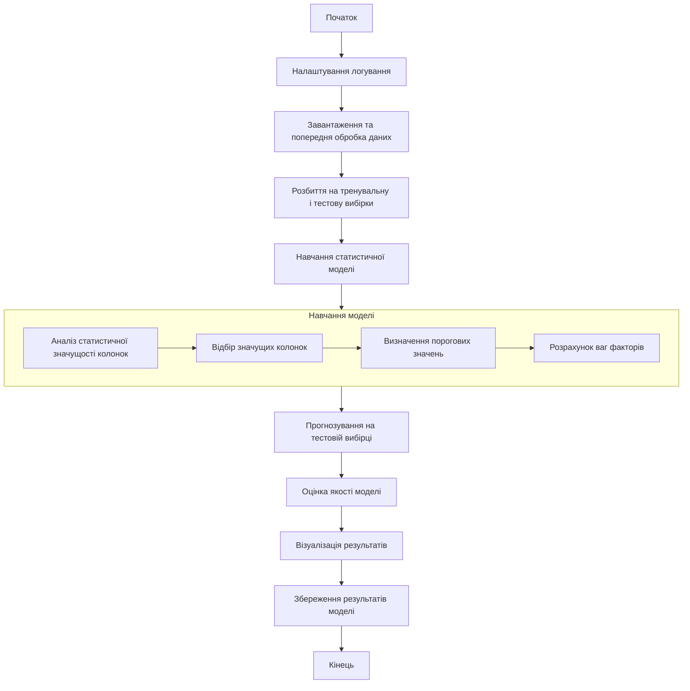

## Деталізація основних вузлів

### 1. Завантаження та попередня обробка даних

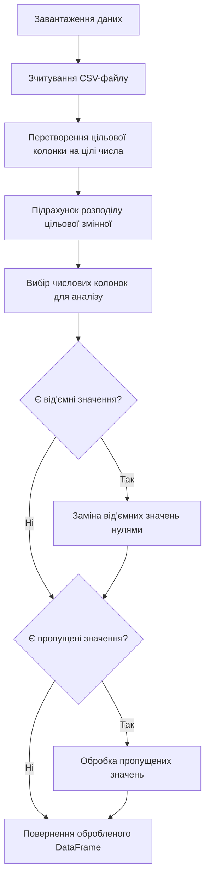

### 2. Розбиття на тренувальну і тестову вибірки

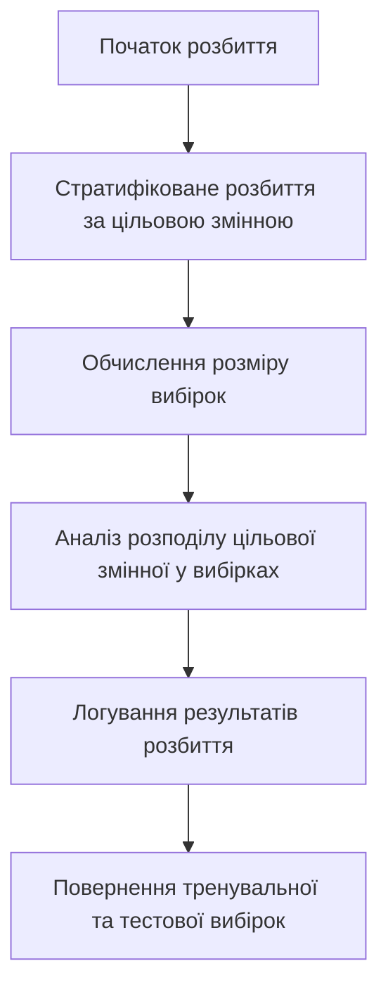

### 3. Аналіз статистичної значущості колонок

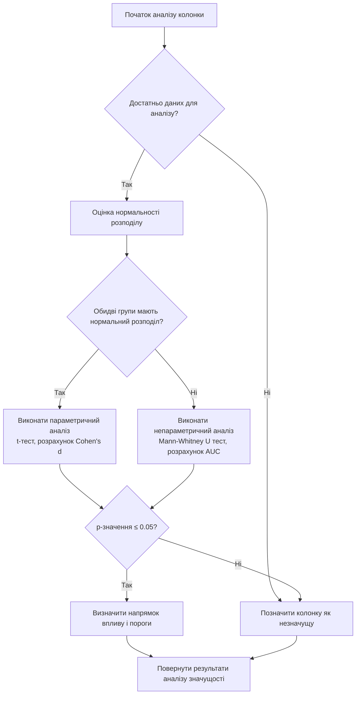

### 4. Оцінка нормальності розподілу

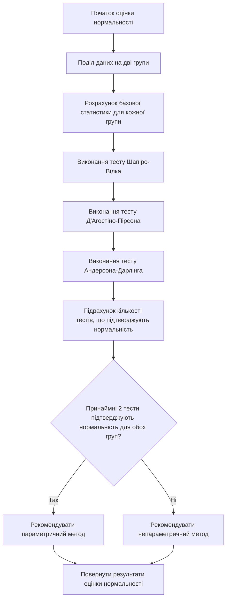

### 5. Навчання статистичної моделі

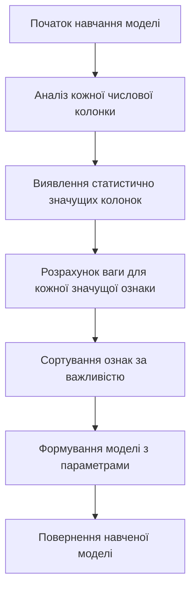

### 6. Прогнозування з використанням статистичної моделі

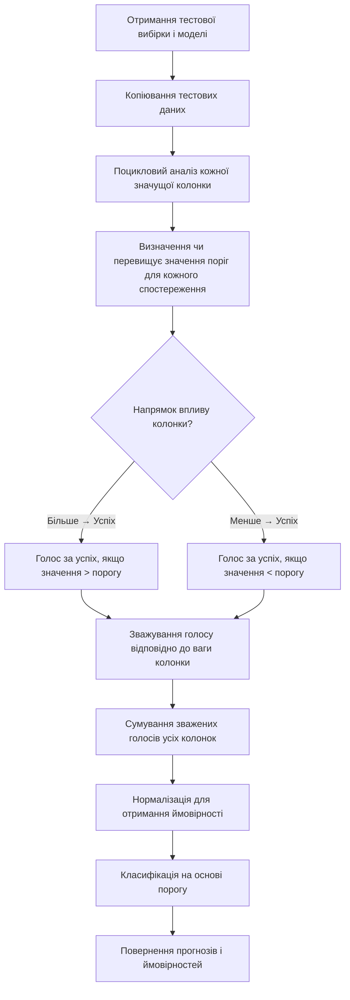

### 7. Оцінка якості моделі

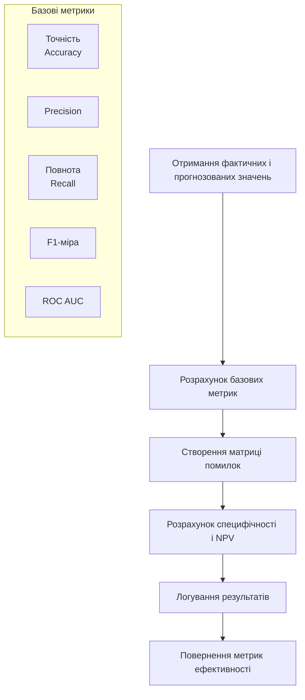

### 8. Візуалізація результатів

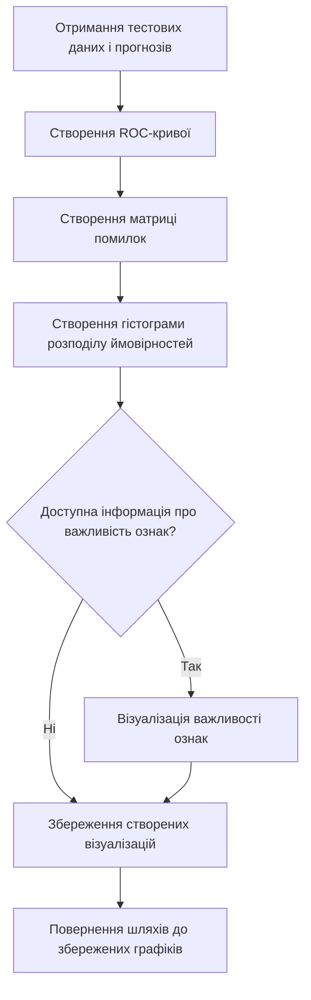

## Діаграма параметричного і непараметричного порівняння груп

### Параметричний аналіз

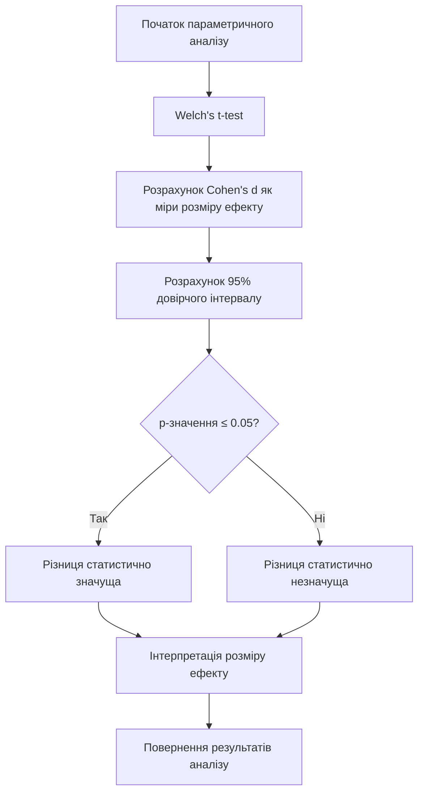

### Непараметричний аналіз

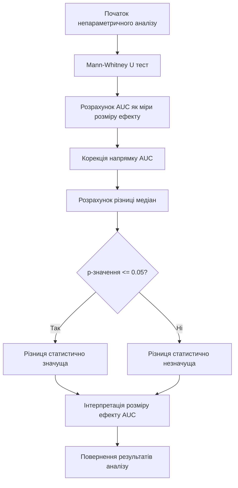

## Повний потік виконання основної функції

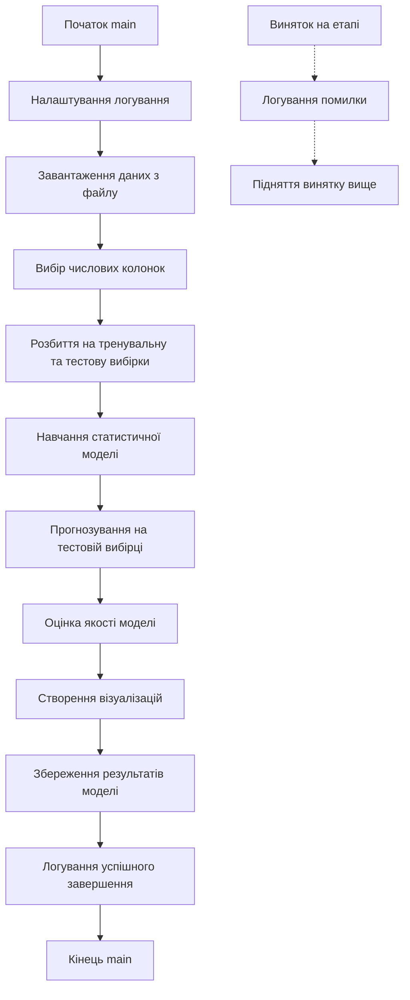
