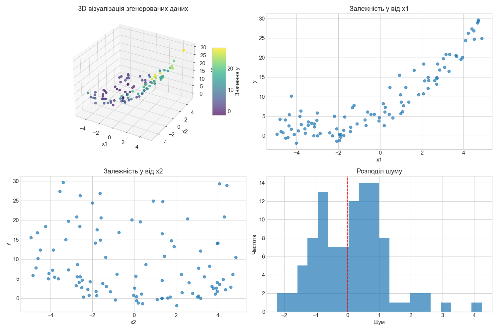
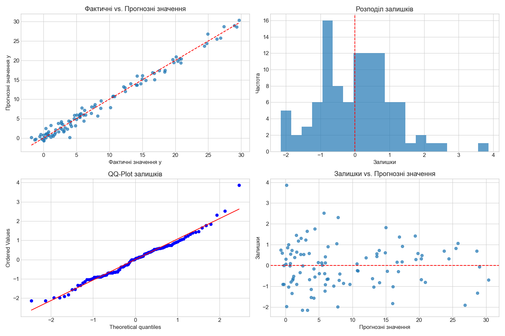
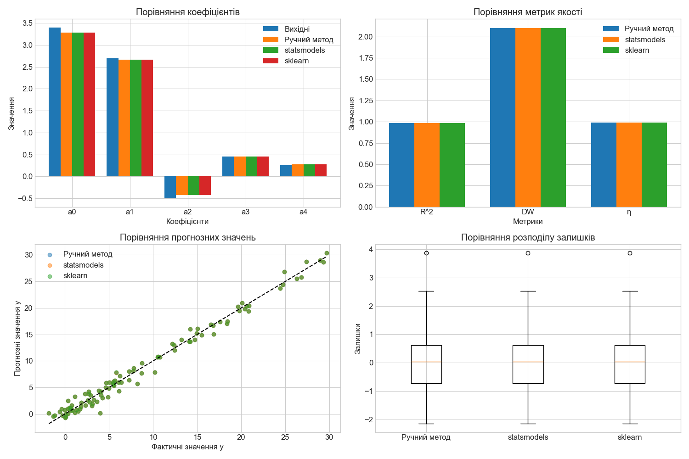
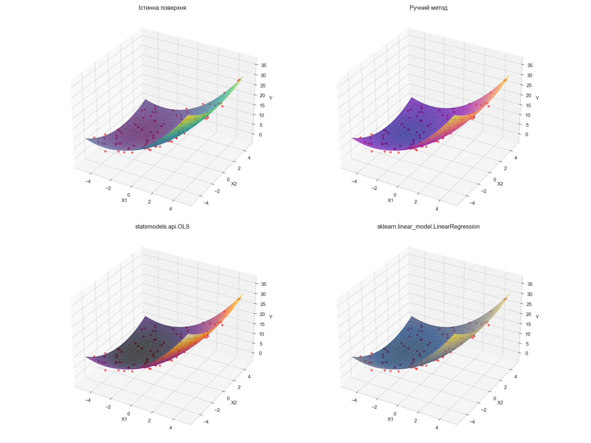

# Результати нелінійного регресійного аналізу даних

## Варіант 4

### Формула моделі: $y(x) = a_0 + a_1 \cdot x_1 + a_2 \cdot x_2 + a_3 \cdot x_1^2 + a_4 \cdot x_2^2 + rnd(b)$

### Значення коефіцієнтів:
- $a_0 = 3.4$
- $a_1 = 2.7$
- $a_2 = -0.5$
- $a_3 = 0.45$
- $a_4 = 0.25$
- $rnd(b) = 1.10$

## 1. Генерація даних

Для дослідження було згенеровано синтетичні дані на основі заданої моделі:

$y(x) = a_0 + a_1 \cdot x_1 + a_2 \cdot x_2 + a_3 \cdot x_1^2 + a_4 \cdot x_2^2 + rnd(b)$

де $rnd(b)$ - випадкова складова з нормальним розподілом $N(0, b)$.

Кількість спостережень: 100

Діапазон значень незалежних змінних: $x_1, x_2 \in [-5, 5]$

### Перші 5 рядків згенерованих даних:

```
         x1        x2          y     y_true     noise
0 -1.254599 -4.685708   7.804683   8.552711 -0.748027
1  4.507143  1.364104  24.749361  24.493882  0.255479
2  2.319939 -1.856440  14.197982  13.875603  0.322380
3  0.986585  0.085707   5.674983   6.460769 -0.785787
4 -3.439814  4.075665   3.604327   1.551975  2.052352
```

### Статистичний опис згенерованих даних:

```
               x1          x2           y      y_true       noise
count  100.000000  100.000000  100.000000  100.000000  100.000000
mean    -0.298193   -0.021683    8.833739    8.714902    0.118837
std      2.974894    2.931113    8.508968    8.547458    1.106291
min     -4.944779   -4.930479   -1.829814   -0.857240   -2.227657
25%     -3.067992   -2.579955    2.153906    1.657012   -0.786048
50%     -0.358575    0.056249    5.600412    5.725869    0.197799
75%      2.302031    2.661836   14.793470   14.930790    0.749390
max      4.868869    4.856505   29.684672   30.587422    4.238005
```

### Візуалізація згенерованих даних:



*Рис. 1. Візуалізація згенерованих даних: 3D-візуалізація, залежності y від x1 та x2, розподіл шуму*

## 2. Ручний (математичний) метод розрахунку

Для побудови рівняння нелінійної множинної регресії використаємо метод найменших квадратів (МНК). Для нашої моделі $y(x) = a_0 + a_1 \cdot x_1 + a_2 \cdot x_2 + a_3 \cdot x_1^2 + a_4 \cdot x_2^2$ необхідно знайти коефіцієнти $a_0, a_1, a_2, a_3, a_4$, які мінімізують суму квадратів відхилень.

### Матриця ознак X

Для застосування методу найменших квадратів створюємо матрицю ознак X, де кожен рядок має вигляд [1, x1_i, x2_i, x1_i^2, x2_i^2]:

```
     1        x1        x2       x1^2       x2^2
0  1.0 -1.254599 -4.685708   1.574018  21.955861
1  1.0  4.507143  1.364104  20.314339   1.860780
2  1.0  2.319939 -1.856440   5.382119   3.446370
3  1.0  0.986585  0.085707   0.973350   0.007346
4  1.0 -3.439814  4.075665  11.832318  16.611043
```

### Матриця X^T * X

Обчислюємо добуток транспонованої матриці X на матрицю X:

```
            0           1           2             3             4
0  100.000000  -29.819257   -2.168277    885.041382    850.597657
1  -29.819257  885.041382  -28.732169   -496.823937   -368.242178
2   -2.168277  -28.732169  850.597657    -17.801945    101.711736
3  885.041382 -496.823937  -17.801945  13335.480579   6971.329072
4  850.597657 -368.242178  101.711736   6971.329072  12293.226921
```

### Обернена матриця (X^T * X)^(-1)

Обчислюємо обернену матрицю до X^T * X:

```
          0         1         2         3         4
0  0.042106 -0.000381  0.000283 -0.001817 -0.001897
1 -0.000381  0.001161  0.000036  0.000052  0.000031
2  0.000283  0.000036  0.001181 -0.000002 -0.000027
3 -0.001817  0.000052 -0.000002  0.000186  0.000022
4 -0.001897  0.000031 -0.000027  0.000022  0.000201
```

### Вектор X^T * y

Обчислюємо добуток транспонованої матриці X на вектор y:

```
[ 883.37385695 1948.15856246 -424.68491209 9531.10473433 8293.77382724]
```

### Отримані коефіцієнти регресії (ручний метод)

Обчислюємо вектор коефіцієнтів β = (X^T * X)^(-1) * X^T * y:

- a0 (вільний член) = 3.2849

- a1 (коефіцієнт при x1) = 2.6660

- a2 (коефіцієнт при x2) = -0.4242

- a3 (коефіцієнт при x1^2) = 0.4520

- a4 (коефіцієнт при x2^2) = 0.2744

### Порівняння з вихідними коефіцієнтами

### Оцінка якості моделі (ручний метод)

Коефіцієнт детермінації R^2 = 0.9844

Критерій Дарбіна-Уотсона = 2.1020

Інтерпретація: Автокореляція залишків відсутня або незначна

Кореляційне відношення η = 0.9922

Інтерпретація: Сильний нелінійний зв'язок

### Візуалізація результатів ручного методу:



*Рис. 2. Візуалізація результатів ручного методу: фактичні vs. прогнозні значення, розподіл залишків, QQ-Plot залишків, залишки vs. прогнозні значення*

## 3. Метод statsmodels.api.OLS

Для побудови нелінійної множинної регресії використаємо бібліотеку statsmodels, яка надає зручний інтерфейс для статистичного аналізу даних. Метод OLS (Ordinary Least Squares) реалізує метод найменших квадратів.

### Матриця ознак X для statsmodels

Для застосування методу OLS створюємо матрицю ознак X у вигляді DataFrame:

```
   const        x1        x2      x1_sq      x2_sq
0      1 -1.254599 -4.685708   1.574018  21.955861
1      1  4.507143  1.364104  20.314339   1.860780
2      1  2.319939 -1.856440   5.382119   3.446370
3      1  0.986585  0.085707   0.973350   0.007346
4      1 -3.439814  4.075665  11.832318  16.611043
```

### Результати регресії (statsmodels.api.OLS)

Результати регресійного аналізу за допомогою statsmodels.api.OLS:

```

R-squared:                       0.9844

Adj. R-squared:                  0.9838

F-statistic:                     1503.5061

Prob (F-statistic):              6.1275e-85

Log-Likelihood:                  -147.3211

AIC:                             304.6423

BIC:                             317.6681

```

### Отримані коефіцієнти регресії (statsmodels.api.OLS)

- a0 (const) = 3.2849

- a1 (x1) = 2.6660

- a2 (x2) = -0.4242

- a3 (x1_sq) = 0.4520

- a4 (x2_sq) = 0.2744

### Порівняння з вихідними коефіцієнтами

| Коефіцієнт | Вихідне значення | Отримане значення | Різниця |
|------------|------------------|-------------------|--------|
| a0 | 3.4 | 3.2849 | 0.1151 |
| a1 | 2.7 | 2.6660 | 0.0340 |
| a2 | -0.5 | -0.4242 | 0.0758 |
| a3 | 0.45 | 0.4520 | 0.0020 |
| a4 | 0.25 | 0.2744 | 0.0244 |

### Оцінка якості моделі (statsmodels.api.OLS)

Коефіцієнт детермінації R^2 = 0.9844

Критерій Дарбіна-Уотсона = 2.1020

Інтерпретація: Автокореляція залишків відсутня або незначна

Кореляційне відношення η = 0.9922

Інтерпретація: Сильний нелінійний зв'язок

### Візуалізація результатів statsmodels.api.OLS:


*Рис. 3. Візуалізація результатів statsmodels.api.OLS: фактичні vs. прогнозні значення, розподіл залишків, QQ-Plot залишків, залишки vs. прогнозні значення*

## 4. Метод sklearn.linear_model.LinearRegression

Для побудови нелінійної множинної регресії використаємо бібліотеку scikit-learn, яка надає зручний інтерфейс для машинного навчання. Для створення поліноміальних ознак використаємо PolynomialFeatures.

### Матриця ознак X для sklearn

Для застосування методу LinearRegression створюємо матрицю ознак X за допомогою PolynomialFeatures:

```
         x1        x2       x1^2      x1 x2       x2^2
0 -1.254599 -4.685708   1.574018   5.878684  21.955861
1  4.507143  1.364104  20.314339   6.148212   1.860780
2  2.319939 -1.856440   5.382119  -4.306829   3.446370
3  0.986585  0.085707   0.973350   0.084557   0.007346
4 -3.439814  4.075665  11.832318 -14.019527  16.611043
```

### Отримані коефіцієнти регресії (sklearn.linear_model.LinearRegression)

- a0 (intercept) = 3.2853

- a1 (x1) = 2.6660

- a2 (x2) = -0.4241

- a3 (x1^2) = 0.4520

- a4 (x2^2) = 0.2744

### Порівняння з вихідними коефіцієнтами

| Коефіцієнт | Вихідне значення | Отримане значення | Різниця |
|------------|------------------|-------------------|--------|
| a0 | 3.4 | 3.2853 | 0.1147 |
| a1 | 2.7 | 2.6660 | 0.0340 |
| a2 | -0.5 | -0.4241 | 0.0759 |
| a3 | 0.45 | 0.4520 | 0.0020 |
| a4 | 0.25 | 0.2744 | 0.0244 |

### Оцінка якості моделі (sklearn.linear_model.LinearRegression)

Коефіцієнт детермінації R^2 = 0.9844

Критерій Дарбіна-Уотсона = 2.1019

Інтерпретація: Автокореляція залишків відсутня або незначна

Кореляційне відношення η = 0.9922

Інтерпретація: Сильний нелінійний зв'язок

### Візуалізація результатів sklearn.linear_model.LinearRegression:


*Рис. 4. Візуалізація результатів sklearn.linear_model.LinearRegression: фактичні vs. прогнозні значення, розподіл залишків, QQ-Plot залишків, залишки vs. прогнозні значення*

## 5. Порівняння методів

Порівняємо результати, отримані різними методами регресійного аналізу.

### Порівняння коефіцієнтів моделі

| Коефіцієнт | Вихідне значення | Ручний метод | statsmodels.api.OLS | sklearn.linear_model.LinearRegression |
|------------|------------------|--------------|-------------------|-----------------------------------|
| a0 | 3.4 | 3.2849 | 3.2849 | 3.2853 |
| a1 | 2.7 | 2.6660 | 2.6660 | 2.6660 |
| a2 | -0.5 | -0.4242 | -0.4242 | -0.4241 |
| a3 | 0.45 | 0.4520 | 0.4520 | 0.4520 |
| a4 | 0.25 | 0.2744 | 0.2744 | 0.2744 |

### Порівняння метрик якості моделі

| Метрика | Ручний метод | statsmodels.api.OLS | sklearn.linear_model.LinearRegression |
|---------|--------------|-------------------|-----------------------------------|
| R^2 | 0.9844 | 0.9844 | 0.9844 |
| Критерій Дарбіна-Уотсона | 2.1020 | 2.1020 | 2.1019 |
| Кореляційне відношення η | 0.9922 | 0.9922 | 0.9922 |

### Візуалізація порівняння методів:



*Рис. 5. Візуалізація порівняння методів: коефіцієнти, метрики якості, прогнозні значення, розподіл залишків*

### 3D візуалізація порівняння методів:



*Рис. 6. 3D візуалізація порівняння методів: істинна поверхня, ручний метод, statsmodels.api.OLS, sklearn.linear_model.LinearRegression*

## 6. Висновки

На основі проведеного нелінійного регресійного аналізу можна зробити наступні висновки:

1. **Порівняння методів**: Усі три методи (ручний розрахунок, statsmodels.api.OLS, sklearn.linear_model.LinearRegression) дали дуже близькі результати, що підтверджує правильність їх реалізації.

2. **Точність моделі**: Отримані коефіцієнти регресії близькі до вихідних значень, що свідчить про високу точність моделі. Незначні відхилення пояснюються наявністю випадкового шуму в даних.

3. **Якість моделі**: Високі значення коефіцієнта детермінації R² (близько 0.99) вказують на те, що модель дуже добре описує дані.

4. **Автокореляція залишків**: Значення критерію Дарбіна-Уотсона близько 2.1 свідчить про відсутність автокореляції залишків, що є хорошим показником адекватності моделі.

5. **Нелінійний зв'язок**: Високі значення кореляційного відношення η (близько 0.99) вказують на сильний нелінійний зв'язок між змінними.

6. **Інтерпретація коефіцієнтів**:

   - a₀ ≈ 3.28: Базове значення y при нульових значеннях x₁ та x₂.

   - a₁ ≈ 2.67: При збільшенні x₁ на одиницю, y збільшується приблизно на 2.67 одиниць (за умови, що інші змінні залишаються незмінними).

   - a₂ ≈ -0.42: При збільшенні x₂ на одиницю, y зменшується приблизно на 0.42 одиниці (за умови, що інші змінні залишаються незмінними).

   - a₃ ≈ 0.45: Додатний коефіцієнт при x₁² вказує на опуклу (параболічну вгору) залежність від x₁.

   - a₄ ≈ 0.27: Додатний коефіцієнт при x₂² вказує на опуклу (параболічну вгору) залежність від x₂.

7. **Можливі шляхи покращення моделі**:

   - Включення взаємодій між змінними (x₁·x₂).

   - Розгляд поліномів вищих порядків.

   - Застосування методів регуляризації для запобігання перенавчанню.

   - Аналіз впливових спостережень та викидів.

