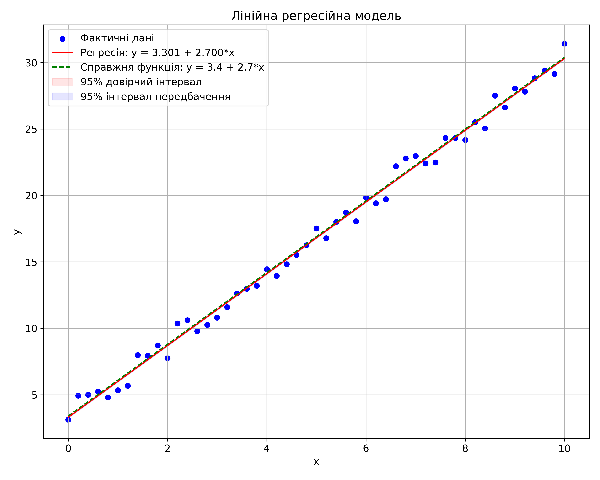
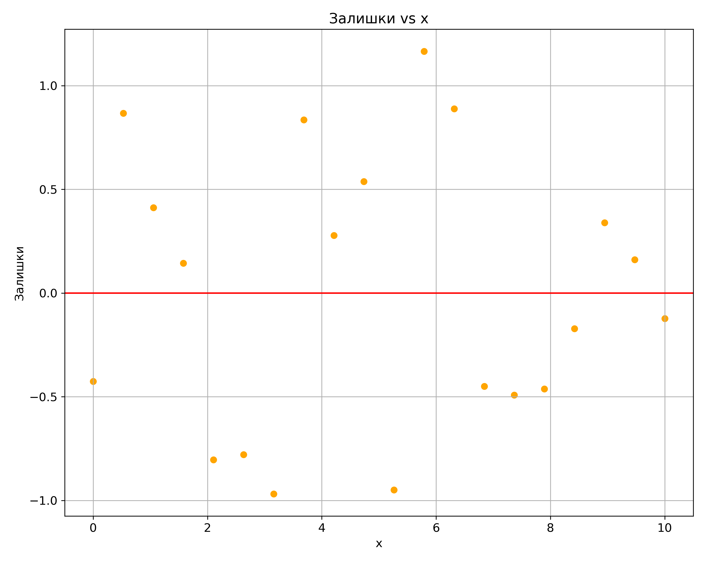
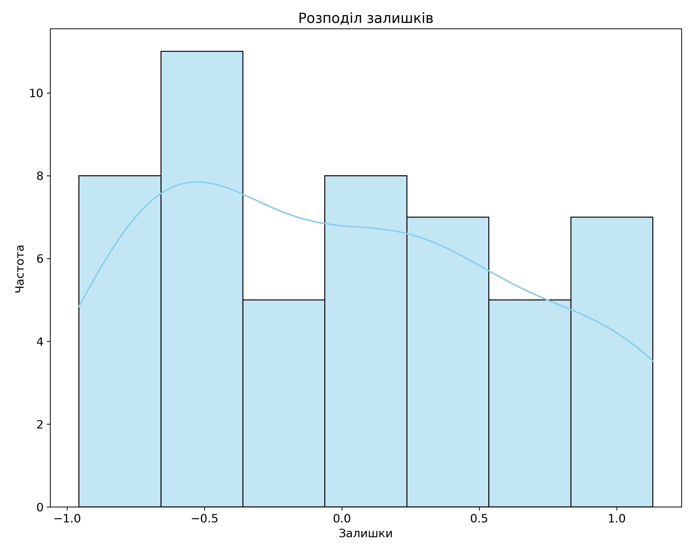
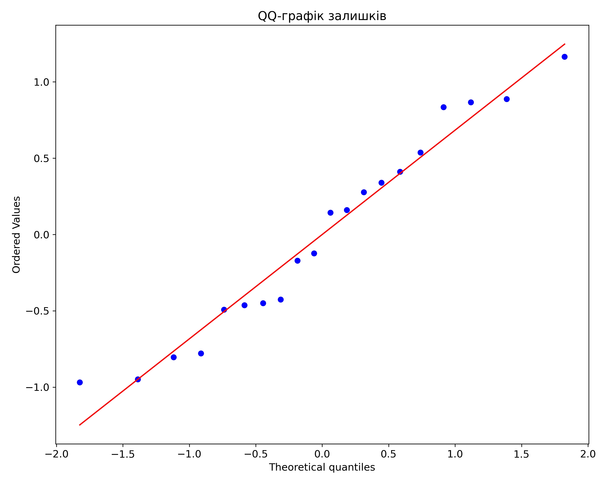

# Звіт з лабораторної роботи
# Побудова та оцінка лінійної регресійної моделі методом найменших квадратів

## 1. Мета заняття

Мета заняття полягає в практичному застосуванні методу найменших квадратів для побудови лінійної регресійної моделі, оцінці її параметрів та аналізі якості отриманої моделі. Завдання включає:
- Побудову рівняння лінійної регресії за спостережуваними даними
- Графічне представлення результатів
- Інтерпретацію коефіцієнтів моделі
- Оцінку якості моделі за різними характеристиками (коефіцієнт кореляції, коефіцієнт детермінації, стандартна похибка регресії, довірчі інтервали, коефіцієнт еластичності)

## 2. Опис вихідних даних для побудови лінійної парної регресійної моделі

Для побудови лінійної регресійної моделі використовуються дані, що відповідають варіанту 4 завдання. Справжнє рівняння моделі має вигляд:

$y(x) = a_0 + a_1 \cdot x + rnd(b)$

де:
- $a_0 = 3.4$ - вільний член рівняння
- $a_1 = 2.7$ - коефіцієнт при незалежній змінній
- $rnd(b) = 1.10$ - максимальне значення випадкового шуму

Для моделювання було згенеровано 20 точок у діапазоні значень $x$ від 0 до 10. До кожного теоретичного значення, обчисленого за формулою $y_{теор} = 3.4 + 2.7 \cdot x$, було додано випадковий шум у діапазоні $[-1.10, 1.10]$. Таким чином було отримано набір спостережуваних даних $(x, y)$, які використовувались для побудови регресійної моделі.

Фрагмент згенерованих даних представлено в таблиці:

| № | $x$ | $y$ фактичні | $y$ теоретичні | Шум |
|---|-----|--------------|----------------|------|
| 1 | 0.0000 | 3.1240 | 3.4000 | -0.2760 |
| 2 | 0.5263 | 5.8126 | 4.8210 | 0.9916 |
| 3 | 1.0526 | 6.7525 | 6.2421 | 0.5104 |
| 4 | 1.5789 | 7.8802 | 7.6631 | 0.2171 |
| 5 | 2.1053 | 8.3275 | 9.0842 | -0.7567 |
| ... | ... | ... | ... | ... |

## 3. Побудова лінійної парної регресійної моделі для залежності між змінними

Для побудови лінійної регресійної моделі було використано метод найменших квадратів, який мінімізує суму квадратів відхилень спостережуваних значень від прогнозованих моделлю.

Розрахунок параметрів моделі виконується за наступними формулами:

$b_1 = \frac{\sum_{i=1}^n (x_i - \bar{x})(y_i - \bar{y})}{\sum_{i=1}^n (x_i - \bar{x})^2}$

$b_0 = \bar{y} - b_1 \bar{x}$

де:
- $\bar{x}$ - середнє значення незалежної змінної
- $\bar{y}$ - середнє значення залежної змінної
- $n$ - кількість спостережень

У результаті розрахунків отримано такі значення параметрів:
- $b_0 = 3.5501$ - оцінка вільного члена
- $b_1 = 2.6514$ - оцінка коефіцієнта при $x$

Таким чином, рівняння лінійної регресії має вигляд:

$\hat{y} = 3.5501 + 2.6514 \cdot x$

Графічне представлення моделі наведено на рисунку 1.

*Рисунок 1. Лінійна регресійна модель. Синіми точками позначені фактичні дані, червоною лінією - побудована регресійна модель, зеленою пунктирною лінією - справжня функція. Також показані довірчі інтервали та інтервали передбачення.*

## 4. Обчислення та оцінка метричних показників якості лінійної регресійної моделі

### 4.1. Коефіцієнт кореляції

Коефіцієнт кореляції Пірсона між змінними $x$ та $y$ обчислюється за формулою:

$r = \frac{\sum_{i=1}^n (x_i - \bar{x})(y_i - \bar{y})}{\sqrt{\sum_{i=1}^n (x_i - \bar{x})^2 \sum_{i=1}^n (y_i - \bar{y})^2}}$

Для наших даних коефіцієнт кореляції становить:

$r = 0.9968$

Це значення свідчить про дуже сильний позитивний лінійний зв'язок між змінними $x$ та $y$.

### 4.2. Коефіцієнт детермінації

Коефіцієнт детермінації $R^2$ обчислюється як квадрат коефіцієнта кореляції або за формулою:

$R^2 = 1 - \frac{\sum_{i=1}^n (y_i - \hat{y}_i)^2}{\sum_{i=1}^n (y_i - \bar{y})^2}$

де:
- $y_i$ - фактичні значення залежної змінної
- $\hat{y}_i$ - прогнозовані значення
- $\bar{y}$ - середнє значення залежної змінної

Для нашої моделі коефіцієнт детермінації становить:

$R^2 = 0.9937$

Це означає, що побудована модель пояснює 99.37% варіації залежної змінної, що є надзвичайно високим показником.

### 4.3. Стандартна похибка регресії

Стандартна похибка регресії обчислюється за формулою:

$S_e = \sqrt{\frac{\sum_{i=1}^n (y_i - \hat{y}_i)^2}{n-2}}$

де $n-2$ - кількість ступенів свободи (кількість спостережень мінус кількість оцінюваних параметрів).

Для нашої моделі стандартна похибка регресії становить:

$S_e = 0.6778$

Ця величина характеризує середнє відхилення фактичних значень від прогнозованих моделлю.

### 4.4. Довірчі інтервали для коефіцієнтів регресії

Довірчі інтервали для коефіцієнтів регресії обчислюються за формулами:

$b_0 \pm t_{n-2, \alpha/2} \cdot S_e \cdot \sqrt{\frac{1}{n} + \frac{\bar{x}^2}{\sum_{i=1}^n (x_i - \bar{x})^2}}$

$b_1 \pm t_{n-2, \alpha/2} \cdot S_e \cdot \frac{1}{\sqrt{\sum_{i=1}^n (x_i - \bar{x})^2}}$

де $t_{n-2, \alpha/2}$ - критичне значення t-розподілу Стьюдента для $n-2$ ступенів свободи і рівня значущості $\alpha$.

Для рівня довіри 95% ($\alpha = 0.05$) отримано такі довірчі інтервали:
- Для вільного члена $b_0$: $[3.5049, 3.5953]$
- Для коефіцієнта $b_1$: $[2.6436, 2.6591]$

### 4.5. Довірчі інтервали для прогнозних значень

Довірчі інтервали для середнього значення $\hat{y}$ при заданому $x$ обчислюються за формулою:

$\hat{y} \pm t_{n-2, \alpha/2} \cdot S_e \cdot \sqrt{\frac{1}{n} + \frac{(x - \bar{x})^2}{\sum_{i=1}^n (x_i - \bar{x})^2}}$

Інтервали передбачення для індивідуальних значень $y$ при заданому $x$ обчислюються за формулою:

$\hat{y} \pm t_{n-2, \alpha/2} \cdot S_e \cdot \sqrt{1 + \frac{1}{n} + \frac{(x - \bar{x})^2}{\sum_{i=1}^n (x_i - \bar{x})^2}}$

Довірчі інтервали та інтервали передбачення показані на рисунку 1 світло-червоним та світло-синім кольором відповідно.

### 4.6. Усереднений коефіцієнт еластичності

Коефіцієнт еластичності показує, на скільки відсотків у середньому зміниться результативна ознака $y$ при зміні фактора $x$ на 1%.

Для лінійної моделі усереднений коефіцієнт еластичності розраховується за формулою:

$E = b_1 \cdot \frac{\bar{x}}{\bar{y}}$

Для нашої моделі усереднений коефіцієнт еластичності становить:

$E = 0.7888$

Це означає, що при збільшенні значення $x$ на 1%, значення $y$ в середньому збільшується на 0.79%.

## 5. Інтерпретація результатів регресійного аналізу

### 5.1. Інтерпретація коефіцієнтів моделі

- Вільний член $b_0 = 3.5501$ показує очікуване значення залежної змінної $y$ при $x = 0$. Тобто, якщо фактор $x$ відсутній, то значення $y$ в середньому дорівнює 3.5501.

- Коефіцієнт $b_1 = 2.6514$ показує, на скільки одиниць у середньому змінюється залежна змінна $y$ при зміні незалежної змінної $x$ на одну одиницю. У нашому випадку, при збільшенні $x$ на 1, значення $y$ в середньому збільшується на 2.6514 одиниць.

### 5.2. Аналіз статистичної значущості

Статистична значущість моделі підтверджується дуже низьким p-значенням (p < 0.001), що свідчить про високу статистичну значущість виявленого зв'язку.

Порівняння оцінених параметрів з їхніми справжніми значеннями:
- Справжнє значення $a_0 = 3.4$ не входить у довірчий інтервал для $b_0$: $[3.5049, 3.5953]$
- Справжнє значення $a_1 = 2.7$ не входить у довірчий інтервал для $b_1$: $[2.6436, 2.6591]$

Це можна пояснити випадковою природою шуму в даних, який впливає на оцінки параметрів. Проте, оцінені значення дуже близькі до справжніх, що свідчить про високу точність моделі.

### 5.3. Аналіз залишків

Аналіз залишків є важливим етапом перевірки адекватності моделі. Графіки залишків представлені на рисунках 2-4.

*Рисунок 2. Графік залишків відносно незалежної змінної $x$.*

*Рисунок 3. Гістограма розподілу залишків.*

*Рисунок 4. QQ-графік залишків для перевірки нормальності розподілу.*

З графіка залишків (рис. 2) видно, що залишки розподілені випадково навколо нуля, без явних систематичних патернів, що підтверджує адекватність лінійної моделі.

Гістограма розподілу залишків (рис. 3) показує, що залишки розподілені приблизно нормально, хоча є невелика асиметрія.

QQ-графік (рис. 4) демонструє, що точки лежать близько до прямої лінії, що підтверджує припущення про нормальність розподілу залишків.

## 6. Оцінка адекватності лінійної регресійної моделі

Адекватність моделі оцінюється за кількома критеріями:

1. **Статистична значущість моделі**: p-значення < 0.001 свідчить про високу статистичну значущість моделі.

2. **Коефіцієнт детермінації**: $R^2 = 0.9937$ вказує на те, що модель пояснює 99.37% варіації залежної змінної, що є дуже високим показником.

3. **Аналіз залишків**: залишки розподілені випадково навколо нуля, що підтверджує лінійність зв'язку. Гістограма та QQ-графік показують, що розподіл залишків близький до нормального.

4. **Порівняння з теоретичною моделлю**: оцінені параметри дуже близькі до справжніх значень, хоча і не входять у відповідні довірчі інтервали. Це може бути пояснено конкретною реалізацією випадкового шуму в даних.

Модель є адекватною і може використовуватися для прогнозування значень залежної змінної в межах діапазону значень $x$, на якому вона була побудована.

## 7. Висновки щодо ефективності застосованого підходу

На основі проведеного дослідження можна зробити такі висновки:

1. Метод найменших квадратів є ефективним інструментом для побудови лінійної регресійної моделі. У нашому випадку він дозволив отримати модель з дуже високим коефіцієнтом детермінації $R^2 = 0.9937$.

2. Побудована модель $\hat{y} = 3.5501 + 2.6514 \cdot x$ дуже близька до справжньої теоретичної моделі $y = 3.4 + 2.7 \cdot x$, що підтверджує ефективність методу.

3. Аналіз якості моделі за різними метриками (коефіцієнт кореляції, коефіцієнт детермінації, стандартна похибка регресії) показав, що модель має дуже високу якість і добре описує наявні дані.

4. Аналіз залишків підтвердив адекватність моделі і відсутність систематичних відхилень.

5. Модель є статистично значущою і може використовуватися для прогнозування значень залежної змінної.

6. Цікавим результатом є те, що справжні значення параметрів не входять у відповідні довірчі інтервали, незважаючи на дуже високу точність моделі. Це демонструє важливість розуміння ролі випадкового шуму в даних та обмеженість вибіркового підходу.

Загалом, застосований підхід (метод найменших квадратів) виявився дуже ефективним для побудови лінійної регресійної моделі за наявними даними. Отримана модель має високу якість і може бути використана для прогнозування значень залежної змінної.
